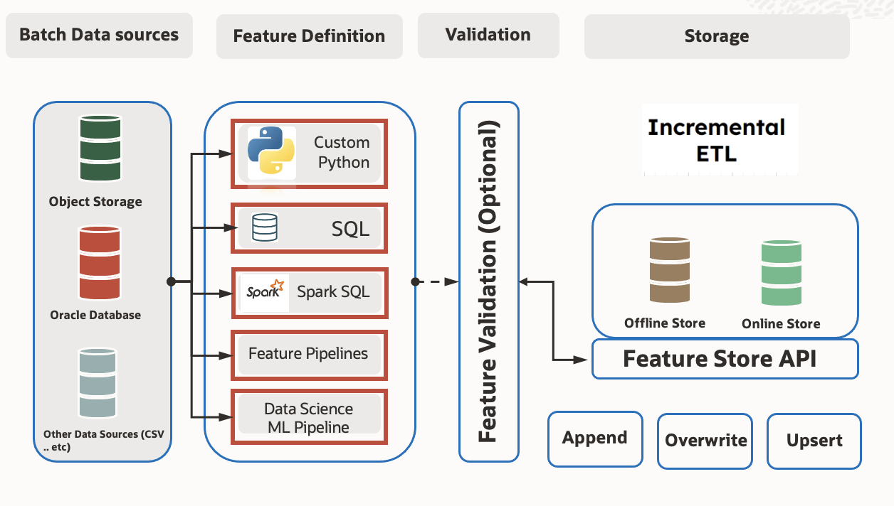

CI/CD: Small and Large Data Use Cases
**************************************

Introduction
============

This section elaborates on different data ingestion modes (Append, Overwrite, Upsert) used within a feature store context. Understanding these modes is crucial for efficient data management and integration.

Feature Store with ML Jobs (Small Data Use Cases)
=================================================

Utilizing ML jobs within the Feature Store caters to scenarios dealing with small data volumes.

**Usage Scenario**:

- **ML Job Integration**: Integrate ML jobs into the CI/CD pipeline for feature extraction, transformation, and loading using small datasets.
- **Automation with CI/CD**: Automate the deployment and execution of ML job scripts through CI/CD pipelines for feature management in the Feature Store environment.

.. seealso::
   `Feature Store Creation and Ingestion with Jobs <https://github.com/oracle-samples/oci-data-science-ai-samples/tree/main/feature_store/tutorials/feature_store_creation_ingestion_with_jobs>`_

Feature Store with Dataflow (Large Data Use Cases)
==================================================

Dataflow is a robust solution when handling large-scale data processing within the Feature Store.

**Usage Scenario**:

- **Dataflow Integration**: Incorporate Dataflow capabilities within the CI/CD pipeline for efficient feature extraction, transformation, and loading with large datasets.
- **Scalable Processing**: Leverage Dataflow's scalable processing power to handle and manage extensive data volumes effectively.

.. seealso::
   `Feature Store Creation and Ingestion with Dataflow <https://github.com/oracle-samples/oci-data-science-ai-samples/tree/main/feature_store/tutorials/feature_store_creation_ingestion_with_dataflow>`_

Modes of ingestion
===================

Append Mode
###########

In Append mode, new data is added to the existing dataset or table. This process involves appending new records to the end of the existing dataset without altering or removing pre-existing data. It's suitable for continuous addition of new records while preserving the integrity of the existing dataset.

.. code-block:: python3

   from ads.feature_store.feature_group_job import BatchIngestionMode
   from ads.feature_store.feature_group import FeatureGroup

   feature_group = FeatureGroup.from_id("<unique_id>")
   feature_group.materialise(airports_df, ingestion_mode=BatchIngestionMode.APPEND)

Overwrite Mode
##############

Overwrite mode replaces the entire existing dataset with the new data being saved. If the target table or dataset already exists, it is completely dropped and recreated with the new data. This mode is beneficial for refreshing the dataset entirely with the most recent data, discarding all previous records.

.. code-block:: python3

   from ads.feature_store.feature_group_job import BatchIngestionMode
   from ads.feature_store.feature_group import FeatureGroup

   feature_group = FeatureGroup.from_id("<unique_id>")
   feature_group.materialise(airports_df, ingestion_mode=BatchIngestionMode.OVERWRITE)

Upsert Mode (Merge Mode)
########################

Upsert mode, also known as merge mode, updates existing records in the dataset based on a specified condition or primary key. If a record with the same key exists, it is updated with the new data; otherwise, a new record is inserted. This mode helps in maintaining data consistency and avoiding duplicates.

.. code-block:: python3

   from ads.feature_store.feature_group_job import BatchIngestionMode
   from ads.feature_store.feature_group import FeatureGroup

   feature_group = FeatureGroup.from_id("<unique_id>")
   feature_group.materialise(airports_df, ingestion_mode=BatchIngestionMode.UPSERT)

Complete Mode
#############

Complete Mode involves rewriting the full output for each batch interval. It provides the complete result set for the computation performed on that batch interval. This mode is suitable when requiring a comprehensive, updated result set for every batch interval, regardless of whether it's a complete rewrite of the entire output.

.. code-block:: python3

   from ads.feature_store.feature_group_job import StreamingIngestionMode
   from ads.feature_store.feature_group import FeatureGroup

   feature_group = FeatureGroup.from_id("<unique_id>")
   feature_group.materialise_stream(df, ingestion_mode=StreamingIngestionMode.COMPLETE)

Update Mode
###########

Update Mode is specifically designed to capture only the changed records in the output. It outputs the rows that have been updated since the last batch, maintaining intermediate state and providing insights into the delta or changes between different batches. This mode is ideal for scenarios involving aggregations or incremental updates to the output data.

.. code-block:: python3

   from ads.feature_store.feature_group_job import StreamingIngestionMode
   from ads.feature_store.feature_group import FeatureGroup

   feature_group = FeatureGroup.from_id("<unique_id>")
   feature_group.materialise_stream(df, ingestion_mode=StreamingIngestionMode.UPDATE)

Append Mode
###########

Append Mode appends newly generated results from each micro-batch to the output sink. It works when the computation produces only new records and does not modify or update existing data in the output. This mode suits scenarios where the result set continuously grows, with each batch contributing new records without altering existing ones.

.. code-block:: python3

   from ads.feature_store.feature_group_job import StreamingIngestionMode
   from ads.feature_store.feature_group import FeatureGroup

   feature_group = FeatureGroup.from_id("<unique_id>")
   feature_group.materialise_stream(df, ingestion_mode=StreamingIngestionMode.APPEND)

Considerations for Usage
########################

- **Performance Implications:** Each mode has its performance considerations. Append tends to be faster as it merely adds new records, while Overwrite involves dropping and recreating the entire dataset, potentially impacting performance and resource usage.
- **Data Consistency:** Upsert mode helps in maintaining data consistency by updating existing records and inserting new ones, ensuring the integrity of the dataset.

Use Cases
###########

- **Append:** Real-time streaming data, continuous addition of new records without altering existing data.
- **Overwrite:** Periodic data refreshes or complete replacement of the dataset with the latest information.
- **Upsert:** Synchronizing datasets, updating existing records, and avoiding duplicates, commonly used in databases and data warehouses.

Conclusion
###########

Understanding the nuances of these ingestion modes is crucial for choosing the appropriate method based on specific requirements and use cases. It ensures efficient data management and integration within the feature store environment.
