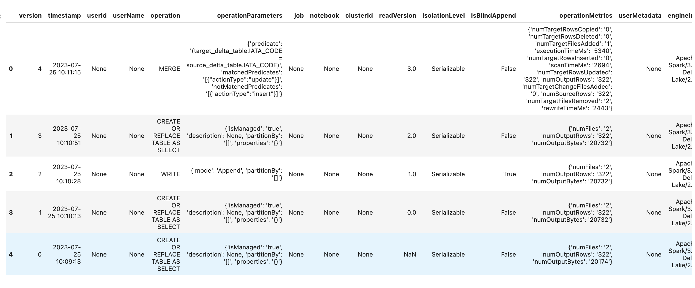

Data Versioning
****************

Data versioning is a practice aimed at recording the various data commits integrated into a particular feature group and dataset. This involves tracking changes in data over time while maintaining consistent schema structures and feature definitions within a shared schema version. Note that, in Feature Store, data versioning features are available only for offline feature groups.

As Of
======

You can call the ``as_of()`` method of the ``FeatureGroup`` or ``Dataset`` instance to get the specified point in time and time traveled data.

The ``.as_of()`` method takes the following optional parameters:

- ``commit_timestamp: date-time``. The commit timestamp for the feature group.
- ``version_number: int``. The version number for the feature group.

.. code-block:: python3

  # as_of feature group
  df = feature_group.as_of(version_number=1)

History
=======

You can call the ``history()`` method of the ``FeatureGroup`` or ``Dataset`` instance to show the history of the feature group.

.. code-block:: python3

  # Show history of feature group
  df = feature_group.history()
