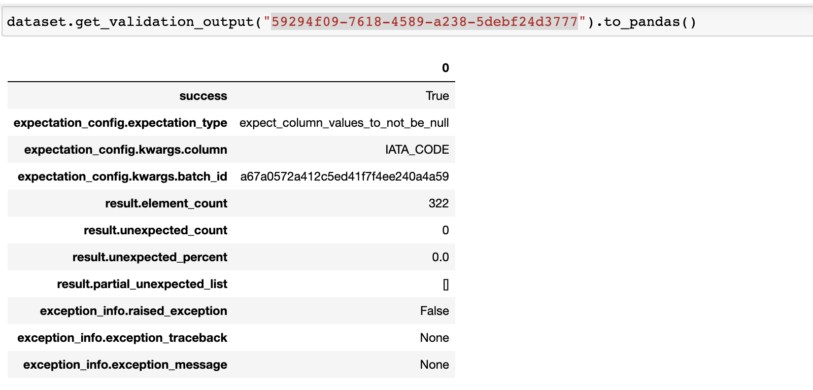

Dataset
********

A dataset is a collection of feature that are used together to either train a model or perform model inference.

Define
======

In an ADS feature store module, you can either use the Python API or YAML to define a dataset.

With the specified way below, you can define a dataset and give it a name.
A ``Dataset`` instance will be created.

.. tabs::

  .. code-tab:: Python3
    :caption: Python

    from ads.feature_store.dataset import Dataset

    dataset = (
        Dataset
        .with_name("<dataset_name>")
        .with_entity_id(<entity_id>)
        .with_feature_store_id("<feature_store_id>")
        .with_description("<dataset_description>")
        .with_compartment_id("<compartment_id>")
        .with_dataset_ingestion_mode(DatasetIngestionMode.SQL)
        .with_query('SELECT col FROM <entity_id>.<feature_group_nmae>')
    )

  .. code-tab:: Python3
    :caption: YAML

    from ads.feature_store.dataset import Dataset

    yaml_string = """
    kind: dataset
    spec:
      compartmentId: ocid1.compartment..<unique_id>
      description: <dataset_description>
      name: <dataset_name>
      featureStoreId: <feature_store_id>
    type: dataset
    """

    dataset = Dataset.from_yaml(yaml_string)

Create
======

You can call the ``create()`` method of the ``Dataset`` instance to create an dataset.

.. important::

  This method is lazy and does not persist any metadata or feature data in the feature store on its own.
  To persist the dataset and save feature data along the metadata in the feature store, call the ``materialise()``
  method with a DataFrame.

.. code-block:: python3

  # Create an dataset
  dataset.create()

Load
====

Use the ``from_id()`` method from the ``Dataset`` class to load an existing dataset with its OCID provided. It returns a ``Dataset`` instance.

.. code-block:: python3

  from ads.feature_store.dataset import Dataset

  dataset = Dataset.from_id("ocid1.dataset..<unique_id>")

Materialise
===========

You can call the ``materialise() -> DatasetJob`` method of the ``Dataset`` instance to load the data to dataset. To persist the dataset and save dataset data along the metadata in the feature store, call the ``materialise()``

The ``.materialise()`` method takes the following parameter:

- ``input_dataframe: Union[DataFrame, pd.DataFrame]``. Spark dataframe or pandas dataframe.
- ``from_timestamp: str(Optional)``. From timestamp of dataset.
- ``to_timestamp: str(Optional)``. To timestamp of dataset.
- ``feature_option_details: FeatureOptionDetails(Optional)``. Feature option details for materialise operation.
    - ``write_config_details: (merge_schema: bool, overwrite_schema: bool)``. Write config details for feature option details
    - ``read_config_details: (version_as_of: int, timestamp_as_of: datetime)``. Read config details for feature option details

.. code-block:: python3

  from ads.feature_store.dataset_job import DatasetJob

  dataset_job: DatasetJob = dataset.materialise(dataframe)

.. seealso::
   :ref:`Dataset Job`

Delete
======

Use the ``.delete()`` method on the ``Dataset`` instance to delete a dataset.

A dataset can only be deleted when its associated entities are all deleted,

.. code-block:: python3

  dataset.delete()

Get last dataset job
====================
Dataset job is the execution instance of a dataset. Each dataset job will include validation results and statistics results.

With a Dataset instance, we can get the last dataset job details using ``get_last_job()``

.. code-block:: python3

  dataset_job = dataset.get_last_job()

Save expectation entity
=======================
Feature store allows you to define expectations on data being materialized into dataset instance.With a ``Dataset`` instance, You can save the expectation details using ``with_expectation_suite()`` with parameters

- ``expectation_suite: ExpectationSuite``. ExpectationSuit of great expectation
- ``expectation_type: ExpectationType``. Type of expectation
        - ``ExpectationType.STRICT``: Fail the job if expectation not met
        - ``ExpectationType.LENIENT``: Pass the job even if expectation not met

.. note::

  Great Expectations is a Python-based open-source library for validating, documenting, and profiling your data. It helps you to maintain data quality and improve communication about data between teams. Software developers have long known that automated testing is essential for managing complex codebases.

.. image:: figures/validation.png

.. code-block:: python3

    expectation_suite = ExpectationSuite(
        expectation_suite_name="expectation_suite_name"
    )
    expectation_suite.add_expectation(
        ExpectationConfiguration(
            expectation_type="expect_column_values_to_not_be_null",
            kwargs={"column": "<column>"},
        )

    dataset_resource = (
            Dataset()
            .with_description("dataset description")
            .with_compartment_id(<compartment_id>)
            .with_name(<name>)
            .with_entity_id(entity_id)
            .with_feature_store_id(feature_store_id)
            .with_query(f"SELECT * FROM `{entity_id}`.{feature_group_name}")
            .with_expectation_suite(
                expectation_suite=expectation_suite,
                expectation_type=ExpectationType.STRICT,
            )
        )

You can call the ``get_validation_output()`` method of the Dataset instance to fetch validation results for a specific ingestion job.
The ``get_validation_output()`` method takes the following optional parameter:

- ``job_id: string``. Id of dataset job

``get_validation_output().to_pandas()`` will output  the validation results for each expectation as pandas dataframe

``get_validation_output().to_summary()`` will output the overall summary of validation as pandas dataframe.

.. seealso::

    :ref:`Feature Validation`

Statistics Computation
========================
During the materialization feature store performs computation of statistical metrics for all the features  by default. This can be configured using ``StatisticsConfig`` object which can be passed at the creation of
dataset or it can be updated later as well.

.. code-block:: python3

  # Define statistics configuration for selected features
  stats_config = StatisticsConfig().with_is_enabled(True).with_columns(["column1", "column2"])

This can be used with dataset instance.

.. code-block:: python3

  from ads.feature_store.dataset import Dataset

  dataset = (
        Dataset
        .with_name("<dataset_name>")
        .with_entity_id(<entity_id>)
        .with_feature_store_id("<feature_store_id>")
        .with_description("<dataset_description>")
        .with_compartment_id("<compartment_id>")
        .with_dataset_ingestion_mode(DatasetIngestionMode.SQL)
        .with_query('SELECT col FROM <entity_id>.<feature_group_name>')
        .with_statistics_config(stats_config)
  )

You can call the ``get_statistics()`` method of the dataset to fetch metrics for a specific ingestion job.

The ``get_statistics()`` method takes the following optional parameter:

- ``job_id: string``. Id of dataset job

.. code-block:: python3

  # Fetch stats results for a dataset job
  df = dataset.get_statistics(job_id).to_pandas()

.. seealso::

    :ref:`Statistics`

Get features
============
You can call the ``get_features_df()`` method of the Dataset instance to fetch features in a dataset.

.. code-block:: python3

  # Fetch features for a dataset
  df = dataset.get_features_df()
  df.show()

Preview
========

.. deprecated:: 1.0.3
   Use :func:`as_of` instead.

You can call the ``preview()`` method of the Dataset instance to preview the dataset.

The ``.preview()`` method takes the following optional parameter:
- ``timestamp: date-time``. Commit timestamp for dataset
- ``version_number: int``. Version number for dataset
- ``row_count: int``. Defaults to 10. Total number of row to return

.. code-block:: python3

  # Preview dataset
  df = dataset.preview(row_count=50)
  df.show()

as_of
=======

You can call the ``as_of()`` method of the Dataset instance to get specified point in time and time traveled data.

The ``.as_of()`` method takes the following optional parameter:

- ``commit_timestamp: date-time``. Commit timestamp for dataset
- ``version_number: int``. Version number for dataset

.. code-block:: python3

  # as_of feature group
  df = dataset.as_of(version_number=1)

Restore
=======
You can call the ``restore()`` method of the Dataset instance to restore the dataset to a particular version and timestamp.

The ``.restore()`` method takes the following optional parameter:
- ``timestamp: date-time``. Commit timestamp for dataset
- ``version_number: int``. Version number for dataset

.. code-block:: python3

  # Restore dataset to a particular version and timestamp
  df = feature_group.restore(version_number=2)
  df.show()

Profile
=======
You can call the ``profile()`` method of the Dataset instance to profile the dataset.

.. code-block:: python3

  # Profile dataset
  df = dataset.profile()
  df.show()

History
=======
You can call the ``history()`` method of the Dataset instance to show history of the dataset.

.. code-block:: python3

  # Show history of dataset
  df = dataset.history()
  df.show()

Visualize Lineage
=================

Use the ``show()`` method on the ``Dataset`` instance to visualize the lineage of the dataset.

The ``show()`` method takes the following optional parameter:

- ``rankdir: (str, optional)``. Defaults to ``LR``. The allowed values are ``TB`` or ``LR``. This parameter is applicable only for ``graph`` mode and it renders the direction of the graph as either top to bottom (TB) or left to right (LR).

.. code-block:: python3

  dataset.show()

Below is an example of the output.

.. figure:: figures/dataset_lineage.png
  :width: 400

Add Model Details
=================

You can call the ``add_models()`` method of the Dataset instance to add model ids to dataset.
The ``.add_models()`` method takes the following parameter:

- ``model_details: ModelDetails``.  ModelDetails takes ``items: List[str]`` as parameter and model ids to be passed as items.

.. code-block:: python3

  dataset.add_models(ModelDetails().with_items([<ocid1.datasciencemodel..<unique_id>]))
