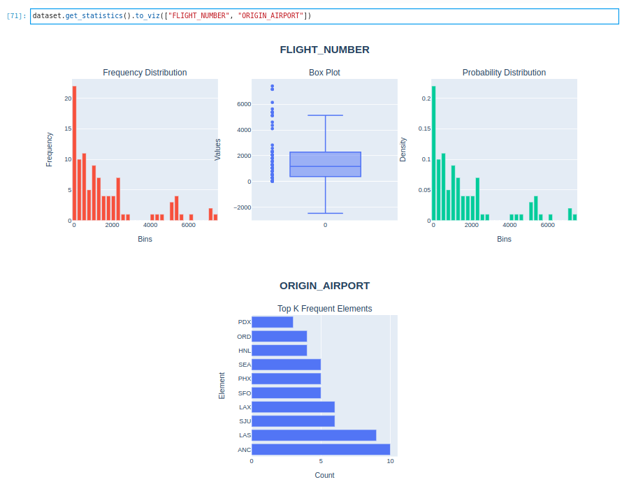

Dataset
********

A dataset is a collection of features that are used together to train a model or perform model inference.

.. image:: figures/dataset.png

Define
======

In an ADS Feature Store module, you can use the Python API or a yaml file to define a dataset.

The following example defines a dataset and gives it a name. A ``Dataset`` instance is created.

.. tabs::

  .. code-tab:: Python3
    :caption: Python

    from ads.feature_store.dataset import Dataset

    dataset = (
        Dataset
        .with_name("<dataset_name>")
        .with_entity_id(<entity_id>)
        .with_feature_store_id("<feature_store_id>")
        .with_description("<dataset_description>")
        .with_compartment_id("<compartment_id>")
        .with_query('SELECT col FROM <entity_id>.<feature_group_name>')
    )

  .. code-tab:: Python3
    :caption: YAML

    from ads.feature_store.dataset import Dataset

    yaml_string = """
    kind: dataset
    spec:
      compartmentId: ocid1.compartment..<unique_id>
      description: <dataset_description>
      name: <dataset_name>
      featureStoreId: <feature_store_id>
    type: dataset
    """

    dataset = Dataset.from_yaml(yaml_string)

Create
======

Use the the ``create()`` method of the ``Dataset`` instance to create a dataset.

.. important::

 This method does not persist any metadata or feature data in the Feature Store. To persist the dataset and save feature data including the metadata in the Feature Store, use the ``materialise()`` method with a dataframe. For simple queries with only one level of nesting, users do not need to define ``with_feature_groups``. However, in complex queries involving more than one level of nesting, users are required to define ``with_feature_groups``.

.. tabs::

  .. code-tab:: Python3
    :caption: Simple SQL

    from ads.feature_store.dataset import Dataset

    dataset = (
        Dataset
        .with_name("<dataset_name>")
        .with_entity_id(<entity_id>)
        .with_feature_store_id("<feature_store_id>")
        .with_description("<dataset_description>")
        .with_compartment_id("<compartment_id>")
        .with_query('SELECT col FROM <entity_id>.<feature_group_name>')
    )

    dataset.create()

  .. code-tab:: Python3
    :caption: Complex SQL

    from ads.feature_store.dataset import Dataset
    from ads.feature_store.feature_group import FeatureGroup

    feature_group = FeatureGroup.from_id("<unique_id>")

    dataset = (
        Dataset
        .with_name("<dataset_name>")
        .with_entity_id(<entity_id>)
        .with_feature_store_id("<feature_store_id>")
        .with_description("<dataset_description>")
        .with_compartment_id("<compartment_id>")
        .with_query('SELECT col FROM (SELECT col FROM <entity_id>.<feature_group_name> WHERE condition = 'some_condition') AS nested_table;')
        .with_feature_groups([feature_group])
    )

    # Create an dataset
    dataset.create()

Load
====

Use the ``from_id()`` method from the ``Dataset`` class to load an existing dataset by specifying the OCID. A ``Dataset`` instance is returned.

.. code-block:: python3

  from ads.feature_store.dataset import Dataset

  dataset = Dataset.from_id("<unique_id>")

Materialise
===========

Use the the ``materialise() -> DatasetJob`` method of the ``Dataset`` instance to load the data to dataset. To persist the dataset and save dataset data, including the metadata in the Feature Store, use ``materialise()``.

The ``.materialise()`` method has the following parameters:

- ``input_dataframe: Union[DataFrame, pd.DataFrame]``. The Spark dataframe or Pandas dataframe.
- ``from_timestamp: str(Optional)``. The from timestamp of the dataset.
- ``to_timestamp: str(Optional)``. The to timestamp of the dataset.
- ``feature_option_details: FeatureOptionDetails(Optional)``. The feature option details for the materialise operation.
    - ``write_config_details: (merge_schema: bool, overwrite_schema: bool)``. The write configuration details for the feature option details.
    - ``read_config_details: (version_as_of: int, timestamp_as_of: datetime)``. The read configuration details for the feature option details.

.. code-block:: python3

  from ads.feature_store.dataset_job import DatasetJob

  dataset_job: DatasetJob = dataset.materialise(dataframe)

.. seealso::
   :ref:`Dataset Job`

Delete
======

Use the ``.delete()`` method on the ``Dataset`` instance to delete a dataset. A dataset can only be deleted when its associated entities are all deleted.

.. code-block:: python3

  dataset.delete()

Get Last Dataset Job
====================
A dataset job is the processing instance of a dataset. Each dataset job includes validation and statistics results.

With a ``Dataset`` instance, you can get the last dataset job details using ``get_last_job()``.

.. code-block:: python3

  dataset_job = dataset.get_last_job()

Save Expectation Entity
=======================
Feature Store allows you to define expectations on data being materialised into a dataset instance. With a ``Dataset`` instance, save the expectation details using ``with_expectation_suite()`` with the following parameters:

- ``expectation_suite: ExpectationSuite``. ``ExpectationSuite`` of the great expectation library.
- ``expectation_type: ExpectationType``. The type of expectation.
        - ``ExpectationType.STRICT``: Fail the job if the expectation isn't met.
        - ``ExpectationType.LENIENT``: Pass the job even if the expectation isn't met.

.. note::

  `Great Expectations <https://docs.greatexpectations.io/docs/0.15.50/>`_  is an open source Python-based library that validates, documents, and profiles data. It automates testing, which is essential for managing complex code bases.

.. image:: figures/validation.png

.. code-block:: python3

    from great_expectations.core import ExpectationSuite, ExpectationConfiguration
    from ads.feature_store.common.enums import ExpectationType
    from ads.feature_store.dataset import Dataset

    dataset = Dataset.from_id("<unique_id>")

    expectation_suite = ExpectationSuite(
        expectation_suite_name="expectation_suite_name"
    )
    expectation_suite.add_expectation(
        ExpectationConfiguration(
            expectation_type="expect_column_values_to_not_be_null",
            kwargs={"column": "<column>"},
        )

    dataset_resource = (
            Dataset()
            .with_description("dataset description")
            .with_compartment_id(<compartment_id>)
            .with_name(<name>)
            .with_entity_id(entity_id)
            .with_feature_store_id(feature_store_id)
            .with_query(f"SELECT * FROM `{entity_id}`.{feature_group_name}")
            .with_expectation_suite(
                expectation_suite=expectation_suite,
                expectation_type=ExpectationType.STRICT,
            )
        )

Use the the ``get_validation_output()`` method of the dataset instance to fetch validation results for a specific ingestion job.
The ``get_validation_output()`` method has the following optional parameters:

- ``job_id: string``. The ID of the dataset job.

``get_validation_output().to_pandas()`` Outputs the validation results for each expectation as a Pandas dataframe.

.. image:: figures/dataset_validation_results.png

``get_validation_output().to_summary()`` Outputs the overall summary of the validation as a Pandas dataframe.

.. image:: figures/dataset_validation_summary.png

.. seealso::

    :ref:`Feature Validation`

Statistics Computation
========================
During the materialisation, Feature Store performs computation of statistical metrics for all the features by default. The computation is configured using a ``StatisticsConfig`` object, which is passed at the creation of the dataset, or it can be updated later.

.. code-block:: python3

  # Define statistics configuration for selected features
  from ads.feature_store.statistics_config import StatisticsConfig
  stats_config = StatisticsConfig().with_is_enabled(True).with_columns(["column1", "column2"])

This is used with ``Dataset`` instance.

.. code-block:: python3

  from ads.feature_store.dataset import Dataset

  dataset = (
        Dataset
        .with_name("<dataset_name>")
        .with_entity_id(<entity_id>)
        .with_feature_store_id("<feature_store_id>")
        .with_description("<dataset_description>")
        .with_compartment_id("<compartment_id>")
        .with_dataset_ingestion_mode(DatasetIngestionMode.SQL)
        .with_query('SELECT col FROM <entity_id>.<feature_group_name>')
        .with_statistics_config(stats_config)
  )

Use the the ``get_statistics()`` method of the ``Dataset`` instance to fetch the metrics for a specific ingestion job.

The ``get_statistics()`` method has the following optional parameter:

- ``job_id: string``. The ID of the dataset job.

.. code-block:: python3

  # Fetch stats results for a dataset job
  df = dataset.get_statistics(job_id).to_pandas()

.. image:: figures/dataset_statistics.png

.. code-block:: python3

  # Fetch and visualize stats for a dataset job
  df = dataset.get_statistics(job_id).to_viz()

.. seealso::

    :ref:`Statistics`

Get features
============
Use the the ``get_features_df()`` method of the ``Dataset`` instance to fetch features in a dataset.

.. code-block:: python3

  # Fetch features for a dataset
  df = dataset.get_features_df()
  df.show()

Preview
========

.. deprecated:: 1.0.3
   Use :func:`as_of` instead.

Use the the ``preview()`` method of the ``Dataset`` instance to preview the dataset.

The ``.preview()`` method has the following optional parameters:
- ``timestamp: date-time``. The commit timestamp for the dataset.
- ``version_number: int``. The version number for the dataset.
- ``row_count: int``. Defaults to 10. The total number of rows to return.

.. code-block:: python3

  # Preview dataset
  df = dataset.preview(row_count=50)
  df.show()

As Of
=======

Use the the ``as_of()`` method of the ``Dataset`` instance to get a specified point in time and time traveled data.

The ``.as_of()`` method has the following optional parameters:

- ``commit_timestamp: date-time``. The commit timestamp for the dataset.
- ``version_number: int``. The version number for the dataset.

.. code-block:: python3

  # as_of feature group
  df = dataset.as_of(version_number=1)

Restore
=======
Use the the ``restore()`` method of the ``Dataset`` instance to restore the dataset to a particular version and timestamp.

The ``.restore()`` method has the following optional parameters:
- ``timestamp: date-time``. The commit timestamp for the dataset.
- ``version_number: int``. The version number for the dataset.

.. code-block:: python3

  # Restore the dataset to a particular version and timestamp
  df = feature_group.restore(version_number=2)
  df.show()

Profile
=======
Use the the ``profile()`` method of the ``Dataset`` instance to profile the dataset.

.. code-block:: python3

  # Profile dataset
  df = dataset.profile()
  df.show()

History
=======
Use the the ``history()`` method of the ``Dataset`` instance to show the history of the dataset.

.. code-block:: python3

  # Show history of dataset
  df = dataset.history()
  df.show()

Visualize Lineage
=================

Use the ``show()`` method on the ``Dataset`` instance to visualize the lineage of the dataset.

The ``show()`` method has the following optional parameter:

- ``rankdir: (str, optional)``. Defaults to ``LR``. The allowed values are ``TB`` or ``LR``. This parameter is applicable only for ``graph`` mode. It renders the direction of the graph as either top to bottom (TB) or left to right (LR).

.. code-block:: python3

  dataset.show()

The following is an example of the output:

.. figure:: figures/dataset_lineage.png
  :width: 400

Add Model Details
=================

Use the the ``add_models()`` method of the ``Dataset`` instance to add model IDs to the dataset.
The ``.add_models()`` method has the following parameter:

- ``model_details: ModelDetails``.  Provide ``items: List[str]`` as parameter and model IDs are passed as items.

.. code-block:: python3

  dataset.add_models(ModelDetails().with_items([<ocid1.datasciencemodel..<unique_id>]))
