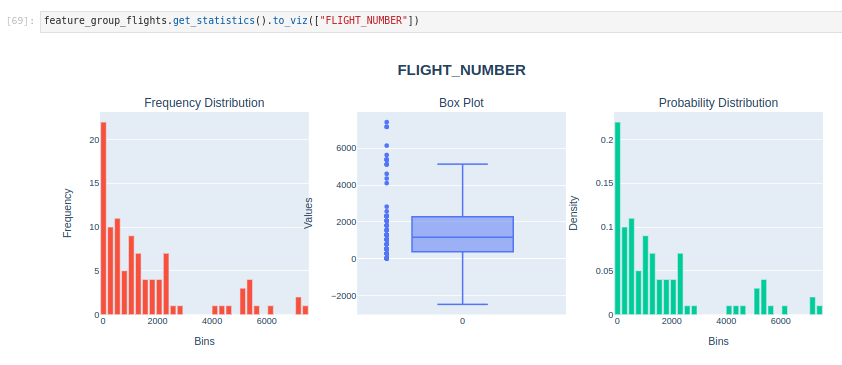

Feature Group
*************

A feature group in a Feature Store is a collection of related features that are often used together in machine learning models. Feature groups serve as an organizational unit in the Feature Store to manage, version, and share features across different machine learning projects. By organizing features into groups, data scientists and machine learning engineers can efficiently discover, reuse, and collaborate on features. Feature groups reduce the redundant work and ensure consistency in feature engineering.

.. image:: figures/feature_group.png

In feature group, three key types play crucial roles:

- **Primary Keys**: These keys uniquely identify individual records in the feature group. They ensure the uniqueness and integrity of each entry, allowing for efficient retrieval and modification of specific data points.
- **Partition Keys**: These keys assist in distributing and organizing data across different partitions in the feature group. They enable efficient data retrieval by logically grouping related information, optimizing query performance, and minimizing resource utilization.
- **Event Timestamp Keys**: These keys capture the temporal aspect of the data by indicating the time or timestamp associated with a specific event or entry in the feature group. They facilitate time-based querying, trend analysis, and time-series operations.

.. important::
    By default, special characters such as spaces and any of the characters ,;{}()\n\t= are not supported in feature group column names.

Define
======

In an ADS Feature Store module, you can use the Python API or a .yaml file to define a feature group.

The following example defines a feature group and gives it a name. A ``FeatureGroup`` instance is created.

.. tabs::

  .. code-tab:: Python3
    :caption: Python

    from ads.feature_store.feature_group import FeatureGroup
    # Dictionary containing arguments for the feature group for the transformation function.
    transformation_kwargs = {}

    feature_group_flights = (
        FeatureGroup()
        .with_feature_store_id(feature_store.id)
        .with_primary_keys(["col1"])
        .with_partition_keys(["col1", "col2"])
        .with_name("flights_feature_group")
        .with_entity_id("<entity_id>")
        .with_compartment_id("ocid1.compartment..<unique_id>")
        .with_schema_details_from_dataframe(dataframe)
        .with_transformation_kwargs(transformation_kwargs)
    )

  .. code-tab:: Python3
    :caption: YAML

    from ads.feature_store.feature_group import FeatureGroup

    yaml_string = """
    kind: FeatureGroup
    spec:
      compartmentId: ocid1.compartment..<unique_id>
      entityId: <entity_id>
      featureStoreId: <feature_store_id>
      id: <feature_group_id>
      inputFeatureDetails:
      - featureType: STRING
        name: col1
        orderNumber: 1
      - featureType: STRING
        name: col2
        orderNumber: 2
      name: <feature_group_name>
      primaryKeys:
        items:
        - name: col1
      partitionKeys:
        items:
        - name: col1
      statisticsConfig:
        isEnabled: true
    type: featureGroup
    """

    feature_group = FeatureGroup.from_yaml(yaml_string)

Create
======

Use the ``create()`` method of the ``FeatureGroup`` instance to create a feature group.

.. important::

  This method doesn't persist any metadata or feature data in the Feature Store. To persist the feature group and save feature data, including the metadata in the Feature Store, use the ``materialise()`` method with a dataframe.

.. code-block:: python3

  # Create a feature group
  feature_group.create()

Load
====

Use the ``from_id()`` method from the ``FeatureGroup`` class to load an existing feature group by specifying its OCID. A ``FeatureGroup`` instance is returned.

.. code-block:: python3

  from ads.feature_store.feature_group import FeatureGroup

  feature_group = FeatureGroup.from_id("<unique_id>")

Materialise
===========

Use the ``materialise() -> FeatureGroupJob`` method of the ``FeatureGroup`` instance to load the data to feature group. To persist the feature group and save feature group data, including the metadata in the Feature Store, use ``materialise()``.

The ``.materialise()`` method has the following parameters:

- ``input_dataframe: Union[DataFrame, pd.DataFrame]``. The Spark dataframe or Pandas dataframe.
- ``from_timestamp: str(Optional)``. The from timestamp of the feature group.
- ``to_timestamp: str(Optional)``. The to timestamp of the feature group.
- ``feature_option_details: FeatureOptionDetails(Optional)``. The feature option details for the materialise operation.
    - ``write_config_details: (merge_schema: bool, overwrite_schema: bool)``. Write configuration details for the feature option details.
    - ``read_config_details: (version_as_of: int, timestamp_as_of: datetime)``. Read configuration details for the feature option details.

.. code-block:: python3

  from ads.feature_store.feature_group_job import FeatureGroupJob

  feature_group_job: FeatureGroupJob = feature_group.materialise(dataframe)

.. seealso::
   For more information, see :ref:`Feature Group Job`.

.. seealso::
   See :ref:`Data types` for the types supported by Feature Store.

Materialise Stream
==================
You can call the ``materialise_stream() -> FeatureGroupJob`` method of the ``FeatureGroup`` instance to load the streaming data to the feature group. To persist the feature group and save the feature group data along the metadata in the Feature Store, call the ``materialise_stream()``

The ``.materialise_stream()`` method takes the following parameter:
    - ``input_dataframe``: The features in Streaming Dataframe to be saved.
    - ``query_name``: It is possible to optionally specify a name for the query to make it easier to recognize in the Spark UI. It defaults to ``None``.
    - ``ingestion_mode``: Specifies how the data of a streaming DataFrame or dataset is written to a streaming sink.
        - ``append``: Only the new rows in the streaming DataFrame or dataset are written to the sink. If the query doesn’t contain aggregations, it is equivalent to the append mode. It defaults to ``"append"``.
        - ``complete``: All the rows in the streaming DataFrame or dataset are written to the sink every time there is an update.
        - ``update``: Only the rows that were updated in the streaming DataFrame or dataset are written to the sink every time there is an update.
    - ``await_termination``: Waits for the ending of this query, either by ``query.stop()`` or by an exception. If the query has ended with an exception, then the exception is raised. If a timeout is set, it returns whether the query has terminated or not in the timeout seconds. It defaults to ``False``.
    - ``timeout``: Only relevant in combination with ``await_termination=True``.
        - Defaults to ``None``.
    - ``checkpoint_dir``: The checkpoint directory location. It's used to as a reference to where to resume the streaming job from. It defaults to ``None``.
    - ``write_options``: Extra write options for Spark as key-value pairs.
        - Defaults to ``{}``.

.. code-block:: python3

  from ads.feature_store.feature_group import FeatureGroup

  from ads.feature_store.common.spark_session_singleton import SparkSessionSingleton
  from pyspark.sql.types import StructType

  # Get the spark session managed by the feature store
  spark = SparkSessionSingleton(metastore_id=metastore_id).get_spark_session()

  df = spark.readStream \
    .option("sep", ",") \
    .option("header", True) \
    .csv(f"{stream_data_dir}/")

  feature_group = FeatureGroup.from_id("<unique_id>")

  query = fg.materialise_stream(input_dataframe=df, checkpoint_dir=f"{stream_data_dir}chec")

  query.awaitTermination()

.. seealso::
   :ref:`Feature Group Job`

.. seealso::
   Refer  :ref:`Data types` supported by Feature Store.

Delete
======

Use the ``.delete()`` method on the ``FeatureGroup`` instance to delete a feature group. A feature group can only be deleted when its associated entities are all deleted.

.. code-block:: python3

  feature_group.delete()

Select
======
Use the ``select()`` method of the ``FeatureGroup`` instance to return the ``Query`` interface. The ``Query`` interface is used to join and filter on the feature group.

Feature Store provides an API similar to Pandas to join feature groups together, and to select features from different feature groups. Write the query by selecting all, or a subset, of the features from a feature group, and then join them with all, or a subset, of the features of another feature group.

.. code-block:: python3

  # Select all columns of feature group
  feature_group.select().show()

  # Select subset columns of feature group
  feature_group.select(['col1', 'col2']).show()

  # Filter feature groups
  feature_group.filter(feature_group.col1 == 0).show()

  # Join feature groups
  query = feature_group_a.select()\
                .join(feature_group_b.select(), left_on=['a_1'], right_on=['b_1'])\
                .join(feature_group_c.select(), left_on=['b_1'], right_on=['c_1'])
  query.show(5)

Save Expectation Entity
=======================
Using a ``FeatureGroup`` instance, you can save the expectation details using ``with_expectation_suite()`` with the following parameters:

- ``expectation_suite: ExpectationSuite``. The ``ExpectationSuite`` of the great expectation library.
- ``expectation_type: ExpectationType``. The type of expectation.
        - ``ExpectationType.STRICT``: Fail the job if the expectation isn't met.
        - ``ExpectationType.LENIENT``: Pass the job even if the expectation isn't met.

.. note::

  `Great Expectations <https://docs.greatexpectations.io/docs/0.15.50/>`_  is an open source Python-based library that validates, documents, and profiles data. It automates testing, which is essential for managing complex code bases.

.. code-block:: python3

    from great_expectations.core import ExpectationSuite, ExpectationConfiguration
    from ads.feature_store.common.enums import ExpectationType
    from ads.feature_store.feature_group import FeatureGroup

    feature_group = FeatureGroup.from_id("<unique_id>")

    expectation_suite = ExpectationSuite(
        expectation_suite_name="expectation_suite_name"
    )
    expectation_suite.add_expectation(
        ExpectationConfiguration(
            expectation_type="expect_column_values_to_not_be_null",
            kwargs={"column": "<column>"},
        )

    feature_group_resource = (
        FeatureGroup()
        .with_feature_store_id(feature_store.id)
        .with_primary_keys(["<key>"])
        .with_name("<name>")
        .with_entity_id(entity.id)
        .with_compartment_id(<compartment_id>)
        .with_schema_details_from_dataframe(<datframe>)
        .with_expectation_suite(
            expectation_suite=expectation_suite,
            expectation_type=ExpectationType.STRICT,
         )
    )

Use the ``get_validation_output()`` method of the ``FeatureGroup`` instance to fetch validation results for a specific ingestion job.
The ``get_validation_output()`` method has the following optional parameters:

- ``job_id: string``. The ID of the feature group job.

``get_validation_output().to_pandas()`` Outputs  the validation results for each expectation as a Pandas dataframe.

.. image:: figures/validation_results.png

``get_validation_output().to_summary()`` Outputs the overall summary of validation as a Pandas dataframe.

.. seealso::

   :ref:`Feature Validation`

Statistics Computation
========================
During the materialisation, Feature Store performs a computation of statistical metrics for all the features by default. Configure computation using a ``StatisticsConfig`` object, which is passed at the creation of a feature group, or which can be updated later.

.. code-block:: python3

  # Define statistics configuration for selected features
  from ads.feature_store.statistics_config import StatisticsConfig
  stats_config = StatisticsConfig().with_is_enabled(True).with_columns(["column1", "column2"])

The following example uses computation with a feature group instance.

.. code-block:: python3

  # Fetch stats results for a feature group job
  from ads.feature_store.feature_group import FeatureGroup

  feature_group_resource = (
    FeatureGroup()
    .with_feature_store_id(feature_store.id)
    .with_primary_keys(["<key>"])
    .with_name("<name>")
    .with_entity_id(entity.id)
    .with_compartment_id(<compartment_id>)
    .with_schema_details_from_dataframe(<dataframe>)
    .with_statistics_config(stats_config)

Use the ``get_statistics()`` method of the feature group to fetch metrics for a specific ingestion job.

The ``get_statistics()`` method has the following optional parameter:

- ``job_id: string``. The ID of feature the group job.

.. code-block:: python3

  # Fetch statistics results for a feature group job
  df = feature_group.get_statistics(job_id).to_pandas()

.. image:: figures/stats_1.png

.. code-block:: python3

  # Fetch and visualize statistics for a dataset job
  df = feature_group.get_statistics(job_id).to_viz()

.. seealso::

    :ref:`Statistics`

Get Last Feature Group Job
==========================
The feature group job is the processing instance of a feature group. Each feature group job includes validation and statistics results.

Using a FeatureGroup instance, you can get the last feature group job details using ``get_last_job()``.

.. code-block:: python3

  # Fetch validation results for a feature group
  feature_group_job = feature_group.get_last_job()

Get Features
=============
Use the ``get_features_df`` method of the ``FeatureGroup`` instance to fetch features in a feature group.

.. code-block:: python3

  # Fetch features for a feature group
  df = feature_group.get_features_df()

Filter
======
Use the ``filter()`` method of the ``FeatureGroup`` instance to return the ``Query`` interface. The ``Query`` interface is used to join and filter on the feature group or a set of feature groups.

Feature store provides an API similar to Pandas to join feature groups together, and to select features from different feature groups. Write the query by selecting all or a subset of features from a feature group, and then join them with all or a subset of features of another feature group.

.. code-block:: python3

  # Filter feature group
  feature_group.filter(feature_group.col1 > 10).show()

  # Filter feature group with get_feature
  feature_group.filter(feature_group.get_feature("col1") > 10).show()

Get Feature
===========
Use the ``get_feature()`` method of the ``FeatureGroup`` instance to return the description of feature.

.. code-block:: python3

    feature_group.get_feature("col1")

Preview
=======

.. deprecated:: 1.0.3
   Use :func:`as_of` instead.

Use the ``preview()`` method of the ``FeatureGroup`` instance to preview the feature group.

The ``.preview()`` method has the following optional parameters:

- ``timestamp: date-time``. The commit timestamp of the feature group.
- ``version_number: int``. The version number of the feature group.
- ``row_count: int``. Defaults to 10. The total number of rows to return.

.. code-block:: python3

  # Preview feature group
  df = feature_group.preview(row_count=50)

As Of
=======

Use the ``as_of()`` method of the ``FeatureGroup`` instance to get specified point in time and time traveled data.

The ``.as_of()`` method takes the following optional parameters:

- ``commit_timestamp: date-time``. The commit timestamp for the feature group.
- ``version_number: int``. The version number for the feature group.

.. code-block:: python3

  # as_of feature group
  df = feature_group.as_of(version_number=1)

Restore
=======

Use the ``restore()`` method of the ``FeatureGroup`` instance to restore the feature group to a particular version and timestamp.

The ``.restore()`` method takes the following optional parameters:

- ``timestamp: date-time``. The commit timestamp of the feature group.
- ``version_number: int``. The version number of the feature group.

.. code-block:: python3

  # Restore the feature group to a particular version and timestamp
  df = feature_group.restore(version_number=2)

Profile
=======

Use the ``profile()`` method of the ``FeatureGroup`` instance to profile the feature group.

.. code-block:: python3

  # Profile feature group
  df = feature_group.profile()

History
=======

Use the ``history()`` method of the ``FeatureGroup`` instance to show the history of the feature group.

.. code-block:: python3

  # Show history of feature group
  df = feature_group.history()

Visualize Lineage
=================

Use the ``show()`` method on the ``FeatureGroup`` instance to visualize the lineage of the feature group.

The ``show()`` method has the following optional parameter:

  - ``rankdir: (str, optional)``. It defaults to ``LR``. The allowed values are ``TB`` or ``LR``. This parameter is applicable only for ``graph`` mode, and it renders the direction of the graph as either top to bottom (TB) or left to right (LR).

.. code-block:: python3

  feature_store.show()

The following is an example of the output:

.. figure:: figures/feature_group_lineage.png
  :width: 400

.. _Data types:

Data Types
==========
The data is stored in a data type native to each store. Specifying ``with_schema_details_from_dataframe`` causes the Feature Store to automatically infer the data types from the dataframe. This option can also specify the data type explicitly.

.. note::

    Offline Data Types
    ###################
    The following table shows the mapping when registering a Spark dataframe, or a Pandas dataframe. For Spark dataframes, all  data types including those not specified in the following table, are mapped to the Offline Feature Type, COMPLEX.

    .. list-table::
       :widths: 20 25 25 40
       :header-rows: 1

       * - Spark Type
         - Pandas Type
         - Offline Feature Type
         - Notes
       * - BooleanType
         - bool
         - BOOLEAN
         - True or False
       * - ByteType
         - uint8
         - INTEGER
         - 8-bit integer
       * - ShortType
         - int16, Int16
         - INTEGER
         - 16-bit integer
       * - IntegerType
         - int32
         - INTEGER
         - 32-bit integer
       * - LongType
         - int64
         - INTEGER
         - 64-bit integer
       * - FloatType
         - float32
         - FLOAT
         - Floating-point values
       * - DoubleType
         - float64
         - FLOAT
         - Double-precision floating-point values
       * - DecimalType
         - object(decimal)
         - DECIMAL
         - Fixed-point decimal numbers
       * - TimestampType
         - datetime64[ns]
         - TIMESTAMP
         - Timestamps
       * - DateType
         - datetime64[ns]
         - TIMESTAMP
         - Date values
       * - StringType
         - object
         - STRING
         - Textual data
       * - ArrayType(IntegerType())
         - object (list), object (np.ndarray)
         - INTEGER_ARRAY
         - List of values
       * - ArrayType(LongType())
         - object (list), object (np.ndarray)
         - LONG_ARRAY
         - List of values
       * - ArrayType(FloatType())
         - object (list), object (np.ndarray)
         - FLOAT_ARRAY
         - List of values
       * - ArrayType(DoubleType())
         - object (list), object (np.ndarray)
         - DOUBLE_ARRAY
         - List of values
       * - ArrayType(BinaryType())
         - object (list), object (np.ndarray) - not supported
         - BINARY_ARRAY
         - List of values
       * - ArrayType(DateType())
         - object (list), object (np.ndarray)
         - DATE_ARRAY
         - List of values
       * - ArrayType(TimestampType())
         - object (list), object (np.ndarray)
         - TIMESTAMP_ARRAY
         - List of values
       * - StructType
         - object - not supported
         - STRUCT
         - Structured data
       * - BinaryType
         - object(bytes) - not supported
         - BINARY
         - Binary data
       * - MapType(StringType(), StringType())
         - object - not supported
         - STRING_STRING_MAP
         - Key-value pairs
       * - MapType(StringType(), IntegerType())
         - object - not supported
         - STRING_INTEGER_MAP
         - Key-value pairs
       * - MapType(StringType(), ShortType())
         - object - not supported
         - STRING_SHORT_MAP
         - Key-value pairs
       * - MapType(StringType(), LongType())
         - object - not supported
         - STRING_LONG_MAP
         - Key-value pairs
       * - MapType(StringType(), FloatType())
         - object - not supported
         - STRING_FLOAT_MAP
         - Key-value pairs
       * - MapType(StringType(), DoubleType())
         - object - not supported
         - STRING_DOUBLE_MAP
         - Key-value pairs
       * - MapType(StringType(), TimestampType())
         - object - not supported
         - STRING_TIMESTAMP_MAP
         - Key-value pairs
       * - MapType(StringType(), DateType())
         - object - not supported
         - STRING_DATE_MAP
         - Key-value pairs

    For Pandas dataframes, the initial step involves converting the dataframe into a Spark dataframe. This conversion uses the default conversion mechanism provided by Spark, which might result in a less precise mapping between Python and Spark types.

    .. list-table::
       :widths: 30 20 40
       :header-rows: 1

       * - Pandas Type
         - Spark Type
         - Notes
       * - bool
         - BooleanType
         -
       * - int8, uint8, int16, uint16, int32, int, uint32, int64
         - LongType
         -
       * - float, float16, float32, float64
         - DoubleType
         -
       * - object (decimal.decimal)
         - DecimalType
         -
       * - datetime64[ns], datetime64[ns, tz]
         - TimestampType
         - Timestamps and Timezones
       * - object (datetime.date)
         - DateType
         -
       * - object (str), object(np.unicode)
         - StringType
         -
       * - object (list), object (np.ndarray)
         -
         - Not supported
