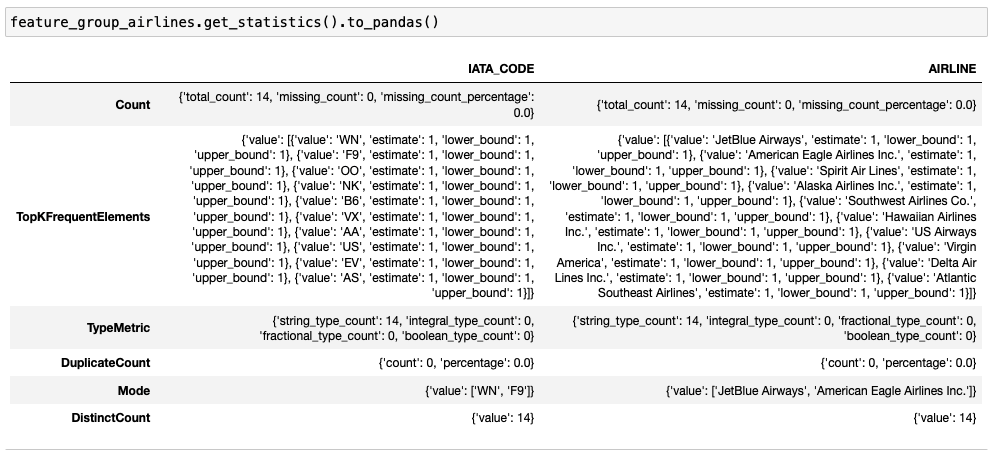

Feature Group
*************

A feature group in a feature store is a collection of related features that are often used together in ml models. It serves as an organizational unit within the feature store for users to manage, version and share features across different ml projects. By organizing features into groups, data scientists and ml engineers can efficiently discover, reuse and collaborate on features reducing the redundant work and ensuring consistency in feature engineering.

Define
======

In an ADS feature store module, you can either use the Python API or YAML to define a feature group.

With the specified way below, you can define a feature group and give it a name.
A ``FeatureGroup`` instance will be created.

.. tabs::

  .. code-tab:: Python3
    :caption: Python

    from ads.feature_store.feature_group import FeatureGroup
    # Dictionary containing arguments for the feature group for the transformation function.
    transformation_kwargs = {}

    feature_group_flights = (
        FeatureGroup()
        .with_feature_store_id(feature_store.id)
        .with_primary_keys(["col1"])
        .with_partition_keys(["col1", "col2"])
        .with_name("flights_feature_group")
        .with_entity_id("<entity_id>")
        .with_compartment_id("ocid1.compartment..<unique_id>")
        .with_schema_details_from_dataframe(dataframe)
        .with_transformation_kwargs(transformation_kwargs)
    )

  .. code-tab:: Python3
    :caption: YAML

    from ads.feature_store.feature_group import FeatureGroup

    yaml_string = """
    kind: FeatureGroup
    spec:
      compartmentId: ocid1.compartment..<unique_id>
      entityId: <entity_id>
      featureStoreId: <feature_store_id>
      id: <feature_group_id>
      inputFeatureDetails:
      - featureType: STRING
        name: col1
        orderNumber: 1
      - featureType: STRING
        name: col2
        orderNumber: 2
      name: <feature_group_name>
      primaryKeys:
        items:
        - name: col1
      partitionKeys:
        items:
        - name: col1
      statisticsConfig:
        isEnabled: true
    type: featureGroup
    """

    feature_group = FeatureGroup.from_yaml(yaml_string)

Create
======

You can call the ``create()`` method of the ``FeatureGroup`` instance to create a feature group.

.. important::

  This method is lazy and does not persist any metadata or feature data in the feature store on its own.
  To persist the feature group and save feature data along the metadata in the feature store, call the ``materialise()``
  method with a DataFrame.

.. code-block:: python3

  # Create a feature group
  feature_group.create()

Load
====

Use the ``from_id()`` method from the ``FeatureGroup`` class to load an existing feature group with its OCID provided. It returns a ``FeatureGroup`` instance.

.. code-block:: python3

  from ads.feature_store.feature_group import FeatureGroup

  feature_group = FeatureGroup.from_id("ocid1.feature_group..<unique_id>")

Materialise
===========

You can call the ``materialise() -> FeatureGroupJob`` method of the ``FeatureGroup`` instance to load the data to feature group. To persist the feature_group and save feature_group data along the metadata in the feature store, call the ``materialise()``

The ``.materialise()`` method takes the following parameter:

- ``input_dataframe: Union[DataFrame, pd.DataFrame]``. Spark dataframe or pandas dataframe.
- ``from_timestamp: str(Optional)``. From timestamp of feature group.
- ``to_timestamp: str(Optional)``. To timestamp of feature group.
- ``feature_option_details: FeatureOptionDetails(Optional)``. Feature option details for materialise operation.
    - ``write_config_details: (merge_schema: bool, overwrite_schema: bool)``. Write config details for feature option details
    - ``read_config_details: (version_as_of: int, timestamp_as_of: datetime)``. Read config details for feature option details

.. code-block:: python3

  from ads.feature_store.feature_group_job import FeatureGroupJob

  feature_group_job: FeatureGroupJob = feature_group.materialise(dataframe)

.. seealso::
   :ref:`Feature Group Job`

.. seealso::
   Refer  :ref:`Data types` supported by feature store

Delete
======

Use the ``.delete()`` method on the ``FeatureGroup`` instance to delete a feature group.

A feature group can only be deleted when its associated entities are all deleted,

.. code-block:: python3

  feature_group.delete()

Select
======
You can call the ``select()`` method of the FeatureGroup instance to return ``Query`` interface. ``Query`` interface can be used to join and filter on the feature group.

Feature store provides an API similar to Pandas to join feature groups together and to select features from different feature groups. This easies the way you can write the query by selecting all/subset of features from a feature group and join them with all/subset of features of another feature group.

.. code-block:: python3

  # Select all columns of feature group
  feature_group.select().show()

  # Select subset columns of feature group
  feature_group.select(['col1', 'col2']).show()

  # Filter feature groups
  feature_group.filter(feature_group.col1 == 0).show()

  # Join feature groups
  query = feature_group_a.select()\
                .join(feature_group_b.select(), left_on=['a_1'], right_on=['b_1'])\
                .join(feature_group_c.select(), left_on=['b_1'], right_on=['c_1'])
  query.show(5)

Save expectation entity
=======================
With a ``FeatureGroup`` instance, You can save the expectation details using ``with_expectation_suite()`` with parameters

- ``expectation_suite: ExpectationSuite``. ExpectationSuit of great expectation
- ``expectation_type: ExpectationType``. Type of expectation
        - ``ExpectationType.STRICT``: Fail the job if expectation not met
        - ``ExpectationType.LENIENT``: Pass the job even if expectation not met

.. note::

  Great Expectations is a Python-based open-source library for validating, documenting, and profiling your data. It helps you to maintain data quality and improve communication about data between teams. Software developers have long known that automated testing is essential for managing complex codebases.

.. image:: figures/validation.png

.. code-block:: python3

    expectation_suite = ExpectationSuite(
        expectation_suite_name="expectation_suite_name"
    )
    expectation_suite.add_expectation(
        ExpectationConfiguration(
            expectation_type="expect_column_values_to_not_be_null",
            kwargs={"column": "<column>"},
        )

    feature_group_resource = (
        FeatureGroup()
        .with_feature_store_id(feature_store.id)
        .with_primary_keys(["<key>"])
        .with_name("<name>")
        .with_entity_id(entity.id)
        .with_compartment_id(<compartment_id>)
        .with_schema_details_from_dataframe(<datframe>)
        .with_expectation_suite(
            expectation_suite=expectation_suite,
            expectation_type=ExpectationType.STRICT,
         )
    )

You can call the ``get_validation_output()`` method of the FeatureGroup instance to fetch validation results for a specific ingestion job.
The ``get_validation_output()`` method takes the following optional parameter:

- ``job_id: string``. Id of feature group job
``get_validation_output().to_pandas()`` will output  the validation results for each expectation as pandas dataframe

``get_validation_output().to_summary()`` will output the overall summary of validation as pandas dataframe.

.. image:: figures/validation_summary.png
.. seealso::

   :ref:`Feature Validation`

Statistics Computation
========================
During the materialization feature store performs computation of statistical metrics for all the features  by default. This can be configured using ``StatisticsConfig`` object which can be passed at the creation of
feature group or it can be updated later as well.

.. code-block:: python3

  # Define statistics configuration for selected features
  stats_config = StatisticsConfig().with_is_enabled(True).with_columns(["column1", "column2"])

This can be used with feature group instance.

.. code-block:: python3

  # Fetch stats results for a feature group job
  from ads.feature_store.feature_group import FeatureGroup

  feature_group_resource = (
    FeatureGroup()
    .with_feature_store_id(feature_store.id)
    .with_primary_keys(["<key>"])
    .with_name("<name>")
    .with_entity_id(entity.id)
    .with_compartment_id(<compartment_id>)
    .with_schema_details_from_dataframe(<dataframe>)
    .with_statistics_config(stats_config)

You can call the ``get_statistics()`` method of the feature group to fetch metrics for a specific ingestion job.

The ``get_statistics()`` method takes the following optional parameter:

- ``job_id: string``. Id of feature group job

.. code-block:: python3

  # Fetch stats results for a feature group job
  df = feature_group.get_statistics(job_id).to_pandas()

.. seealso::

    :ref:`Statistics`

Get last feature group job
==========================
Feature group job is the execution instance of a feature group. Each feature group job will include validation results and statistics results.

With a FeatureGroup instance, we can get the last feature group job details using ``get_last_job()``

.. code-block:: python3

  # Fetch validation results for a feature group
  feature_group_job = feature_group.get_last_job()

Get features
=============
You can call the ``get_features_df`` method of the FeatureGroup instance to fetch features in a feature group

.. code-block:: python3

  # Fetch features for a feature group
  df = feature_group.get_features_df()

Filter
======
You can call the ``filter()`` method of the FeatureGroup instance to return ``Query`` interface. ``Query`` interface can be used to join and filter on the feature group or a set of feature groups.

Feature store provides an API similar to Pandas to join feature groups together and to select features from different feature groups. This easies the way you can write the query by selecting all/subset of features from a feature group and join them with all/subset of features of another feature group.

.. code-block:: python3

  # Filter feature group
  feature_group.filter(feature_group.col1 > 10).show()

Preview
=======

You can call the ``preview()`` method of the FeatureGroup instance to preview the feature group.

The ``.preview()`` method takes the following optional parameter:

- ``timestamp: date-time``. Commit timestamp for feature group
- ``version_number: int``. Version number for feature group
- ``row_count: int``. Defaults to 10. Total number of row to return

.. code-block:: python3

  # Preview feature group
  df = feature_group.preview(row_count=50)

Restore
=======

You can call the ``restore()`` method of the FeatureGroup instance to restore the feature group to a particular version and timestamp.

The ``.restore()`` method takes the following optional parameter:

- ``timestamp: date-time``. Commit timestamp for feature group
- ``version_number: int``. Version number for feature group

.. code-block:: python3

  # Restore feature group to a particular version and timestamp
  df = feature_group.restore(version_number=2)

Profile
=======

You can call the ``profile()`` method of the FeatureGroup instance to profile the feature group.

.. code-block:: python3

  # Profile feature group
  df = feature_group.profile()

History
=======

You can call the ``history()`` method of the FeatureGroup instance to show history of the feature group.

.. code-block:: python3

  # Show history of feature group
  df = feature_group.history()

Visualize Lineage
=================

Use the ``show()`` method on the ``FeatureGroup`` instance to visualize the lineage of the feature group.

The ``show()`` method takes the following optional parameter:

  - ``rankdir: (str, optional)``. Defaults to ``LR``. The allowed values are ``TB`` or ``LR``. This parameter is applicable only for ``graph`` mode and it renders the direction of the graph as either top to bottom (TB) or left to right (LR).

.. code-block:: python3

  feature_store.show()

Below is an example of the output.

.. _Data types:

Data types
==========
The data will be stored in a data type native to each store. There is an option to automatically infer the datatype or specify the datatype explicitly. If the user specifies ``with_schema_details_from_dataframe``, the feature store service automatically infers the data types from the dataframe

.. note::

    Offline data types
    ###################
    Please refer to the following mapping when registering a Spark DataFrame, or a Pandas DataFrame.For spark dataframes we support
    all the data types and the ones which are not specified in the following table will be mapped to  Offline Feature Type COMPLEX

    .. list-table::
       :widths: 20 25 25 40
       :header-rows: 1

       * - Spark Type
         - Pandas Type
         - Offline Feature Type
         - Notes
       * - BooleanType
         - bool
         - BOOLEAN
         - True or False
       * - ByteType
         - uint8
         - INTEGER
         - 8-bit integer
       * - ShortType
         - int16, Int16
         - INTEGER
         - 16-bit integer
       * - IntegerType
         - int32
         - INTEGER
         - 32-bit integer
       * - LongType
         - int64
         - INTEGER
         - 64-bit integer
       * - FloatType
         - float32
         - FLOAT
         - Floating-point values
       * - DoubleType
         - float64
         - FLOAT
         - Double-precision floating-point values
       * - DecimalType
         - object(decimal)
         - DECIMAL
         - Fixed-point decimal numbers
       * - TimestampType
         - datetime64[ns]
         - TIMESTAMP
         - Timestamps
       * - DateType
         - datetime64[ns]
         - TIMESTAMP
         - Date values
       * - StringType
         - object
         - STRING
         - Textual data
       * - ArrayType(IntegerType())
         - object (list), object (np.ndarray)
         - INTEGER_ARRAY
         - List of values
       * - ArrayType(LongType())
         - object (list), object (np.ndarray)
         - LONG_ARRAY
         - List of values
       * - ArrayType(FloatType())
         - object (list), object (np.ndarray)
         - FLOAT_ARRAY
         - List of values
       * - ArrayType(DoubleType())
         - object (list), object (np.ndarray)
         - DOUBLE_ARRAY
         - List of values
       * - ArrayType(BinaryType())
         - object (list), object (np.ndarray) - not supported
         - BINARY_ARRAY
         - List of values
       * - ArrayType(DateType())
         - object (list), object (np.ndarray)
         - DATE_ARRAY
         - List of values
       * - ArrayType(TimestampType())
         - object (list), object (np.ndarray)
         - TIMESTAMP_ARRAY
         - List of values
       * - StructType
         - object - not supported
         - STRUCT
         - Structured data
       * - BinaryType
         - object(bytes) - not supported
         - BINARY
         - Binary data
       * - MapType(StringType(), StringType())
         - object - not supported
         - STRING_STRING_MAP
         - Key-value pairs
       * - MapType(StringType(), IntegerType())
         - object - not supported
         - STRING_INTEGER_MAP
         - Key-value pairs
       * - MapType(StringType(), ShortType())
         - object - not supported
         - STRING_SHORT_MAP
         - Key-value pairs
       * - MapType(StringType(), LongType())
         - object - not supported
         - STRING_LONG_MAP
         - Key-value pairs
       * - MapType(StringType(), FloatType())
         - object - not supported
         - STRING_FLOAT_MAP
         - Key-value pairs
       * - MapType(StringType(), DoubleType())
         - object - not supported
         - STRING_DOUBLE_MAP
         - Key-value pairs
       * - MapType(StringType(), TimestampType())
         - object - not supported
         - STRING_TIMESTAMP_MAP
         - Key-value pairs
       * - MapType(StringType(), DateType())
         - object - not supported
         - STRING_DATE_MAP
         - Key-value pairs

    When it comes to Pandas dataframes, the initial step involves converting the dataframe into a Spark dataframe. This conversion is done using the default conversion mechanism provided by Spark, which may result in a less precise mapping between Python and Spark types.

    .. list-table::
       :widths: 30 20 40
       :header-rows: 1

       * - Pandas Type
         - Spark Type
         - Notes
       * - bool
         - BooleanType
         -
       * - int8, uint8, int16, uint16, int32, int, uint32, int64
         - LongType
         -
       * - float, float16, float32, float64
         - DoubleType
         -
       * - object (decimal.decimal)
         - DecimalType
         -
       * - datetime64[ns], datetime64[ns, tz]
         - TimestampType
         - Timestamps and Timezones
       * - object (datetime.date)
         - DateType
         -
       * - object (str), object(np.unicode)
         - StringType
         -
       * - object (list), object (np.ndarray)
         -
         - Not supported
