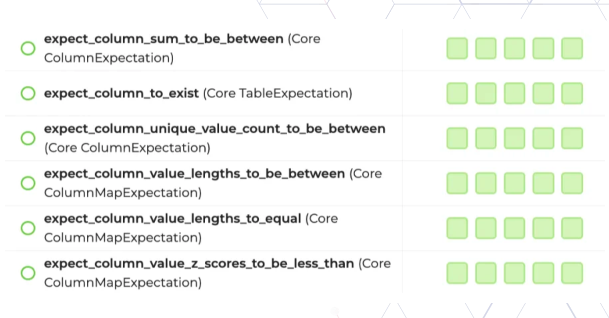

.. _Feature Validation:

Feature Validation
******************

Feature validation is the process of checking the quality and accuracy of the features used in a machine learning model. This is important because features that aren't accurate or reliable can lead to poor model performance. Feature Store lets you define expectations on the data that is being materialised into feature groups and datasets. The Great Expectations open source library is used to define expectations.

There are two types of expectations possible for expectation suite

- ``ExpectationType.STRICT``: Requires meeting set expectations. The job fails if criteria aren't met.
- ``ExpectationType.LENIENT``: Permits unmet expectations. The job continues despite criteria not being fully satisfied.

.. note::
  `Great Expectations <https://docs.greatexpectations.io/docs/0.15.50/>`_  is an open source Python-based library that validates, documents, and profiles data. It automates testing, which is essential for managing complex code bases.

Expectations
============
An expectation is a verifiable assertion about your data.

The following example defines an expectation:

.. code-block:: python3

    from great_expectations.core import ExpectationSuite, ExpectationConfiguration
    from ads.feature_store.common.enums import ExpectationType
    from ads.feature_store.feature_group import FeatureGroup

    feature_group = FeatureGroup.from_id("<unique_id>")

    # Create an Expectation
    expectation_suite = ExpectationSuite(
        expectation_suite_name="test_suite"
    )
    expectation_suite.add_expectation(
        ExpectationConfiguration(
            expectation_type="expect_column_values_to_not_be_null",
            kwargs={"column": "COL1"},
        )
    )
    expectation_suite.add_expectation(
        ExpectationConfiguration(
            expectation_type="expect_column_values_to_be_between",
            kwargs={"column": "COL2", "min_value": 0, "max_value": 30},
        )
    )

    feature_group.with_expectation_suite(expectation_suite, expectation_type = ExpectationType.STRICT)
    feature_group.update()

Expectations Suite
===================

An expectation suite is a collection of verifiable assertions. For example, expectations about your data.

The following example defines an expectation suite:

.. code-block:: python3

    # Create an Expectation Suite
    expectation_suite = ExpectationSuite(
        expectation_suite_name=<expectation_suite_name>
    )
    expectation_suite.add_expectation(expect_config)
