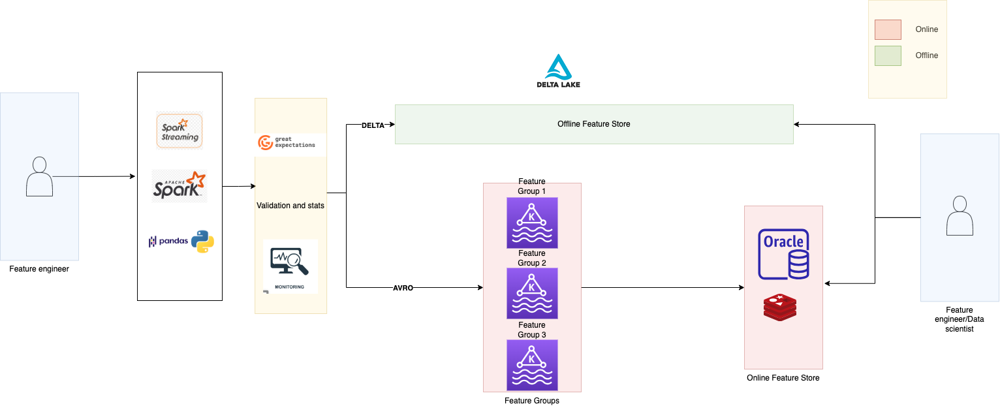

.. _Online Feature Store:

Online feature store (Experimental)
***********************************

Data Science Feature Store is designed to optimize the delivery of features at low latency by employing online stores. These features' values are retrieved from various data sources and seamlessly integrated into the online store through a process called materialization. This process can be initiated using the ``materialise`` function available within the ADS Feature Store framework.

The constraints attached to the online feature store is completely tangent from the constraints attached to the offline feature store. Offline feature store constitutes of storage as columnar database whereas online feature store constitutes of storage as row-wise database, offline store constitutes of access patterns involving joins whereas online feature store constitutes of key-value lookups, offline feature store does not have latency specific requirements for data access whereas online feature store constitutes very specific latency specific requirements for feature store.

Feature skew occurs when substantial variations arise between the feature processes carried out in an offline machine learning pipeline (the feature or training pipeline) and those in the related online inference pipeline. To ensure flexibility and customization options, the ADS Feature Store leverages two primary data sources: Redis and OpenSearch. Both sources are configurable, enabling users to fine-tune settings and configurations according to specific preferences and operational requirements.

Get nearest neighbours
======================
You can call the ``get_nearest_neighbours() -> NearestNeighbour`` method of the ``FeatureGroup`` or ``Dataset`` instance to find the nearest neighbours for a feature field

The ``.get_nearest_neighbours()`` method takes the following parameter:
    - ``field``: Indicates which fields to fetch.
    - ``k_neighbors``: Number of neighbours to fetch
    - ``embedding_vector``: Embedding vector. Usually a dense vector
    - ``max_candidate_pool``: Indicates the maximum candidate pool size

.. seealso::
   :ref:`Materialise FG` for feature group materialisation

.. seealso::
   :ref:`Materialise Dataset` for dataset materialisation

Get serving vector
===================
You can call the ``get_serving_vector()`` method of the ``FeatureGroup`` or ``Dataset`` instance to find the serving vector

The ``.get_serving_vector()`` method takes the following parameter:
    - ``primary_key_vector``: Primary key vector for feature group

.. seealso::
   :ref:`Materialise FG` for feature group materialisation

.. seealso::
   :ref:`Materialise Dataset` for dataset materialisation

Online feature store datatypes
==============================

The following tables illustrate the mapping of data types to OpenSearch.

+------------------+-----------------+-------------------+
| Feature Store    | Spark Type      | Open Search       |
| Type             |                 | Datatype          |
+==================+=================+===================+
| STRING           | ByteType        | byte              |
+------------------+-----------------+-------------------+
| SHORT            | ShortType       | short             |
+------------------+-----------------+-------------------+
| INTEGER          | IntegerType     | int               |
+------------------+-----------------+-------------------+
| LONG             | LongType        | long              |
+------------------+-----------------+-------------------+
| FLOAT            | FloatType       | float             |
+------------------+-----------------+-------------------+
| DOUBLE           | DoubleType      | double            |
+------------------+-----------------+-------------------+
| STRING           | StringType      | string            |
+------------------+-----------------+-------------------+
| BINARY           | BinaryType      | string            |
|                  | (BASE64)        |                   |
+------------------+-----------------+-------------------+
| BOOLEAN          | BooleanType     | boolean           |
+------------------+-----------------+-------------------+
| DATE             | DateType        | date              |
|                  | (string format) |                   |
+------------------+-----------------+-------------------+
| TIMESTAMP        | TimestampType   | long              |
|                  |                 | (unix time)       |
+------------------+-----------------+-------------------+
| {TYPE}_ARRAY     | ArrayType       | array{TYPE}       |
+------------------+-----------------+-------------------+
| {TYPE}_MAP       | MapType         | object            |
+------------------+-----------------+-------------------+
| STRUCT           | StructType      | object            |
+------------------+-----------------+-------------------+
