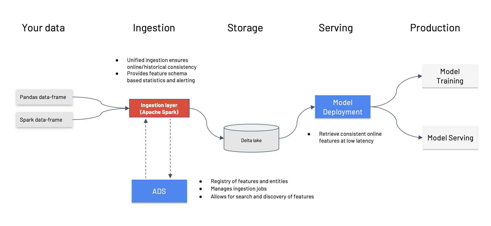

Overview
********

Managing many datasets, data-sources and transformations for machine learning is complex and costly. Poorly cleaned data, data issues, bugs in transformations, data drift and training serving skew all leads to increased model development time and worse model performance. Here, feature store is well positioned to solve many of the problems since it provides a centralised way to transform and access data for training and serving time and helps defines a standardised pipeline for ingestion of data and querying of data.

Oracle feature store is a stack based solution that is deployed in the customer enclave using OCI resource manager. Customer can stand up the service with infrastructure in their own tenancy. The service consists of API which are deployed in customer tenancy using resource manager.

- ``Feature Vector``: Set of feature values for any one primary/identifier key. Eg.  All/subset of  features of customer id '2536' can be called as one feature vector.
- ``Feature``: A feature is an individual measurable property or characteristic of a phenomenon being observed.
- ``Entity``: An entity is a group of semantically related features. The first step a consumer of features would typically do when accessing the feature store service is to list the entities and the entities associated features. Another way to look at it is that an entity is an object or concept that is described by its features. Examples of entities could be customer, product, transaction, review, image, document, etc.
- ``Feature Group``: A feature group in a feature store is a collection of related features that are often used together in ml models. It serves as an organizational unit within the feature store for users to manage, version and share features across different ml projects. By organizing features into groups, data scientists and ml engineers can efficiently discover, reuse and collaborate on features reducing the redundant work and ensuring consistency in feature engineering.
- ``Feature Group Job``: Feature group job is the execution instance of a feature group. Each feature group job will include validation results and statistics results.
- ``Dataset``: A dataset is a collection of feature that are used together to either train a model or perform model inference.
- ``Dataset Job``: Dataset job is the execution instance of a dataset. Each dataset job will include validation results and statistics results.

.. important::

  The OCI Feature Store support following versions

    .. list-table::
      :widths: 25 75
      :header-rows: 1

      * - Package Name
        - Latest Version
      * - python
        - .. image:: https://img.shields.io/badge/python-3.8-blue?style=for-the-badge&logo=pypi&logoColor=white
      * - fspyspark32_p38_cpu_v1
        - .. image:: https://img.shields.io/badge/fspyspark32_p38_cpu_v1-1.0-blue?style=for-the-badge&logo=pypi&logoColor=white
      * - delta-spark
        - .. image:: https://img.shields.io/badge/delta-2.0.1-blue?style=for-the-badge&logo=pypi&logoColor=white
      * - pyspark
        - .. image:: https://img.shields.io/badge/pyspark-3.2.1-blue?style=for-the-badge&logo=pypi&logoColor=white
