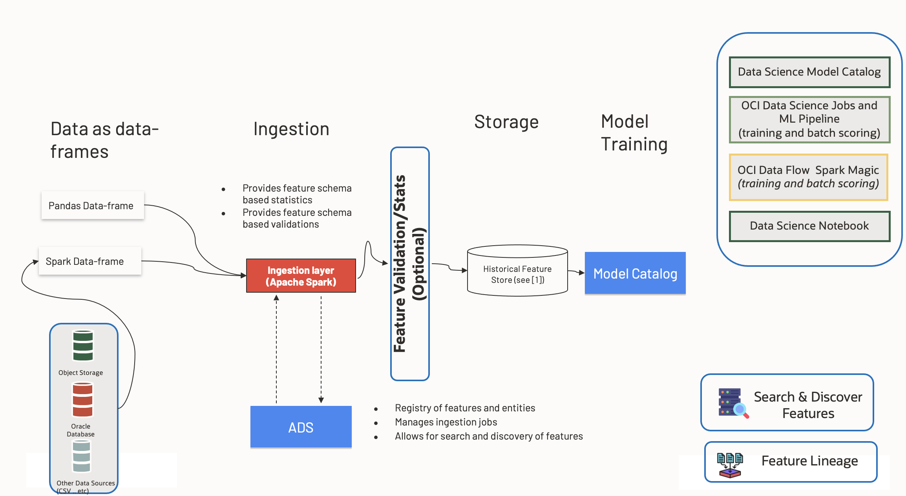

Overview
********

Managing many datasets, data sources, and transformations for machine learning is complex and costly. Poorly cleaned data, data issues, bugs in transformations, data drift, and training serving skew all lead to increased model development time and poor model performance. Feature Store solves many of the problems because it is a centralized way to transform and access data for training and serving time, Feature Stores help define a Feature Store pipeline for ingestion of data and querying of data.

ADS Feature Store is a stack-based solution that is deployed in your tenancy using OCI Resource Manager.

The following are brief descriptions of key concepts and the main components of ADS Feature Store.

- ``Feature Vector``:  A set of feature values for any one primary and identifier key. For example, all and a subset of features of customer ID 2536 can be called as one feature vector .
- ``Feature``: A feature is an individual measurable property or characteristic of an event being observed.
- ``Entity``: An entity is a group of semantically related features. The first step a consumer of features would typically do when accessing the Feature Store service is to list the entities and the entities associated with features. Another way to look at it is that an entity is an object or concept that's described by its features. Examples of entities are customer, product, transaction, review, image, and document.
- ``Feature Group``: A feature group in a Feature Store is a collection of related features that are often used together in ML models. It serves as an organizational unit in the Feature Store for users to manage, version, and share features across different ML projects. By organizing features into groups, data scientists and ML engineers can efficiently discover, reuse, and collaborate on features reducing the redundant work and ensuring consistency in feature engineering.
- ``Feature Group Job``: Feature group jobs are the processing instance of a feature group. Each feature group job includes validation results and statistics results.
- ``Dataset``: 	A dataset is a collection of features that are used together to either train a model or perform model inference.
- ``Dataset Job``: A dataset job is the processing instance of a dataset. Each dataset job includes validation results and statistics results.

.. important::

      Prerequisite : Contact #oci-feature-store_early-preview to get your tenancy whitelisted for early access of ADS Feature Store.

.. important::

  The ADS Feature Store supports and requires the following versions:

    .. list-table::
      :widths: 25 75
      :header-rows: 1

      * - Package Name
        - Latest Version
      * - python
        - .. image:: https://img.shields.io/badge/python-3.8-blue?style=for-the-badge&logo=pypi&logoColor=white
      * - fspyspark32_p38_cpu_v2
        - .. image:: https://img.shields.io/badge/fspyspark32_p38_cpu_v2-1.0-blue?style=for-the-badge&logo=pypi&logoColor=white
      * - delta-spark
        - .. image:: https://img.shields.io/badge/delta-2.0.1-blue?style=for-the-badge&logo=pypi&logoColor=white
      * - pyspark
        - .. image:: https://img.shields.io/badge/pyspark-3.2.1-blue?style=for-the-badge&logo=pypi&logoColor=white
      * - great-expectations
        - .. image:: https://img.shields.io/badge/greatexpectations-0.17.19-blue?style=for-the-badge&logo=pypi&logoColor=white
      * - pandas
        - .. image:: https://img.shields.io/badge/pandas-1.5.3-blue?style=for-the-badge&logo=pypi&logoColor=white
      * - pyarrow
        - .. image:: https://img.shields.io/badge/pyarrow-11.0.0-blue?style=for-the-badge&logo=pypi&logoColor=white
