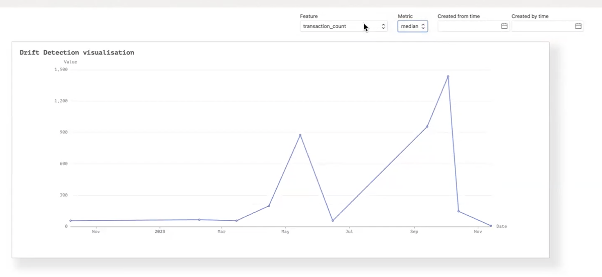

.. _Statistics:

Statistics
*************

Feature Store provides functionality to compute statistics for feature groups and datasets, and then persists them including the metadata. These statistics can help you
derive insights about the data quality. These statistical metrics are computed during materialisation time and persisting with other metadata.

.. note::

  Feature Store uses MLM Insights, which is a Python API that helps evaluate and monitor data for entire ML observability lifecycle. It performs data summarization, which reduces a dataset into a set of descriptive statistics.

The statistical metrics that are computed by feature store depend on the feature type.

+------------------------+-----------------------+
| Numerical Metrics      | Categorical Metrics   |
+========================+=======================+
| Skewness               | Count                 |
+------------------------+-----------------------+
| StandardDeviation      | TopKFrequentElements  |
+------------------------+-----------------------+
| Min                    | TypeMetric            |
+------------------------+-----------------------+
| IsConstantFeature      | DuplicateCount        |
+------------------------+-----------------------+
| IQR                    | Mode                  |
+------------------------+-----------------------+
| Range                  | DistinctCount         |
+------------------------+-----------------------+
| ProbabilityDistribution|                       |
+------------------------+-----------------------+
| Variance               |                       |
+------------------------+-----------------------+
| FrequencyDistribution  |                       |
+------------------------+-----------------------+
| Count                  |                       |
+------------------------+-----------------------+
| Max                    |                       |
+------------------------+-----------------------+
| DistinctCount          |                       |
+------------------------+-----------------------+
| Sum                    |                       |
+------------------------+-----------------------+
| IsQuasiConstantFeature |                       |
+------------------------+-----------------------+
| Quartiles              |                       |
+------------------------+-----------------------+
| Mean                   |                       |
+------------------------+-----------------------+
| Kurtosis               |                       |
+------------------------+-----------------------+

Drift Monitoring
================

Models can fail silently. Over and over we see the root cause of model issues in production can be traced back to the data itself, not the model. By applying data monitoring to the feature store, practitioners can automatically catch data issues like missing values, change in data format or unexpected values (change in data cardinality), and data drift upstream before the models are impacted

