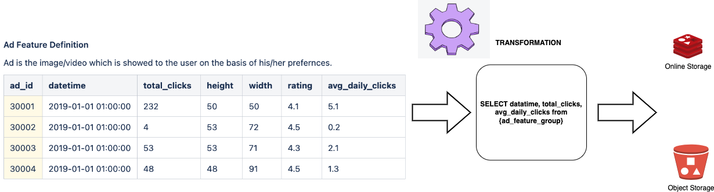

Transformation
**************

Transformations in a Feature Store refer to the operations and processes applied to raw data to create, modify, or derive new features that can be used as inputs for ML Models. These transformations are crucial for improving the quality, relevance, and usefulness of features which in turn can enhance the performance of ML models. It is an object that represents a transformation applied on the feature group and can be a pandas transformation or Spark SQL transformation.

* ``TransformationMode.PANDAS``: Pandas Transformation lets users to do the transformation using native pandas functionality. The interface expects ``PANDAS`` dataframe as input and ``PANDAS`` dataframe as output.
* ``TransformationMode.SQL``: Spark SQL brings native support for SQL to Spark. Users generally can give the spark transformation that they wish to do using spark SQL. The interface expects ``SPARK`` dataframe as input and ``SQL STRING`` as output.
* ``TransformationMode.SPARK``: Spark Transformation lets users to do the transformation using native spark functionality. The interface expects ``SPARK`` dataframe as input and ``SPARK`` dataframe as output.

.. tabs::

  .. code-tab:: Python3
    :caption: TransformationMode.SQL

    from ads.feature_store.transformation import Transformation,TransformationMode

    def transactions_df(transactions_batch):
        sql_query = f"select id, cc_num, amount from {transactions_batch}"
        return sql_query

    transformation = (
        Transformation()
         .with_description("Feature store description")
         .with_compartment_id(os.environ["PROJECT_COMPARTMENT_OCID"])
         .with_name("transformation_name")
         .with_feature_store_id(feature_store.id)
         .with_transformation_mode(TransformationMode.SQL)
         .with_source_code_function(transactions_df)
    )
    transformation.create()

  .. code-tab:: Python3
    :caption: TransformationMode.PANDAS

    def chained_transformation(patient_result_df, **transformation_args):
        def label_encoder_transformation(patient_result_df, **transformation_args):
            from sklearn.preprocessing import LabelEncoder
            # creating instance of labelencoder
            labelencoder = LabelEncoder()
            result_df = patient_result_df.copy()
            column_labels= transformation_args.get("label_encode_column")
            if isinstance(column_labels,list):
                for col in column_labels:
                    result_df[col] = labelencoder.fit_transform(result_df[col])
            elif isinstance(column_labels, str):
                 result_df[column_labels] = labelencoder.fit_transform(result_df[column_labels])
            else:
                return None
            return result_df

        def min_max_scaler(patient_result_df, **transformation_args):
            from sklearn.preprocessing import MinMaxScaler
            final_result_df = patient_result_df.copy()
            scaler = MinMaxScaler(feature_range=(0, 1))
            column_labels= transformation_args.get("scaling_column_labels")
            final_result_df[column_labels] = scaler.fit_transform(final_result_df[column_labels])
            return patient_result_df

        def feature_removal(input_df, **transformation_args):
            output_df = input_df.copy()
            output_df.drop(transformation_args.get("redundant_feature_label"), axis=1, inplace=True)
            return output_df

        out1 = label_encoder_transformation(patient_result_df, **transformation_args)
        out2 = min_max_scaler(out1, **transformation_args)
        return feature_removal(out2, **transformation_args)

    transformation_args = {
        "label_encode_column": ["SOURCE"],
        "scaling_column_labels": [],
        "redundant_feature_label": ["MCH", "MCHC", "MCV"]
    }

    from ads.feature_store.transformation import Transformation,TransformationMode

    transformation = (
        Transformation()
        .with_name("chained_transformation")
        .with_feature_store_id(feature_store.id)
        .with_source_code_function(chained_transformation)
        .with_transformation_mode(TransformationMode.PANDAS)
        .with_description("transformation to perform feature engineering")
        .with_compartment_id(compartment_id)
    )

    transformation.create()

  .. code-tab:: Python3
    :caption: TransformationMode.SPARK

    def credit_score_transformation(credit_score):
        import pyspark.sql.functions as F

        # Create a new Spark DataFrame that contains the transformed credit score.
        transformed_credit_score = credit_score.select(
            "user_id",
            "date",
            F.when(F.col("credit_score").cast("int") > 500, 1).otherwise(0).alias("credit_score")
        )

        # Return the new Spark DataFrame.
        return transformed_credit_score

    from ads.feature_store.transformation import Transformation,TransformationMode

    transformation = (
        Transformation()
        .with_name("spark_transformation")
        .with_feature_store_id(feature_store.id)
        .with_source_code_function(credit_score_transformation)
        .with_transformation_mode(TransformationMode.SPARK)
        .with_description("transformation to perform feature engineering")
        .with_compartment_id(compartment_id)
    )

    transformation.create()

Define
======

In an ADS Feature Store module, you can use the Python API or YAML file to define a transformation.

With the following way specified, you can define a transformation and give it a name.
A ``Transformation`` instance is created.

.. tabs::

  .. code-tab:: Python3
    :caption: Python

    from ads.feature_store.transformation import Transformation

    transformation = (
        Transformation
        .with_name("<transformation_name>")
        .with_feature_store_id("<feature_store_id>")
        .with_source_code("<source_code>")
        .with_transformation_mode("<transformation_mode>")
        .with_description("<transformation_description>")
        .with_compartment_id("<compartment_id>")
    )

  .. code-tab:: Python3
    :caption: YAML

    from ads.feature_store.transformation import Transformation

    yaml_string = """
    kind: transformation
    spec:
      compartmentId: ocid1.compartment..<unique_id>
      description: <transformation_description>
      name: <transformation_name>
      featureStoreId: <feature_store_id>
      sourceCode: <source_code>
      transformationMode: <transformation_mode>
    type: transformation
    """

    transformation = Transformation.from_yaml(yaml_string)

Create
======

You can call the ``create()`` method of the ``Transformation`` instance to create a transformation.

.. code-block:: python3

  # Create an transformation
  transformation.create()

Load
====

Use the ``from_id()`` method from the ``Transformation`` class to load an existing transformation with its OCID provided. It returns a ``Transformation`` instance.

.. code-block:: python3

  from ads.feature_store.transformation import Transformation

  transformation = Transformation.from_id("ocid1.transformation..<unique_id>")

Delete
======

Use the ``.delete()`` method on the ``Transformation`` instance to delete a transformation.

A transformation can only be deleted when its associated entities are all deleted.

.. code-block:: python3

  transformation.delete()
