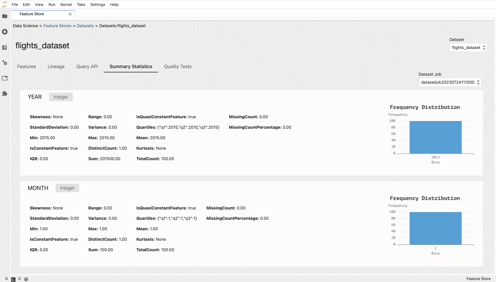

User Interface
****************
You can use the user-friendly UI for feature discovery by using notebook extensions. The UI helps you to identify which features belong to specific datasets and feature groups, and establish the process of exploring available features in a particular dataset or feature group.

Groups in the organization must share the pipelines existing in the ecosystem to promote reuse of features if the pipelines already exists. The work happens in silos that make discovery impossible, which results in teams being unable to use each others work. The following are a few examples of the interfaces that could help you discover features as part of a particular feature group, discover features part of a particular dataset, and how transformations are applied to see the source and destination of the data.

Feature Store
=============
Feature Store is the top-level entity for a Feature Store.

Feature Group
=============
Feature groups are instrumental in feature discovery as they offer a structured way to organize and manage features based on their semantic meaning or context. By grouping related features together, data scientists can efficiently locate and use the relevant attributes for model development. The versioning capability of feature groups ensures that changes in feature definitions are tracked. Tracking enables reproducibility and aids in evaluating the impact of feature modifications on model performance. The collaborative aspect of feature groups fosters knowledge sharing and reuse across data driven projects, which promots efficiency and consistency in the feature discovery processes.

.. image:: figures/featuregroup.gif

Validation
###########
Feature validation is assessing the quality, relevance, and effectiveness of features through techniques like cross-validation. Validaion helps to prevent overfitting, and improves model generalization.

Lineage
###########
Lineage tracking provides a historical record of data transformations and processing, which ensures transparency and reproducibility in feature engineering and model development.

.. image:: figures/lineage_fg.png

Statistics
###########
Statistical analysis of features helps uncover insights about their distributions, central tendencies, and variations, which aids in feature selection and understanding data characteristics.

.. image:: figures/stats_fg.png

Dataset
=======
Datasets also support iterative experimentation, letting data scientists create various dataset configurations with different feature combinations and transformations, which facilites the discovery of the most valuable features for model training.

.. image:: figures/dataset.gif

Lineage
###########
Lineage tracking provides a historical record of data transformations and processing, which ensures transparency and reproducibility in feature engineering and model development.

.. image:: figures/lineage_d1.png

Statistics
###########
Statistical analysis of features helps uncover insights about their distributions, central tendencies, and variations, which aids in feature selection and understanding data characteristics.

Entity
======
An entity is a group of semantically related features. The first step a consumer of features would typically do when accessing the feature store service, is to list the entities and the entities associated with features. Another way to look at it is that an entity is an object or concept that's described by its features. Examples of entities are customer, product, transaction, review, image, and document.

Transformation
==============
Transformation constructs are a pivotal component of feature engineering, and enable data scientists to adapt and enhance features to improve model performance. The flexibility to perform mathematical operations, scaling, normalization, handling missing data, and encoding categorical variables, transformation constructs empowers data professionals to craft features that align with specific modeling requirements.

.. image:: figures/transformations.gif
