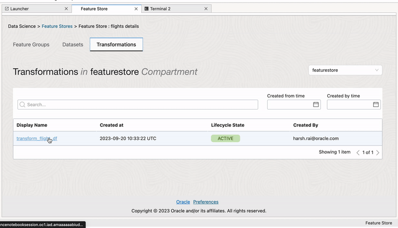

UI
***
The users will have the convenience of utilizing a user-friendly UI interface for feature discovery via notebook extensions. The UI interface will empower users to identify which features belong to specific datasets and feature groups, establishing the process of exploring available features in a particular dataset or feature group. Groups within the organisation have a need to share the pipelines existing within the ecosystem to promote re-use of features if the pipelines already exists. Currently, The work happens in silos which makes discovery impossible and results in teams not able to leverage each other work. Below are a few examples of the interfaces which could help users discover features part of a particular feature group, discover features part of a particular dataset and how transformations are applied in order to get a know how of the source and destination of the data.

Feature Store
=============
The "Feature Store" is the top-level entity within a feature store service.

Feature Group
=============
Feature Groups are instrumental in feature discovery as they offer a structured way to organize and manage features based on their semantic meaning or context. By grouping related features together, data scientists can efficiently locate and leverage relevant attributes for model development. Moreover, the versioning capability of Feature Groups ensures that changes in feature definitions are tracked, enabling reproducibility and aiding in evaluating the impact of feature modifications on model performance. Furthermore, the collaborative aspect of Feature Groups fosters knowledge sharing and reuse across data-driven projects, promoting efficiency and consistency in feature discovery processes.

.. image:: figures/featuregroup.gif

Validation
###########
Feature validation involves assessing the quality, relevance, and effectiveness of features through techniques like cross-validation, helping to prevent overfitting and improve model generalization.

.. image:: figures/validation_fg.png

Lineage
###########
Lineage tracking provides a historical record of data transformations and processing, ensuring transparency and reproducibility in feature engineering and model development.

Stats
###########
Statistical analysis of features helps uncover insights about their distributions, central tendencies, and variations, aiding in feature selection and understanding data characteristics.

.. image:: figures/stats_fg.png

Dataset
======
Datasets also support iterative experimentation, allowing data scientists to create various dataset configurations with different feature combinations and transformations, facilitating the discovery of the most valuable features for model training.

.. image:: figures/dataset.gif

Lineage
###########
Lineage tracking provides a historical record of data transformations and processing, ensuring transparency and reproducibility in feature engineering and model development.

.. image:: figures/lineage_d2.png

Stats
###########
Statistical analysis of features helps uncover insights about their distributions, central tendencies, and variations, aiding in feature selection and understanding data characteristics.

.. image:: figures/stats_d.png

Entity
======
An entity is a group of semantically related features. The first step a consumer of features would typically do when accessing the feature store service is to list the entities and the entities associated features. Another way to look at it is that an entity is an object or concept that is described by its features. Examples of entities could be customer, product, transaction, review, image, document, etc.

Transformation
==============
Transformation constructs are a pivotal component of feature engineering, enabling data scientists to adapt and enhance features to improve model performance. With the flexibility to perform mathematical operations, scaling, normalization, handling missing data, and encoding categorical variables, transformation constructs empower data professionals to craft features that align with specific modeling requirements.

