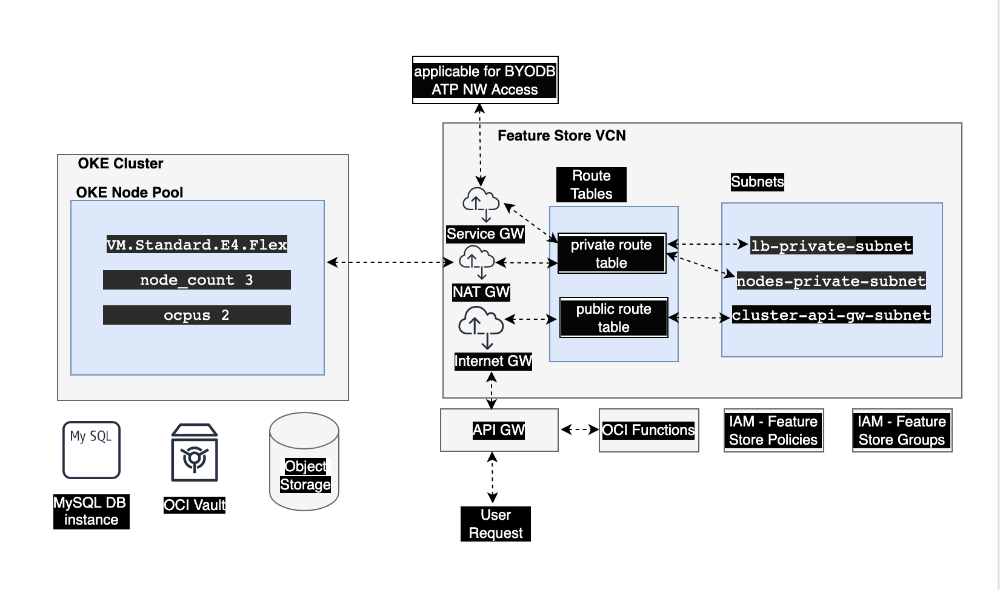
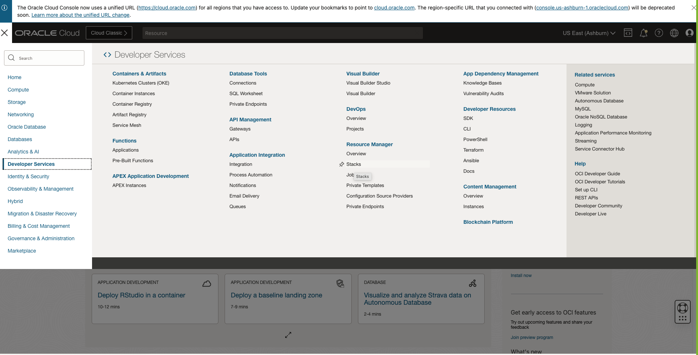
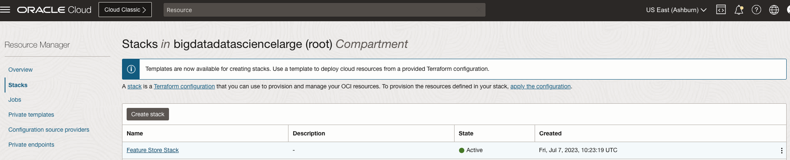
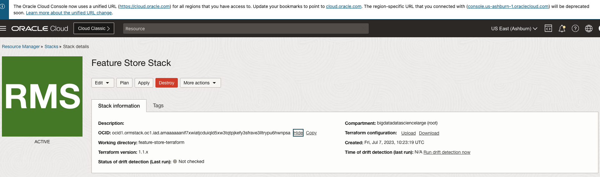

=====================================
Terraform: Setting Up a Feature Store
=====================================

The following shows a terraform stack deployment of the Feature Store resources.

Blue-green deployment is a strategy for releasing new versions of an application with minimal downtime and risk. It is used in Kubernetes, and other deployment environments, to achieve a smooth transition between application versions with the ability to quickly rollback if issues are detected. In a blue-green deployment, there are two environments named blue and green that run concurrently. One environment is designated as the live or production environment called blue. While the other environment, named green, is idle or running a newer version of the application for testing. Both environments have identical configurations and infrastructure.

.. _User Policies:

Required Policies for a Terraform Stack
=======================================

Feature store requires the following policy statements to deploy the Feature Store in a Terraform stack:

..  code-block:: shell

    define tenancy service_tenancy as ocid1.tenancy.oc1..aaaaaaaa462hfhplpx652b32ix62xrdijppq2c7okwcqjlgrbknhgtj2kofa
    endorse group <Feature Store user group> to read repos in tenancy service_tenancy
    allow group <Feature Store user group> to manage orm-stacks in compartment <compartmentName>
    allow group <Feature Store user group> to manage orm-jobs in compartment <compartmentName>
    allow group <Feature Store user group> to manage object-family in compartment <compartmentName>
    allow group <Feature Store user group> to manage users in compartment <compartmentName>
    allow group <Feature Store user group> to manage instance-family in compartment <compartmentName>
    allow group <Feature Store user group> to manage tag-namespaces in compartment <compartmentName>
    allow group <Feature Store user group> to manage groups in compartment <compartmentName>
    allow group <Feature Store user group> to manage policies in compartment <compartmentName>
    allow group <Feature Store user group> to manage dynamic-groups in compartment <compartmentName>
    allow group <Feature Store user group> to manage virtual-network-family in compartment <compartmentName>
    allow group <Feature Store user group> to manage functions-family in compartment <compartmentName>
    allow group <Feature Store user group> to inspect compartments in compartment <compartmentName>
    allow group <Feature Store user group> to manage cluster-family in compartment <compartmentName>
    allow group <Feature Store user group> to manage mysql-family in compartment <compartmentName>
    allow group <Feature Store user group> to manage api-gateway-family in compartment <compartmentName>

No policies are explicitly required for administrator users.

Deploy Using Oracle Resource Manager
====================================

If you aren't already signed in, enter the tenancy and user credentials. Review and accept the terms and conditions. Review the :ref:`Release Notes` to obtain the latest conda environment and ``SERVICE_VERSION``.

1. Ensure that you have the required policy statements.

2. Download the stack from the ``Terraform Stack`` column in the :ref:`Release Notes`.

3. Click to deploy the stack.

4. Select the region and compartment where you want to deploy the stack.

5. Follow the prompts and instructions to create the stack.

6. After creating the stack, click **Terraform Actions**, and select **Plan**.

7. Wait for the job to complete, and then review the plan.

8. To make changes return to the Stack Details page, click **Edit Stack**, and make the required changes. Then run the Plan action again.

9. If no further changes are necessary, return to the Stack Details page, click **Terraform Actions**, and click **Apply**.

Deploy Using the Oracle CLI
==============================

Prerequisites
#############

Install `oci-cli <https://docs.oracle.com/en-us/iaas/Content/API/Concepts/cliconcepts.htm>`__ if it's not installed.

Steps
#####

.. note::

  Review the :ref:`Release Notes` to obtain the latest conda environment and ``SERVICE_VERSION``. Remember to replace the values within angle brackets ("<>" symbols) in the commands with the relevant values for your environment.

1. Ensure that you have the required policy statements.

2. Run the shell command:

  ..  code-block:: shell

    rm -f feature-store-terraform.zip \
    && wget https://objectstorage.us-ashburn-1.oraclecloud.com/p/vZogtXWwHqbkGLeqyKiqBmVxdbR4MK4nyOBqDsJNVE4sHGUY5KFi4T3mOFGA3FOy/n/idogsu2ylimg/b/oci-feature-store/o/beta/terraform/feature-store-terraform.zip \
    && oci resource-manager stack create \
        --compartment-id <COMPARTMENT_OCID> \
        --config-source feature-store-terraform.zip \
        --terraform-version 1.1.x \
        --variables '{
            "service_version": "<SERVICE_VERSION>",
            "tenancy_ocid": "<TENANCY_OCID>",
            "compartment_ocid": "<COMPARTMENT_OCID>",
            "region": "<REGION>",
            "user_ocid": "<USER_OCID>"
        }' \
        --display-name "Feature Store Stack" \
        --working-directory "feature-store-terraform" \
    | tee stack_output.json \
    && stack_id=$(jq -r '.data."id"' stack_output.json) \
    && oci resource-manager job create-apply-job \
        --execution-plan-strategy AUTO_APPROVED \
        --stack-id $stack_id \
        --wait-for-state SUCCEEDED \
        --wait-for-state FAILED

Update Feature Store Stack Using OCI CLI
========================================================

Prerequisites
#############

1. Install `oci-cli <https://docs.oracle.com/en-us/iaas/Content/API/Concepts/cliconcepts.htm>`__ if it's not installed.
2. To update the stack, get the <STACK_ID> from the stack details page in the Console using `Resource Manager <https://www.oracle.com/devops/resource-manager/>`__:

Steps
#####

.. note::

  Review the :ref:`Release Notes` to obtain the latest conda environment and ``SERVICE_VERSION``. Remember to replace the values within angle brackets ("<>" symbols) in the commands with the relevant values for your environment.

1. Run the shell command:

  ..  code-block:: shell

    rm -f feature-store-terraform.zip \
    && wget https://objectstorage.us-ashburn-1.oraclecloud.com/p/vZogtXWwHqbkGLeqyKiqBmVxdbR4MK4nyOBqDsJNVE4sHGUY5KFi4T3mOFGA3FOy/n/idogsu2ylimg/b/oci-feature-store/o/beta/terraform/feature-store-terraform.zip \
    && oci resource-manager stack update \
        --stack-id <STACK_ID> \
        --variables '{"service_version": "<SERVICE_VERSION>", "tenancy_ocid": "<TENANCY_OCID>", "compartment_ocid": "<COMPARTMENT_OCID>", "region": "<REGION>", "user_ocid": "<USER_OCID>"}' \
        --config-source "feature-store-terraform.zip" \
        --working-directory "feature-store-terraform" --force \
    && oci resource-manager job create-apply-job \
        --execution-plan-strategy AUTO_APPROVED \
        --stack-id <STACK_ID> \
        --wait-for-state SUCCEEDED --wait-for-state FAILED

Terraform Variables
===============================

The following Terraform variables used in this stack are:

.. list-table::
   :header-rows: 1

   * - Variable Name
     - Value
     - Description
   * - `service_version`
     - `0.1.218.master`
     - The version of API to be deployed in customer tenancy.
   * - `spec_version`
     - `0.1.218.master`
     - The version of API specifications to be deployed in customer tenancy.
   * - `deployment_name`
     - `DEFAULT_NAME`
     - The name of the deployment.
   * - `db_name`
     - `DEFAULT_NAME`
     - The name of the ATP or MySQL database.
   * - `db_config`
     - `DEFAULT_NAME`
     - The configuration of the database.
   * - `compartment_ocid`
     - `DEFAULT_NAME`
     - The OCID of the compartment to deploy the Feature Store stack in.
   * - `vcn_details`
     - `DEFAULT_NAME`
     - The VCN details required to onboard the database that has network access within the VCN.
   * - `user_ocid`
     - `ocid1.user..<unique_id>`
     - If you don't have permission to create users, provide the user_ocid of a user that has permission to retrieve images from the OCI Registry.
   * - `tenancy_ocid`
     - `ocid1.tenancy..<unique_id>`
     - The OCID of the tenancy to deploy the Feature Store stack in.
   * - `ssh_authorized_key`
     - `<SSH AUTHORIZED KEY>`
     - The OCID of tenancy to deploy the Feature Store stack in.
   * - `ocir_puller_auth_token`
     - `<AUTH TOKEN>`
     - If the specified user has an auth_token to use, then specify it. If null, a new token is created. This variable requires that the user has one token at most . There is a limit of two tokens per user.
   * - `ocir_puller_group_ocid`
     - `ocid1.group..<unique_id>`
     - If you have permission to create users and a group already exists with policies to pull images from OCI Registry, you can provide the group_ocid to create a new user and add it to this group. Leave null if you are specifying an ocir_puller_user_ocid.
   * - `ocir_puller_user_ocid`
     - `ocid1.user..<unique_id>`
     - If you do not have permission to create users, provide the user_ocid of a user that has permission to create MySQL and Object Storage buckets.
   * - `feature_store_user_group_id`
     - `ocid1.group..<unique_id>`
     - Specify the Feature Store user group ID if the specified user is not an administrator.

User VCN Deployment
===================
Bring your own database (BYODB) is not supported by Feature Store because it doesn't support private access using a private endpoint and private access gateway for ATP instances.

You can specify VCN details for the Feature Store to use an existing VCN. A Terraform stack Feature Store has the following Terraform VCN variables:

    .. list-table::
       :header-rows: 1

       * - Variable Name
         - Value
         - Description
       * - `vcn_id`
         - `ocid1.vcn.oc1.iad.xxxxxxxxxxxx`
         - The OCID of the VCN where you want to deploy the Feature Store.
       * - `vcn_cidr`
         - `10.0.0.0/16`
         - The VCN CIDR range to be use.
       * - `subnet_suffix`
         - `8`
         - The subnet suffix to be used to create Feature Store related subnets. For example, 10.0.0.0/16 + 8 => 10.0.0.0/24.
       * - `max_subnet`
         - `16`
         - Optional. Sets the maximum subnet creations that are allowed within the CIDR range.
       * - 'dhcp_options_id'
         - 'ocid1.dhcpoptions.oc1.iad.xxxxxxxxx'
         - DHCP options OCID is required for instance configuration within the VCN.
       * - `igw_id`
         - `ocid1.internetgateway.oc1.iad.xxxxxxxxxxxx`
         - Optional. The internet gateway OCID. Feature Store creates the IGW if it isn't specified.
       * - `nat_gw_id`
         - `ocid1.natgateway.oc1.iad.xxxxxxxxxx`
         - Optional. The NAT gateway OCID. The Feature Store creates the NAT gateway if it isn't specified.
       * - `sgw_id`
         - `ocid1.servicegateway.oc1.iad.xxxxxxxxxx`
         - Optional. The Feature Store gateway OCID. Feature Store doesn't create SGW even when its null, or doesn't enable SGW until the time you explicitly set using sgw_enable. This ensures that SGW is only enabled for network resources (ATP for example) that allow access through SGW.
       * - `sgw_enable`
         - `false`
         - Enable service gateway use or creation depending on the sgw_id specified.
       * - `private_route_table_id`
         - `ocid1.routetable.oc1.iad.xxxxxxxxxxxxxxxx`
         - Optional. The private route table OCID. Ensure that the NAT gateway and Feature Store gateway (if applicable) route rules have been added for Feature Store access. The Feature Store creates a private route table with supporting route rules if not specified.
       * - `public_route_table_id`
         - `ocid1.routetable.oc1.iad.xxxxxxxxxxxxxxxx`
         - Optional. The public route table OCID. Ensure that the internet gateway route rule are added for Feature Store access. The Feature Store creates a public route table with supporting route rules if not specified.

    Feature Store is deployed in Feature Store specific subnets and security list access is maintained on the basis of details specified.

    Onboarding a Database
    #####################

    Specify the following details to onboard database instances.

    1. Use the following variables to specify a general database configuration that's required for the initial database setup for a BYODB or Feature Store database.

    .. list-table:: db_config
       :header-rows: 1

       * - Variable Name
         - Value
         - Description
       * - `vault_ocid`
         - `ocid1.vault.oc1.iad.b5sb3bclaaaog.xxxxxxxxxxxxx`
         - The OCID of the vault where the ATP or MySQL secret is. Set to null if setting up a Feature Store database.
       * - `vault_compartment_id`
         - `ocid1.tenancy.oc1.iad.b5sb3bclaaaog.xxxxxxxxxxxxx`
         - The OCID of the vault compartment. Set to null if setting up a Feature Store database.
       * - `db_type`
         - `mysql`
         - Set the database type to ATP or MySQL.
       * - `db_secret_source`
         - `VAULT`
         - The database secret source. Use VAULT for BYODB databases. Use OSS for an ATP database and LOCAL for MySQL for default Feature Store deployment without BYODB.
       * - `user_db`
         - `false`
         - Set to true for BYODB.

    1. Use the following variables to specify the details to onboard your database. All of these variables can be remain null if you don't want to onboard your database.

    .. list-table:: user_db_config
       :header-rows: 1

       * - Variable Name
         - Value
         - Description
       * - `db_system_name`
         - `featurestoretestatp_xxxx`
         - The database instance name.
       * - `db_username`
         - `admin`
         - The username for the database.
       * - `db_password_secret`
         - `test_atp_xxxx`
         - The vault database password secret.

    .. tabs::

       .. tab:: MySQL DB Config: MySQL database configuration

          A MySQL instance can only be accessed within the network so you must deploy the Feature Store in your VCN. Specify the vault secret for the MySQL database password.
          Ensure that ingress rules are in place to provide VCN access for the MySQL instance, see `Networking <https://docs.oracle.com/en-us/iaas/mysql-database/doc/networking-setup-mysql-db-systems.html>`__ for more details.

          .. list-table:: mysql_db_config
             :header-rows: 1

             * - Variable Name
               - Value
               - Description
             * - `mysql_db_ip_addr`
               - `192.168.xxx.xxxx`
               - MySQL database IP address.
             * - `mysql_db_port`
               - `3306`
               - MySQL database port.

       .. tab:: ATP DB Config: ATP database configuration

          The existing ATP instance can have two types of access:

              1. Public Access: The ATP instance can be accessed with Feature Store deployed in its own VCN, or in your VCN. Specify the vault secret names to use for the ATP database connection.

              2. Network Access: If the ATP instance has network access in a VCN, then you must deploy the Feature Store in the VCN that has ATP access. Specify the vault secret names to use for the ATP connection.

          .. list-table:: atp_db_config
             :header-rows: 1

             * - Variable Name
               - Value
               - Description
             * - `wallet_file_secret`
               - `["cwallet.sso", "ewallet.p12", "keystore.jks", "ojdbc.properties", "tnsnames.ora", "truststore.jks", "sqlnet.ora"]`
               - The list of ATP Wallet files vault secrets base64 encoded. Encode the wallet files to the base64 format, and then push them as base64 encoded strings to the vault.
             * - `wallet_password_secret`
               - `example-secret`
               - The vault wallet password secret.
