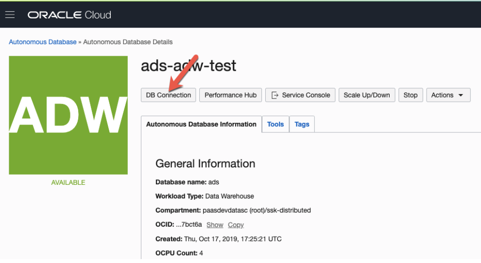
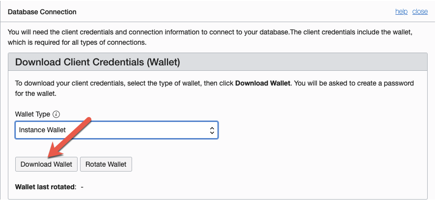
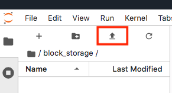
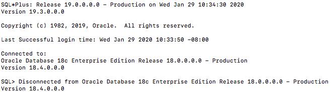

.. _configuration-8:

=============
Configuration
=============

**Authenticating to the Oracle Cloud Infrastructure APIs from a Notebook Session**
==================================================================================

When you are working within a notebook session, you are operating as the ``datascience`` Linux user. This user does not have an OCI Identity and Access Management (IAM) identity, so it has no access to the Oracle Cloud Infrastructure API. Oracle Cloud Infrastructure resources include Data Science projects and models, and the resources of other OCI serviceS, such as Object Storage, Functions, Vault, Data Flow, and so on. To access these resources from the notebook environment, you must use one of the two provided authentication approaches:

**1. Authenticating Using Resource Principals**
---------------------------------------------------------------------------------------------------

This is the generally preferred way to authenticate with an OCI service. A resource principal is a feature of IAM that enables resources to be authorized principal actors that can perform actions on service resources. Each resource has its own identity, and it authenticates using the certificates that are added to it. These certificates are automatically created, assigned to resources, and rotated avoiding the need for you to upload credentials to your notebook session.

Data Science enables you to authenticate using your notebook session's resource principal to access other OCI resources. When compared to using the OCI configuration and key files approach, using resource principals provides a more secure and easy way to authenticate to the OCI APIs.

Within your notebook session, you can choose to use the resource principal to authenticate while using the Accelerated Data Science (ADS) SDK by running ``ads.set_auth(auth='resource_principal')`` in a notebook cell. For example:

.. code-block:: python

  import ads 
  ads.set_auth(auth='resource_principal')
  compartment_id = os.environ['NB_SESSION_COMPARTMENT_OCID']
  pc = ProjectCatalog(compartment_id=compartment_id)
  pc.list_projects()

**2. Authenticating Using API Keys**
---------------------------------------------------------------------------------------------

This is the default method of authentication. You can also authenticate as your own personal IAM user by creating or uploading OCI configuration and API key files inside your notebook session environment. The OCI configuration file contains the necessary credentials to authenticate your user against the model catalog and other OCI services like Object Storage. The example notebook, `api_keys.ipynb` demonstrates how to create these files.

The ``getting-started.ipynb`` notebook in the home directory of the notebook session environment demonstrates all the steps needed to create the configuration file and the keys. Follow the steps in that notebook before importing and using ADS in your notebooks.

.. note::
   If you already have an OCI configuration file (``config``) and associated keys, you can upload them directly to the ``/home/datascience/.oci`` directory using the JupyterLab **Upload Files** or the drag-and-drop option.

**3. Authenticating Using a Customized Oracle Cloud Infrastructure Configuration (Customization)**
--------------------------------------------------------------------------------------------------

The default authentication that is used by ADS is set with the ``set_auth()`` method. However, each relevant ADS method has an optional parameter to specify the authentication method to use. The most common use case for this is when you have different permissions in different API keys or there are differences between the permissions granted in the resource principals and your API keys.

Most ADS methods do not require a signer to be explicitly given. By default, ADS uses the API keys to sign requests to OCI resources. The ``set_auth()`` method is used to explicitly set a default signing method. This method accepts one of two strings ``"api_key"`` or ``"resource_principal"``.

The ``~/.oci/config`` configuration allow for multiple configurations to be stored in the same file. The ``set_auth()`` method takes is ``oci_config_location`` parameter that specifies the location of the configuration, and the default is ``"~/.oci/config"``. Each configuration is called a profile, and the default profile is ``DEFAULT``. The ``set_auth()`` method takes in a parameter ``profile``. It specifies which profile in the ``~/.oci/config`` configuration file to use. In this context, the ``profile`` parameter is only used when API keys are being used. If no value for ``profile`` is specified, then the ``DEFAULT`` profile section is used.

.. code-block:: python

  ads.set_auth("api_key") # default signer is set to API Keys
  ads.set_auth("api_key", profile = "TEST") # default signer is set to API Keys and to use TEST profile
  ads.set_auth("api_key", oci_config_location = "~/.test_oci/config") # default signer is set to API Keys and to use non-default oci_config_location

The ``authutil`` module has helper functions that return a signer which is used for authentication. The ``api_keys()`` method returns a signer that uses the API keys in the ``.oci`` configuration directory. There are optional parameters to specify the location of the API keys and the profile section. The ``resource_principal()`` method returns a signer that uses resource principals. The method ``default_signer()`` returns either a signer for API Keys or resource principals depending on the defaults that have been set. The ``set_auth()`` method determines which signer type is the default. If nothing is set then API keys are the default.

.. code-block:: python

  from ads.common import auth as authutil
  from ads.common import oci_client as oc

  # Example 1: Create Object Storage client with  the default signer.
  auth = authutil.default_signer()
  oc.OCIClientFactory(**auth).object_storage

  # Example 2: Create Object Storage client with timeout set to 6000 using resource principal authentication.
  auth = authutil.resource_principal({"timeout": 6000})
  oc.OCIClientFactory(**auth).object_storag

  # Example 3: Create Object Storage client with timeout set to 6000 using API Key authentication.
  auth = authutil.api_keys(oci_config="/home/datascience/.oci/config", profile="TEST", kwargs={"timeout": 6000})
  oc.OCIClientFactory(**auth).object_storage

In the this example, the default authentication uses API keys specified with the ``set_auth`` method. However, since the ``os_auth`` is specified to use resource principals, the notebook session uses the resource principal to access OCI Object Store.

.. code-block:: python

  set_auth("api_key") # default signer is set to api_key
  os_auth = authutil.resource_principal() # use resource principal to as the preferred way to access object store

**Setup for ADB**
=================

There are two different configurations of the Autonomous Database (ADB). They are the Autonomous Data Warehouse (ADW) and the Autonomous Transaction Processing (ATP). The steps to connect to ADW and ATP are the same.  To access an instance 
of the ADB from the notebook environment, you need the client credentials and connection information. The client credentials include the wallet, which is required for all types of connections.

Use these steps to access Oracle ADB:

1. From the ADW or ATP instance page that you want to load a dataset from, click ``DB Connection``.

2. Click ``Download Wallet`` to download the wallet file. You need to create a password to for the wallet to complete the download. You don't need this password to connect from the notebook. 
  
3. Unzip the wallet.

4. Create a ``<path_to_wallet_folder>`` folder for your wallet on the notebook environment environment. 

5. Upload your wallet files into the ``<path_to_wallet_folder>`` folder using the Jupyterlab **Upload Files**:

6. Open the ``sqlnet.ora`` file from the wallet files, then configure the ``METHOD_DATA``:

.. code-block:: bash

  METHOD_DATA = (DIRECTORY="<path_to_wallet_folder>")

7. To find the location of the ``sqlnet.ora`` file, the ``TNS_ADMIN`` environment variable must point to that location. We suggest that you create a Python dictionary to store all of the connection information. In this example, this dictionary is called ``creds``. It is generally poor security practice to store credentials in your notebook. We recommend that you use the ``ads-examples/ADB_working_with.ipynb`` notebook example that demonstrates how to store them outside the notebook in a configuration file.

   The environment variable should be set in your notebooks. For example: 

.. code-block:: python

  # Replace with your TNS_ADMIN value here:
  creds = {}
  creds['tns_admin'] = <path_to_wallet_folder>
  os.environ['TNS_ADMIN'] = creds['tns_admin']

8. You can find SID names from the ``tnsname.ora`` file in the wallet file. Create a dictionary to manage your credentials. In this example, the variable ``creds`` is used. The SID is an identifier that identifies the consumer group of the the Oracle Database:

.. code-block:: python

  # Replace with your SID name here:
  creds['sid'] = <your_SID_name>

9. Ask your database administrator for the username and password, and then add them to your ``creds`` dictionary. For example:

.. code-block:: python

  creds['user'] = <database_user>
  creds['password'] = <database_password>

10. Test the connection to the ADB by running these commands:

.. code-block:: python

  os.environ['TNS_ADMIN'] = creds['tns_admin']
  connect = 'sqlplus ' + creds['user'] + '/' + creds['password'] + '@' + creds['sid']
  print(os.popen(connect).read())

Messages similar to the following display if the connection is successful:

An introduction to loading data from ADB into ADS using ``cx_Oracle`` and ``SQLAlchemy`` is in :ref:`Loading Data <loading-data-10>`.

Example Notebook: Using OCI Vault for Secret Storage and Retrieval
==================================================================

Overview:
---------

The Oracle Cloud Infrastructure Vault is a service that provides
management of encryption keys and secret credentials. A vault is a
storage container that holds keys and secrets. The Vault service not
only secures your secrets it provides a central repository that allows
them to be used in different notebooks and shared with only those that
need access. No longer will your secrets be stored in code that can
accidentally be checked into git repositories.

This notebook demonstrates how to create a vault, a key, and store a
secret that is encrypted with that key. It also demonstrates how to
retrieve the secret so that it can be used in a notebook. The notebook
explains how to update that secret and basic operations, such as listing
deleting vaults, keys, and secrets.

**Important:**

Placeholder text for required values are surrounded by angle brackets
that must be removed when adding the indicated content. For example,
when adding a database name to ``database_name = "<database_name>"``
would become ``database_name = "production"``.

--------------
Prerequisites:
--------------

-  Experience with specific topic: Novice
-  Professional experience: None

Before using this notebook, your tenancy must be configured to use the Vault service.
^^^^^^^^^^^^^^^^^^^^^^^^^^^^^^^^^^^^^^^^^^^^^^^^^^^^^^^^^^^^^^^^^^^^^^^^^^^^^^^^^^^^^

This notebook performs CRUD (create, read, update, delete) operations on
vaults, keys, and secrets. These are all part of the Vault Service. The
account that is using this notebook requires permissions to these
resources. The account administrator needs to grant privileges to
perform these actions. How the permissions are configured can depend on
your tenancy configuration, see the `Vault Service’s permissions
documentation <https://docs.cloud.oracle.com/en-us/iaas/Content/Identity/Reference/keypolicyreference.htm>`__
for details. The `Vault Service’s common
policies <https://docs.cloud.oracle.com/en-us/iaas/Content/Identity/Concepts/commonpolicies.htm#sec-admins-manage-vaults-keys>`__
are:

::

   allow group <group> to manage vaults in compartment <compartment>
   allow group <group> to manage keys in compartment <compartment>
   allow group <group> to manage secret-family in compartment <compartment>

--------------

Objectives:
-----------

-  Introduction to the Vault Service

   -  Key and Secret Management Concepts
   -  Vaults
   -  Keys
   -  Key Version
   -  Hardware Security Modules
   -  Envelope Encryption
   -  Secrets
   -  Secret Versions
   -  Secret Bundles

-  Creating a Vault
-  Creating a Key
-  Secret

   -  Storing a Secret
   -  Retrieving a Secret
   -  Updating a Secret

-  Listing Resources

   -  List Secrets
   -  Listing Keys
   -  Listing Vaults

-  Deletion

   -  Deleting a Secret
   -  Deleting a Key
   -  Deleting a Vault

-  References

--------------

**Introduction to the Vault Service**

The `Oracle Cloud Infrastructure
Vault <https://docs.cloud.oracle.com/en-us/iaas/Content/KeyManagement/Concepts/keyoverview.htm>`__
lets you centrally manage the encryption keys that protect your data and
the secret credentials that you use to securely access resources.

Vaults securely store master encryption keys and secrets that you might
otherwise store in configuration files or in code.

Use the Vault service to exercise control over the lifecycle keys and
secrets. Integration with Oracle Cloud Infrastructure Identity and
Access Management (IAM) lets you control who and what services can
access which keys and secrets and what they can do with those resources.
The Oracle Cloud Infrastructure Audit integration gives you a way to
monitor key and secret use. Audit tracks administrative actions on
vaults, keys, and secrets.

Keys are stored on highly available and durable hardware security
modules (HSM) that meet Federal Information Processing Standards (FIPS)
140-2 Security Level 3 security certification. The Vault service uses
the Advanced Encryption Standard (AES) as its encryption algorithm and
its keys are AES symmetric keys.

**Key and Secret Management Concepts**

The following concepts are integral to understanding the Vault service.

**Vaults**

Vaults are logical entities where the Vault service stores keys and
secrets. The Vault service offers different vault types. A virtual
private vault is an isolated partition on an HSM. Vaults can share
partitions on the HSM with other vaults.

**Keys**

Keys are logical entities that represent one or more key versions that
contain the cryptographic material used to encrypt and decrypt data. The
Vault service recognizes master encryption keys, wrapping keys, and data
encryption keys.

Master encryption keys can be generated internally by the Vault service
or imported to the service from an external source. Once a master
encryption key has been created, the Oracle Cloud Infrastruture API can
be used to generate data encryption keys that the Vault service returns
to you. by default, a wrapping key is included with each vault. A
wrapping key is a 4096-bit asymmetric encryption key pair based on the
RSA algorithm.

**Key Version**

Each master encryption key is assigned a version number. When a key is
rotated, a new key version is created by the Vault service or it can be
imported. Periodically rotating keys reduces the risk if a key is ever
compromised. A key’s unique OCID remains the same across rotations, but
the key version enables the Vault service to seamlessly rotate keys to
meet any compliance requirements. Older key versions cannot be used for
encryption. However, they remain available to decrypt data.

**Hardware Security Modules**

Keys and secrets are stored within an HSM. This provides a layer of
physical security. Keys and secrets are only stored on HSM and cannot be
exported from the HSM. HSMs meet the FIPS 140-2 Security Level 3
security certification. This means that the HSM hardware is
tamper-evident, has physical safeguards for tamper-resistance, requires
identity-based authentication, and deletes keys from the device when it
detects tampering.

**Envelope Encryption**

The data encryption key used to encrypt your data is, itself, encrypted
with a master encryption key. This concept is known as envelope
encryption. Oracle Cloud Infrastructure services do not have access to
the plain text data without interacting with the Vault service and
without access to the master encryption key that is protected by IAM.

**Secrets**

Secrets are credentials, such as passwords, certificates, SSH keys, or
authentication tokens. You can retrieve secrets from the Vault service
when you need them to access resources or other services.

**Secret Versions**

Each secret is automatically assigned a version number. When secrets are
rotated and updated, the new secret has a new version number. A secret’s
unique OCID remains the same across rotations and updates. It is
possible to configure a rule that prevents a secret from being reused
after rotation and updating. However, the older secret remains
available.

**Secret Bundles**

A secret bundle consists of the secret contents, properties of the
secret, and the secret version (version number or rotation state), and
user-provided contextual metadata for the secret.

.. code:: ipython3

    import base64
    import json
    import oci
    import os
    import random
    import string
    import uuid

    from oci.config import from_file
    from oci.key_management import KmsManagementClient
    from oci.key_management import KmsManagementClientCompositeOperations
    from oci.key_management import KmsVaultClient
    from oci.key_management import KmsVaultClientCompositeOperations
    from oci.key_management.models import CreateVaultDetails
    from oci.key_management.models import KeyShape
    from oci.key_management.models import CreateKeyDetails
    from oci.key_management.models import ScheduleKeyDeletionDetails
    from oci.key_management.models import ScheduleVaultDeletionDetails
    from oci.secrets import SecretsClient
    from oci.vault import VaultsClient
    from oci.vault.models import Base64SecretContentDetails
    from oci.vault.models import CreateSecretDetails
    from oci.vault.models import ScheduleSecretDeletionDetails
    from oci.vault.models import UpdateSecretDetails
    from oci.vault import VaultsClientCompositeOperations
    from os import path

Some helper functions are:

.. code:: ipython3

    def dict_to_secret(dictionary):
        return base64.b64encode(json.dumps(dictionary).encode('ascii')).decode("ascii")

    def secret_to_dict(wallet):
        return json.loads(base64.b64decode(wallet.encode('ascii')).decode('ascii'))

Setup
=====

Optionally, you could edit the following code to configure this
notebook. You need an Oracle Cloud Infrastructure configuration file. If
this has not been set up, see the ``getting-started.ipynb`` notebook. By
default, this notebook uses the ``~/.oci/config`` configuration file and
the ``DEFAULT`` profile. If you have changed your configuration from the
one setup using the ``getting-started.ipynb`` notebook, then the
``config`` variable may need to be updated.

A vault, keys, and secret need to belong to a compartment. By default,
the compartment of this notebook session is used. To set up these
resources in a different compartment, enter the compartment’s OCID in
the ``compartment_id`` variable.

The main use case for a data scientist is to store a secret, such as an
SSH key, database password, or some other credential. To do this, a
vault and key are required. By default, this notebook creates these
resources. However, the ``vault_id`` and ``key_id`` variables can be
updated with vault and key OCIDs to use existing resources.

.. code:: ipython3

    # Select the configuration file to connect to Oracle Cloud Infrastructure resources
    config = from_file(path.join(path.expanduser("~"), ".oci", "config"), "DEFAULT")

    # Select the compartment to create the secrets in.
    # Use the notebook compartment by default
    compartment_id = os.environ['NB_SESSION_COMPARTMENT_OCID']

    # Enter a vault OCID. Otherwise, one is created.
    vault_id = "<vault_id>"
    # Enter a KMS OCID to encrypt the secret. Otherwise, one is created
    key_id = "<key_id>"

For the purposes of this notebook, a secret is stored. The secret is the
credentials needed to access a database. The notebook is designed so
that any secret can be stored as long as it is in the form of a
dictionary. To store your secret, just modify the dictionary.

.. code:: ipython3

    # Sample credentials that are going to be stored.
    credential = {'database_name': 'databaseName_high',
                  'username': 'admin',
                  'password': 'MySecretPassword',
                  'database_type': 'oracle'}

Note, to connect to an Oracle database the `database_name` value should be its 
connection identifier. You can find the connection identifier by extracting the 
credential wallet zip file and opening the `tnsnames.ora` file 
(connection_identifier = (...)). Usually the connection identifier will 
end with `_high`, `_medium` or `_low` i.e. `'MyDatabaseName_high'`.

**Create a Vault**

To store a secret, a key is needed to encrypt and decrypt the secret.
This key and secret are stored in a vault. The code in the following
cell creates a vault if you have not specified an OCID in the
``vault_id`` variable. The ``KmsVaultClient`` class takes a
configuration object and establishes a connection to the key management
service (KMS). Communication with ``KmsVaultClient`` is asynchronous.
For the purpose of this notebook, it is better to have synchronous
communication so the ``KmsVaultClient`` are wrapped in a
``KmsVaultClientCompositeOperations`` object.

The details of the vault are specified using an object of the
``CreateVaultDetails`` type. A compartment ID must be provided along
with the properties of the vault. For the purposes of this notebook, the
vault’s display name is ``DataScienceVault_`` and a random string
because the names of a vault must be unique. This value can be changed
to fit your individual needs.

.. code:: ipython3

    if vault_id == "<vault_id>":
        # Create a VaultClientCompositeOperations for composite operations.
        vault_client = KmsVaultClientCompositeOperations(KmsVaultClient(config))

        # Create vault_details object for use in creating the vault.
        vault_details = CreateVaultDetails(compartment_id=compartment_id,
            vault_type=oci.key_management.models.Vault.VAULT_TYPE_DEFAULT,
            display_name="DataScienceVault_{}".format(str(uuid.uuid4())[-6:]))

        # Vault creation is asynchronous; Create the vault and wait until it becomes active.
        print("Creating vault...", end='')
        vault = vault_client.create_vault_and_wait_for_state(vault_details,
                    wait_for_states=[oci.vault.models.Secret.LIFECYCLE_STATE_ACTIVE]).data
        vault_id = vault.id
        print('Done')
        print("Created vault: {}".format(vault_id))
    else:
        # Get the vault using the vault OCID.
        vault = KmsVaultClient(config).get_vault(vault_id=vault_id).data
        print("Using vault: {}".format(vault.id))

.. parsed-literal::

    Creating vault...Done
    Created vault: ocid1.vault.oc1.iad.bfqidkaoaacuu.abuwcljrq272bqs3gkzil5dunchkqmojdcbtt4o4worttrz6ogxsad3ckzpq

**Create a Key**

The secret is encrypted and decrypted using an AES key. The code in the
following cell creates a key if you have not specified an OCID in the
``key_id`` variable. The ``KmsManagementClient`` class takes a
configuration object and the endpoint for the vault that is going to be
used to store the key. It establishes a connection to the KMS.
Communication with ``KmsManagementClient`` is asynchronous. For the
purpose of this notebook, it is better to have synchronous communication
so the ``KmsManagementClient`` is wrapped in a
``KmsManagementClientCompositeOperations`` object.

The details of the key are specified using an object of type
``CreateKeyDetails``. A compartment OCID must be provided along with the
properties of the key. The ``KeyShape`` class defines the properties of
the key. In this example, it is a 32-bit AES key.

For the purposes of this notebook, the key’s display name is
``DataScienceKey_`` and a random string because the names of a key must
be unique. This value can be changed to fit your individual needs.

.. code:: ipython3

    if key_id == "<key_id>":
        # Create a vault management client using the endpoint in the vault object.
        vault_management_client = KmsManagementClientCompositeOperations(
            KmsManagementClient(config, service_endpoint=vault.management_endpoint))

        # Create key_details object that needs to be passed when creating key.
        key_details = CreateKeyDetails(compartment_id=compartment_id,
            display_name="DataScienceKey_{}".format(str(uuid.uuid4())[-6:]),
            key_shape=KeyShape(algorithm="AES", length=32))

        # Vault creation is asynchronous; Create the vault and wait until it becomes active.
        print("Creating key...", end='')
        key = vault_management_client.create_key_and_wait_for_state(key_details,
                  wait_for_states=[oci.key_management.models.Key.LIFECYCLE_STATE_ENABLED]).data
        key_id = key.id
        print('Done')
        print("Created key: {}".format(key_id))
    else:
        print("Using key: {}".format(key_id))

.. parsed-literal::

    Creating key...Done
    Created key: ocid1.key.oc1.iad.bfqidkaoaacuu.abuwcljsronxc2udqylxfdzyywtxrlhr3jpyxz34ovfpn7ioqeanm2bvzuoq

**Secret**

**Store a Secret**

The code in the following cell creates a secret that is to be stored.
The variable ``credential`` is a dictionary and contains the information
that is to be stored. The UDF ``dict_to_secret`` takes a Python
dictionary, converts it to a JSON string, and then Base64 encodes it.
This string is what is to be stored as a secret so the secret can be
parsed by any system that may need it.

The ``VaultsClient`` class takes a configuration object and establishes
a connection to the Vault service. Communication with ``VaultsClient``
is asynchronous. For the purpose of this notebook, it is better to have
synchronous communication so ``VaultsClient`` is wrapped in a
``VaultsClientCompositeOperations`` object.

The contents of the secret are stored in a
``Base64SecretContentDetails`` object. This object contains information
about the encoding being used, the stage to be used,and most importantly
the payload (the secret). The ``CreateSecretDetails`` class is used to
wrap the ``Base64SecretContentDetails`` object and also specify other
properties about the secret. It requires the compartment OCID, the vault
that is to store the secret, and the key to use to encrypt the secret.
For the purposes of this notebook, the secret’s display name is
``DataScienceSecret_`` and a random string because the names of a secret
must be unique. This value can be changed to fit your individual needs.

.. code:: ipython3

    # Encode the secret.
    secret_content_details = Base64SecretContentDetails(
        content_type=oci.vault.models.SecretContentDetails.CONTENT_TYPE_BASE64,
        stage=oci.vault.models.SecretContentDetails.STAGE_CURRENT,
        content=dict_to_secret(credential))

    # Bundle the secret and metadata about it.
    secrets_details = CreateSecretDetails(
            compartment_id=compartment_id,
            description = "Data Science service test secret",
            secret_content=secret_content_details,
            secret_name="DataScienceSecret_{}".format(str(uuid.uuid4())[-6:]),
            vault_id=vault_id,
            key_id=key_id)

    # Store secret and wait for the secret to become active.
    print("Creating secret...", end='')
    vaults_client_composite = VaultsClientCompositeOperations(VaultsClient(config))
    secret = vaults_client_composite.create_secret_and_wait_for_state(
                 create_secret_details=secrets_details,
                 wait_for_states=[oci.vault.models.Secret.LIFECYCLE_STATE_ACTIVE]).data
    secret_id = secret.id
    print('Done')
    print("Created secret: {}".format(secret_id))

.. parsed-literal::

    Creating secret...Done
    Created secret: ocid1.vaultsecret.oc1.iad.amaaaaaav66vvnia2bmkbroin34eu2ghmubvmrtjdgo4yr6daewakacwuk4q

**Retrieve a Secret**

The ``SecretsClient`` class takes a configuration object. The
``get_secret_budle`` method takes the secret’s OCID and returns a
``Response`` object. Its ``data`` attribute returns ``SecretBundle``
object. This has an attribute ``secret_bundle_content`` that has the
object ``Base64SecretBundleContentDetails`` and the ``content``
attribute of this object has the actual secret. This returns the Base64
encoded JSON string that was created with the ``dict_to_secret``
function. The process can be reversed with the ``secret_to_dict``
function. This will return a dictionary with the secrets.

.. code:: ipython3

    secret_bundle = SecretsClient(config).get_secret_bundle(secret_id)
    secret_content = secret_to_dict(secret_bundle.data.secret_bundle_content.content)

    print(secret_content)

.. parsed-literal::

    {'database': 'datamart', 'username': 'admin', 'password': 'MySecretPassword'}

**Update a Secret**

Secrets are immutable but it is possible to update them by creating new
versions. In the code in the following cell, the ``credential`` object
updates the ``password`` key. To update the secret, a
``Base64SecretContentDetails`` object must be created. The process is
the same as previously described in the `Store a
Secret <#store_secret>`__ section. However, instead of using a
``CreateSecretDetails`` object, an ``UpdateSecretDetails`` object is
used and only the information that is being changed is passed in.

Note that the OCID of the secret does not change. A new secret version
is created and the old secret is rotated out of use, but it may still be
available depending on the tenancy configuration.

The code in the following cell updates the secret. It then prints the
OCID of the old secret and the new secret (they will be the same). It
also retrieves the updated secret, converts it into a dictionary, and
prints it. This shows that the password was actually updated.

.. code:: ipython3

    # Update the password in the secret.
    credential['password'] = 'UpdatedPassword'

    # Encode the secret.
    secret_content_details = Base64SecretContentDetails(
        content_type=oci.vault.models.SecretContentDetails.CONTENT_TYPE_BASE64,
        stage=oci.vault.models.SecretContentDetails.STAGE_CURRENT,
        content=dict_to_secret(credential))

    # Store the details to update.
    secrets_details = UpdateSecretDetails(secret_content=secret_content_details)

    #Create new secret version and wait for the new version to become active.
    secret_update = vaults_client_composite.update_secret_and_wait_for_state(
        secret_id,
        secrets_details,
        wait_for_states=[oci.vault.models.Secret.LIFECYCLE_STATE_ACTIVE]).data

    # The secret OCID does not change.
    print("Orginal Secret OCID: {}".format(secret_id))
    print("Updated Secret OCID: {}".format(secret_update.id))

    ### Read a secret's value.
    secret_bundle = SecretsClient(config).get_secret_bundle(secret_update.id)
    secret_content = secret_to_dict(secret_bundle.data.secret_bundle_content.content)

    print(secret_content)

.. parsed-literal::

    Orginal Secret OCID: ocid1.vaultsecret.oc1.iad.amaaaaaav66vvnia2bmkbroin34eu2ghmubvmrtjdgo4yr6daewakacwuk4q
    Updated Secret OCID: ocid1.vaultsecret.oc1.iad.amaaaaaav66vvnia2bmkbroin34eu2ghmubvmrtjdgo4yr6daewakacwuk4q
    {'database': 'datamart', 'username': 'admin', 'password': 'UpdatedPassword'}

**List Resources**

This section demonstrates how to obtain a list of resources from the
vault, key, and secrets

**List Secrets**

The ``list_secrets`` method of the ``VaultsClient`` provides access to
all secrets in a compartment. It provides access to all secrets that are
in all vaults in a compartment. It returns a ``Response`` object and the
``data`` attribute in that object is a list of ``SecretSummary``
objects.

The ``SecretSummary`` class has the following attributes: \*
compartment_id: Compartment OCID. \* defined_tags: Oracle defined tags.
\* description: Secret description. \* freeform_tags: User-defined tags.
\* id: OCID of the secret. \* key_id: OCID of the key used to encrypt
and decrypt the secret. \* lifecycle_details: Details about the
lifecycle. \* lifecycle_state: The current lifecycle state, such as
ACTIVE and PENDING_DELETION. \* secret_name: Name of the secret. \*
time_created: Timestamp of when the secret was created. \*
time_of_current_version_expiry: Timestamp of when the secret expires if
it is set to expire. \* time_of_deletion: Timestamp of when the secret
is deleted if it is pending deletion. \* vault_id: Vault OCID that the
secret is in.

Note that the ``SecretSummary`` object does not contain the actual
secret. It does provide the secret’s OCID that can be used to obtain the
secret bundle, which has the secret. See the `retrieving a
secret <#retrieve_secret>`__, section.

The following code uses attributes about a secret to display basic
information about all the secrets.

.. code:: ipython3

    secrets = VaultsClient(config).list_secrets(compartment_id)
    for secret in secrets.data:
        print("Name: {}\nLifecycle State: {}\nOCID: {}\n---".format(
            secret.secret_name, secret.lifecycle_state,secret.id))

.. parsed-literal::

    Name: DataScienceSecret_fd63db
    Lifecycle State: ACTIVE
    OCID: ocid1.vaultsecret.oc1.iad.amaaaaaav66vvniagqpunilowexgxnwjqzx5eya4an6265yoy7wo4p63kynq
    ---
    Name: DataScienceSecret_fcacaa
    Lifecycle State: ACTIVE
    OCID: ocid1.vaultsecret.oc1.iad.amaaaaaav66vvniax6dbkfszad7viefndaopzxubfxjeaf7tln72pagc4mxa
    ---
    Name: DataScienceSecret_fc51f0
    Lifecycle State: ACTIVE
    OCID: ocid1.vaultsecret.oc1.iad.amaaaaaav66vvnia567p7mzsoky2xpwwwfrn7r6focxqqhq26sc4rakdegia
    ---
    Name: DataScienceSecret_fa0d5f
    Lifecycle State: ACTIVE
    OCID: ocid1.vaultsecret.oc1.iad.amaaaaaav66vvnia4vouh2p4e44a6aovizduocdzzgk2eaykkue5zb3hnppa
    ---
    Name: DataScienceSecret_f88189
    Lifecycle State: ACTIVE
    OCID: ocid1.vaultsecret.oc1.iad.amaaaaaav66vvniazodsiisibvqts5jb7nlvbscu75bhniy3dq4mdgvctmiq
    ---
    Name: DataScienceSecret_f357db
    Lifecycle State: ACTIVE
    OCID: ocid1.vaultsecret.oc1.iad.amaaaaaav66vvniawm3hpm7kqxke63c7hpv4o5ugajv45mjvyuajhlminh7q
    ---
    Name: DataScienceSecret_f2dd9b
    Lifecycle State: ACTIVE
    OCID: ocid1.vaultsecret.oc1.iad.amaaaaaav66vvniayplhqx6v34d5gwb5nlsvsmbcb4mh7lcocbutmhsqlehq
    ---
    Name: DataScienceSecret_f2ba4e
    Lifecycle State: ACTIVE
    OCID: ocid1.vaultsecret.oc1.iad.amaaaaaav66vvnialk4r5k7pqp4aqzedyqajlpizpirzv3u3tjkr3c46r26a
    ---
    Name: DataScienceSecret_f1beef
    Lifecycle State: ACTIVE
    OCID: ocid1.vaultsecret.oc1.iad.amaaaaaav66vvniawda3c6q2hvbpewa2epog7conytqbfkehes7tuq4zmy4a
    ---
    Name: DataScienceSecret_ef2bf9
    Lifecycle State: ACTIVE
    OCID: ocid1.vaultsecret.oc1.iad.amaaaaaav66vvnia3prpt3zx2r4jc6uhzk3si75z4vbmtyvr64fnveivsbya
    ---
    Name: DataScienceSecret_ed4db0
    Lifecycle State: ACTIVE
    OCID: ocid1.vaultsecret.oc1.iad.amaaaaaav66vvnialfqf7ntctbsdagqsx35ltdcjpkpolu2hm7zgcslxlm5q
    ---
    Name: DataScienceSecret_ea2e0f
    Lifecycle State: ACTIVE
    OCID: ocid1.vaultsecret.oc1.iad.amaaaaaav66vvniaacaatikyxme3ldrlnd3gb4vquks74ykelofjkm3dxstq
    ---
    Name: DataScienceSecret_e914bf
    Lifecycle State: ACTIVE
    OCID: ocid1.vaultsecret.oc1.iad.amaaaaaav66vvniabee37s75dbwdxv6a5ufljmbuzsdwismlnak64l5kykka
    ---
    Name: DataScienceSecret_e8d27c
    Lifecycle State: ACTIVE
    OCID: ocid1.vaultsecret.oc1.iad.amaaaaaav66vvnia6hubu6pymmohytwvnppllaqwo2mndc63ehr2fudn4bja
    ---
    Name: DataScienceSecret_e86db5
    Lifecycle State: ACTIVE
    OCID: ocid1.vaultsecret.oc1.iad.amaaaaaav66vvniaqpzmofvkch2qik5igszlfztvpin23wkgt24tugyoudja
    ---
    Name: DataScienceSecret_e6519b
    Lifecycle State: ACTIVE
    OCID: ocid1.vaultsecret.oc1.iad.amaaaaaav66vvnia66xyoasi55yok3oh2qpo3dhon4suwxpcglgvtsy2db6q
    ---
    Name: DataScienceSecret_e2a66e
    Lifecycle State: ACTIVE
    OCID: ocid1.vaultsecret.oc1.iad.amaaaaaav66vvniaqx5bwlctcqdn6ktlicjcihj7obhp7hks24ygl6iat75q
    ---
    Name: DataScienceSecret_e2058f
    Lifecycle State: ACTIVE
    OCID: ocid1.vaultsecret.oc1.iad.amaaaaaav66vvniagpieuw6uxvwrmrsumxnpzkrakps5wx4couvrwu3avria
    ---
    Name: DataScienceSecret_e0ce7c
    Lifecycle State: ACTIVE
    OCID: ocid1.vaultsecret.oc1.iad.amaaaaaav66vvniansqyvlxtpt53tdnk6ys4f4phran6tgxk7s6depxdi2qq
    ---
    Name: DataScienceSecret_e06595
    Lifecycle State: ACTIVE
    OCID: ocid1.vaultsecret.oc1.iad.amaaaaaav66vvniaedel6xgimxtkjflrcqjlzahgvlevjig27ddpk6rbkshq
    ---
    Name: DataScienceSecret_da03ab
    Lifecycle State: ACTIVE
    OCID: ocid1.vaultsecret.oc1.iad.amaaaaaav66vvniarcsog6bfvc424j5hfxb2eajfe42ysfvhenjaiymuwl6a
    ---
    Name: DataScienceSecret_d36d3b
    Lifecycle State: ACTIVE
    OCID: ocid1.vaultsecret.oc1.iad.amaaaaaav66vvniamqqece3bmhcx23ylxujzongeix6iw56bsno2mmfgw6ja
    ---
    Name: DataScienceSecret_d104f6
    Lifecycle State: ACTIVE
    OCID: ocid1.vaultsecret.oc1.iad.amaaaaaav66vvnia3k5dxj6icleecmvuu7e3tnptamf42sknnun3swkwonrq
    ---
    Name: DataScienceSecret_ce23c0
    Lifecycle State: ACTIVE
    OCID: ocid1.vaultsecret.oc1.iad.amaaaaaav66vvniarhynqfwbmvm5bxhqtxfqjdtxjmmnhfqaac2h5nbmwgfa
    ---
    Name: DataScienceSecret_cde37f
    Lifecycle State: ACTIVE
    OCID: ocid1.vaultsecret.oc1.iad.amaaaaaav66vvniaf5no6vhanhw7vwt2kby7a2p755no4pxlwnowxo7lkymq
    ---
    Name: DataScienceSecret_c5ff0f
    Lifecycle State: ACTIVE
    OCID: ocid1.vaultsecret.oc1.iad.amaaaaaav66vvniactsdjzdtifh75gsedo45piqosph4szmexhyb7akfzixa
    ---
    Name: DataScienceSecret_c508fb
    Lifecycle State: ACTIVE
    OCID: ocid1.vaultsecret.oc1.iad.amaaaaaav66vvniasmmohgq3b2icayhgy7qvr55hflzudsexyvp4agzpc6uq
    ---
    Name: DataScienceSecret_c2dcee
    Lifecycle State: ACTIVE
    OCID: ocid1.vaultsecret.oc1.iad.amaaaaaav66vvniaovub3wlvzrgc5nfti6cffdnz6vjuwbftk3hejqxoixsa
    ---
    Name: DataScienceSecret_c00d2f
    Lifecycle State: ACTIVE
    OCID: ocid1.vaultsecret.oc1.iad.amaaaaaav66vvniayfdiymjemvqmeogasqje2zu7gglnyaayqwbmtqewavqq
    ---
    Name: DataScienceSecret_be8899
    Lifecycle State: ACTIVE
    OCID: ocid1.vaultsecret.oc1.iad.amaaaaaav66vvniakjqjkywfwnnk35d4rn42tr7te33gr6ouu7gmulg42yeq
    ---
    Name: DataScienceSecret_be6b0e
    Lifecycle State: ACTIVE
    OCID: ocid1.vaultsecret.oc1.iad.amaaaaaav66vvniad534l5sqxny3fuzducn4jcgzvz632u7g4bf3tq5nfmqa
    ---
    Name: DataScienceSecret_bdc992
    Lifecycle State: ACTIVE
    OCID: ocid1.vaultsecret.oc1.iad.amaaaaaav66vvniah4xdqspldq6dj7lww6adkex6gmmm3fcpsoeibwbcxlwq
    ---
    Name: DataScienceSecret_b9de9b
    Lifecycle State: ACTIVE
    OCID: ocid1.vaultsecret.oc1.iad.amaaaaaav66vvnia33kq43z5646skcoqn4ztb2p4w7c2y5m3itpaehkjioja
    ---
    Name: DataScienceSecret_b715ab
    Lifecycle State: ACTIVE
    OCID: ocid1.vaultsecret.oc1.iad.amaaaaaav66vvniaz35pcy7i6tvtxgognovtdjpoz34g23rrybc3x6um4soa
    ---
    Name: DataScienceSecret_b5ca7d
    Lifecycle State: ACTIVE
    OCID: ocid1.vaultsecret.oc1.iad.amaaaaaav66vvniasfsbjrovrnaokr3c3yhywmqezhzumfcm6explpmauyxa
    ---
    Name: DataScienceSecret_b55d36
    Lifecycle State: ACTIVE
    OCID: ocid1.vaultsecret.oc1.iad.amaaaaaav66vvniaesjugeq64subnn44ex2jxj5td3kgzo2jfoeuyhdomrca
    ---
    Name: DataScienceSecret_b2c11d
    Lifecycle State: ACTIVE
    OCID: ocid1.vaultsecret.oc1.iad.amaaaaaav66vvniasj7lgbbcsw4dccjcwjmubsthjs4j7mcl4ex4hsfn2ibq
    ---
    Name: DataScienceSecret_acc994
    Lifecycle State: ACTIVE
    OCID: ocid1.vaultsecret.oc1.iad.amaaaaaav66vvnialjye4pp47ju5rkhu5gux2gblxazu6q2jt25eptcxs74a
    ---
    Name: DataScienceSecret_a574d7
    Lifecycle State: ACTIVE
    OCID: ocid1.vaultsecret.oc1.iad.amaaaaaav66vvniaoyhs27zkifruhc7h2w5sacvhrkcuj5ay3uexlzuusgwq
    ---
    Name: DataScienceSecret_a425fc
    Lifecycle State: ACTIVE
    OCID: ocid1.vaultsecret.oc1.iad.amaaaaaav66vvnia7aw5jx6olskkjupl4pqkqjtfhixscftektad3wvpobzq
    ---
    Name: DataScienceSecret_9c9d64
    Lifecycle State: ACTIVE
    OCID: ocid1.vaultsecret.oc1.iad.amaaaaaav66vvnia7jufq3spbj2kdlzohjiwnlcejaqp52bsbtmj2vevk54q
    ---
    Name: DataScienceSecret_97bc4b
    Lifecycle State: ACTIVE
    OCID: ocid1.vaultsecret.oc1.iad.amaaaaaav66vvniax3lzkmhswpqoinr7eg3gm3zfrk553ciytygpqdpg45za
    ---
    Name: DataScienceSecret_968bcd
    Lifecycle State: ACTIVE
    OCID: ocid1.vaultsecret.oc1.iad.amaaaaaav66vvnia5dibuy6psvmwzh5gna4n5czmupum7yam7crw64joipha
    ---
    Name: DataScienceSecret_92dfaf
    Lifecycle State: ACTIVE
    OCID: ocid1.vaultsecret.oc1.iad.amaaaaaav66vvniazi25vjxdepwzrc2ofhjnzs23u4fzubdpvdgxbqia2jiq
    ---
    Name: DataScienceSecret_919df1
    Lifecycle State: ACTIVE
    OCID: ocid1.vaultsecret.oc1.iad.amaaaaaav66vvnia5vd3u665yr7o72jxf6l2fbxhwodyixqlqvyipp3varsq
    ---
    Name: DataScienceSecret_904a11
    Lifecycle State: ACTIVE
    OCID: ocid1.vaultsecret.oc1.iad.amaaaaaav66vvniajaf55isgwm36bfjvqnay3awpghdzaxq72qgp2zdfdzya
    ---
    Name: DataScienceSecret_8dae1f
    Lifecycle State: ACTIVE
    OCID: ocid1.vaultsecret.oc1.iad.amaaaaaav66vvnia2bmkbroin34eu2ghmubvmrtjdgo4yr6daewakacwuk4q
    ---
    Name: DataScienceSecret_8c2628
    Lifecycle State: ACTIVE
    OCID: ocid1.vaultsecret.oc1.iad.amaaaaaav66vvnia5f6cworyppjhi2cn6ubcaqx5ja3tr53npakqkegspqca
    ---
    Name: DataScienceSecret_83b6d6
    Lifecycle State: ACTIVE
    OCID: ocid1.vaultsecret.oc1.iad.amaaaaaav66vvniacvq6j6qrlbrmxeff7uccg4ifuoicermwhq67phjnmbja
    ---
    Name: DataScienceSecret_8339c1
    Lifecycle State: ACTIVE
    OCID: ocid1.vaultsecret.oc1.iad.amaaaaaav66vvniase2lwd4fumayx5pwyxipfjdrrfhubgpvq7jjkmubjyna
    ---
    Name: DataScienceSecret_7fe4ac
    Lifecycle State: ACTIVE
    OCID: ocid1.vaultsecret.oc1.iad.amaaaaaav66vvniau53l43vnadaid4vw2k7x3wp5hxjthrgcdpc24su4p23q
    ---
    Name: DataScienceSecret_779386
    Lifecycle State: ACTIVE
    OCID: ocid1.vaultsecret.oc1.iad.amaaaaaav66vvniaguu2isimuzyeecrndapt2zzlp5fpp6pwwt5b5w6hogvq
    ---
    Name: DataScienceSecret_71b360
    Lifecycle State: ACTIVE
    OCID: ocid1.vaultsecret.oc1.iad.amaaaaaav66vvnia7atkoj4dwcbt4zffqyz663ch62agisjhfvyyqwde67qq
    ---
    Name: DataScienceSecret_719e1b
    Lifecycle State: ACTIVE
    OCID: ocid1.vaultsecret.oc1.iad.amaaaaaav66vvniah2qv4ktkgtkwowzpbk47mdvmaqwh6g4r2h544iq3i4qa
    ---
    Name: DataScienceSecret_711ffc
    Lifecycle State: ACTIVE
    OCID: ocid1.vaultsecret.oc1.iad.amaaaaaav66vvniadplcwv6c5lisnssnh2n72wvguxyzf3z75wp3xpui37nq
    ---
    Name: DataScienceSecret_6ba803
    Lifecycle State: ACTIVE
    OCID: ocid1.vaultsecret.oc1.iad.amaaaaaav66vvniaftyrdp4lekmru2cbcentabw6o7f7afjaituam7jzozgq
    ---
    Name: DataScienceSecret_64ea61
    Lifecycle State: ACTIVE
    OCID: ocid1.vaultsecret.oc1.iad.amaaaaaav66vvnialbo7kv6d5sbtznnq46cghkwifieetkp5jqspjvzms4bq
    ---
    Name: DataScienceSecret_64db4f
    Lifecycle State: ACTIVE
    OCID: ocid1.vaultsecret.oc1.iad.amaaaaaav66vvniakvkqs6ezowdcgxnmky6boveeir7h6fu6bcio7bcgtlta
    ---
    Name: DataScienceSecret_645a92
    Lifecycle State: ACTIVE
    OCID: ocid1.vaultsecret.oc1.iad.amaaaaaav66vvniavd3txh22xegslbsxnptjtt7jglahxpj5ysqb34xk3vta
    ---
    Name: DataScienceSecret_623939
    Lifecycle State: ACTIVE
    OCID: ocid1.vaultsecret.oc1.iad.amaaaaaav66vvniasue5jr555ih2ummklhauf63ukthmdfwx2vhq37jaegna
    ---
    Name: DataScienceSecret_622766
    Lifecycle State: ACTIVE
    OCID: ocid1.vaultsecret.oc1.iad.amaaaaaav66vvnia3qe7hj75poy6dbuczi7wj6eos27g4ikgsxpwp7yqjyna
    ---
    Name: DataScienceSecret_5fb302
    Lifecycle State: ACTIVE
    OCID: ocid1.vaultsecret.oc1.iad.amaaaaaav66vvniauzksrbvsd2oyyid7n7asopel2ry6ofjvjjtbftwdlyaa
    ---
    Name: DataScienceSecret_5f3d3b
    Lifecycle State: ACTIVE
    OCID: ocid1.vaultsecret.oc1.iad.amaaaaaav66vvniawwwobkv25seccdam7mxnppzwwr4qgrkf7vo3uhbmhkia
    ---
    Name: DataScienceSecret_5a0c20
    Lifecycle State: ACTIVE
    OCID: ocid1.vaultsecret.oc1.iad.amaaaaaav66vvniaetad535uwbrpdyln76lmhogn6i36aghgh77anqezrfeq
    ---
    Name: DataScienceSecret_590fd1
    Lifecycle State: ACTIVE
    OCID: ocid1.vaultsecret.oc1.iad.amaaaaaav66vvnia2mvzrk2gr53tqzfld2zboflabau45v5lj6xkfanbde3q
    ---
    Name: DataScienceSecret_583408
    Lifecycle State: ACTIVE
    OCID: ocid1.vaultsecret.oc1.iad.amaaaaaav66vvnia7pa7ohb4zb7opws724i6cgyxmqqedb7khcej767h7crq
    ---
    Name: DataScienceSecret_4c9c71
    Lifecycle State: ACTIVE
    OCID: ocid1.vaultsecret.oc1.iad.amaaaaaav66vvniahrcrxyzviakneier65kxjw55gkb6h5sj7uu7bubknyua
    ---
    Name: DataScienceSecret_4b0709
    Lifecycle State: ACTIVE
    OCID: ocid1.vaultsecret.oc1.iad.amaaaaaav66vvniagiznfmfkl3uedhvseaatex7dnoifpww3b5mihemugblq
    ---
    Name: DataScienceSecret_4a8597
    Lifecycle State: ACTIVE
    OCID: ocid1.vaultsecret.oc1.iad.amaaaaaav66vvniampulcmv3c5qgwmahpjrxmddwhymxl2bdp3kxk5ax2vda
    ---
    Name: DataScienceSecret_47aff8
    Lifecycle State: ACTIVE
    OCID: ocid1.vaultsecret.oc1.iad.amaaaaaav66vvniax4bedwdnxhug3jcea42etxzautdh6iizj4ctt6qjzsla
    ---
    Name: DataScienceSecret_437a2d
    Lifecycle State: ACTIVE
    OCID: ocid1.vaultsecret.oc1.iad.amaaaaaav66vvnia5twvyx6nquffscjzqsrebnu2uo4acuqcvwvsuzpagruq
    ---
    Name: DataScienceSecret_432baf
    Lifecycle State: ACTIVE
    OCID: ocid1.vaultsecret.oc1.iad.amaaaaaav66vvniasqk5dqiyjlje4pebijpxhzo3nmct2abmzsi5p4yhk2za
    ---
    Name: DataScienceSecret_411eb2
    Lifecycle State: ACTIVE
    OCID: ocid1.vaultsecret.oc1.iad.amaaaaaav66vvniarugb4i422kouj6tcy6ac2m5t4r2h7bflyr6xt2dyv7ha
    ---
    Name: DataScienceSecret_3f298c
    Lifecycle State: ACTIVE
    OCID: ocid1.vaultsecret.oc1.iad.amaaaaaav66vvnia4azphsmz4luohe5kzvm5tptgo3rtktsvibqotqhgaxxa
    ---
    Name: DataScienceSecret_395edf
    Lifecycle State: ACTIVE
    OCID: ocid1.vaultsecret.oc1.iad.amaaaaaav66vvniayfe3abji4xmzt3d3qmseo54dwykkmneylmag4rffd33q
    ---
    Name: DataScienceSecret_371e2c
    Lifecycle State: ACTIVE
    OCID: ocid1.vaultsecret.oc1.iad.amaaaaaav66vvniavnyp44wttdrctul3mlujqwqze4wrmag3jazit666pkua
    ---
    Name: DataScienceSecret_344a64
    Lifecycle State: ACTIVE
    OCID: ocid1.vaultsecret.oc1.iad.amaaaaaav66vvniawoovhzxlkmyjmctgcxl45b6cjshyfkz7cd3k5ysyihbq
    ---
    Name: DataScienceSecret_326b66
    Lifecycle State: ACTIVE
    OCID: ocid1.vaultsecret.oc1.iad.amaaaaaav66vvniapt7ow7vmrrngumruch6ij2ih3q7sdwwsbocnicabqpxa
    ---
    Name: DataScienceSecret_2fc373
    Lifecycle State: ACTIVE
    OCID: ocid1.vaultsecret.oc1.iad.amaaaaaav66vvnias562odlfdwrgdnpufzdjucq6xazygqs57ncyvavckc5q
    ---
    Name: DataScienceSecret_2f92d0
    Lifecycle State: ACTIVE
    OCID: ocid1.vaultsecret.oc1.iad.amaaaaaav66vvniaolunt5o43db4dkrf7p2dv7dwb6qxcvtvqeylkrm6kk5a
    ---
    Name: DataScienceSecret_2f6f2e
    Lifecycle State: ACTIVE
    OCID: ocid1.vaultsecret.oc1.iad.amaaaaaav66vvniafir7dcubdmlhuuqlvtlzipmxh5jr3sbxwyrl7n7yktza
    ---
    Name: DataScienceSecret_2860ff
    Lifecycle State: ACTIVE
    OCID: ocid1.vaultsecret.oc1.iad.amaaaaaav66vvnia2hbry43edxu2sw6gkxq72zbu3wpiddvshla3uwuunibq
    ---
    Name: DataScienceSecret_200013
    Lifecycle State: ACTIVE
    OCID: ocid1.vaultsecret.oc1.iad.amaaaaaav66vvniawphd5i6ge7ycbdcv5etqwagz3nwah6jyprq72doiwk7q
    ---
    Name: DataScienceSecret_1fc3f1
    Lifecycle State: ACTIVE
    OCID: ocid1.vaultsecret.oc1.iad.amaaaaaav66vvniarp5uimnfq2tpdremwkxbb7byj3mawkopvqiwuydomc3a
    ---
    Name: DataScienceSecret_1f7551
    Lifecycle State: ACTIVE
    OCID: ocid1.vaultsecret.oc1.iad.amaaaaaav66vvniarg7arsbc4eaumsddt46ss2wsrceqkg62m2l3weijdieq
    ---
    Name: DataScienceSecret_1c7eb1
    Lifecycle State: ACTIVE
    OCID: ocid1.vaultsecret.oc1.iad.amaaaaaav66vvniaa4l3rsyh4mamsg4wz5ugxm5boxb7oszfeiu7ubgc7cfq
    ---
    Name: DataScienceSecret_19362f
    Lifecycle State: ACTIVE
    OCID: ocid1.vaultsecret.oc1.iad.amaaaaaav66vvnia4gmx2eyl44zho6qco5o62g3ir7nsbws3mhdxxxvvasra
    ---
    Name: DataScienceSecret_18d9f8
    Lifecycle State: ACTIVE
    OCID: ocid1.vaultsecret.oc1.iad.amaaaaaav66vvnia7z4ohnmjogi62zudlq2n33k4rthbbsrcxzcfafg2delq
    ---
    Name: DataScienceSecret_1833ea
    Lifecycle State: ACTIVE
    OCID: ocid1.vaultsecret.oc1.iad.amaaaaaav66vvniafhp2g5uhs6axdqurofprzju6lddavfzhi5ded6cqgoaq
    ---
    Name: DataScienceSecret_17bca7
    Lifecycle State: ACTIVE
    OCID: ocid1.vaultsecret.oc1.iad.amaaaaaav66vvniazxfzfdzrhzsoj5vpnxlddutmvc5do2z5npfifeakrloq
    ---
    Name: DataScienceSecret_16da8e
    Lifecycle State: ACTIVE
    OCID: ocid1.vaultsecret.oc1.iad.amaaaaaav66vvniayryidsnrbkxcpyqlnqgnvfrprl5cfrvx6zlkkd6e2wiq
    ---
    Name: DataScienceSecret_0f063e
    Lifecycle State: ACTIVE
    OCID: ocid1.vaultsecret.oc1.iad.amaaaaaav66vvniadwuziqauyx6kf7eobpggtmqxyhjzzknsu2vkl5hswy5q
    ---
    Name: DataScienceSecret_0efc06
    Lifecycle State: ACTIVE
    OCID: ocid1.vaultsecret.oc1.iad.amaaaaaav66vvniayj5p3cuu45tac3wsxuxphfpwzvye7d2xgxlivr3m3pxa
    ---
    Name: DataScienceSecret_0ef56b
    Lifecycle State: ACTIVE
    OCID: ocid1.vaultsecret.oc1.iad.amaaaaaav66vvniaddre2xhjtgj4xmpmozyassdx7ihnbwtkdtehiueusxqa
    ---
    Name: DataScienceSecret_0888ef
    Lifecycle State: ACTIVE
    OCID: ocid1.vaultsecret.oc1.iad.amaaaaaav66vvnia6rpqign5xga2omytmtvrgu3lchv2pv55rygfsplt7pla
    ---
    Name: DataScienceSecret_074734
    Lifecycle State: ACTIVE
    OCID: ocid1.vaultsecret.oc1.iad.amaaaaaav66vvniaqlplqctmrmjh5dok2wrx5jx4nu365dj3zofguqhqs7dq
    ---
    Name: DataScienceSecret_05fe9c
    Lifecycle State: ACTIVE
    OCID: ocid1.vaultsecret.oc1.iad.amaaaaaav66vvniaawr76c7wtdh5aznabqykxh6jcc22adf44c5amfuw4kya
    ---
    Name: DataScienceSecret_02924e
    Lifecycle State: ACTIVE
    OCID: ocid1.vaultsecret.oc1.iad.amaaaaaav66vvnianvmfulgezha6fmkxocq5hwobij5norqpitkicfm2fsqa
    ---
    Name: DataScienceSecret_0133e0
    Lifecycle State: ACTIVE
    OCID: ocid1.vaultsecret.oc1.iad.amaaaaaav66vvnia4tukytzvkbwcb45lz5fvkzmuwrdypvtwndbk2gfv4joa
    ---

**List Keys**

The ``list_keys`` method of the ``KmsManagementClient`` object provide
access returns a list of keys in a specific vault. It returns a
``Response`` object and the ``data`` attribute in that object is a list
of ``KeySummary`` objects.

The ``KeySummary`` class has the following attributes: \*
compartment_id: OCID of the compartment that the key belongs to \*
defined_tags: Oracle defined tags \* display_name: Name of the key \*
freeform_tags: User-defined tags \* id: OCID of the key \*
lifecycle_state: The lifecycle state such as ENABLED \* time_created:
Timestamp of when the key was created \* vault_id: OCID of the vault
that holds the key

Note, the ``KeySummary`` object does not contain the AES key. When a
secret is returned that was encrypted with a key it will automatiacally
be decrypted. The most common use-case for a data scientist is to list
keys to get the OCID of a desired key but not to interact directly with
the key.

The following code uses some of the above attributes to provide details
on the keys in a given vault.

.. code:: ipython3

    # Get a list of keys and print some information about each one
    key_list = KmsManagementClient(config, service_endpoint=vault.management_endpoint).list_keys(
                   compartment_id=compartment_id).data
    for key in key_list:
        print("Name: {}\nLifecycle State: {}\nOCID: {}\n---".format(
            key.display_name, key.lifecycle_state,key.id))

.. parsed-literal::

    Name: DataScienceKey_1ddde6
    Lifecycle State: ENABLED
    OCID: ocid1.key.oc1.iad.bfqidkaoaacuu.abuwcljsronxc2udqylxfdzyywtxrlhr3jpyxz34ovfpn7ioqeanm2bvzuoq
    ---

**List Vaults**

The ``list_vaults`` method of the ``KmsVaultClient`` object returns a
list of all the vaults in a specific compartment. It returns a
``Response`` object and the ``data`` attribute in that object is a list
of ``VaultSummary`` objects.

The ``VaultSummary`` class has the following attributes: \*
compartment_id: OCID of the compartment that the key belongs to. \*
crypto_endpoint: The end-point for encryption and decryption. \*
defined_tags: Oracle defined tags. \* display_name: Name of the key. \*
freeform_tags: User-defined tags. \* id: OCID of the vault. \*
lifecycle_state: The lifecycle state, such as ACTIVE. \* time_created:
Timestamp of when the key was created. \* management_endpoint: Endpoint
for managing the vault. \* vault_type: The
oci.key_management.models.Vault type. For example, DEFAULT.

The following code uses some of the above attributes to provide details
on the vaults in a given compartment.

.. code:: ipython3

    # Get a list of vaults and print some information about each one.
    vault_list = KmsVaultClient(config).list_vaults(compartment_id=compartment_id).data
    for vault_key in vault_list:
        print("Name: {}\nLifecycle State: {}\nOCID: {}\n---".format(
            vault_key.display_name, vault_key.lifecycle_state,vault_key.id))

.. parsed-literal::

    Name: DataScienceVault_594c0f
    Lifecycle State: ACTIVE
    OCID: ocid1.vault.oc1.iad.bfqidkaoaacuu.abuwcljrq272bqs3gkzil5dunchkqmojdcbtt4o4worttrz6ogxsad3ckzpq
    ---
    Name: DataScienceVault_a10ee1
    Lifecycle State: DELETED
    OCID: ocid1.vault.oc1.iad.bfqfe7rlaacuu.abuwcljrteupphxni7fogpmvhtiomypj2wopp4t4sqbqxfzepmnmcvw3bfjq
    ---
    Name: DataScienceVault_0cbf46
    Lifecycle State: ACTIVE
    OCID: ocid1.vault.oc1.iad.bbpu3dcbaaeug.abuwcljsxsmzjuw556zslquqstrdrhlhsv3qizroqe63wrvtrxhedshyujpq
    ---
    Name: shay_test
    Lifecycle State: ACTIVE
    OCID: ocid1.vault.oc1.iad.bbpnctjwaacuu.abuwcljr2wsf2bfhd7j7bcmyovpv7ksno5ob2dkpw6twpy4ewkwldavhh5da
    ---

**Deletion**

Vaults, keys, and secrets cannot be deleted immediately. They are marked
as pending deletion. By default, they are deleted 30 days after they
request for deletion. The length of time before deletion is
configurable.

**Delete a Secret**

The ``schedule_secret_deletion`` method of the ``VaultsClient`` class is
used to delete a secret. It requires the secret’s OCID and a
``ScheduleSecretDeletionDetails`` object. The
``ScheduleSecretDeletionDetails`` provides details about when the secret
is deleted.

The ``schedule_secret_deletion`` method returns a ``Response`` object
that has information about the deletion process. If the key has already
been marked for deletion, a ``ServiceError`` occurs with information
about the key.

.. code:: ipython3

    try:
        VaultsClient(config).schedule_secret_deletion(secret_id, ScheduleSecretDeletionDetails())
    except:
        print("The secret has already been deleted?")

**Delete a Key**

The ``schedule_key_deletion`` method of the ``KmsManagementClient``
class is used to delete a key. It requires the key’s OCID and a
``ScheduleKeyDeletionDetails`` object. The
``ScheduleKeyDeletionDetails`` provides details about when the key is
deleted.

The ``schedule_key_deletion`` method returns a ``Response`` object that
has information about the deletion process. If the key has already been
marked for deletion, a ``ServiceError`` occurs.

Note that secrets are encrypted with a key. If that key is deleted, then
the secret cannot be decrypted.

.. code:: ipython3

    try:
        KmsManagementClient(config, service_endpoint=vault.management_endpoint).schedule_key_deletion(
            key_id, ScheduleKeyDeletionDetails())
    except:
        print("Key has already been deleted?")

**Delete a Vault**

The ``schedule_vault_deletion`` method of the ``KmsVaultClient`` class
is used to delete a vault. It requires the vault’s OCID and a
``ScheduleVaultDeletionDetails`` object. The
``ScheduleVaultDeletionDetails`` provides details about when the vault
is deleted.

The ``schedule_vault_deletion`` method returns a ``Response`` object
that has information about the deletion process. If the vault has
already been marked for deletion, then a ``ServiceError`` occurs.

Note that keys and secrets are associated with vaults. If a vault is
deleted, then all the keys and secrets in that vault are deleted.

.. code:: ipython3

    try:
        KmsVaultClient(config).schedule_vault_deletion(vault_id, ScheduleVaultDeletionDetails())
    except:
        print("Vault has already been deleted?")

**References**

`Overview of the Vault <https://docs.cloud.oracle.com/en-us/iaas/Content/KeyManagement/Concepts/keyoverview.htm>`__
\* `Example code for working with the key management
service <https://github.com/oracle/oci-python-sdk/blob/master/examples/kms_example.py>`__
\* `API reference for Key
Management <https://oracle-cloud-infrastructure-python-sdk.readthedocs.io/en/latest/api/key_management.html>`__
\* `API reference for
Vault <https://oracle-cloud-infrastructure-python-sdk.readthedocs.io/en/latest/api/vault.html>`__
\* `Managing permissions for
Vault <https://docs.cloud.oracle.com/en-us/iaas/Content/Identity/Reference/keypolicyreference.htm>`__
\* `Secure way of managing secrets in Oracle Cloud
Infrastructure <https://www.ateam-oracle.com/secure-way-of-managing-secrets-in-oci>`__
