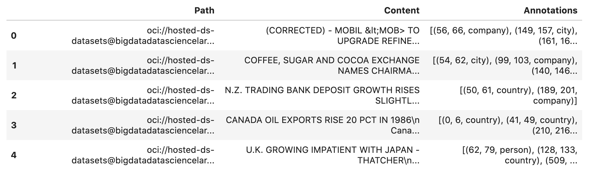
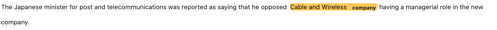

Examples
********

Binary Text Classification
==========================

This example will demonstrate how to do binary text classification. It will demonstrate a typical data science workflow using a single label dataset from the Data Labeling Service (DLS).

Start by loading in the required libraries:

.. code-block:: python3
    
    import ads
    import oci
    import os
    import pandas as pd
    
    from sklearn.feature_extraction.text import TfidfVectorizer 
    from sklearn.tree import DecisionTreeClassifier

Dataset
-------

A subset of the 20 Newsgroups dataset is used in this example. The complete dataset is a collection of approximately 20,000 newsgroup documents partitioned across 20 different newsgroups. The dataset is popular for experiments where the machine learning application predicts which newsgroup a record belongs to.

Since this example is a binary classification, only the ``rec.sport.baseball`` and ``sci.space`` newsgroups are used.  The dataset was previously labeled in the Data Labeling service. The metadata was exported and saved in a publicly accessible Object Storage bucket.

The data was previously labeled in the Data Labeling service. The metadata was exported and was saved in a publicly accessible Object Storage bucket. The metadata JSONL file is used to import the data and labels.

Load
----

You use the ``.read_labeled_data()`` method to read in the metadata file, record file, and the entire corpus of documents. Only the metadata file has to be specified because it contains references to the record and corpus documents. The ``.read_labeled_data()`` method returns a dataframe that is easy to work with.

The next example loads a labeled dataset, and returns the text from each email and the labeled annotation:

.. code-block:: python3
    
    df = pd.DataFrame.ads.read_labeled_data(
        "oci://hosted-ds-datasets@bigdatadatasciencelarge/DLS/text_single_label_20news/metadata.jsonl",
        materialize=True
    )
  
Preprocess
----------

The data needs to be standardized. The next example performs the following operations: 

* Converts the text to lower case. 
* Uses a regular expression (RegEx) command to remove any character that is not alphanumeric, underscore, or whitespace. 
* Replace the sequence of characters ``\n`` with a space.

The binary classifier model you train is a decision tree where the features are based on n-grams of the words. You use n-grams that are one, two, and three words long (unigrams, bigrams, and trigrams). The vectorizer removes English stop words because they provide little value to the model being built. A weight is assigned to these features using the `term frequency-inverse document frequency <https://en.wikipedia.org/wiki/Tf–idf>`__
(TF\*IDF) approach .

.. code-block:: python3

    df['text_clean'] = df['Content'].str.lower().str.replace(r'[^\w\s]+', '').str.replace('\n', ' ')
    vectorizer = TfidfVectorizer(stop_words='english', analyzer='word', ngram_range=(1,3)) 

Train
-----

In this example, you skip splitting the dataset into the training and test sets since the goal is to build a toy model. You assign ``0`` for the ``rec.sport.baseball`` label and ``1`` for the ``sci.space`` label:

.. code-block:: python3

    classifier = DecisionTreeClassifier()
    feature = vectorizer.fit_transform(df['text_clean'])
    model = classifier.fit(feature, df['Annotations'])

Predict
-------

Use the following to predict the category for a given text data
using the trained binary classifier:

.. code-block:: python3

    classifier.predict(vectorizer.transform(["reggie jackson played right field"]))

Image Classification
====================

This example demonstrates how to read image files and labels, normalize the size of the image, train a SVC model, and make predictions. The SVC model is used to try and determine what class a model belongs to.

To start, import the required libraries:

.. code-block:: python3

    import ads
    import matplotlib.pyplot as plt
    import oci
    import os
    import pandas as pd
    
    from ads.data_labeling import LabeledDatasetReader
    from PIL import Image
    from sklearn import svm, metrics
    from sklearn.model_selection import train_test_split

Data Source 
-----------

The data for this example was taken from a set of x-rays that were previously labeled in the Data Labeling service whether they have pneumonia or not. The metadata was exported and saved in a publicly accessible Object Storage bucket. The following commands define the parameters needed to access the metadata JSONL file:

.. code-block:: python3

    metadata_path = f"'oci://hosted-ds-datasets@bigdatadatasciencelarge/DLS/image_single_label_xray/metadata.jsonl'"

Load
----

This example loads and materializes the data in the dataframe. That is the dataframe to contain a copy of the image file. You do this with the ``.ads.read_labeled_data()`` method:

.. code-block:: python3

    df = pd.DataFrame.ads.read_labeled_data(path=metadata_path, 
                                            materialize=True)

Visualize
---------

The next example extracts images from the dataframe, and plots them along with their labels:

.. code-block:: python3

    _, axes = plt.subplots(nrows=1, ncols=4, figsize=(10, 3))
    for ax, image, label in zip(axes, df.Content, df.Annotations):
        ax.set_axis_off()
        ax.imshow(image, cmap=plt.cm.gray_r, interpolation='nearest')
        ax.set_title(f'Training: {label}')

Preprocess
----------

The image files are mixture of RGB and grayscale. Convert all the images to single channel grayscale so that the input to the SVC model is consistent:

.. code-block:: python3

    df.Content = df.Content.apply(lambda x: x.convert("L"))

The images are different sizes and you can normalize the size with:

.. code-block:: python3

    basewidth, hsize = min(df.Content.apply(lambda x: x.size))
    df.Content = df.Content.apply(lambda x: x.resize((basewidth, hsize), Image.NEAREST))

Convert the image to a numpy array as that is what the SVC is expecting. Each pixel in the image is now a dimension in hyperspace.

.. code-block:: python3

    from numpy import asarray
    import numpy as np
    
    data = np.stack([np.array(image).reshape(-1) for image in df.Content], axis=0)
    labels = df.Annotations

The model needs to be trained on one set of data, and then its performance would be assessed on a set of data that it has not seen before. Therefore, this splits the data into a training and testing sets:

.. code-block:: python3

    X_train, X_test, y_train, y_test = train_test_split(
        data, labels, test_size=0.1, shuffle=True)

Train
-----

The following obtains an SVC classifier object, and trains it on the training set:

.. code-block:: python3

    clf = svm.SVC(gamma=0.001)
    clf.fit(X_train, y_train)

Predict
-------
    
With the trained SVC model, you can now make predictions using the testing dataset:

.. code-block:: python3

    predicted = clf.predict(X_test)
    predicted

Multinomial Text Classification
================================

Building a multinomial text classifier is a similar to creating a binary text classifier except that you make a classifier for each class.  You use a one-vs-the-rest (OvR) multinomial strategy. That is, you create one classifier for each class where one class is the class your are trying to predict, and the other class is all the other classes.  You treat the other classes as if they were one class. The classifier predicts whether the observation is in the class or not. If there are m classes, then there will be m classifiers. Classification is based on which classifier has the more confidence that an observation is in the class.

Start by loading in the required libraries:

.. code-block:: python3
    
    import ads
    import nltk
    import oci
    import os
    import pandas as pd
    
    from nltk.corpus import stopwords
    from sklearn.feature_extraction.text import TfidfVectorizer 
    from sklearn.model_selection import cross_val_score
    from sklearn.multiclass import OneVsRestClassifier
    from sklearn.preprocessing import MultiLabelBinarizer
    from sklearn.svm import LinearSVC

Dataset
--------

A subset of the `Reuters Corpus <https://archive.ics.uci.edu/ml/datasets/reuters-21578+text+categorization+collection>`__ dataset is used in this example. You use scikit-learn and ``nltk`` packages to build a multinomial classifier. The Reuters data is a benchmark dataset for document classification. More precisely, it is a data set where where the target variable it multinomial. It has 90 categories, 7,769 training documents, and 3,019 testing documents.

The data was previously labeled in the Data Labeling service. The metadata was exported and was saved in a publicly accessible Object Storage bucket. The metadata JSONL file is used to import the data and labels.

Load
----

This example loads a dataset with a target variable that is multinomial. It returns the text and the class annotation in a dataframe:

.. code-block:: python3
    
    df = pd.DataFrame.ads.read_labeled_data(
        "oci://hosted-ds-datasets@bigdatadatasciencelarge/DLS/text_multi_label_nltk_reuters/metadata.jsonl",
        materialize=True
    )
    

Preprocess
----------

You can use the ``MultiLabelBinarizer()`` method to convert the labels into the scikit-learn classification format during the dataset preprocessing. This `transformer converts <https://scikit-learn.org/stable/modules/generated/sklearn.preprocessing.MultiLabelBinarizer.html>`__ a list of sets or tuples into the supported multilabel format, a binary matrix of ``samples*classes``.

The next step is to vectorize the input text to feed it into a supervised machine learning system. In this example, TF*IDF
vectorization is used.

For performance reasons, the ``TfidfVectorizer`` is limited to 10,000 words.

.. code-block:: python3

    nltk.download('stopwords') 
    
    stop_words = stopwords.words("english") ## See scikit-learn documentation for what these words are
    vectorizer = TfidfVectorizer(stop_words=stop_words, max_features = 10000) 
    mlb = MultiLabelBinarizer()
    
    X_train = vectorizer.fit_transform(df["Content"]) ## Vectorize the inputs with tf-idf
    y_train = mlb.fit_transform(df["Annotations"]) ## Vectorize the labels

Train
-----

You train a Linear Support Vector, ``LinearSVC``, classifier using the text data to generate features and annotations to represent the response variable.

The data from the `study class <https://probml.github.io/pml-book/book0.html>`__ is treated as positive, and the data from all the other classes is treated as negative.

This example uses the scalable Linear Support Vector Machine, ``LinearSVC``, for classification. It's quick to train and empirically
adequate on NLP problems:

.. code-block:: python3

    clf = OneVsRestClassifier(LinearSVC(class_weight = "balanced"), n_jobs = -1) 
    clf.fit(X_train, y_train)

Predict
-------

The next example applies cross-validation to estimate the prediction error. The ``K`` fold cross-validation works by partitioning a dataset into ``K`` splits. For the ``k`` :superscript:`th` part, it fits the model to the other ``K-1`` splits of the data and calculates the prediction error. It uses the ``k`` :superscript:`th` part to do this prediction.  For more details about this process, see `here <https://en.wikipedia.org/wiki/Cross-validation_(statistics)>`__ and specifically this `image <https://upload.wikimedia.org/wikipedia/commons/thumb/b/b5/K-fold_cross_validation_EN.svg/1920px-K-fold_cross_validation_EN.svg.png>`__.

By performing cross-validation, there are five separate models trained on different train and test splits to get an estimate of the error that is expected when the model is generalized to an independent dataset. This example uses the `cross_val_score <https://scikit-learn.org/stable/modules/generated/sklearn.model_selection.cross_val_score.html>`__ method to estimate the mean and standard deviation of errors:

.. code-block:: python3

    cross_val_score(clf, X_train, y_train, cv=5)

Named Entity Recognition
========================

This example shows you how to use a labeled dataset to create a named entity recognition model. The dataset is labeled using the Oracle Cloud Infrastructure (OCI) Data Labeling Service (DLS).

To start, load the required libraries

.. code-block:: python3

    import ads
    import os
    import pandas as pd
    import spacy

    from spacy.tokens import DocBin
    from tqdm import tqdm

Dataset
-------

The `Reuters Corpus <https://archive.ics.uci.edu/ml/datasets/reuters-21578+text+categorization+collection>`__ is a benchmark dataset that is used in the evaluation of document classification models. It is based on Reuters' financial newswire service articles from 1987. It contains the title and text of the article in addition to a list of people, places and organizations that are referenced in the article. It is this information that is used to label the dataset. A subset of the news articles were labeled using the DLS. 

Load
----

This labeled dataset has been exported from the DLS and the metadata has been stored in a publically accessible 
Object Storage bucket. The ``.read_labeled_data()`` method is used to load the data. The ``materialize`` parameter
causes the original data to be also be returned with the dataframe.

.. code-block:: python3
    
    path = 'oci://hosted-ds-datasets@bigdatadatasciencelarge/DLS/text_entity_extraction_nltk_reuters/metadata.jsonl'
    df = pd.DataFrame.ads.read_labeled_data(
        path,
        materialize=True
    )

Preprocess
----------

Covert the annotations data to the `SpaCy format <https://spacy.io/api/data-formats>`__ This will give you the start and end position of each entity and then the type of entity, such as person, place, organization.

.. code-block:: python3

    df.Annotations = df.Annotations.apply(lambda items: [x.to_spacy() for x in items])

The resulting dataframe will look like the following:

In this example, you will not be evaluating the performance of the model. Therefore, the data will not be split into train and test sets. Instead, you use all the data as training data. The following code snippet will create a list of tuples that contain the original article text and the annotation data.

.. code-block:: python3

    train_data = []
    for i, row in df.iterrows():
        train_data.append((row['Content'], {'entities': row['Annotations']}))
        

The training data will look similar to the following:

.. parsed-literal::

    [("(CORRECTED) - MOBIL &lt;MOB> TO UPGRADE REFINERY UNIT
    Mobil Corp said it will spend over 30
    mln dlrs to upgrade a gasoline-producing unit at its Beaumont,
    ...
    (Correcting unit's output to barrels/day from barrels/year)",
      {'entities': [(56, 66, 'company'), (149, 157, 'city'), (161, 166, 'city')]}),
     ('COFFEE, SUGAR AND COCOA EXCHANGE NAMES CHAIRMAN
     The New York Coffee, Sugar and Cocoa
     ...
     of Demico Futures, was elected treasurer.',
      {'entities': [(54, 62, 'city'),
        (99, 103, 'company'),
        (140, 146, 'person'),
        (243, 254, 'person'),
        ...   
        (718, 732, 'person')]}),
  
     ...

    ]

The DocBin format will be used as it provides faster serialization and efficient storage. The following code snippet does the conversion and writes the resulting DocBin object to a file.

.. code-block:: python3

    
    nlp = spacy.blank("en") # load a new spacy model
    db = DocBin() # create a DocBin object
    i=0
    for text, annot in tqdm(train_data): # data in previous format
        doc = nlp.make_doc(text) # create doc object from text
        ents = []
        for start, end, label in annot["entities"]: # add character indexes
            span = doc.char_span(start, end, label=label, alignment_mode="contract")
            
            if span is not None:
                ents.append(span)
        doc.ents = ents # label the text with the ents
        db.add(doc)
    
    db.to_disk(os.path.join(os.path.expanduser("~"), "train.spacy") # save the docbin object

Train
-----

The model will be trained using spaCy. Since this is done through the command line a configuration file is needed. In spaCy, this is a two-step process. You will create a ``base_config.cfg`` file that will contain the non-default settings for the model. Then the ``init fill-config`` argument on the spaCy module will be used to auto-fill a partial ``config.cfg`` file with the default values for the parameters that are not given in the ``base_config.cfg`` file. The ``config.cfg`` file contains all the settings and hyperparameters that will be needed to train the model.  See the `spaCy training documentation <https://spacy.io/usage/training>`__ for more details. 

The following code snippet will write the ``base_config.cfg`` configuration file and contains all the non-default parameter values.

.. code-block:: python3

    config = """
    [paths]
    train = null
    dev = null
    
    [system]
    gpu_allocator = null
    
    [nlp]
    lang = "en"
    pipeline = ["tok2vec","ner"]
    batch_size = 1000
    
    [components]
    
    [components.tok2vec]
    factory = "tok2vec"
    
    [components.tok2vec.model]
    @architectures = "spacy.Tok2Vec.v2"
    
    [components.tok2vec.model.embed]
    @architectures = "spacy.MultiHashEmbed.v2"
    width = ${components.tok2vec.model.encode.width}
    attrs = ["ORTH", "SHAPE"]
    rows = [5000, 2500]
    include_static_vectors = false
    
    [components.tok2vec.model.encode]
    @architectures = "spacy.MaxoutWindowEncoder.v2"
    width = 96
    depth = 4
    window_size = 1
    maxout_pieces = 3
    
    [components.ner]
    factory = "ner"
    
    [components.ner.model]
    @architectures = "spacy.TransitionBasedParser.v2"
    state_type = "ner"
    extra_state_tokens = false
    hidden_width = 64
    maxout_pieces = 2
    use_upper = true
    nO = null
    
    [components.ner.model.tok2vec]
    @architectures = "spacy.Tok2VecListener.v1"
    width = ${components.tok2vec.model.encode.width}
    
    [corpora]
    
    [corpora.train]
    @readers = "spacy.Corpus.v1"
    path = ${paths.train}
    max_length = 0
    
    [corpora.dev]
    @readers = "spacy.Corpus.v1"
    path = ${paths.dev}
    max_length = 0
    
    [training]
    dev_corpus = "corpora.dev"
    train_corpus = "corpora.train"
    
    [training.optimizer]
    @optimizers = "Adam.v1"
    
    [training.batcher]
    @batchers = "spacy.batch_by_words.v1"
    discard_oversize = false
    tolerance = 0.2
    
    [training.batcher.size]
    @schedules = "compounding.v1"
    start = 100
    stop = 1000
    compound = 1.001
    
    [initialize]
    vectors = ${paths.vectors}
    """
    
    with open(os.path.join(os.path.expanduser("~"), "base_config.cfg"), 'w') as f:
        f.write(config)

The following code snippet calls a new Python interpretrer that runs the spaCy module.  It loads the ``base_config.cfg`` file and writes out the configuration file ``config.cfg`` that has all of the training parameters that will be used. It contains the default values plus the ones that were specified in the ``base_config.cfg`` file.

.. code-block:: bash

    !$CONDA_PREFIX/bin/python -m spacy init fill-config ~/base_config.cfg ~/config.cfg

To train the model, you will call a new Python interpreter to run the spaCy module using the ``train`` command-line argument and other arguments that point to the training files that you have created.

.. code-block:: bash

    !$CONDA_PREFIX/bin/python -m spacy train ~/config.cfg --output ~/output --paths.train ~/train.spacy --paths.dev ~/train.spacy 

Predict
-------

The spaCy training procedure creates a number of models. The best model is stored in ``model-best`` under the output directory that was specified. The following code snippet loads that model and creates a sample document. The model is run and the output has the new document plus and entities that were detected are highlighted.

.. code-block:: python3

    nlp = spacy.load(os.path.join(os.path.expanduser("~), "output", "model-best")) #load the best model
    doc = nlp("The Japanese minister for post and telecommunications was reported as saying that he opposed Cable and Wireless having a managerial role in the new company.") # input sample text
    
    spacy.displacy.render(doc, style="ent", jupyter=True) # display in Jupyter

