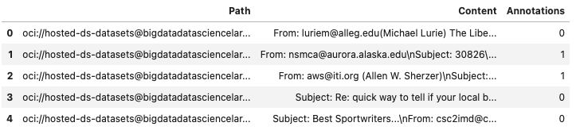

Load
****

The returned value from the ``.export()`` method is used to load a dataset.  You can load a dataset into a Pandas dataframe using ``LabeledDatasetReader`` or a Pandas accessor.  The ``LabeledDatasetReader`` creates an object that allows you to perform operations, such as getting information about the dataset without having to load the entire dataset. It also allows you to read the data directly into a Pandas dataframe or to use an iterator to process the records one at a time.  The Pandas accessor approach provides a convenient method to load the data in a single command.

``LabeledDatasetReader``
========================

Call the ``.from_export()`` method on ``LabeledDatasetReader`` to construct an object that allows you to read the data.  You need the metadata path that was generated by the ``.export()`` method.  Optionally, you can set ``materialize`` to  `True` to load the contents of the dataset. It's set to `False` by default.

.. code-block:: python3

   from ads.data_labeling import LabeledDatasetReader
   ds_reader = LabeledDatasetReader.from_export(
    path=metadata_path,
    materialize=True
   )

You can explore the metadata information of the dataset by calling ``info()`` on the ``LabeledDatasetReader`` object.  You can also convert the metadata object to a dictionary using ``to_dict``:

.. code-block:: python3

   metadata = ds_reader.info()
   metadata.labels
   metadata.to_dict()

On the ``LabeledDatasetReader`` object, you call ``read()`` to load the labeled dataset. By default, it's read into a Pandas dataframe.  You can specify the output annotation format to be ``spacy`` for the Entity Extraction dataset or ``yolo`` for the Object Detection dataset.

An Entity Extraction dataset is a dataset type that supports natural language processing named entity recognition (NLP NER).  `Here is an example of spacy format <https://spacy.io/api/data-formats>`_.  A Object Detection dataset is a dataset type that contains data from detecting instances of objects of a certain class within an image.  `Here is an example of yolo format <https://opencv-tutorial.readthedocs.io/en/latest/yolo/yolo.html>`_.

.. code-block:: python3

   df = ds_reader.read()
   df = ds_reader.read(format="spacy")
   df = ds_reader.read(format="yolo")

When a dataset is too large, you can read it in small portions. The result is presented as a generator.

.. code-block:: python3

   for df in ds_reader.read(chunksize=10):
      df.head()

Alternatively, you can call ``read(iterator=True)`` to return a generator of the loaded dataset, and loop all the records in the ``ds_generator`` by running:

.. code-block:: python3

   ds_generator = ds_reader.read(iterator=True)
   for item in ds_generator:
      print(item)

The ``iterator`` parameter can be combined with the ``chunksize`` parameter.  When you use the two parameters, the result is also presented as a generator. Every item in the generator is a list of dataset records.

.. code-block:: python3

   for items in ds_reader.read(iterator=True, chunksize=10):
      print(items)

Pandas Accessor
===============

The Pandas accessor approach allows you to to read a labeled dataset into a Pandas dataframe using a single command.

Use the ``.read_labeled_data()`` method to read  the metadata file, record file, and all the corpus documents.  To do this, you must know the metadata path that was created from the ``.export()`` method.  Optionally you can set ``materialize`` to  `True` to load content of the dataset. It's set to `False` by default.  The ``read_labeled_data()`` method returns a dataframe that is easy to work with.

This example loads a labeled dataset and returns a Pandas dataframe containing the content and the annotations:

.. code-block:: python3

   import pandas as pd
   df = pd.DataFrame.ads.read_labeled_data(
       path="<metadata_path>",
       materialize=True
   )

If you'd like to load a labeled dataset from the OCI Data Labeling, you can specify the ``dataset_id``, which is dataset OCID that you'd like to read.

The following example loads a labeled dataset from the OCI Data Labeling and returns a Pandas dataframe containing the content and the annotations:

.. code-block:: python3

   import pandas as pd
   df = pd.DataFrame.ads.read_labeled_data(
       dataset_id="<dataset_ocid>",
       materialize=True
   )

You can specify the output annotation format to be ``spacy`` for the Entity Extraction dataset or ``yolo`` for the Object Detection dataset.

.. code-block:: python3

   import pandas as pd
   df = pd.DataFrame.ads.read_labeled_data(
       dataset_id="<dataset_ocid>",
       materialize=True,
       format="spacy"
   )

An example of a dataframe loaded with the labeled dataset is:

