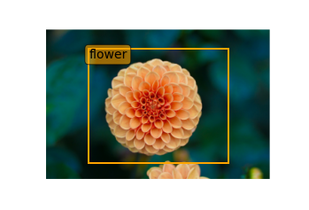
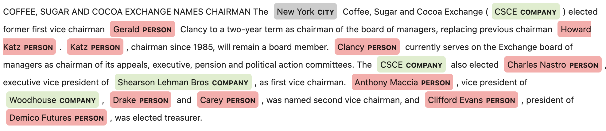

Visualize
*********

After the labeled dataset is loaded in a Pandas dataframe, you can be visualize it using ADS.  The visualization functionality only works if there are no transformations made to the `Annotations` column.

Image
=====

An image dataset, with an Object Detection annotation class, can have selected image records visualized by calling the ``.render_bounding_box()`` method. You can provide customized colors for each label.  If the ``path`` parameter is specified, the annotated image file is saved to that path.  Otherwise, the image is displayed in the notebook session.  The maximum number of records to display is set to 50 by default. This setting can be changed with the ``limit`` parameter:

.. code-block:: python3

   df.head(1).ads.render_bounding_box()   # without user defined colors

   df.iloc[1:3,:].ads.render_bounding_box(
      options={"default_color": "white", 
               "colors": {"flower":"orange", "temple":"green"}},
      path="test.png"
   )

An example of a single labeled image record is similar to:

Optionally, you can  convert the bounding box to YOLO format by calling ``to_yolo()`` on bounding box.  The labels are mapped to the index value of each label in the ``metadata.labels`` list.

.. code-block:: python3

   df["Annotations"] = df.Annotations.apply(
      lambda items: [item.to_yolo(metadata.labels) for item in items] if items else None
   )

Text
====

For a text dataset, with an entity extraction annotation class, you can also visualize selected text records by calling ``.render_ner()``, and optionally providing customized colors for each label. By default, a maximum of 50 records are displayed. However, you can adjust this using the ``limit`` parameter:

.. code-block:: python3

   df.head(1).ads.render_ner()  # without user defined colors

   df.iloc[1:3,:].ads.render_ner(options={"default_color":"#DDEECC", 
                                 "colors": {"company":"#DDEECC", 
                                            "person":"#FFAAAA", 
                                            "city":"#CCC"}})

This is an example output for a single labeled text record:

Optionally, you can convert the entities by calling ``to_spacy()``:

.. code-block:: python3

   df["Annotations"] = df.Annotations.apply(
      lambda items: [item.to_spacy() for item in items] if items else None
   )

