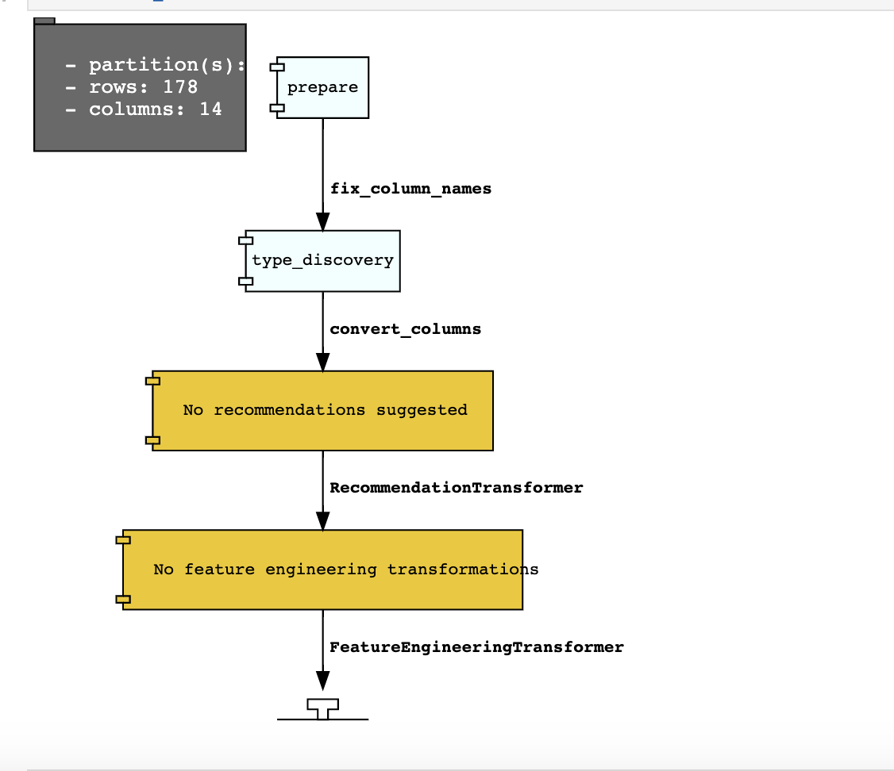

.. _data-transformations-8:

Transform Data 
##############

When datasets are loaded with DatasetFactory, they can be transformed and manipulated easily with the built-in functions. Underlying, an ``ADSDataset`` object is a Pandas dataframe. Any operation that can be performed to a `Pandas dataframe <https://pandas.pydata.org/docs/reference/api/pandas.DataFrame.html>`_ can also be applied to an ADS Dataset.

Loading the Dataset
********************

You can load a ``pandas`` dataframe into an ``ADSDataset`` by calling.

.. code-block:: python3

   from ads.dataset.factory import DatasetFactory

   ds = DatasetFactory.from_dataframe(df)

Automated Transformations
*************************

ADS has built in automatic transform tools for datasets. When the ``get_recommendations()`` tool is applied to an ``ADSDataset`` object, it shows the user detected issues with the data and recommends changes to apply to the dataset.  You can accept the changes is as easy as clicking a button in the drop down menu.  After all the changes are applied, the transformed dataset can be retrieved by calling ``get_transformed_dataset()``.

.. code-block:: python3

  wine_ds.get_recommendations()

Alternatively, you can use ``auto_transform()`` to apply all the recommended transformations at once. ``auto_transform()`` returns a transformed dataset with several optimizations applied automatically. The optimizations include:

* Dropping constant and primary key columns, which has no predictive quality.
* Imputation to fill in missing values in noisy data.
* Dropping strongly co-correlated columns that tend to produce less generalizable models.
* Balancing a dataset using up or down sampling.

One optional argument to ``auto_transform()`` is ``fix_imbalance``, which is set to ``True`` by default. When ``True``, ``auto_transform()`` corrects any imbalance between the classes. ADS downsamples the dominant class first unless there are too few data points. In that case, ADS upsamples the minority class.

.. code-block:: python3

  ds = wine_ds.auto_transform()

You can visualize the transformation that has been performed on a dataset by calling ``visualize_transforms()``.

.. note::

  ``visualize_transforms()`` is only applied to the automated transformations and does not capture any custom transformations that you may have applied to the dataset.

.. code-block:: python3

    ds.visualize_transforms()

Row Operations
***************

The operations that can be applied to a Pandas dataframe can be applied to an ``ADSDataset`` object.

Examples of some of the most common row operations you can apply on an ``ADSDataset`` object follow.

Delete Rows
===========

Rows within a dataset can be filtered out by row numbers.  The index of the new dataset can be reset accordingly.

.. code-block:: python3

    #Filter out rows by row number and reset index of new data
    ds_subset = ds.loc[10:100]
    ds_subset = ds_subset.reset_index()

Do not try to insert index into dataset columns.

Reset Index
============

Reset the index to the default index.  When you reset index, the old index is added as a column ``index`` and a new sequential index is used. You can use the ``drop`` parameter to avoid the old index being added as a column:

.. code-block:: python3

    ds_subset = ds.loc[10:100]
    ds_subset = ds_subset.reset_index(drop=True)
    ds_subset.head()

The index restarts at zero for each partition. This is due to the inability to statically know the full length of the index.

Append Rows
============

New rows can be added to an existing dataset:

.. code-block:: python3

    #Create new row to be added
    row_to_add = ds.loc[0]
    row_to_add['target'] = 'class_0'

    #Add in new row to existing dataset
    new_addition_ds = ds.merge(row_to_add, how = 'outer')

Alternatively, you can use the ``append()`` method of a Pandas dataframe to achieve a similar result:

.. code-block:: python3

    ds2 = wine_ds.df.append(ds)

The ``ds2`` is created as a Pandas DataFrame object.

Row Filtering
=============

Columns can be filtered out by the values:

.. code-block:: python3

    ds_filtered = ds[(ds['alcohol'] > 13.0) & (ds['malic_acid'] < 2.5)]
    ds_filtered.head()

Removing Duplicated Rows
========================

Duplicate rows can removed using the  ``drop_duplicates`` function:

.. code-block:: python3

  ds_without_dup = ds.drop_duplicates()

Column Operations
******************

The column operations that can be applied to a Pandas dataframe can be applied to an ADS dataset as in the following examples.

Delete a Column
===============

To delete specific columns from the dataset, the ``drop_columns`` function can be used along with names of the columns to be deleted from the dataset. The ``ravel`` Pandas command returns the flattened underlying data as an ndarray. The ``name_of_df.columns[:].ravel()`` command returns the name of all the columns in a dataframe as an array.

.. code-block:: python3

   ds_subset_columns = ds.drop_columns(['alcohol', 'malic_acid'])
   ds_subset_columns.columns[:].ravel()

.. parsed-literal::

   array(['ash', 'alcalinity_of_ash', 'magnesium', 'total_phenols',
       'flavanoids', 'nonflavanoid_phenols', 'proanthocyanins',
       'color_intensity', 'hue', 'od280/od315_of_diluted_wines',
       'proline', 'target'], dtype=object)

Rename a Column
===============

Columns can be renamed with the ``rename_columns()`` method:

.. code-block:: python3

    ds_columns_rename = ds.rename_columns({'alcohol': 'alcohol_amount',
                                    'malic_acid': 'malic_acid_amount'})
    ds_columns_rename.columns[:].ravel()

.. parsed-literal::

   array(['alcohol_amount', 'malic_acid_amount', 'ash', 'alcalinity_of_ash',
       'magnesium', 'total_phenols', 'flavanoids', 'nonflavanoid_phenols',
       'proanthocyanins', 'color_intensity', 'hue',
       'od280/od315_of_diluted_wines', 'proline', 'target'], dtype=object)

Counts of Unique Values
=======================

The count per unique value can be obtained with the ``value_counts()`` method:

.. code-block:: python3

    ds['target'].value_counts()

.. parsed-literal::

   class_1    71
   class_0    59
   class_2    48
   Name: target, dtype: int64

Normalize a Column
==================

You can apply a variety of normalization techniques to numerical columns (both continuous and discrete). You can leverage the built in ``max()`` and ``min()`` methods to perform a minmax normalization:

.. code-block:: python3

    max_alcohol = wine_ds['alcohol'].max()
    min_alcohol = wine_ds['alcohol'].min()
    alcohol_range = max_alcohol  - min_alcohol
    wine_ds.df['norm_alcohol'] = (wine_ds['alcohol'] / alcohol_range)

Combine Columns
===============

This example creates a new column by performing operations to combine two or more columns together:

.. code-block:: python3

    new_feature_col = ((0.4)*wine_ds['total_phenols'] + (0.6)*wine_ds['flavanoids'])
    ds_new_feature = wine_ds.assign_column('new_feature', new_feature_col)
    ds_new_feature.head()

Alternatively, you can create a new column directly in the Pandas dataframe attribute:

.. code-block:: python3

    new_feature_col = ((0.4)*wine_ds['total_phenols'] + (0.6)*wine_ds['flavanoids'])
    wine_ds.df['new_feature'] = new_feature_col
    wine_ds.head()

To add new column, use a new name for it. You can add anew column and change it by combining with existing column:

.. code-block:: python3

    noise = np.random.normal(0,.1,wine_ds.shape[0])
    ds_noise = wine_ds.assign_column('noise', noise)

    ds_ash = ds_noise.assign_column('noise', ds_noise['noise'] + ds_noise['ash'])
    ds_ash = ds_ash.rename(columns={'noise':'ash_with_noise'})
    ds_ash.head()

The resulting column is renamed with dict-like mapper.

Apply a Function to a Column
============================

You can apply functions to update column values in existing column. This example updates the column in place using lambda expression:

.. code-block:: python3

    wine_ds.assign_column('proline', lambda x: x is None or x > 1000)
    wine_ds.head()

.. _data-transformations-change-dtype:

Change Data Type
================

You can change the data type columns with the ``astype()`` method. ADS uses the Pandas method, ``astype()``, on dataframe objects. For specifics, see `astype for a Pandas Dataframe <https://pandas.pydata.org/docs/reference/api/pandas.DataFrame.astype.html>`_, `using numpy.dtype <https://docs.scipy.org/doc/numpy/reference/generated/numpy.dtype.html#numpy.dtype>`_, or `Pandas dtypes <https://pandas.pydata.org/pandas-docs/stable/getting_started/basics.html#dtypes>`_.

When you change the type of a column, ADS updates its semantic type to categorical, continuous, datetime, or ordinal. For example, if you update a column type to integer, its semantic type updates to ordinal.  For data type details, see ref:`loading-data-specify-dtype`.

This example converts a dataframe column from float, to the low-level integer type and ADS updates its semantic type to ordinal:

.. code-block:: python3

    wine_ds = wine_ds.astype(types={'proline': 'int64'})
    print(wine_ds.feature_types['proline']['low_level_type'])
    print(wine_ds.feature_types['proline']['type'])

    # Note: When you cast a float column to integer, you lose precision.
    wine_ds['proline'].head()

To convert a column of type float to categorical, you convert it to integer first. This example converts a column data type from float to integer, then to categorical, and then the number of categories in the column is reduced:

.. code-block:: python3

    # create a new dataset with a renamed column for binned data and update the values
    ds = wine_ds.rename_columns({'color_intensity': 'color_intensity_bin'})
    ds = ds.assign_column('color_intensity_bin', lambda x: x/3)

    # convert the column from float to categorical:
    ds = ds.astype(types={'color_intensity_bin': 'int64'})
    ds = ds.astype(types={'color_intensity_bin': 'categorical'})

You can use ``feature_types`` to see if the semantic data type of the converted column is categorical:

.. code-block:: python3

    wine_ds.feature_types['color_intensity_bin']['type']

.. parsed-literal::

    'categorical'

The low-level type of the converted column is category:

.. code-block:: python3

    ds['color_intensity_bin'].head()

.. parsed-literal::

    0    1
    1    1
    2    1
    3    2
    4    1
    Name: color_intensity_bin, dtype: category
    Categories (5, int64): [0, 1, 2, 3, 4]

Dataset Manipulation
*********************

ADS has built in functions that support categorical encoding, null values and imputation.

Categorical Encoding
====================

ADS has a built in categorical encoder that can be accessed by calling ``from ads.dataset.label_encoder import DataFrameLabelEncoder``. This example encodes the three classes of wine that make up the dataset:

.. code-block:: python3

    from ads.dataset.label_encoder import DataFrameLabelEncoder
    ds_encoded = DataFrameLabelEncoder().fit_transform(ds.to_pandas())
    ds_encoded['target'].value_counts()

.. parsed-literal::

    1    71
    0    59
    2    48

One-Hot Encoding
================

One-hot encoding transforms one categorical column with *n* categories into *n* or *n-1* columns with indicator variables. You can prepare one of the columns to be categorical with categories low, medium, and high:

.. code-block:: python3

    def convert_to_level(value):
        if value < 12:
            return 'low'
        elif value > 13:
            return 'high'
        else:
            return 'medium'

    ds = wine_ds
    ds = ds.assign_column('alcohol', convert_to_level)

You can use the Pandas method ``get_dummies()`` to perform one-hot encoding on a column. Use the ``prefix`` parameter to assign a prefix to the new columns that contain the indicator variables. This example creates *n* columns with one-hot encoding:

.. code-block:: python3

    data = ds.to_pandas()['alcohol'] # data of which to get dummy indicators
    onehot = pd.get_dummies(data, prefix='alcohol')

To create *n-1* columns, use ``drop_first=True`` when converting the categorical column. You can add a one-hot column to the initial dataset with the ``merge()`` method:

.. code-block:: python3

    data = ds.to_pandas()['alcohol'] # data of which to get dummy indicators
    onehot = pd.get_dummies(data, prefix='alcohol', drop_first=False)
    ds_onehot = ds.merge(onehot)

Encoding for all categorical columns can be accomplished with the ``fit_transform()`` method:

.. code-block:: python3

    from ads.dataset.label_encoder import DataFrameLabelEncoder

    ds_encoded = DataFrameLabelEncoder().fit_transform(ds_onehot.to_pandas())
    ds_encoded['alcohol'].value_counts()

.. parsed-literal::

    0    92
    2    67
    1    19

To drop the initial categorical column that you transformed into one-hot, use one of these examples:

.. code-block:: python3

    ds_onehot = ds_onehot.drop_columns('alcohol')   # before ``fit_transform()`` method
    # or
    ds_encoded = ds_encoded.drop(columns='alcohol') # after ``fit_transform()`` method

Extract Null Values
===================

To detect all nulls in a dataset, use the ``isnull`` function to return a boolean dataset matching the dimension of our input:

.. code-block:: python3

    ds_null = ds.isnull()
    np.any(ds_null)

.. parsed-literal::

    alcohol                         False
    malic_acid                      False
    ash                             False
    alcalinity_of_ash               False
    magnesium                       False
    total_phenols                   False
    flavanoids                      False
    nonflavanoid_phenols            False
    proanthocyanins                 False
    color_intensity                 False
    hue                             False
    od280/od315_of_diluted_wines    False
    proline                         False
    target                          False

Imputation
==========

The ``fillna`` function ia used to replace null values with specific values. Generate a null value by replacing the entry below a certain value with null, and then imputing it with a value:

.. code-block:: python3

    ds_with_null = ds.assign_column("malic_acid", lambda x: None if x < 2 else x)
    ds_with_null['malic_acid'].head()

.. parsed-literal::

    0     NaN
    1     NaN
    2    2.36
    3     NaN
    4    2.59
    Name: malic_acid, dtype: float64

.. code-block:: python3

    ds_impute = ds_with_null.fillna(method='bfill')
    ds_impute['malic_acid'].head()

.. parsed-literal::

    0    2.36
    1    2.36
    2    2.36
    3    2.59
    4    2.59
    Name: malic_acid, dtype: float64

Combine Datasets
================

ADS datasets can be merged and combined together to form a new dataset.

Join Datasets
-------------

You can merge two datasets together with a database-styled join on columns or indexes by specifying the type of join ``left``, ``right``, ``outer``, or ``inner``. These type are defined by:

* ``left``:  Use only keys from the left dataset, similar to SQL left outer join.
* ``right``: Use only keys from the right dataset, similar to SQL right outer join.
* ``inner``: Intersection of keys from both datasets, similar to SQL inner join.
* ``outer``: Union of keys from both datasets, similar to SQL outer join.

This is an example of performing an outer join on two datasets.  The datasets are subsets of the wine dataset, and each dataset contains only one class of wine.

.. code-block:: python3

    ds_class1 = ds[ds['target']=='class_1']
    ds_class2 = ds[ds['target']=='class_2']
    ds_merged_outer = ds_class1.merge(ds_class2, how='outer')
    ds_merged_outer['target'].value_counts()

.. parsed-literal::

    class_1    71
    class_2    48
    class_0     0
    Name: target, dtype: int64

Concatenate Datasets
--------------------

Two datasets can be concatenated along a particular axis (vertical or horizontal) with the option of performing set logic (union or intersection) of the indexes on the other axes.  You can stack two datasets vertically with:

.. code-block:: python3

    ds_concat = pd.concat([ds_class1, ds_class2], axis = 0)
    ds_concat['target'].value_counts()

.. parsed-literal::

    class_1    71
    class_2    48
    class_0     0
    Name: target, dtype: int64

Train/Test Datasets
*******************

After all data transformations are complete, you can split the data into a train and test or train, test, and validation set. To split data into a train and test set with a train size of 80% and test size of 20%:

.. code-block:: python3

    from ads.dataset.dataset_browser import DatasetBrowser
    sklearn = DatasetBrowser.sklearn()
    wine_ds = sklearn.open('wine')
    ds = wine_ds.auto_transform()
    train, test = ds.train_test_split(test_size=0.2)

For a train, test, and validation set, the defaults are set to  80% of the data for training, 10% for testing, and 10% for validation. This example sets split to 70%, 15%, and 15%:

.. code-block:: python3

    data_split = wine_ds.train_validation_test_split(
        test_size=0.15,
        validation_size=0.15
    )
    train, validation, test = data_split
    print(data_split)   # print out shape of train, validation, test sets in split

The resulting three data subsets each have separate data (X) and labels (y).

.. code-block:: python3

    print(train.X)  # print out all features in train dataset
    print(train.y)  # print out labels in train dataset

You can split the dataset right after the ``DatasetFactory.open()`` statement:

.. code-block:: python3

    ds = DatasetFactory.open("path/data.csv").set_target('target')
    train, test = ds.train_test_split(test_size=0.25)

Text Data 
*********

.. toctree::
    :maxdepth: 3

    ../ADSString/index
    ../text_extraction/text_dataset
