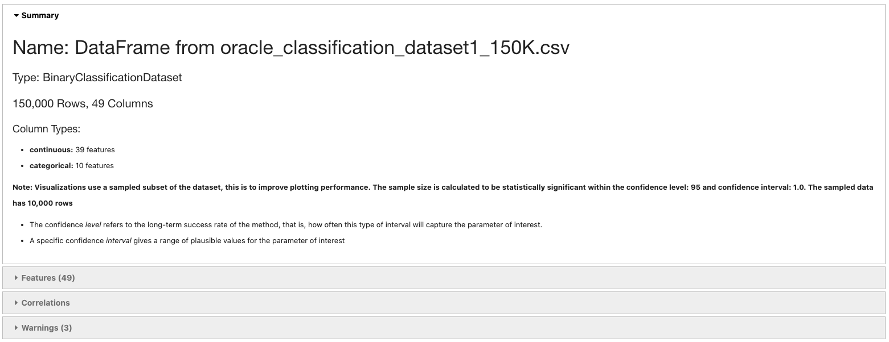
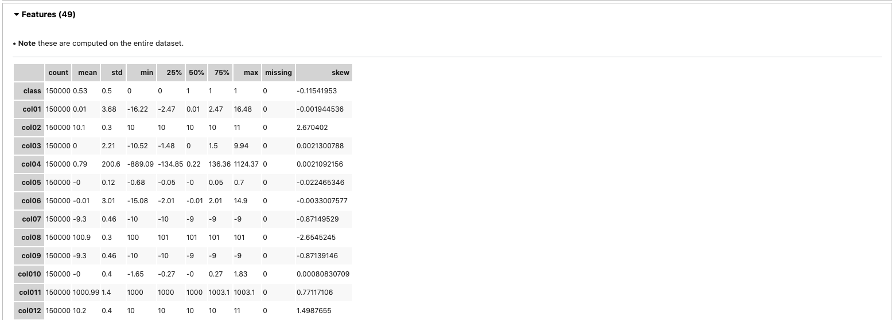
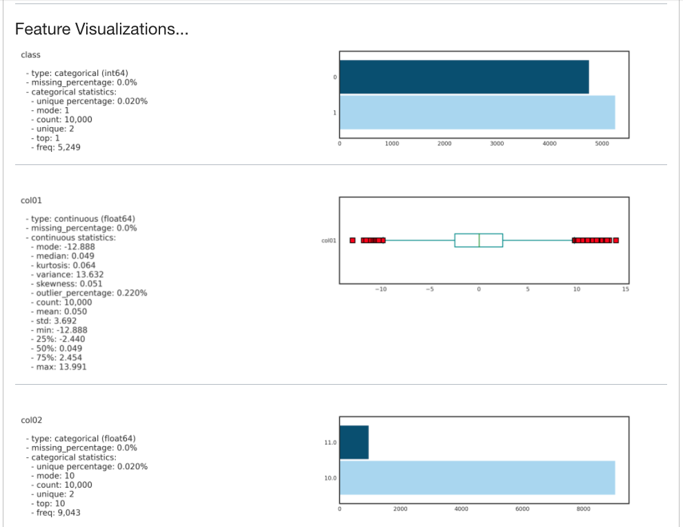
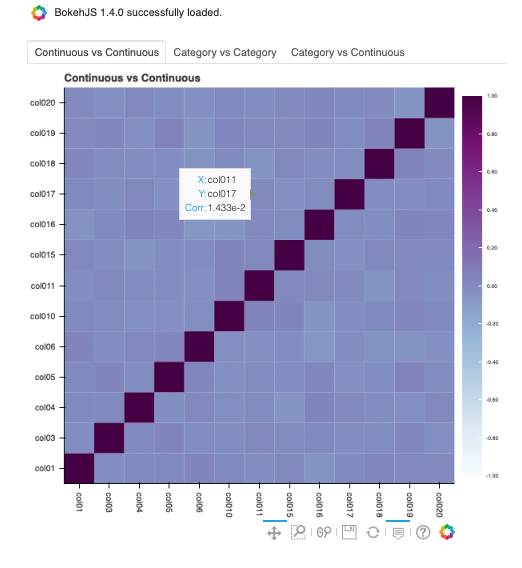
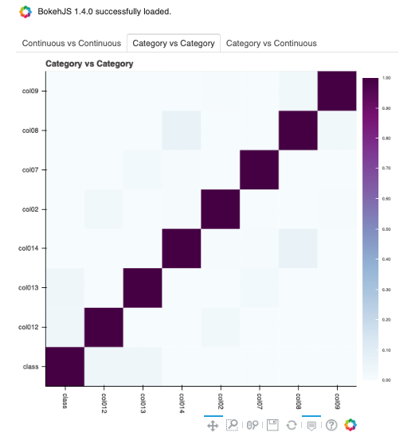
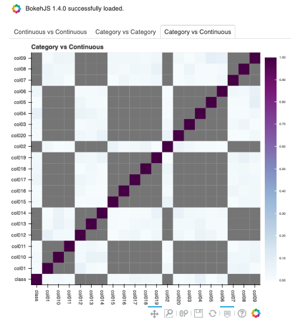
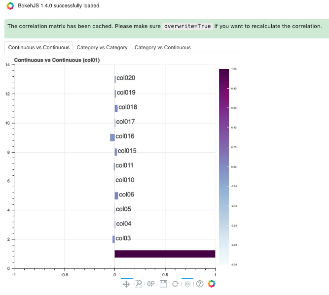
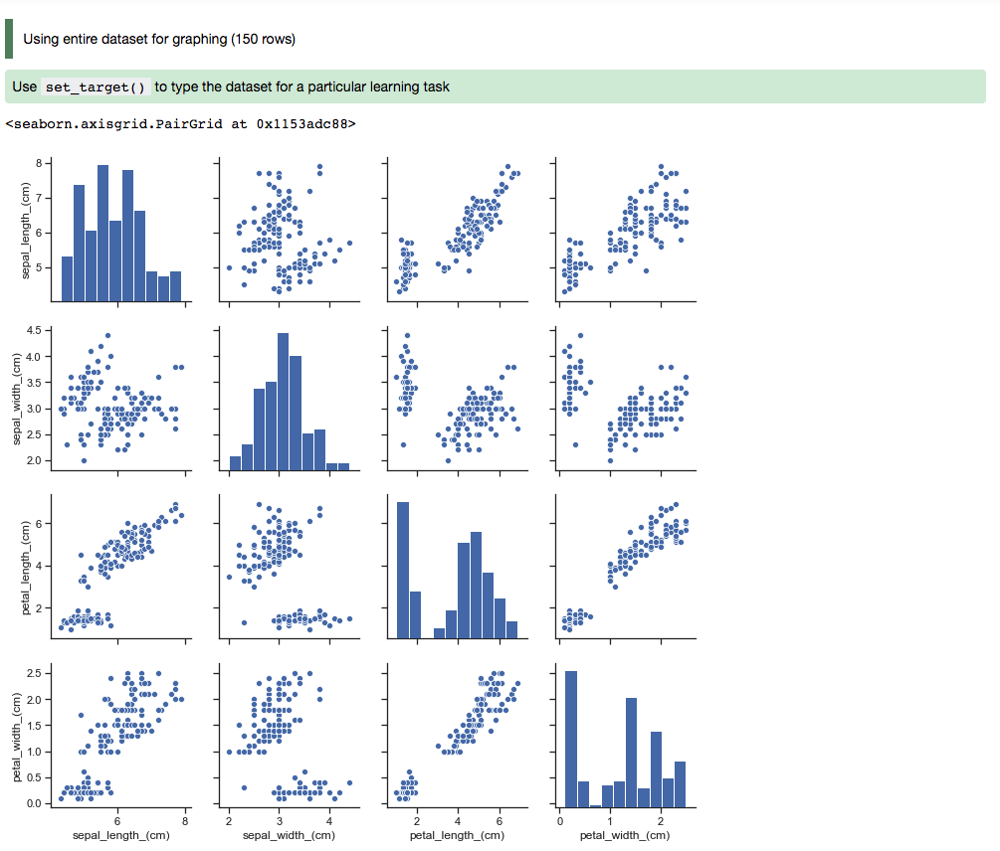
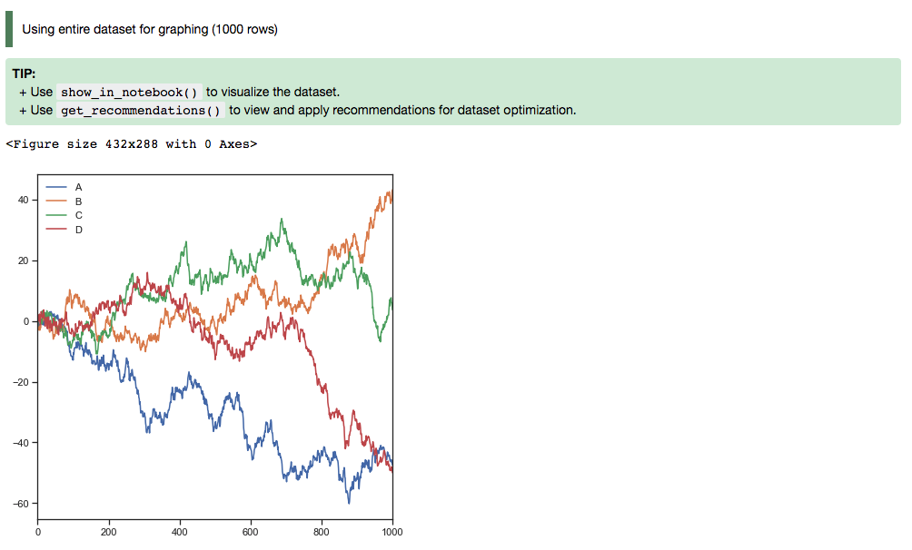
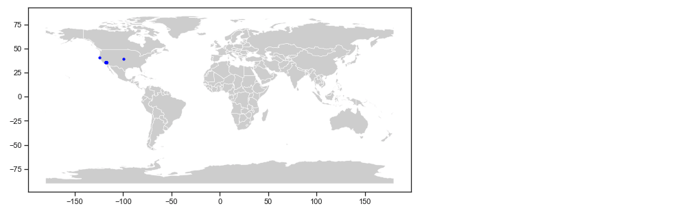

.. _data-visualization-8:

##############
Visualize Data
##############

Data visualization is an important aspect of data exploration, analysis, and communication. Generally, visualization of the data is one of the first steps in any analysis. It allows the analysts to efficiently gain an understanding of the data and guides the exploratory data analysis (EDA) and the modeling process.

An efficient and flexible data visualization tool can provide a lot of insight into the data. ADS provides a smart visualization tool. It automatically detects the data type and renders plots that optimally represent the characteristics of the data. Within ADS, custom visualizations can be created using any plotting library.

Automatic 
*********

The ADS ``show_in_notebook()`` method creates a comprehensive preview of all the basic information about a dataset including:

* The predictive data type (for example, regression, binary classification, or multinomial classification).
* The number of columns and rows.
* Feature type information.
* Summary visualization of each feature.
* The correlation map.
* Any warnings about data conditions that you should be aware of.

To improve plotting performance, the ADS ``show_in_notebook()`` method uses an optimized subset of the data. This smart sample is selected so that it is statistically representative of the full dataset.  The correlation map is only displayed when the data only has numerical (``continuous`` or
``oridinal``) columns.

.. code-block:: python3

    ds.show_in_notebook()







To visualize the correlation, call the ``show_corr()`` method. If the correlation matrices have not been cached, this call triggers the ``corr()`` function which calculates the correlation matrices.

``corr()`` uses the following methods to calculate the correlation based on the data types:

* Continuous-Continuous: ```Pearson`` method <https://en.wikipedia.org/wiki/Pearson_correlation_coefficient>`__. The correlations range from -1 to 1.
* Categorical-Categorical:  ```Cramer's V`` method <https://en.wikipedia.org/wiki/Cram%C3%A9r%27s_V>`__. The correlations range from 0 to 1.
* Continuous-Categorical: ```Correlation Ratio`` method <https://en.wikipedia.org/wiki/Correlation_ratio>`__. The correlations range from 0 to 1.

Correlations are displayed independently because the correlations are calculated using different methodologies and the ranges are not the same. Consolidating them into one matrix could be confusing and inconsistent.

.. note::

 ``Continuous`` features consist of ``continuous`` and ``ordinal`` types.
 ``Categorical`` features consist of ``categorical`` and ``zipcode`` types.

.. code-block:: python3

    ds.show_corr(nan_threshold=0.8, correlation_methods='all')







By default, ``nan_threshold`` is set to 0.8. This means that if more than 80% of the values in a column are missing, that column is dropped from the correlation calculation. ``nan_threshold`` should be between 0 and 1. Other options includes:

* ``correlation_methods``: Methods to calculate the correlation. By default, only ``pearson`` correlation is calculated and shown. Can select one or more from ``pearson``, ``cramers v``, and ``correlation ratio``. Or set to ``all`` to show all correlation charts.
* ``correlation_target``: Defaults to None. It can be any columns of type ``continuous``, ``ordinal``, ``categorical`` or ``zipcode``. When ``correlation_target`` is set, only pairs that contain ``correlation_target`` display.
* ``correlation_threshold``: Apply a filter to the correlation matrices and only exhibit the pairs whose correlation values are greater than or equal to the ``correlation_threshold``.
* ``force_recompute``: Defaults to False. Correlation matrices are cached. Set ``force_recompute`` to ``True`` to recalculate the correlation. Note that both ``corr()`` and ``show_corr()`` method can trigger calculation of correlation matrices if run with ``force_recompute`` set to be ``True``, or when there is no cached value exists. ``show_in_notebook()`` calculates the correlation only when there are only numerical columns in the dataset.
* ``frac``: Defaults to 1. The portion of the original data to calculate the correlation on. ``frac`` must be between 0 and 1.
* ``plot_type``: Defaults to ``heatmap``. Valid values are ``heatmap`` and ``bar``. If ``bar`` is chosen, ``correlation_target`` also has to be set and the bar chart will only show the correlation values of the pairs which have the target in them.

.. code-block:: python3

    ds.show_corr(correlation_target='col01', plot_type='bar')



To explore features, use the smart ``plot()`` method. It accepts one or two feature names. The ``show_in_notebook()`` method automatically determines the best type of plot based on the type of features that are to be plotted.

Three different examples are described. They use a binary classification dataset with 1,500 rows and 21 columns. 13 of the columns have a continuous data type, and 8 are categorical.  There are three different examples.

* A single categorical feature: The ``plot()`` method detects that the feature is categorical because it only has the values of 0 and 1. It then automatically renders a plot of the count of each category.

  .. code-block:: python3

      ds.plot("col02").show_in_notebook(figsize=(4,4))

  .. figure:: figures/single_column_count_plot.png
       :align: center

* Categorical and continuous feature pair: ADS chooses the best plotting method, which is a violin plot.

  .. code-block:: python3

      ds.plot("col02", y="col01").show_in_notebook(figsize=(4,4))

  .. figure:: figures/violin_plot.png
       :align: center

* A pair of continuous features: ADS chooses a Gaussian heatmap as the best visualization. It generates a scatter plot and assigns a color to each data point based on the local density (Gaussian kernel).

  .. code-block:: python3

      ds.plot("col01", y="col03").show_in_notebook()

  .. figure:: figures/gaussian_heatmap.png
       :align: center

Customized 
**********

ADS provides intelligent default options for your plots. However, the visualization API is flexible enough to let you customize your charts or choose your own plotting library.  You can use the ADS ``call()`` method to select your own plotting routine.

Seaborn
=======

In this example, a dataframe is passed directly to the Seaborn pair plot function. It does a faceted, pairwise plot between all the features in the dataset. The function creates a grid of axises such that each variable in the data is shared in the y-axis across a row and in the x-axis across a column. The diagonal axises are treated differently by drawing a histogram of each feature.

.. code-block:: python3

      import seaborn as sns
      from sklearn.datasets import load_iris
      import pandas as pd
      data = load_iris()
      df = pd.DataFrame(data.data, columns=data.feature_names)
      sns.set(style="ticks", color_codes=True)
      sns.pairplot(df.dropna())



Matplotlib
==========

- Using Matplotlib:

.. code-block:: python3

      import matplotlib.pyplot as plt
      from numpy.random import randn

      df = pd.DataFrame(randn(1000, 4), columns=list('ABCD'))

      def ts_plot(df, figsize):
          ts = pd.Series(randn(1000), index=pd.date_range('1/1/2000', periods=1000))
          df.set_index(ts)
          df = df.cumsum()
          plt.figure()
          df.plot(figsize=figsize)
          plt.legend(loc='best')

      ts_plot(df, figsize=(7,7))



- Using a Pie Chart:

  .. code-block:: python3

      import numpy as np
      import pandas as pd
      import matplotlib.pyplot as plt

      data = {'data': [1109, 696, 353, 192, 168, 86, 74, 65, 53]}
      df = pd.DataFrame(data, index = ['20-50 km', '50-75 km', '10-20 km', '75-100 km', '3-5 km', '7-10 km', '5-7 km', '>100 km', '2-3 km'])

      explode = (0, 0, 0, 0.1, 0.1, 0.2, 0.3, 0.4, 0.6)
      colors = ['#191970', '#001CF0', '#0038E2', '#0055D4', '#0071C6', '#008DB8', '#00AAAA',
              '#00C69C', '#00E28E', '#00FF80', ]

      def bar_plot(df, figsize):
          df["data"].plot(kind='pie', fontsize=17, colors=colors, explode=explode)
          plt.axis('equal')
          plt.ylabel('')
          plt.legend(bbox_to_anchor=(1.05, 1), loc=2, borderaxespad=0.)
          plt.show()

      bar_plot(df, figsize=(7,7))

  .. figure:: figures/piechart.png
       :align: center

Geographic Information System (GIS)
===================================

This example uses the California earthquake data retrieved from United States Geological Survey (USGS) earthquake catalog. It visualizes the location of major earthquakes.

.. code-block:: python3

      earthquake.plot_gis_scatter(lon="longitude", lat="latitude")



