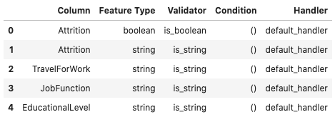
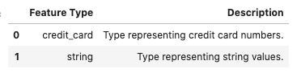

Assign Feature Types
********************

The ``.feature_type`` property is used to assign the feature types that are to be associated with a feature. It accepts an ordered list of the custom, default, and tag feature types. 

The ``.feature_type`` property is defined on a Pandas Series and dataframe. There are small differences between the ways that they are used are defined.

The order that you specify custom feature types defines the inheritance chain so controls which attribute or method is dispatched a feature. The default feature type doesn't have to be specified. If you specify it, it is placed after the custom feature types in the inheritance chain. Tag feature types are always placed after the default feature type. 

It is best practice to list the custom feature type first, then default, and then the tag feature types. The order matters so list any custom features first in the list.

When using the ``.feature_type`` property, the provided list accepts class names and custom feature type objects. For example, assume that ``CreditCard`` is a custom feature type and has the class name ``'credit_card'``. The following ``.feature_type`` statements are equivalent:

.. code-block:: python3

   CreditCard = feature_type_manager.feature_type_object('credit_card')
   String = feature_type_manager.feature_type_object('string')
   series.ads.feature_type = ['credit_card', 'string']
   series.ads.feature_type = [CreditCard, String]
   series.ads.feature_type = [CreditCard, 'string']

Dataframe
=========

Like a Pandas Series, you can use ``.feature_type`` on a dataframe to set the feature types for the columns in the dataframe. This property accepts a dictionary where the key in the dictionary is the column name, and the value is a list of feature types associated with that column.

.. code-block:: python3

    attrition_path = os.path.join('/opt', 'notebooks', 'ads-examples', 'oracle_data', 'orcl_attrition.csv')
    df = pd.read_csv(attrition_path, 
                     usecols=['Attrition', 'TravelForWork', 'JobFunction', 'EducationalLevel'])
    df.ads.feature_type = {'Attrition': ['boolean', 'category'],
                             'TravelForWork': ['category'],
                             'JobFunction': ['category'],
                             'EducationalLevel': ['category']}
    df.ads.validator_registered()

Series
======

When working with a Pandas Series you can access the ADS feature type attributes and properties by accessing the ``.ads`` method on
the Pandas Series.

To assign feature types to a Pandas Series, use the ``.ads.feature_type`` property. The next example creates a series of credit card numbers.  Then it uses the ``.feature_type`` property with a list of strings of the class names of the feature types.

.. code-block:: python3

    series = pd.Series(["4532640527811543", "4556929308150929", "4539944650919740", "4485348152450846"], name='Credit Card')
    series.ads.feature_type = ['credit_card', 'string']
    series.ads.feature_type_description

