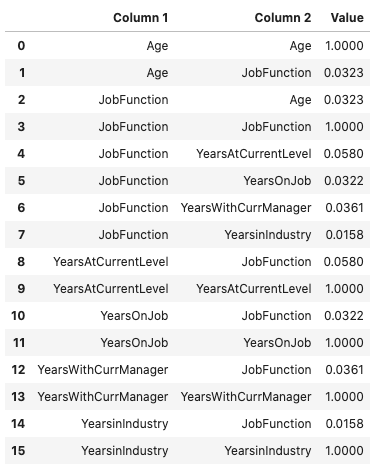
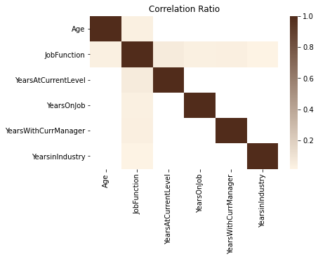
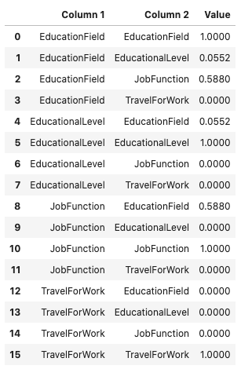
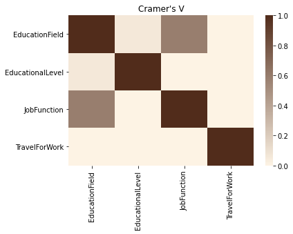
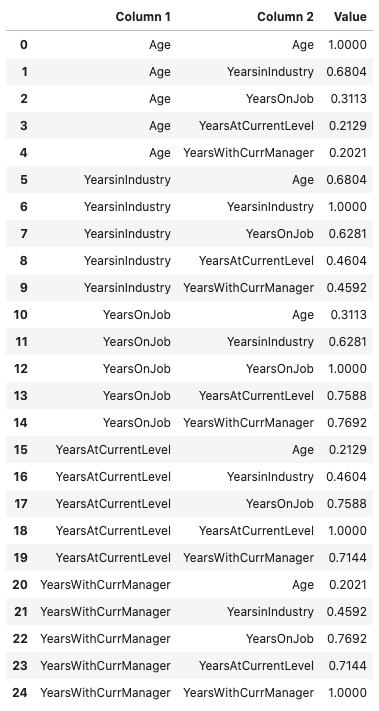
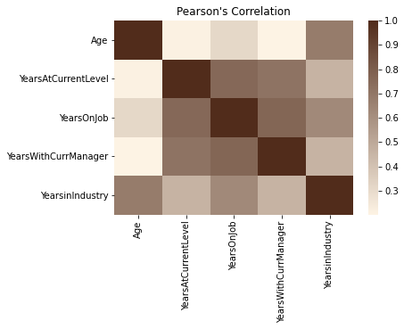

Correlation
***********

Generally, a data scientist wants to make a model as parsimonious as possible. This often involves determining what features are highly correlated and removing some of them. While some models, such as decision trees, aren't sensitive to correlated variables, others, such as an ordinary least squares regression, are. You might also want to remove correlated variables because it reduces the cost of collecting and processing
the data.

ADS speeds up your analysis by providing methods to compute different types of correlations. There are several different correlation techniques and they have different use cases. Also, there are two sets of methods for each correlation type. One method returns a dataframe with the correlation information, and the other method generates a plot.

What correlation technique you use depends on the type of data that you are working with. When using these correlation techniques, you must slice your dataframe so that only the appropriate feature types are used in the calculation. The ADS feature type selection tools help you do this quickly. 

The following is a summary of the different correlation techniques and what data to use. 

* ``correlation_ratio``: The correlation ratio measures the extent to which a distribution is spread out within individual categories relative to the spread of the entire population. This metric is used to compare categorical variables to continuous values. 
* ``cramersv``: The Cramér’s V provides a measure of the degree of association between two categorical and nominal datasets.
* ``pearson``: The Pearson correlation coefficient is a normalized measure of the covariance between two sets of data. It measures the linear correlation between the datasets. Use this method when both datasets contain continuous values. 

Correlation Ratio
=================

Statistical dispersion, or scatter, is a measure of the spread of a distribution with variance being a common metric. The correlation ratio is a measure of dispersion with categories relative to the dispersion across the entire dataset. The correlation ratio is a weighted variance of the category means over the variance of all samples. It is given with this formula:

.. math:: \eta = \sqrt{\frac{\sigma_{\bar{y}}^2}{\sigma_y^2}}

where:

.. math:: \sigma_{\bar{y}}^2 = \frac{\sum_x n_x(\bar{y}_x - \bar{y})^2}{\sum_x n_x}

.. math:: \sigma_{y}^2 = \frac{\sum_{x,i} n_x(\bar{y}_{x,i} - \bar{y})^2}{n}

Where :math:`n` is the total number of observations and :math:`n_x` is the number of observations in a category :math:`x`. :math:`\bar{y}_x` is the mean value in category :math:`x` and :math:`\bar{y}` is the overall mean.

Values of :math:`\eta` near zero indicate that there is no dispersion between the means of the different categories. A value of :math:`\eta` near one suggests that there in no dispersion within the respective categories.

.. code-block:: python3

    attrition_path = os.path.join('/opt', 'notebooks', 'ads-examples', 'oracle_data', 'orcl_attrition.csv')
    df = pd.read_csv(attrition_path,
                    usecols=['JobFunction', 'Age', 'YearsinIndustry', 'YearsOnJob', 'YearsWithCurrManager', 'YearsAtCurrentLevel'])
    df.ads.feature_type = {'Age': ['continuous'], 'YearsinIndustry': ['continuous'], 'YearsOnJob': ['continuous'], 
                           'YearsWithCurrManager': ['continuous'], 'YearsAtCurrentLevel': ['continuous'],
                           'JobFunction': ['category']}
    df.ads.correlation_ratio()

.. code-block:: python3

    df.ads.correlation_ratio_plot()

Cramér’s V
==========

Cramér’s V is used to measure the amount of association between two categorical and nominal variables. A value of zero means that there is no association between the bivariates, and a value of one means that there is complete association. The :math:`V` is the percentage of the maximum association between the variables and is dependent on the frequency in which the tuples :math:`(x_i, y_j)` occur.

The value of :math:`V` is related to the chi-squared statistic, :math:`X^2` and is given with:

.. math:: V = \sqrt{\frac{X^2}{min(k-1, r-1)n}}

Where: :math:`k` and :math:`r` are the number of categories in the datasets :math:`x` and :math:`y`. :math:`n` is the sample size.

.. code-block:: python3

    attrition_path = os.path.join('/opt', 'notebooks', 'ads-examples', 'oracle_data', 'orcl_attrition.csv')
    df = pd.read_csv(attrition_path,
                     usecols=['TravelForWork', 'JobFunction', 'EducationField', 'EducationalLevel'])
    df.ads.feature_type = {'TravelForWork': ['category'], 'JobFunction': ['category'], 'EducationField': ['category'], 
                           'EducationalLevel': ['category']}
    df.ads.cramersv()

.. code-block:: python3

    df.ads.cramersv_plot()

Pearson Correlation Coefficient
===============================

The Pearson correlation coefficient is known by several names like Pearson’s r, Pearson product moment correlation coefficient, bivariate correlation, or the correlation coefficient. It has a range of [-1, 1] where 1 means that the two datasets are perfectly correlated, and a value of -1 means that the correlation is perfectly out of phase.  So, when one dataset is increasing the other one is decreasing.

The Pearson correlation coefficient is a normalized value of the covariance between the continuous datasets X and Y. It is normalized by the product of the standard deviation between X and Y and is given with this formula:

.. math:: \rho_{X,Y} = \frac{cov(X,Y)}{\sigma_X \sigma_Y}

.. code-block:: python3

    attrition_path = os.path.join('/opt', 'notebooks', 'ads-examples', 'oracle_data', 'orcl_attrition.csv')
    df = pd.read_csv(attrition_path,
                    usecols=['Age', 'YearsinIndustry', 'YearsOnJob', 'YearsWithCurrManager', 'YearsAtCurrentLevel'])
    df.ads.feature_type = {'Age': ['continuous'], 'YearsinIndustry': ['continuous'], 'YearsOnJob': ['continuous'], 
                           'YearsWithCurrManager': ['continuous'], 'YearsAtCurrentLevel': ['continuous']}
    df.ads.pearson()

This same information can be represented in a plot using the ``.pearson_plot()`` method:

.. code-block:: python3

    df.ads.pearson_plot()

