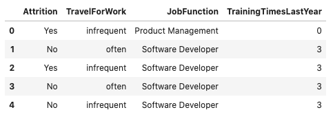

Feature Count
*************

Each column in a Pandas dataframe is associated with at least one feature type. That feature type is the default, and it's determined by the Pandas dtype. However, the feature type system allows you to associate a feature with multiple feature types using an inheritance system. A feature could have a feature set of ``wholesale_price``, ``car_price``, ``USD``, and ``continuous``.

You can call the ``.feature_count()`` method on a dataframe to provide a summary of what features are being used. The output is a dataframe where each row represents a feature type, which is listed in the Feature Type column. The next column lists the number of times the feature type appears in any of the columns. Since each feature can have multiple feature types, it counts all occurrences. The Primary column is the count of the number of times that the feature type is listed as the primary feature type that has no subclasses.

In the next example, the ``orcl_attrition`` dataset is loaded. The feature types are assigned and the top of the dataframe is displayed.

.. code-block:: python3

    attrition_path = os.path.join('/opt', 'notebooks', 'ads-examples', 'oracle_data', 'orcl_attrition.csv')
    df = pd.read_csv(attrition_path, 
                     usecols=['Attrition', 'TravelForWork', 'JobFunction', 'TrainingTimesLastYear'])
    df.ads.feature_type = {'Attrition': ['boolean', 'category'],
                           'TravelForWork': ['category'],
                           'JobFunction': ['category'],
                           'TrainingTimesLastYear': ['integer']}
    df.head()

In the preceding example, the ``.ads.feature_type`` method is used to store the feature types associated with each column. For example, the ``Attrition`` column has the Boolean and category feature types. You can also use the ``.ads.feature_type`` method to return a dictionary that lists the feature types that are assigned to each feature. Notice that the Attrition feature has the feature types Boolean, category, and string associated with it. In the preceding example, only the Boolean and category feature types were specified. That's because the feature type system automatically appends the feature type string based on the Pandas dtype, and is the default feature type. With  ``TrainingTimesLastYear``, the feature type that was specified was an integer. Since this is the dtype, no additional feature type was appended.

.. code-block:: python3

    df.ads.feature_type

.. parsed-literal::

    {'Attrition': ['boolean', 'category', 'string'],
     'TravelForWork': ['category', 'string'],
     'JobFunction': ['category', 'string'],
     'TrainingTimesLastYear': ['integer']}

The ``.feature_count()`` method is called on the dataframe in the next example. It provides a summary of the features used across all features in the dataframe. The output dataframe has one row for each feature type that is represented in the dataframe. This is listed in the Feature Type column. The next column lists the number of times the feature type appears in any of the columns. For example, the category feature type appears in the Attrition, TravelForWork, and JobFunction columns. So, it has a count of three. The Primary column is the count of the number of times that the feature type is listed as the primary feature type. For the category feature type, the value is two because TravelForWork and JobFunction have this set as their primary feature type.  While category is a feature type of Attrition, it's not the primary feature type, Boolean is. With a string feature type, it occurs in the Attrition, TravelForWork, and JobFunction features.  However, it's not the primary feature type in these features so its count is 3, but its Primary count is zero.

.. code-block:: python3

    df.ads.feature_count()

.. image:: figures/ads_feature_type_EDA_2.png

