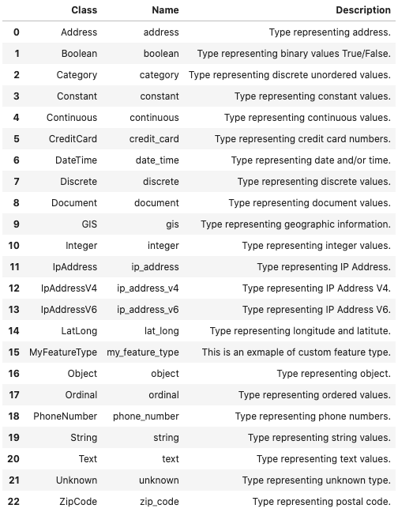
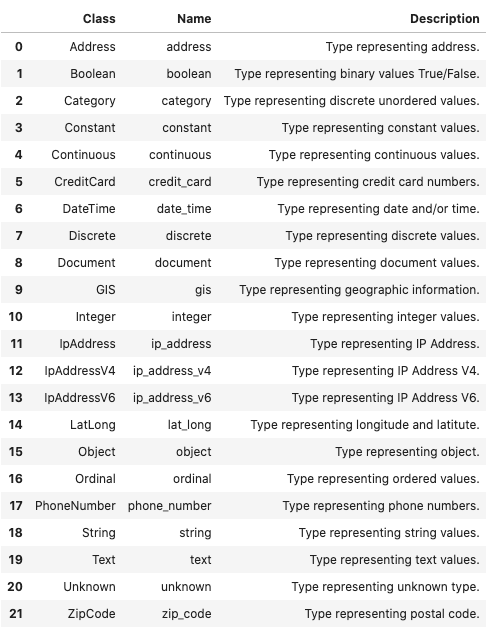
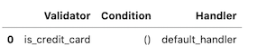
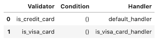
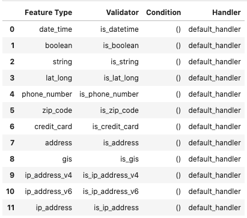
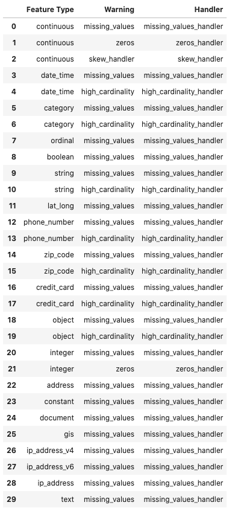

Feature Type Manager
********************

ADS uses custom feature types that define the characteristics of the feature types. It also uses a set of custom validators and warning handlers to provide reusable code to provide validation information for the feature. 

The role of the feature type manager is to provide an interface to manage the custom feature types and various handlers.

.. code-block:: python3

    import ads
    from ads.feature_engineering import feature_type_manager

Custom Feature Types
====================

Custom feature types are created by a data scientist to define a new feature type that is specific to their data. You do this by creating a class that inherits from the ``FeatureType`` class. This custom feature type class must be linked to the ADS system for it to be available for use in ADS. The feature type manager is used to administer this connection.

List
----

Calling ``feature_type_manager.feature_type_registered()`` gives an overview of all the registered feature types. The output is a dataframe with the following columns:

* ``Class``: Registered feature type class.
* ``Name``: Feature type class name.
* ``Description``: Description of each feature type class.

.. code-block:: python3

    feature_type_manager.feature_type_registered()

Register
--------

The feature type framework comes with some common feature types.  However, the power of using feature types is that you can easily create your own, and apply them to your specific data. 

To create a custom feature type, you need to create a class that is inherited from the ``FeatureType`` class. The class must be registered with ADS before you can use it. You do this using the ``feature_type_manager.feature_type_register()`` method passing in the
name of the class.

In the next example, the ``MyFeatureType`` custom feature type is created and registered:

.. code-block:: python3

    class MyFeatureType(FeatureType):
        description = "This is an example of custom feature type."
        
    
    feature_type_manager.feature_type_register(MyFeatureType)
    feature_type_manager.feature_type_registered()

Reset
-----

The ``feature_type_manager.reset()`` is used to unregister all custom feature types. The next example registers the ``MyFeatureType`` and checks that it's there. Then it resets the feature types and checks that ``MyFeatureType`` is not registered.

.. code-block:: python3

    feature_type_manager.feature_type_register(MyFeatureType)
    
    print("MyFeatureType is registered:" + str('my_feature_type' in feature_type_manager.feature_type_registered()['Name'].unique()))
    print("Removing all the custom feature types")
    feature_type_manager.feature_type_unregister('my_feature_type')
    print("MyFeatureType is registered:" + str('my_feature_type' in feature_type_manager.feature_type_registered()['Name'].unique()))

.. parsed-literal::

    MyFeatureType is registered:True
    Removing all the custom feature types
    MyFeatureType is registered:False

Unregister
----------

Custom feature types can be unregistered from ADS using the feature type name and the ``feature_type_manager.feature_type_unregister()`` method.  Built-in feature types can’t be unregistered.

The next example unregisters the ``MyFeatureType`` class using the ``my_feature_type`` feature type name . It also displays the list of registered classes ,and the fact that ``MyFeatureType`` was removed.

.. code-block:: python3

    feature_type_manager.feature_type_unregister('my_feature_type')
    feature_type_manager.feature_type_registered()

Feature Type Object
===================

Feature type objects are derived from the ``FeatureType`` class.  Obtaining a feature type object allows access to manipulate the feature type validators and feature type warnings that are associated with a given feature type. A feature type object is loaded using the ``feature_type_manager.feature_type_object()`` method and providing the its feature type name. For example, a ``PhoneNumber`` custom feature type class might have the feature type name ``phone_number``. This feature type is loaded by following this approach:

.. code-block:: python3

    PhoneNumber = feature_type_manager.feature_type_object('phone_number')

Feature type validators and warnings register their handlers at the feature type level. Therefore, feature type objects are used to manage these handlers.

Feature Type Validator
----------------------

List
^^^^

The ``.validator.registered()`` method returns a dataframe with the validators, conditions, and feature type validators that are associated with the given feature type. For example, assume that there is a custom feature type ``CreditCard`` and it has a single validator registered. The next example demonstrates how to list the validators. It returns a dataframe with the following columns:

* ``Name``: Method name of the validator.
* ``Conditions``: The conditions that call the handler.
* ``Handler``: Name of the function to perform the validation.  This is the actual handler.

.. code-block:: python3

    CreditCard = feature_type_manager.feature_type_object('credit_card')
    CreditCard.validator.registered()

Register
^^^^^^^^

Use the ``.validator.register()`` method on a feature type object to register a handler. A handler can be a default handler, meaning that there are no conditions on it or a handler with conditions. To register a default handler, use the following parameters:

* ``name``: The validator name to use to invoke the feature type validator. 
* ``default_handler``: The function name of the default feature type validator. 
* ``replace``: The flag indicating if the registered handler is replaced with the new one.

To register a handler with conditions use the following parameters:

* ``name``: The validator name that is used to invoke the feature type validator.
* ``condition``: The conditions that call the handler.
* ``handler``: The function name of the feature type validator. 
* ``replace``: The flag indicating if the registered handler is replaced with the new one.

The next example obtains the feature type object, ``CreditCard``, and then it registers the default feature type validator. If one exists with the same name, it is replaced. A call to ``CreditCard.validator_registered()`` returns the registered handlers for the credit card feature type.

.. code-block:: python3

    def is_visa_card_handler(data: pd.Series, *args, **kwargs) -> pd.Series:
        PATTERN = re.compile(_pattern_string, re.VERBOSE)
        def _is_credit_card(x: pd.Series):
            return (
                not pd.isnull(x)
                and PATTERN.match(str(x)) is not None
            )
        return data.apply(lambda x: True if _is_credit_card(x) else False)

    CreditCard = feature_type_manager.feature_type_object('credit_card')
    CreditCard.validator.register(name='is_visa_card', handler=is_visa_card_handler)
    CreditCard.validator.registered()

Unregister
^^^^^^^^^^

Use the ``.validator.unregister()`` method to remove a feature type validator.  With a default feature type validator, only the name of the validator is required. To remove a conditional validator, the ``condition`` parameter must be specified with a dictionary or tuple that matches the conditions of the handler to be removed.

Assume, that there is a ``CreditCard``custom feature type class with the feature type name ``is_credit_card`` and the condition ``'card_type'='Visa'``.
The next example demonstrates how this validator is removed.

.. code-block:: python3

    CreditCard = feature_type_manager.feature_type_object('credit_card')
    CreditCard.validator.unregister(name="is_credit_card", condition = {"card_type": "Visa"})

Feature Type Warning
--------------------

List
^^^^

The ``.warning.registered()`` method returns a dataframe with the name of a warning and handler. For example, assume that there is a custom feature type with the feature type name ``credit_card``. The following example provides information on the warnings that have been registered with this custom feature type.

.. code-block:: python3

    CreditCard = feature_type_manager.feature_type_object('credit_card')
    CreditCard.validator.registered()

.. image:: figures/ads_feature_type_warnings_3.png

Register
^^^^^^^^

Feature type warnings are registered with the feature type object.  You can assign the same handler to multiple feature types. The ``.warning.register()`` method registers the handler for the warning. You give it a name for the handler and the handler function. The optional ``replace = True`` parameter overwrites the handler when the name exists.

.. code-block:: python3

    CreditCard = feature_type_manager.feature_type_object('credit_card')
    CreditCard.warning.register(name='invalid_credit_card', 
                                handler=invalid_credit_card_handler, 
                                replace=True)

Unregister
^^^^^^^^^^

To remove a feature type warning from a custom feature type use the ``.warning.unregister()`` method. It accepts the name of the feature type warning. The next code snippet removes the ``invalid_credit_card`` warning from a feature type class that has the feature type name ``credit_card``.

.. code-block:: python3

    CreditCard = feature_type_manager.feature_type_object('credit_card')
    CreditCard.warning.unregister('invalid_credit_card')

Feature Type Validator
======================

Feature validators are defined at the feature type object level. The feature type manager allows you to list all validators across all feature types. To register, unregister, or list the validators on a specific feature type, use the feature type object.

List
----

To list the current feature handlers and their conditions for all feature types, use the ``feature_type_manager.validator_registered()`` method. It returns a dataframe with the following columns:

* ``Condition``: Condition that the handler is registered in. 
* ``Feature Type``: Feature type class name. 
* ``Handler``: Registered handler.
* ``Validator``: Validation functions that you can call to validate a Pandas Series. 

.. code-block:: python3

    feature_type_manager.validator_registered()

Feature Type Warning
====================

Feature warnings are defined at the feature type object level. The feature type manager allows to list all warnings across all feature types. To register, unregister, or list the warnings on a specific feature type, use the feature type object.

List
----

The ``feature_type_manager.warning_registered()`` method returns a dataframe of registered warnings all registered feature types.  The columns of returned dataframe are:

* ``Feature Type``: Feature type class name.
* ``Handler``: Registered warning handler for that feature type.
* ``Warning``: Warning name.

.. code-block:: python3

    feature_type_manager.warning_registered()

