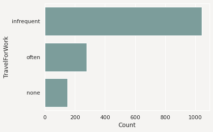
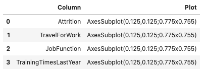
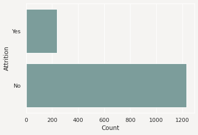
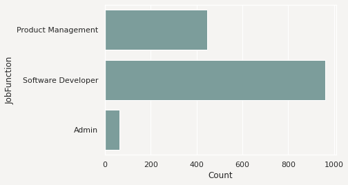
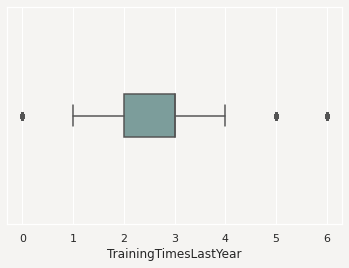
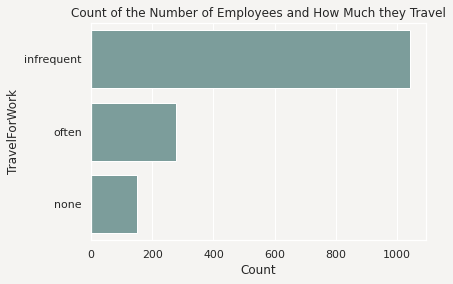
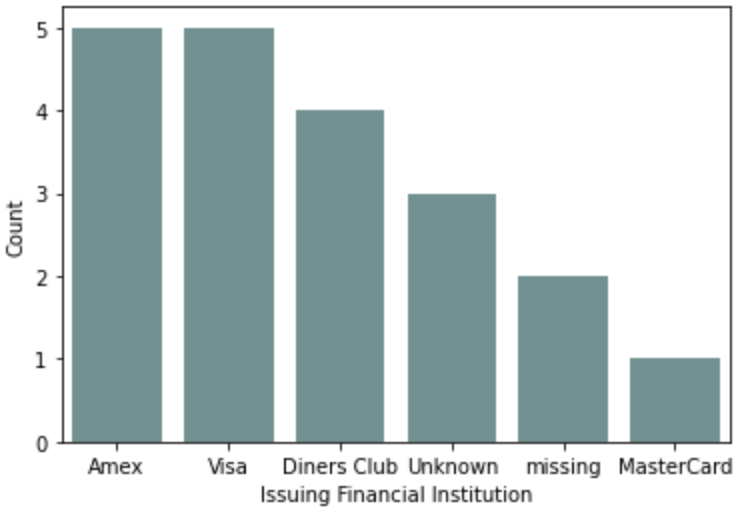

Feature Plot
************

Visualization of a dataset is a quick way to gain insights into the distribution of values. The feature type system in ADS provides plots for all ADS-supported feature types. However, it's easy to create feature plots for your custom feature types. Calling ``.feature_plot()`` on a Pandas Series produces a univariate plot. The ``.feature_plot()`` method is also available on a dataframe. When it is called a dataframe is returned where the column ``Column`` lists the name of the feature and the column ``Plot`` has a plot object.

The power of the feature plot is that you can customize the feature plot that is created for the custom feature types that you create.  Since a feature can have multiple inheritance, the inheritance chain is used to determine which ``.feature_plot()`` method is dispatched.

Create
======

The ``.feature_plot()`` is defined on a Pandas Series and dataframes. The behavior between the two is similar though different. On a Pandas Series, a ``matplotlib.pyplot`` object is returned.  On a Pandas dataframe a dataframe is returned with a collection of ``matplotlib.pyplot`` objects.

Series
------

When using a Pandas Series and the ``.feature_plot()`` method, a ``matplotlib.pyplot`` object is returned.

The next example loads the ``orcl_attrition`` dataset and assigns feature types to each feature. The ``TravelForWork`` feature has a simple feature type inheritance chain with a single feature type, ``category``.  ``category`` is a default feature type so ADS provides a ``.feature_plot()`` method for it. Calling ``.feature_plot()`` produce sa horizontal bar chart with a count of the number of observations in each category. In this specific case, it is a count of the number of employees that travel for work:

.. code-block:: python3

    attrition_path = os.path.join('/opt', 'notebooks', 'ads-examples', 'oracle_data', 'orcl_attrition.csv')
    df = pd.read_csv(attrition_path, 
                    usecols=['Attrition', 'TravelForWork', 'JobFunction', 'TrainingTimesLastYear'])
    df.ads.feature_type = {'Attrition': ['category'], 'TravelForWork': ['category'],
                           'JobFunction': ['category'], 'TrainingTimesLastYear': ['continuous']}
    df['TravelForWork'].ads.feature_plot()

Dataframe
---------

It's often expedient to produce the feature plots for all the features in a dataframe. You can this by calling ``.feature_plot()`` on a dataframe. Unlike the Pandas Series version of ``.feature_plot()``, it doesn't return a ``matplotlib.pyplot`` object. ADS tends to be a dataframe centric system because it often returns dataframes when there are more than one value. This makes the interface consistent and the output is easy to manipulate. Thus, the Pandas dataframe version of the ``.feature_plot()`` method returns a row-dominate dataframe with two columns, ``Column`` and ``Plot``. Each row represents a feature in the source dataframe. The ``Column`` column has the name of the feature or column in the source dataframe. The ``Plot`` column has a ``matplotlib.pyplot`` object representing the resulting plot from the call to ``.feature_plot()`` on that column.

.. code-block:: python3

    df.ads.feature_plot()

.. image:: figures/ads_feature_type_EDA_40_2.png

Modify
======

The feature type system is designed to allow you to reuse your code when working with a feature. The ``.feature_plot()`` method is a custom feature type you can override to produce custom plots that work well with the data you have. However, sometimes the plots may need adjustments to properly represent a specific version of a feature. The feature plot system returns plots that can be modified.

The ``.feature_plot()`` method on a Pandas Series returns a single ``matplotlib.pyplot`` object. This same method on a Pandas Series returns a dataframe with the ``Plot`` column is a ``matplotlib.pyplot`` object. You can modify these objects.

The next example captures the ``matplotlib.pyplot`` object in the variable ``travel_plot``, and then modifies the plot by adding a title.

.. code-block:: python3

   travel_plot = df['TravelForWork'].ads.feature_plot()
   travel_plot.set_title("Count of the Number of Employees that Travel")

You could use this same approach on the dataframe of plots by iterating over each row in the dataframe, and applying the desired changes.

Custom
======

ADS comes with feature plots for the default feature types. While these are designed to be generic and provide reasonable default values, they aren't designed to meet each use case. Custom features are designed to have the ``.feature_plot()`` method overridden so that you get a plot that best summarizes your data.

You could create a custom feature type called ``CreditCard``. This feature type represents a set of credit card numbers as a series of strings. The default feature type would be ``String`` and wouldn't produce a satisfactory summary of the data.  A convenient summary might be a count of the number of cards that are issued by each financial institution along with a count of where the data is missing or that the card number is invalid.

For this example, use the ``card_identify().identify_issue_network()`` helper function because it returns a string of the name of the financial institution that issued the card.

To create a custom feature plot, in the class that you're using to create the custom feature, override the ``feature_plot`` method.  This method must be static. It accepts a Pandas Series, and returns a ``matplotlib.pyplot``. There is nothing that enforces the fact that this type of object is returned. However, it's a good idea to be consistent with the plots that are returned by the default feature types.

.. code-block:: python3

   from ads.feature_engineering import feature_type_manager, FeatureType
   from ads.common.card_identifier import card_identify

   class CreditCard(FeatureType):
      @staticmethod
      def feature_plot(x: pd.Series) -> plt.Axes:

         def assign_issuer(cardnumber):
            if pd.isnull(cardnumber):
               return "missing"
            else:
               return card_identify().identify_issue_network(cardnumber)

         card_types = x.apply(assign_issuer)
         df = card_types.value_counts().to_frame()
         if len(df.index):
            ax = sns.barplot(x=df.index, y=list(df.iloc[:, 0]))
            ax.set(xlabel="Issuing Financial Institution")
            ax.set(ylabel="Count")
            return ax

