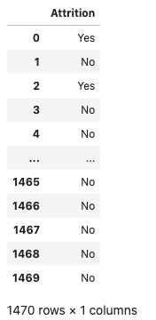

Feature Type Selection
**********************

Pandas provide methods to select the columns that you want by using their column names or positions. However, a common task that data scientists perform is to select columns that have specific attributes. This is often done by manually examining the column names and making a list of them. Or by having attributes encoded to the column name and then creating a search pattern to return a list.

None of these methods are efficient or robust. The feature type system in ADS allows you to define feature types on the features. Since you have feature types assigned to a set of features, the feature type selection allows you to create a new dataframe with only the columns that have, or don't have, specific feature types associated with them.

You can select a subset of columns based on the feature types using the ``.feature_select()`` method. The ``include`` parameter defaults to ``None``.  It takes a list of feature types (feature type object or feature type name) to include in the returned dataframe. The ``exclude`` parameter defaults to ``None``. It takes a list of feature types to exclude from the returned dataframe. You can't set both ``include`` and ``exclude`` to ``None``. A feature type can't be included or excluded at the same time.

.. code-block:: python3

    attrition_path = os.path.join('/opt', 'notebooks', 'ads-examples', 'oracle_data', 'orcl_attrition.csv')
    df = pd.read_csv(attrition_path, 
                     usecols=['Attrition', 'TravelForWork', 'JobFunction', 'EducationalLevel'])
    df.ads.feature_type = {'Attrition': ['boolean'],
                           'TravelForWork': ['category'],
                           'JobFunction': ['category'],
                           'EducationalLevel': ['category']}

Next, create a dataframe that only has columns that have a Boolean feature type:

.. code-block:: python3

    df.ads.feature_select(include=['boolean'])

You can create a dataframe that excludes columns that have a Boolean feature type:

.. code-block:: python3

    df.ads.feature_select(exclude=['boolean'])

.. image:: figures/ads_feature_type_10.png

