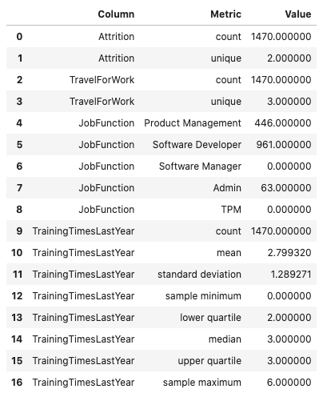
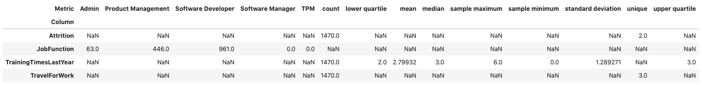
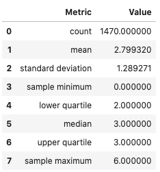
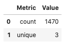
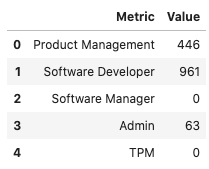

Feature Statistics
******************

Computing summary statistics is one of the most common tasks that data scientists do during an exploratory data analysis (EDA). The goal of the ``.feature_stat()`` method is to produce relevant summary statistics for the feature set. The feature type framework allows you to customize what statistics are used in a feature type. It also standardizes the way those statistics are returned. This empowers you to produce visualizations, and other tools that can use the standardized output.

Using
=====

The ``.feature_stat()`` is used to compute the feature statistics, and it is defined on a Pandas Series and dataframe. In both cases, the method returns a row-dominate dataframe where each row represents a single observation. In each case, there are columns that represent the metric that was computed and the value.  When it is called on a dataframe, there is one other column that represents the feature that the metric was computed for.

Dataframe
---------

The ``.feature_stat()`` method also works at the dataframe level. It produces a similar output to that of the series, except it has an additional column that lists the column name where the metric was computed.

.. code-block:: python3

    df.ads.feature_stat()

Reshape the Output
==================

The ``.feature_stat()`` method outputs its data in a row-dominate format to make it easy to work with. However, there are times when a column dominate format helps to better understand the data. This is often the case when the data all have similar summary statistics. You can convert from the row-dominate to the column-dominate format with the ``.pivot_table()`` method, which is part of Pandas. When there are missing values, an ``NaN`` is inserted.

.. code-block:: python3

    df.ads.feature_stat().pivot_table(index='Column', columns='Metric', values = 'Value')

Series
------

The ``.feature_stat()`` outputs a Pandas dataframe where each row represents a summary statistic. This is called the row-dominate format.  The statistics that are reported depending on the inheritance chain of the feature types. The feature type framework iterates from the primary feature type to the default feature type looking for a feature type that has the ``.feature_stat()`` method defined and then dispatches on that.

In the next example, the ``.feature_stat()`` for the integer feature type is run. This feature set returns the count of the observations, the mean value, the standard deviation, and Tukey’s Five Numbers (sample minimum, lower quartile, median, upper quartile, and sample maximum).

.. code-block:: python3

    df['TrainingTimesLastYear'].ads.feature_stat()

The summary statistics that you create depend on the feature type. For example, assume that there is a dataframe, ``df``, that has a column named ``JobFunction`` and the ``dtype`` is ``categorical``. Thus, its default feature type is also ``categorical``. A call to ``.feature_type_stat()`` produces a count of the number of observations, and the number of unique categories:

.. code-block:: python3

    df['JobFunction'].ads.feature_stat()

Custom
======

You can create custom summary statistics when working with a custom feature type. The previous example with the JobFunction statistics, they might not be an ideal summary for this feature. Instead, you might want to know the number of job functions in each category.  You can create a new feature type and it is associated ``.feature_stat()`` method.  In the next example, a new custom feature type called ``JobFunction`` is created.  It overrides the ``.feature_stat()`` method to produce a count of the  number of each job functions in the data. This feature type is then registered and the dataframe ``JobFunction`` column is updated so that it now inherits from the ``JobFunction`` feature type. Then it prints the feature summary statistics for the ``JobFunction`` column.

To create a custom feature statistics, in the class that you are using to create the custom feature, override the ``feature_stat`` method.  This method must be static. It accepts a Pandas Series and returns a dataframe. The series is the values in the feature that you are computing the statistic for so you must know the ``dtype`` that will be passed in.

The resulting dataframe must have the columns ``Metric`` and ``Value``.  The ``Metric`` column is a string that defines the metric that is being computed. The ``Value`` column is a floating-point value of the metric that was computed.

If there are no metrics that are to be returned, then an empty dataframe with these columns must be returned. There is no limit to the number of metrics that can be returned.

.. code-block:: python3

    from ads.feature_engineering import feature_type_manager, FeatureType

    # Create the JobFunction feature type
    class JobFunction(FeatureType):
        @staticmethod
        def feature_stat(series: pd.Series) -> pd.DataFrame:
            result = dict()
            job_function = ['Product Management', 'Software Developer', 'Software Manager', 'Admin', 'TPM']
            for label in job_function:
                result[label] = len(series[series == label])
            return pd.DataFrame.from_dict(result, orient='index', columns=[series.name])
    
    # Register the JobFunction feature type and assign it to the dataframe    
    feature_type_manager.feature_type_register(JobFunction)
    df['JobFunction'].ads.feature_type = ['job_function', 'category']
    df['JobFunction'].ads.feature_stat()

