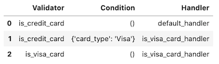
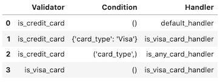
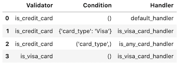
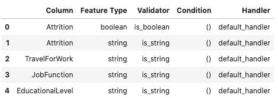
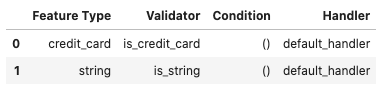
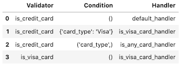
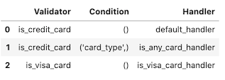
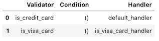
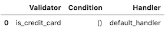

Feature Type Validator
**********************

Overview
========

One aspect of an exploratory data analysis (EDA) is to ensure that all the data is valid. For example, you may have credit card data and want to ensure that all the numbers are valid credit card numbers. The feature type validators are a way of performing this validation. There are built-in methods for the feature types that are provided by ADS, but the idea is for you to create these methods for your custom feature types.

Feature type validators are defined at the feature type level. You define functions that are applied to the features.

The feature type validators are a set of ``.is_*()`` methods, where ``*`` is generally the name of the feature type. For example, the method ``.is_credit_card()`` could be called to ensure that the data are all credit card numbers. The feature type validators return a Boolean Pandas Series, which is the length of the original data. If the element meets the criteria specified in the feature type validator, it indicates ``True``.  Otherwise, it is ``False``. The ``.is_*()`` method is called the *validator*.

The feature type validator system is extensible. You can have multiple validators for any feature type. To continue with the credit card example, your main validator may be ``.is_credit_card()``. However, other validators like ``.is_visa()`` and ``.is_mastercard()`` could be added that determine if the credit card numbers are associated with Visa or Mastercard accounts.

You can extend the feature type validator by using conditions. Conditions allow you to have different sets of feature type validators based on a set of arguments that you define called *conditions*. For example, if you wanted to and see if a credit card is a Visa card you could create a condition like ``.is_credit_card(card_type='Visa')``. Then you register a feature handler with that condition, and it runs when you pass in that condition.

Open and closed are the two types of conditions. A closed condition requires that parameter and value match for the handler to be dispatched.  An open condition only checks the parameter and not the value and will dispatch the handler based on that.

Create
======

The power of the feature type system is that you can quickly create new feature type validators to validate your data. This is a two-step process:

1. Define a function that acts as the feature type validator.
2. Register the feature type validator.

A feature type validator is a function that respects these rules:

*  It takes a Pandas Series as the first argument.
*  The ``*args`` and ``**kwargs`` are supported.
*  It returns a Boolean series that is the same length as the input series.

To register your own handler, you need to define the handler, and then register it to the feature type. If the handler already exists, you don't need to create a new one.

In the next example, a new feature type validator, ``.is_visa_card_handler()``, is created. It checks to see if the credit card number is issued by Visa by testing each element in the ``data`` parameter. It returns a Boolean series the same length as ``data``.

.. code-block:: python3

    def is_visa_card_handler(data: pd.Series, *args, **kwargs) -> pd.Series:
        """
        Processes data and indicates if the data matches Visa credit card.
    
        Parameters
        ----------
        data: pd.Series
            The data to process.
    
        Returns
        --------
        pd.Series: The logical list indicating if the data matches requirements.
        """
        _pattern_string = r"""
            ^(?:4[0-9]{12}(?:[0-9]{3})?         # Visa
            |  ^4[0-9]{12}(?:[0-9]{6})?$        # Visa 19 digit
            )$
        """
        PATTERN = re.compile(_pattern_string, re.VERBOSE)
        def _is_credit_card(x: pd.Series):
            return (
                not pd.isnull(x)
                and PATTERN.match(str(x)) is not None
            )
        return data.apply(lambda x: True if _is_credit_card(x) else False)

Conditions
==========

A condition feature type validator allows you to specify arbitrary parameters that are passed to the feature type system. The system examines these parameters and determines which handler is dispatched. 

Use the ``.validator.register()`` method to register a condition handler.  The ``condition`` parameter is used to specify the conditions that must be met to invoke the handler. Conditions are user-defined parameters and values that help identify what condition that the handler is dispatched on. 

The three types of condition handlers are open, closed ,and default. A closed condition handler must match both the condition parameter name and value to dispatch the handler. An open handler only matches the parameter name. For example, a closed condition handler could be ``fruit='peach'``.  Where an open condition handler would be dispatched without examination of the value of ``fruit``. The default condition handler must always exist. There is one provided by the base class and you can also define a default condition handler by not providing a ``condition`` parameter when registering a feature type validation handler.

Closed Value
------------

Closed value condition feature types allow you to specify any number of key-value pairs to a condition handler, and control which validator is dispatched. However, when calling the handler all of the key-value pairs must match.

The ``condition`` parameter of the ``.validator.register()`` method explicitly defines key-value pairs that are used to determine which handler to dispatch. In a previous example, the ``is_visa_card`` validator was created to determine if the credit cards were issued by Visa.  You could create the same effect by using a condition feature type validator on the ``is_credit_card`` feature type handle using explicit key-value pairs. To do this, the ``condition`` parameter accepts a dictionary of key-value pairs where the key is the parameter name and the dictionary value is the parameter value. For example, ``CreditCard.validator.register(name='is_credit_card', condition={"card_type": "Visa"}, handler=is_visa_card_handler)`` links the parameter ``card_type`` to the value ``Visa``. If ``card_type`` has any other value, it won't dispatch the handler.

In the next example, the credit card feature type has a condition handler registered. It uses the same feature type validator, ``is_visa_card_handler``, that was used to create the ``is_visa_card`` default feature type validator.

.. code-block:: python3

    CreditCard = feature_type_manager.feature_type_object('credit_card')
    CreditCard.validator.register(name='is_credit_card', condition={"card_type": "Visa"}, 
                                  handler=is_visa_card_handler)
    CreditCard.validator.registered()

The next example creates a series of credit card numbers, and uses the ``card_type="Visa"`` parameter when calling the ``is_credit_card`` validator. Notice that only the first two elements are flagged as being issued by Visa. If the default handler was called, all the returned values would be ``True`` because they are all valid credit card numbers.

.. code-block:: python3

    visa = ["4532640527811543", "4556929308150929"]
    mastercard = ["5406644374892259", "5440870983256218"]
    amex = ["371025944923273", "374745112042294"]
    series = pd.Series(visa + mastercard + amex, name='Credit Card')
    series.ads.feature_type = ['credit_card']
    series.ads.validator.is_credit_card(card_type="Visa")

.. parsed-literal::

    0     True
    1     True
    2    False
    3    False
    4    False
    5    False
    Name: Credit Card, dtype: bool

The same effect handler can be dispatched using a feature type object.  The following two validator commands are equivalent.

.. code-block:: python3

    CreditCard = feature_type_manager.feature_type_object('credit_card')
    series.ads.validator.is_credit_card(card_type="Visa")
    CreditCard.validator.is_credit_card(series, card_type="Visa")

With closed value condition feature type validators, the key and values must match what was registered. If they don't, the condition feature type validator isn't called. In the next example, the value is set to ``Mastercard`` to cause the default handler to be called:

.. code-block:: python3

    series.ads.validator.is_credit_card(card_type="Mastercard")

.. parsed-literal::

    0    True
    1    True
    2    True
    3    True
    4    True
    5    True
    Name: Credit Card, dtype: bool

To register a closed value feature type validator that has multiple conditions, you use a dictionary with multiple key-value pairs. For example, to create a condition that checks that the country code is 1 and area code is 902, you could do the following:

.. code-block:: python3

   PhoneNumber.validator.register(name='is_phone_number', 
                                  condition={"country_code": "1", "area_code": "902"},
                                  handler=is_1_902_handler)

Default
-------

Each feature type has a default handler that is called when no other handler can process a request. The process of creating a default handler is the same as any other type of handler. A feature type validator function is created. This handler is then registered with ADS using the feature type object that it is to be applied to along with a reference to a handle. Unlike the open and closed condition handlers, the ``condition`` parameter is excluded.

The next example obtains the feature type object, ``CreditCard``, and then registers the default feature type validator. If one exists with the same name, it's replaced. 

.. code-block:: python3

    CreditCard = feature_type_manager.feature_type_object('credit_card')
    CreditCard.validator.register(name='is_visa_card', handler=is_visa_card_handler)
    CreditCard.validator.registered()

.. image:: figures/ads_feature_type_validator_5.png

Open Value
----------

Open value condition feature type validators are similar to their closed value counterparts except the value isn't used in the matching process.

To register an open value condition feature type validator, the same process is used as for the closed value condition feature type validator with the exception that a tuple is used to specify the conditions and no values are provided. For example, ``CreditCard.validator.register(name='is_credit_card', condition=("card_type",), handler=is_any_card_handler)``.

This example defines a feature type condition handler that accepts the card type as a parameter name:

.. code-block:: python3

    def is_any_card_handler(data: pd.Series, card_type: str) -> pd.Series:
        """
        Processes data and indicates if the data matches any credit card
    
        Parameters
        ----------
        data: pd.Series
            The data to process.
    
        Returns
        --------
        pd.Series: The logical list indicating if the data matches requirements.
        """
        
        if card_type == 'Visa':
            _pattern_string = r"""
                ^(?:4[0-9]{12}(?:[0-9]{3})?         # Visa
                |  ^4[0-9]{12}(?:[0-9]{6})?$        # Visa 19 digit
                )$
            """    
        elif card_type == 'Mastercard':
            _pattern_string = r"""
                ^5[1-5][0-9]{14}|^(222[1-9]|22[3-9]\\d|2[3-6]\\d{2}|27[0-1]\\d|2720)[0-9]{12}$
            """
            
        elif card_type == "Amex":
            _pattern_string = r"""
                ^3[47][0-9]{13}$
            """
        else:
            raise ValueError()
            
        PATTERN = re.compile(_pattern_string, re.VERBOSE)
        def _is_credit_card(x: pd.Series):
            return (
                not pd.isnull(x)
                and PATTERN.match(str(x)) is not None
            )
        return data.apply(lambda x: _is_credit_card(x))

The next example registers the open value feature type validator using a tuple. Notice that values for the ``card_type`` parameter aren’t specified. However, the ``is_any_card_handler`` function has a formal argument for it. The value of the parameter is passed into the handler.  Also, notice the trailing comma to make the parameter in ``condition`` a tuple. This forces Python to make ``('card_type',)`` a tuple. The output of the example is the currently registered feature type validators.

.. code-block:: python3

    CreditCard = feature_type_manager.feature_type_object('credit_card')
    CreditCard.validator.register(name='is_credit_card', condition=("card_type",), handler=is_any_card_handler)
    CreditCard.validator.registered()

To determine which credit card numbers in the ``series`` variable are issued by Mastercard, pass the parameter ``card_type="Mastercard"`` into the ``.is_credit_card()`` feature type validator. The feature type system examines the parameters, and then dispatches ``is_any_card_handler``. ``is_any_card_handler`` accepts the ``card_type`` parameter, and has logic to detect which numbers are Mastercard.

.. code-block:: python3

    visa = ["4532640527811543", "4556929308150929"]
    mastercard = ["5406644374892259", "5440870983256218"]
    amex = ["371025944923273", "374745112042294"]
    series = pd.Series(visa + mastercard + amex, name='Credit Card')
    series.ads.feature_type = ['credit_card']
    series.ads.validator.is_credit_card(card_type="Mastercard")

.. parsed-literal::

    0    False
    1    False
    2     True
    3     True
    4    False
    5    False
    Name: Credit Card, dtype: bool

You can use this approach by using the feature type object, ``CreditCard``. In this example, the values in the variable ``series`` are checked to see if they match American Express credit card numbers:

.. code-block:: python3

    CreditCard.validator.is_credit_card(series, card_type="Amex")

.. parsed-literal::

    0    False
    1    False
    2    False
    3    False
    4     True
    5     True
    Name: Credit Card, dtype: bool

To register an open value feature type validator that has multiple conditions, you would use a tuple with multiple values. For example, if you wanted to create a condition that would check the country and area codes of a phone number, you could use the following:

.. code-block:: python3

   PhoneNumber.validator.register(name='is_phone_number', 
                                  condition=(("country_code", "area_code")),
                                  handler=is_county_area_handler)

You can't mix open and closed condition feature type validators.

Disambiguation
--------------

A closed condition feature type was created for ``'card_type'='Visa'``. There is also an open condition feature type that was created to handle all conditions that specify the ``card_type`` parameter. There appears to be a conflict in that both conditions support the case of ``'card_type'='Visa'``. In fact, there is no conflict. The feature type system determines the most restrictive case and dispatches it so the ``is_visa_card_handler`` handler is called.

.. code-block:: python3

    CreditCard.validator.registered()

The next example causes the ``is_visa_card_handler`` to be dispatched because it has the most restrictive set of requirements that match the
parameters given:

.. code-block:: python3

    series.ads.validator.is_credit_card(card_type="Visa")

.. parsed-literal::

    0     True
    1     True
    2    False
    3    False
    4    False
    5    False
    Name: Credit Card, dtype: bool

List
====

There are a number of ways to list the available validators,and their associated conditions and handlers. The feature type object is used to list the validators that are associated with a single feature type. Listing the feature types on a Pandas Series includes all the validators in the inheritance chain for the feature. When listing the validators on a dataframe it includes all the validators used on all the features in the dataframe. Finally, the feature type manager lists all the validators that have been registered with ADS.

Dataframe
---------

The ``.validator_registered()`` method can be used on a dataframe to obtain information on the feature type validators that are associated with the features of the dataframe. The returned information has the validators for all features. A feature can have multiple feature types in its inheritance chain. This method reports on all feature types in this chain. Only features that have validators associated with it are in the returned dataframe.

The next example loads a sample dataset into a Pandas dataframe, and the feature types are assigned to these columns. The ``.ads.validator_registered()`` is called on the dataframe. The following columns are returned:

* ``Column``: The name of the column that the validator is associated with.
* ``Condition``: Condition that the handler is registered in. 
* ``Feature Type``: Feature type class name. 
* ``Handler``: Registered handler.
* ``Validator``: Validation functions that are called validate a Pandas Series. 

.. code-block:: python3

    attrition_path = os.path.join('/opt', 'notebooks', 'ads-examples', 'oracle_data', 'orcl_attrition.csv')
    df = pd.read_csv(attrition_path, 
                     usecols=['Attrition', 'TravelForWork', 'JobFunction', 'EducationalLevel'])
    df.ads.feature_type = {'Attrition': ['boolean', 'category'],
                             'TravelForWork': ['category'],
                             'JobFunction': ['category'],
                             'EducationalLevel': ['category']}
    
    df.ads.validator_registered()

Feature Type Manager
--------------------

To list all currently registered validator handlers and their conditions in ADS, use the ``feature_type_manager.validator_registered()`` method.  It returns the registered validators in a dataframe format. The columns in the dataframe are: 

* ``Condition``: Condition that the handler is registered in. 
* ``Feature Type``: Feature type class name. 
* ``Handler``: Registered handler.
* ``Validator``: Validation functions that are can call to validate a Pandas Series. 

.. code-block:: python3

    feature_type_manager.validator_registered()

.. image:: figures/ads_feature_type_validator_1.png

Feature Type Object
-------------------

Each feature type object also has a ``.validator.registered()`` method that returns a dataframe with the validators, conditions, and feature type validators that are associated with the given feature type.

The next example uses the feature type manager to obtain a feature type object for a credit card feature type. It then obtains a list of validators, conditions, and handlers that are associated with the feature type.  The results are returned in a dataframe.

.. code-block:: python3

    CreditCard = feature_type_manager.feature_type_object('credit_card')
    CreditCard.validator.registered()

.. image:: figures/ads_feature_type_validator_2.png

Series
------

The ``.validator_registered()`` method can be used on a Pandas Series by calling ``.ads.validator_registered()``. A series can have multiple feature types associated with it. Listing the feature type validators on a series results in all the validators associated with all the feature types in the inheritance chain being returned.

The next example creates a series that contains credit card numbers.  The series has its feature type set to ``credit_card``. The call to ``series.ads.validator_registered()`` reports multiple handlers because the series has multiple feature types associated with it (credit card
and string).

.. code-block:: python3

    series = pd.Series(["4532640527811543", "4556929308150929", "4539944650919740"], name='creditcard')
    series.ads.feature_type = ['credit_card']
    series.ads.validator_registered()

Use
===

The goal of the feature type validator is to validate the data against a set of criteria. You do this using the feature type object itself or on a Pandas Series.

A feature type validator returns a Pandas Series that has the same length as the input series. This allows you to determine which specific elements are valid or not. To create a summary of the results, use the ``.any()`` and ``.all()`` methods, and the results of the validator.

Feature Type Object
-------------------

You can use a feature type object to invoke the feature type validator on any Pandas Series. This series doesn't have to have a feature type associated with it.

The next example creates a Pandas Series. It then uses the feature type manager to obtain a feature type object to the credit card feature type.  This object is used to call the feature type validator by passing in the Pandas Series that is to be assessed. In this example, the series is not assigned the feature type ``credit_card``.

.. code-block:: python3
    
    visa = ["4532640527811543", "4556929308150929", "4539944650919740", "4485348152450846", "4556593717607190"]
    invalid = [np.nan, None, "", "123", "abc"]
    series = pd.Series(visa + invalid)
    CreditCard = feature_type_manager.feature_type_object('credit_card')
    CreditCard.validator.is_credit_card(series)

.. parsed-literal::

    0     True
    1     True
    2     True
    3     True
    4     True
    5    False
    6    False
    7    False
    8    False
    9    False
    Name: creditcard, dtype: bool

Series
------

For a Pandas Series, the feature type validator is invoked by using the name of the validator and any condition arguments that may be required.  To do this, the series object calls ``.ads.validator`` followed by a call to the validator name. For example, ``series.ads.validator.is_credit_card(starts_with='4')``, where ``.is_credit_card()`` is the validator name and ``starts_with='4'`` is the condition.

The next example creates a Pandas Series that contains a set of valid credit card numbers along with a set of invalid numbers. This series has its feature type set to ``credit_card`` and invokes the ``.is_credit_card()`` feature type validator.

.. code-block:: python3

    visa = ["4532640527811543", "4556929308150929", "4539944650919740", "4485348152450846", "4556593717607190"]
    invalid = [np.nan, None, "", "123", "abc"]
    
    series = pd.Series(visa + invalid, name='creditcard')
    series.ads.feature_type = ['credit_card']
    series.ads.validator.is_credit_card()

.. parsed-literal::

    0     True
    1     True
    2     True
    3     True
    4     True
    5    False
    6    False
    7    False
    8    False
    9    False
    Name: creditcard, dtype: bool

A series can have multiple feature types handlers associated with it. In this example, ``.is_string()`` could have also been called. 

Registration
============

Feature type validators are registered with a feature type using the ``.validator.register()`` method on a feature type object. Registration requires that a non-unique name be given for the validator, along with a reference to the feature type handler. You can apply optional conditions.

To unregister a feature type validator, use the ``.validator.unregister()`` method on a feature type object. The method requires the name of the validator. The names of the validators don't have to be unique. The optional ``condition`` parameter is used to identify which validator is to be removed. If the ``condition`` parameter is used, it must match one of the open or closed conditions. If the ``condition`` parameter is not specified then the default validator is removed.

Register
--------

The feature type validator needs to be registered with the feature type. You do that using the ``.validator.register()`` method, which is part of the feature type object. The feature type manager is used to obtain a link to the feature type object.

The ``.validator.register()`` method has the following parameters: 

* ``condition``: What conditions are to be applied to when the handler is called. If the parameter is not given, then a default feature type handler is created. If the parameter dictionary is then a closed feature type is created.  If the parameter is tuple an open feature type is created.
* ``handler``: The function name of the default feature type validator. 
* ``name``: The validator name that is used to invoke the feature type validator. 
* ``replace``: The flag indicating if the registered handler should be replaced with the new one.

The next example obtains the feature type object, ``CreditCard``, and then it registers the default feature type validator. If one exists with the same name, it is replaced. A call to ``CreditCard.validator_registered()`` returns the registered handlers for the credit card feature type.

.. code-block:: python3

    CreditCard = feature_type_manager.feature_type_object('credit_card')
    CreditCard.validator.register(name='is_visa_card', handler=is_visa_card_handler, replace = True)
    CreditCard.validator.registered()

.. image:: figures/ads_feature_type_validator_5.png

Unregister
----------

Use the ``.validator.unregister()`` method to remove a feature type validator.  Condition feature type validators are removed by using the validator as an accessor. The parameters to ``.unregister()`` are a dictionary for closed condition feature type validators, and they must match the dictionary that was used to register the handler. With open condition feature type validators, a tuple is passed to ``.validator.unregister()``. Again, the tuple must match the tuple that was used to register the handler.

To remove a default feature type validator, use the feature type object along with the ``.validator.unregister()`` method. The parameter is the name of the validator. Removing the default feature type validator also removes any condition feature type validators that are associated with it.

The next example lists the current feature type validators:

.. code-block:: python3

    CreditCard = feature_type_manager.feature_type_object('credit_card')
    CreditCard.validator.registered()

Remove the closed condition for the case where ``'card_type'='Visa'`` on the ``is_credit_card`` validator as in the next example. Note that the handler is removed.

.. code-block:: python3

    CreditCard.validator.unregister(name="is_credit_card", condition = {"card_type": "Visa"})
    CreditCard.validator.registered()

Remove the open condition for ``card_type`` on the validator ``is_credit_card`` as in the next example. Note that the handler is removed.

.. code-block:: python3

    CreditCard.validator.unregister(name="is_credit_card", condition=("card_type",))
    CreditCard.validator.registered()

Remove the default feature type validator for ``is_visa_card`` as in the next example. Note that the handler is removed.

.. code-block:: python3

    CreditCard.validator.unregister(name='is_visa_card')
    CreditCard.validator.registered()

