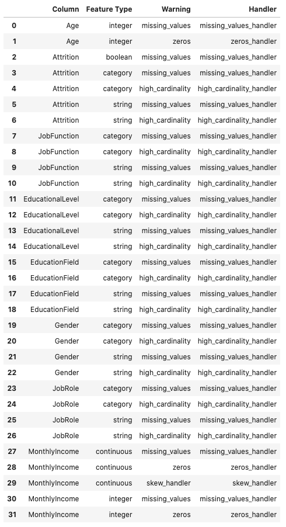
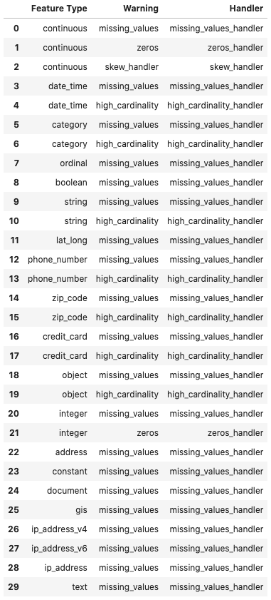
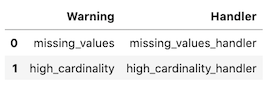
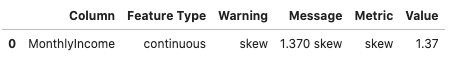
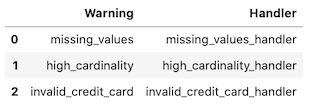
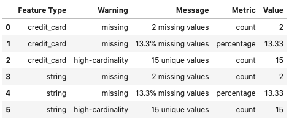
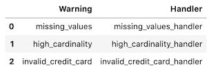

Feature Type Warnings
*********************

Overview
========

Part of the exploratory data analysis (EDA) is to check the state or condition of your data. For example, you may want to ensure that there are no missing values. With categorical data, you often want to confirm that the cardinality is low enough for the type of modeling that you are doing.  Since the feature type system is meant to understand the nature of your data, it is an ideal mechanism to help automate the evaluation of the data.

Feature type warnings ensure that the data meets quality standards.  Historically, this was a manual process where a data scientist would interactively code checks on the data, and then this code would be in a form that would not be reusable for other analyses. The data validation could have to be reproduced and often it wasn't exactly the same leading to differences in reliability on integrity.

The feature type warning infrastructure allows you to code checks on the data, and then repeat the process each time a new dataset is used.  Since the code is at the feature type level, you can reuse the feature type warnings across an entire organization’s data. This allows tests to be complete, thorough, and consistent.

The feature type warning system works across an entire feature. For example, you can check for the number of missing values, and set a threshold on what is the permitted upper limit. This can be a count, percentage, or some other metric. You can also create mechanisms where you check to ensure that the data has the distribution that is assumed by the model class that you want to use. For example, linear regression assumes that the data is normally distributed. So, the feature type warning might have a Shapiro-Wilk test, and a threshold for what is an expected value.

Each feature can have as many feature type warnings as you want. Also, the multiple inheritance nature of the feature type system allows you to write only the feature type warnings that are relevant for that specific feature type because the warnings for all feature types in the inheritance chain are checked. This reduces code duplication, and speeds up your EDA.

For example, assume that you wish to validate a set of data that represents the wholesale price of a car. You have the following inheritance chain, ``wholesale_price``, ``car_price``, ``USD``, and the default feature type ``continuous``. The ``wholesale_price`` might have a method that ensures that the value is a positive number because you can’t purchase a car with negative money. The ``car_price`` feature type might have a check to ensure that it is within a reasonable price range. The ``USD`` feature can check the value to make sure that it represents a valid US dollar amount, and that it isn’t below one cent.  This evaluation is done by registering feature type warnings handlers with ADS.

Feature type warnings are defined at the feature type level with the use of feature type warning handlers. These are functions that accept a Pandas Series and returns a Pandas dataframe in a specified format.  A feature type warning handler can return any number of warnings and the dataframes across all the feature type warning handlers are concatenated together to produce the final dataframe that is returned.

You can create feature type warning handlers and register them dynamically at run time.

Create
======

There are two steps to creating a feature type warning. The first is to write a function that accepts a Pandas Series and returns a carefully crafted dataframe. If there are no warnings, then the dataframe can be empty or the handler can return ``None``. The dataframe must have the following columns:

* ``Message``: A human-readable message about the warning.
* ``Metric``: A string that describes what is being measured.
* ``Value``: A real number value associated with the metric.
* ``Warning``: A string that describes the type of warning.

The next example creates the feature type warning handler, ``invalid_credit_card_handler``. It assumes that there is a registered feature type class called ``CreditCard``, and it has a feature type validator, ``.is_credit_card()``. A feature type validator accepts a series and returns a logical list of the same length as the Series. In this case, ``.is_credit_card()`` determines if a credit card number is valid or not. Then ``invalid_credit_card_handler`` computes the number of invalid cards. 

If there are any invalid create cards, it return sa dataframe with this information. If all of the credit cards are valid, it returns ``None``.

If there are any invalid cards, then it creates a row in a dataframe with the relevant information. If not, it returns ``None``.  When ``None`` or an empty dataframe is returned, then ADS won't include the results in the dataframe that summaries the warnings for an entire Series.

.. code-block:: python3

    def invalid_credit_card_handler(x: pd.Series):
        value = len(x) - CreditCard.validator.is_credit_card(x).sum()
        if value > 0:
            df = pd.DataFrame(columns=['Warning', 'Message', 'Metric', 'Value'])
            df.Value = [value]
            df.Warning = ['invalid credit card count']
            df.Message = [f'{df.Value.values[0]} invalid credit cards']
            df.Metric = ['count']
            return df
        else:
            return None

It's important when creating the values for the ``Message`` column that they provide sufficient information to data scientist so they can understand why the warning is being created. It's generally helpful to provide information on the possible causes.  When possible, provide details on a solution or information about where to look to determine the solution. 

Generally, a feature type warning performs only a single test and returns a single row. This is to make managing your code easier and reduces the complexity of testing. However, there might be times when you want to return several warnings from the same feature type warning handler. To do this, append more rows to the dataframe that is returned.  There is no limit to the number of warnings that can be returned.

List
====

There are several methods to list the registered feature type warnings.  The feature type object is used to list the warnings that are associated with a single feature type. Listing the feature types on a Pandas Series includes all the warnings in the inheritance chain. When listing the warnings on a dataframe it will include all the warnings used on all the features in the dataframe. Finally, the feature type manager lists all the warnings that have been registered with ADS.

Dataframe
---------

You can use the ``warning_registered()`` method on a dataframe to obtain a list of warnings, and their handlers that are associated with the features in the dataframe. Each feature can have multiple feature types in the inheritance chain, and each feature type can have multiple feature type warnings associated with it.

When calling ``warning_registered()`` on a dataframe, a Pandas dataframe with the following columns is returned:

* ``Column``: The name of the column that the warning is associated with.
* ``Feature Type``: Feature type class name.
* ``Handler``: Registered handler.
* ``Warning``: The name of the warning.

In the next example, the ``orcl_attrition`` dataset is loaded, and the feature types are assigned to each column. Lastly, the ``warning_registered()`` method is called to produce a list of feature type warnings that are associated with the features in the dataframe.

.. code-block:: python3

    attrition_path = os.path.join('/opt', 'notebooks', 'ads-examples', 
                                  'oracle_data', 'orcl_attrition.csv')
    df = pd.read_csv(attrition_path, 
                     usecols=['Age', 'Attrition', 'JobFunction', 'EducationalLevel', 
                              'EducationField', 'Gender', 'JobRole','MonthlyIncome'])
    df.ads.feature_type = {
        'Age': ['integer'],
        'Attrition': ['category'],
        'JobFunction': ['string'],
        'EducationalLevel': ['string'],
        'EducationField': ['string'],
        'Gender': ['string'],
        'JobRole': ['string'],
        'MonthlyIncome': ['integer']}
    df.ads.warning_registered()

Feature Type Manager
--------------------

Use the feature type manager to list all the currently registered feature types warning in ADS. The ``feature_type_manager.warning_registered()`` method is used for this purpose.  It returns a Pandas dataframe.

The ``feature_type_manager.warning_registered()`` method shows a dataframe of registered warnings of each registered feature type. The three columns of the returned dataframes are:

* ``Feature Type``: Feature Type class name.
* ``Handler``: Registered warning handler for that feature type.
* ``Warning``: The name of the warning.

.. code-block:: python3

    from ads.feature_engineering import feature_type_manager, Tag
    feature_type_manager.warning_registered()

Feature Type Object
-------------------

To obtain a list of feature type warnings that are associated with a feature type, use the feature type object for a given feature type.  You can obtain a handle to a feature type object using the feature type name along with a call to ``feature_type_manager.feature_type_object()``.

The next example assumes that a custom feature type was created with the feature type name ``'credit_card``. The code obtains a handle to the feature type object, and gets a dataframe of warnings associated with this custom feature type.  Notice that there is no inheritance chain associated with a custom feature type object. The inheritance chain is associated with a feature itself. The returned dataframe only has warnings that have been registered for a given custom feature type.

.. code-block:: python3

    CreditCard = feature_type_manager.feature_type_object('credit_card')
    CreditCard.warning.registered()

The preceding example returns a dataframe with the following columns:

* ``Handler``: Registered warning handler for that feature type.
* ``Name``: The name of the warning.

Series
------

A feature can have multiple feature types associated with it through the multiple inheritance property of a feature. Therefore, calling the ``.warning.registered()`` method on a feature results in a dataframe that lists all of the warnings associated with each feature type that is in the inheritance chain.

The dataframe has the following columns:

* ``Feature Type``: Feature type class name.
* ``Handler``: Registered warning handler for that feature type.
* ``Warning``: The name of the warning.

The following example creates a Pandas Series of credit card data. It assumes there is a custom feature type with the feature type name ``credit_card``, and that several warnings have been registered for that feature type. The code then assigns the custom feature type ``credit_card``, and the default feature type ``string`` to the feature. The inheritance chain is ``credit_card`` and ``string``. 

.. code-block:: python3

    series = pd.Series(["4532640527811543", "4556929308150929", "4539944650919740"])
    series.ads.feature_type = ['credit_card', 'string']
    series.ads.warning_registered()
 

Use
===

The ``.warning()`` method runs all the data quality tests on a feature.  It creates a dataframe where each row is the result of a test that generated warnings. The columns in the dataframe vary depending on what type of object (dataframe, feature type object, or series) is being used.  The dataframe always contains the warning type, is a human-readable message that explains the warning,  the metric that generated the warning, and the value of this metric.

Dataframe
---------

The ``.warning()`` method on the dataframe shows all of the warnings for all of the columns in the dataframe. This is a quick way to determine if the data has conditions that require further investigation.

When ``.warning()`` is called on a dataframe, it returns a dataframe with the following columns.

- ``Column``: The column name of the source dataframe that is associated with the warning.
- ``Feature Type``: The feature type name that generated the warning.
- ``Message``: A human-readable message about the warning.
- ``Metric``: A string that describes what is being measured.
- ``Value``: The value associated with the metric.
- ``Warning``: A string that describes the type of warning.

The next example reads in the ``orcl_attrition`` attrition data, and sets the feature types for each column. The call to ``df.ads.warning()`` causes ADS to run all feature type handlers in each feature. The feature type handers that run depend on the inheritance chain as each feature can have multiple feature types associated with it. Each feature type can have multiple feature type warning handlers. Lastly, it returns a dataframe that lists the warnings.

.. code-block:: python3

    attrition_path = os.path.join('/opt', 'notebooks', 'ads-examples', 
                                  'oracle_data', 'orcl_attrition.csv')
    df = pd.read_csv(attrition_path, 
                     usecols=['Age', 'Attrition', 'JobFunction', 'EducationalLevel', 
                              'EducationField', 'Gender', 'JobRole','MonthlyIncome'])
    df.ads.feature_type = {
        'Age': ['integer'],
        'Attrition': ['category'],
        'JobFunction': ['string'],
        'EducationalLevel': ['string'],
        'EducationField': ['string'],
        'Gender': ['string'],
        'JobRole': ['string'],
        'MonthlyIncome': ['integer']}
    df.ads.warning()

The ``MonthlyIncome`` output generated a warning. Features that don't generate any warnings won't have rows in the returned dataframe.

Feature Type Object
-------------------

Each feature type object also has a ``.warning()`` method that returns a dataframe with the following columns:

* ``Message``: A human-readable message about the warning.
* ``Metric``: A string that describes what is being measured.
* ``Value``: The value associated with the metric.
* ``Warning``: A string that describes the type of warning.

Since there is no data associated with a feature type object, you must pass in a Pandas Series. This series doesn't have to have a feature type associated with it. If it does, they don't have to include the feature type that is represented by the feature type object. So the feature type object treats the data as if it had the same feature type as what it represents.

The next example uses the feature type manager to obtain a feature type object where the feature type name is ``credit_card``. It creates
a Pandas Series, and then generates the warnings.

.. code-block:: python3

    visa = ["4532640527811543", "4556929308150929", "4539944650919740", 
            "4485348152450846", "4556593717607190"]
    amex = ["371025944923273", "374745112042294", "340984902710890", 
            "375767928645325", "370720852891659"]
    invalid = [np.nan, None, "", "123", "abc"]
    series = pd.Series(visa + amex + invalid, name='creditcard')
    CreditCard = feature_type_manager.feature_type_object('credit_card')
    CreditCard.warning(series)

Series
------

Feature type warnings can be generated by using a Pandas Series and calling ``.warning()``. It returns the four columns that were previously described (``Warning``, ``Message``, ``Metric``, and ``Value``) plus the column ``Feature Type``, which is the name of the feature type that generated the warning. 
Since each feature can have multiple feature types, it’s possible to generate different feature types warnings.

In the next example, a set of credit card values are used as the dataset.  The feature type is set to ``credit_card``, and the class that is associated with it has had some warnings registered. The ``series.ads.warning()`` command generates a dataframe with the warnings.

.. code-block:: python3

    visa = ["4532640527811543", "4556929308150929", "4539944650919740", 
            "4485348152450846", "4556593717607190"]
    amex = ["371025944923273", "374745112042294", "340984902710890", 
            "375767928645325", "370720852891659"]
    invalid = [np.nan, None, "", "123", "abc"]
    series = pd.Series(visa + amex + invalid, name='creditcard')
    series.ads.feature_type = ['credit_card']
    series.ads.warning()

There are several things to notice about the generated dataframe. While the feature type was set to ``credit_card``, the dataframe also lists ``string`` in the feature type column. This is because the default feature type is ``string`` so the feature type warning system also ran the tests for the ``string`` feature type.

The tuple (``credit_card``, ``missing``) reports two warnings. This is because each warning handler can perform multiple tests, and report as many warnings as required. You can see this behavior for the (``string``, ``missing``) tuple.

In the preceding example, a Pandas Series was directly used. The more common approach is to generate warnings by accessing a column in a Pandas dataframe.  For example, ``df['MyColumn'].ads.warning()``.

Registration
============

There are two steps to creating a feature type warning. The first is to write a function that accepts a Pandas Series, and returns a carefully crafted dataframe. Once you have the feature type warning handler, the handler must be registered with ADS.

The output from the ``.warning()`` method can vary depending on the class of object that it is being called on (dataframe, feature type object, or series). However, there is only one handler for all these methods so the handler only has to be registered once to work with all variants of ``.warning()``. The architecture of ADS takes care of the differences in the output.

To unregister a feature type warning handler, the use the feature type object along with the feature type name. The ``.warning.unregister()``
performs the unregistration process.

Register
--------

Once a feature type warning handler has been created, you have to register it with ADS. Register the handler with one or more feature type objects.  This allows you to create a handler, and then reuse that handler with any appropriate feature type. For example, you could create a handler that warns when data has missing values. Assume that you have a number of feature types that should never have missing values. This single handler could be applied to each feature type.

The ``.warning.register()`` method on a feature type object is used to assign the handler to it. The ``name`` parameter is the human-readable name that is used to output warnings, and identifies the source of the warning. It's also used to identify the warning in operations like unregistering it. The ``handler`` parameter is the name of the feature type warning handler that you want to register. The optional ``replace`` parameter replaces a handler that exists and has the same ``name``.

The next example assumes that a custom feature type that has the feature type name, ``credit_card``, has been created. It also assumes that the feature type warning handler, ``invalid_credit_card_handler``, has been defined. It uses the ``feature_type_manager.feature_type_object()`` method to obtain the feature type object. Lastly, the ``.warning.register()`` is called on the feature type object to register the feature type warning
with ADS.

.. code-block:: python3

    CreditCard = feature_type_manager.feature_type_object('credit_card')
    CreditCard.warning.register(name='invalid_credit_card', 
                                handler=invalid_credit_card_handler, 
                                replace=True)

Using the ``.registered()`` method in the ``warning`` module, you can see that the ``invalid_credit_card`` handler has been registered:

.. code-block:: python3

    CreditCard.warning.registered()

Unregister
----------

You can remove a feature type warning from a feature type by calling the the ``.warning.unregister()`` method on the associated feature type object. The ``.unregister()`` method accepts the name of the feature type warning. 

The next example assumes that there is a feature type with a feature type name ``credit_card``, and a warning named ``high_cardinality``.  The code removes the ``high-cardinality`` warning, and the remaining feature type warnings are displayed:

.. code-block:: python3

    CreditCard = feature_type_manager.feature_type_object('credit_card')
    CreditCard.warning.unregister('high_cardinality')
    CreditCard.warning.registered()

.. image:: figures/ads_feature_type_warnings_6.png

