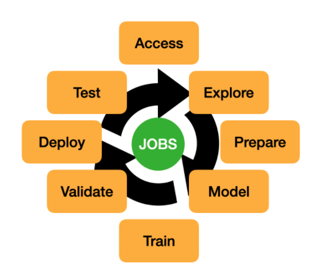

Overview
********

Data Science jobs allow you to run customized tasks outside of a notebook session. You can have Compute on demand and only pay for the Compute that you need. With jobs, you can run applications that perform tasks such as data preparation, model training, hyperparameter tuning, and batch inference. When the task is complete the compute automatically terminates. You can use the Logging service to capture output messages.

Using jobs, you can:

*  Run machine learning (ML) or data science tasks outside of your JupyterLab notebook session.
*  Operationalize discrete data science and machine learning tasks, such as reusable runnable operations.
*  Automate your MLOps or CI/CD pipeline.
*  Run batch or workloads triggered by events or actions.
*  Batch, mini batch, or distributed batch job inference.
*  In a JupyterLab notebook session, you can launch long running tasks or computation intensive tasks in a Data Science job to keep your notebook free for you to continue your work.

Typically, an ML and data science project is a series of steps including:

* Access
* Explore
* Prepare
* Model
* Train
* Validate
* Deploy
* Test

After the steps are completed, you can automate the process of data exploration, model training, deploying, and testing using jobs. A single change in the data preparation or model training to experiment with hyperparameter tunings can be run as a job and independently tested.

Data Science jobs consist of two types of resources: job and job run.

Job
===

A job is a template that describes the task. It contains elements like the job artifact, which is immutable. It can’t be modified after being registered as a Data Science job. A job contains information about the Compute shape, logging configuration, Block Storage, and other options. You can configure environment variables can be configured that are used at run-time by the job run.  You can also pass in CLI arguments. This allows a job run to be customized while using the same job as a template.  You can override the environment variable and CLI parameters in job runs.  Only the job artifact is immutable though the settings can be changed.

Job Run
=======

A job run is an instantiation of a job. In each job run, you can override some of the job configuration. The most common configurations to change are the environment variables and CLI arguments. You can use the same job as a template and launch multiple simultaneous job runs to parallelize a large task. You can also sequence jobs and keep the state by writing state information to Object Storage.

For example, you could experiment with how different model classes perform on the same training data by using the ADSTuner to perform hyperparameter tuning on each model class. You could do this in parallel by having a different job run for each class of models. For a given job run, you could pass an environment variable that identifies the model class that you want to use. Each model cab write its results to the Logging service or Object Storage. Then you can run a final sequential job that uses the best model class, and trains the final model on the entire dataset.

ADS Jobs
========

ADS jobs API calls separate the job configurations into infrastructure and runtime.  Infrastructure specifies the configurations of the OCI resources and service for running the job.  Runtime specifies the source code and the software environments for running the job.  These two types of infrastructure are supported: `Data Science job <https://docs.oracle.com/en-us/iaas/data-science/using/jobs-about.htm>`__ and `Data Flow <https://docs.oracle.com/en-us/iaas/data-flow/using/home.htm>`__.

