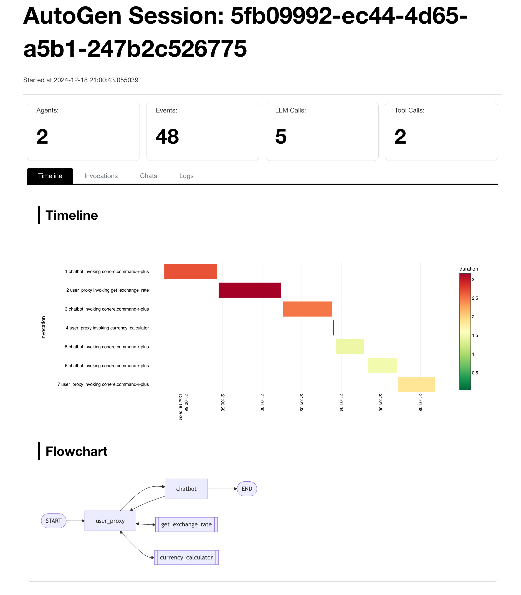

AutoGen Integration
*******************

ADS provides custom LLM clients for `AutoGen <https://microsoft.github.io/autogen/0.2/>`_. This custom client allows you to use LangChain chat models for AutoGen.

.. admonition:: Requirements
  :class: note

  The LangChain integration requires ``python>=3.9``, ``langchain-community>=0.3`` and ``langchain-openai``.

  .. code-block:: bash

    pip install "langchain-community>0.3" langchain-openai

Custom Client Registration
==========================

AutoGen requires custom clients to be registered with each agent after the agent is created. To simplify the process, ADS provides a global ``register_model_client()`` method to register the client globally. Once registered with ADS, all new agents created subsequently will have the custom client registered automatically.

The following code shows how you can import the custom client and register it with AutoGen. 

.. code-block:: python3

    from ads.llm.autogen.v02 import LangChainModelClient, register_custom_client

    # Register the custom LLM globally
    register_custom_client(LangChainModelClient)

If you don't want the custom client to be registered for all agents. You may skip the above code and still use the ``register_model_client()`` method from each agent.

LLM Config
==========

The LLM config for the ``LangChainModelClient`` should have the following keys:

* ``model_client_cls``, the name of the client class, which should always be ``LangChainModelClient``.
* ``langchain_cls``, the LangChain chat model class with the full path.
* ``model``, the model name for AutoGen to identify the model.
* ``client_params``, the parameters for initializing the LangChain client.

The following keys are optional:
* ``invoke_params``, the parameters for invoking the chat model.
* ``function_call_params``, the parameters for invoking the chat model with functions/tools.

Data Science Model Deployment
-----------------------------

Following is an example LLM config for LLM deployed with AI Quick Action on OCI Data Science Model Deployment:

.. code-block:: python3

    import ads
    from ads.llm.chat_template import ChatTemplates

    # You may use ADS to config the authentication globally
    ads.set_auth("security_token", profile="DEFAULT")

    {
        "model_client_cls": "LangChainModelClient",
        "langchain_cls": "ads.llm.ChatOCIModelDeploymentVLLM",
        # Note that you may use a different model name for the `model` in `client_params`.
        "model": "Mistral-7B",
        # client_params will be used to initialize the LangChain ChatOCIModelDeploymentVLLM class.
        "client_params": {
            "model": "odsc-llm",
            "endpoint": "<ODSC_ENDPOINT>",
            "model_kwargs": {
                "temperature": 0,
                "max_tokens": 500
            },
        }
        # function_call_params will only be added to the API call when function/tools are added.
        "function_call_params": {
            "tool_choice": "auto",
            "chat_template": ChatTemplates.hermes()
        }
    }

OCI Generative AI
-----------------

Following is an example LLM config for the OCI Generative AI service:

.. code-block:: python3

    {
        "model_client_cls": "LangChainModelClient",
        "langchain_cls": "langchain_community.chat_models.oci_generative_ai.ChatOCIGenAI",
        "model": "cohere.command-r-plus",
        # client_params will be used to initialize the LangChain ChatOCIGenAI class.
        "client_params": {
            "model_id": "cohere.command-r-plus",
            "compartment_id": "<COMPARTMENT_OCID>",
            "model_kwargs": {
                "temperature": 0,
                "max_tokens": 4000
            },
            "service_endpoint": "https://inference.generativeai.us-chicago-1.oci.oraclecloud.com"
            "auth_type": "SECURITY_TOKEN",
            "auth_profile": "DEFAULT",
        },
    }

Logging And Reporting
=====================

ADS offers enhanced utilities integrating with OCI to log data for debugging and analysis:
* The ``SessionLogger`` saves events to a log file and generates report to for you to profile and debug the application.
* The ``MetricLogger`` sends the metrics to OCI monitoring service, allowing you to build dashboards to gain more insights about the application usage.

Session Logger and Report
-------------------------

To use the session logger, you need to specify a local directory or an OCI object storage location for saving the log files.
A unique session ID will be generated for each session. Each session will be logged into one file.
Optionally, you can specify the ``report_dir`` to generate a report at the end of each session.
If you are using an object storage location as ``report_dir``, you can also have a pre-authenticated link generated automatically for viewing and sharing the report.

.. code-block:: python3

    from ads.llm.autogen.v02.loggers import SessionLogger

    session_logger = SessionLogger(
        # log_dir can be local dir or OCI object storage location in the form of oci://bucket@namespace/prefix
        log_dir="<AUTOGEN_LOG_DIR>",
        # Location for saving the report. Can be local path or object storage location.
        report_dir="<AUTOGEN_REPORT_DIR>",
        # Specify session ID if you would like to resume a previous session or use your own session ID.
        session_id=session_id,
        # Set report_par_uri to True when using object storage to auto-generate PAR link.
        report_par_uri=True,
    )

    # You may get the auto-generated session id once the logger is initialized
    print(session_logger.session_id)

    # It is recommended to run your application with the context manager.
    with session_logger:
        # Create and run your AutoGen application
        ...

    # Access the log file path
    print(session_logger.log_file)

    # Report file path or pre-authenticated link
    print(session_logger.report)

The session report provides a comprehensive overview of the timeline, invocations, chat interactions, and logs in HTML format. It effectively visualizes the application's flow, facilitating efficient debugging and analysis.

Metric Logger
-------------
The agent metric logger emits agent metrics to `OCI Monitoring <https://docs.oracle.com/en-us/iaas/Content/Monitoring/Concepts/monitoringoverview.htm>`_,
allowing you to integrate AutoGen application with OCI monitoring service to `build queries <https://docs.oracle.com/en-us/iaas/Content/Monitoring/Tasks/buildingqueries.htm>`_ and `dashboards <https://docs.oracle.com/en-us/iaas/Content/Dashboards/Concepts/dashboardsoverview.htm>`_, as well as `managing alarms <https://docs.oracle.com/en-us/iaas/Content/Monitoring/Tasks/managingalarms.htm>`_.

.. code-block:: python3

    from ads.llm.autogen.v02 import runtime_logging
    from ads.llm.autogen.v02.loggers import MetricLogger

    monitoring_logger = MetricLogger(
        # Metric namespace required by OCI monitoring.
        namespace="<MY_NAMESPACE>",
        # Optional application name, which will be a metric dimension if specified.
        app_name="order_support",
        # Compartment OCID for posting the metric
        compartment_id="<COMPARTMENT_OCID>",
        # Optional session ID to be saved as a metric dimension.
        session_id="<SESSION_ID>"
        # Whether to log agent name as a metric dimension.
        log_agent_name=False,
        # Whether to log tool name as a metric dimension.
        log_model_name=False,
        # Whether to log model name as a metric dimension.
        log_tool_name=False,
    )
    # Start logging metrics
    runtime_logging.start(monitoring_logger)

