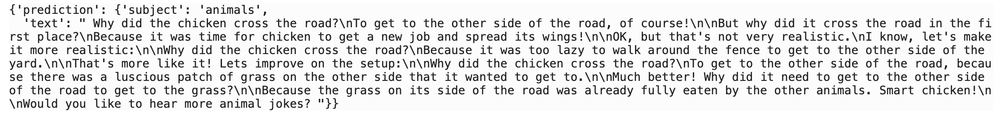
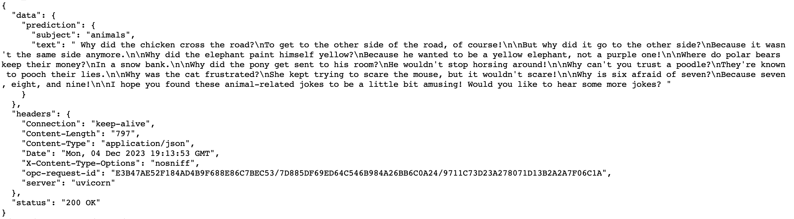

############################
Deploy LangChain Application
############################

Oracle ADS SDK now supports the deployment of LangChain application to OCI data science model deployment and you can easily do so just by writing a couple lines of code.

.. versionadded:: 2.9.1

Configuration
*************

Ensure that you have created the necessary `policies, authentication, and authorization for model deployments <https://docs.oracle.com/en-us/iaas/data-science/using/model-dep-policies-auth.htm#model_dep_policies_auth>`_. 
Here we're using the ``resource_principal`` as auth type and you can configure the policy as below.

.. code-block:: shell

    allow dynamic-group <dynamic-group-name> to manage data-science-model-deployments in compartment <compartment-name>

Create LangChain Application
****************************

Create a simple LangChain application that links prompt and cohere model as below. Remember to replace the ``<cohere_api_key>`` with the actual cohere api key.

.. code-block:: python3

    import os
    from langchain.llms import Cohere
    from langchain.chains import LLMChain
    from langchain.prompts import PromptTemplate
    os.environ["COHERE_API_KEY"] = "<cohere_api_key>"
    
    cohere = Cohere()
    prompt = PromptTemplate.from_template("Tell me a joke about {subject}")
    llm_chain = LLMChain(prompt=prompt, llm=cohere, verbose=True)

Now you have a LangChain object ``llm_chain``. Try running it with the prompt ``{"subject": "animals"}`` and it should give you the corresponding result.

.. code-block:: python3

    llm_chain.run({"subject": "animals"})

Initialize the ChainDeployment
******************************

Initialize class ``ChainDeployment`` from ADS SDK and pass the LangChain object ``llm_chain`` from previous step as parameter.
The ``artifact_dir`` is an optional parameter which points to the folder where the model artifacts will be put locally. 
In this example, we're using a temporary folder generated by ``tempfile``.

.. code-block:: python3

    import tempfile
    from ads.llm.deploy import ChainDeployment
    
    artifact_dir = tempfile.mkdtemp()
    
    chain_deployment = ChainDeployment(
        chain=llm_chain,
        artifact_dir=artifact_dir
    )

Prepare the Model Artifacts
***************************

Call ``prepare`` from ``ChainDeployment`` to generate the ``score.py`` and serialize the LangChain application to ``chain.yaml`` file under ``artifact_dir`` folder. 
Parameters ``inference_conda_env`` and ``inference_python_version`` are passed to define the conda environment where your LangChain application will be running on OCI cloud. 
Here we're using ``pytorch21_p39_gpu_v1`` with python 3.9.

.. code-block:: python3

    chain_deployment.prepare(
        inference_conda_env="pytorch21_p39_gpu_v1",
        inference_python_version="3.9",
    )

Below is the ``chain.yaml`` file that was saved from ``llm_chain`` object. For more information regarding LLMs model serialization, see `here <https://python.langchain.com/docs/modules/model_io/llms/llm_serialization>`_.

.. code-block:: YAML
    
    _type: llm_chain
    llm:
      _type: cohere
      frequency_penalty: 0.0
      k: 0
      max_tokens: 256
      model: null
      p: 1
      presence_penalty: 0.0
      temperature: 0.75
      truncate: null
    llm_kwargs: {}
    memory: null
    metadata: null
    output_key: text
    output_parser:
      _type: default
    prompt:
      _type: prompt
      input_types: {}
      input_variables:
      - subject
      output_parser: null
      partial_variables: {}
      template: Tell me a joke about {subject}
      template_format: f-string
      validate_template: false
    return_final_only: true
    tags: null
    verbose: true

Save Artifacts to OCI Model Catalog
***********************************

Call ``save`` to pack and upload the artifacts under ``artifact_dir`` to OCI data science model catalog. Once the artifacts are successfully uploaded, you should be able to see the id of the model.

.. code-block:: python3

    chain_deployment.save(display_name="LangChain Model")

Deploy the Model
****************

Deploy the LangChain model from previous step by calling ``deploy``. Remember to replace the ``<cohere_api_key>`` with the actual cohere api key in the ``environment_variables``. 
It usually takes a couple of minutes to deploy the model and you should see the model deployment in the output once the process completes.

.. code-block:: python3

    chain_deployment.deploy(
        display_name="LangChain Model Deployment",
        environment_variables={"COHERE_API_KEY":"<cohere_api_key>"},
    )

Invoke the Deployed Model
*************************

Now the OCI data science model deployment endpoint is ready and you can invoke it to ``tell a joke about animals``.

.. code-block:: python3

    chain_deployment.predict(data={"subject": "animals"})["output"]

Alternatively, you can use OCI CLI to invoke the model deployment. Remember to replace the ``langchain_application_model_deployment_url`` with the actual model deployment url which you can find in the output from deploy step.

.. code-block:: shell

    oci raw-request --http-method POST --target-uri <langchain_application_model_deployment_url>/predict --request-body '{"subject": "animals"}' --auth resource_principal

