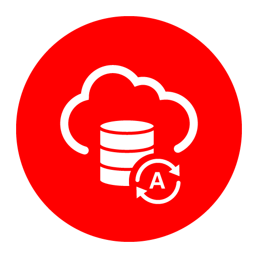

Connect with ``DatasetFactory`` 
*******************************

.. admonition:: Deprecation Note |deprecated|

    * ``DataSetFactory.open`` is deprecated in favor of Pandas to read from file systems. 
    * Pandas(>1.2.1) can connect to object storage using uri format - ``oci://bucket@namepace/path/to/data``.
    * To read from Oracle database or MySQL, see DataBase sections under :doc:`Connecting to Datasources<connect>`
    * ``DataSetFactory.from_dataframe`` is supported to create ``ADSDataset`` class from ``pandas`` dataframe

    See :doc:`Connecting to Datasources<connect>` for examples.

.. |deprecated| image:: /_static/badge_deprecated.svg

You can load data into ADS in several different ways from Oracle Cloud Infrastructure Object Storage, cx_Oracle, or S3.  Following are some examples.

Begin by loading the required libraries and modules:

.. code-block:: python3

    import ads
    import numpy as np
    import pandas as pd

    from ads.dataset.dataset_browser import DatasetBrowser
    from ads.dataset.factory import DatasetFactory

Object Storage
==============

To open a dataset from Object Storage using the resource principal method, you can use the following example, replacing the angle bracketed content with the location and name of your file:

.. code-block:: python3

  import ads
  import os

  from ads.dataset.factory import DatasetFactory

  ads.set_auth(auth='resource_principal')
  bucket_name = <bucket-name>
  file_name = <file-name>
  namespace = <namespace>
  storage_options = {'config':{}, 'tenancy': os.environ['TENANCY_OCID'], 'region': os.environ['NB_REGION']}
  ds = DatasetFactory.open(f"oci://{bucket_name}@{namespace}/{file_name}", storage_options=storage_options)

To open a dataset from Object Storage using the Oracle Cloud Infrastructure configuration file method, include the location of the file using this format ``oci://<bucket_name>@<namespace>/<file_name>`` and modify the optional parameter ``storage_options``. Insert:

* The path to your `Oracle Cloud Infrastructure configuration file <https://docs.cloud.oracle.com/en-us/iaas/Content/API/SDKDocs/cliconfigure.htm>`_,
* The profile name you want to use.

For example:

.. code-block:: python3

  ds = DatasetFactory.open("oci://<bucket_name>@<namespace>/<file_name>", storage_options = {
     "config": "~/.oci/config",
     "profile": "DEFAULT"
  })

Local Storage
=============

To open a dataset from a local source, use ``DatasetFactory.open`` and specify the path of the data file:

.. code-block:: python3

  ds = DatasetFactory.open("/path/to/data.data", format='csv', delimiter=" ")

Oracle Database
---------------

.. image:: images/cx_Oracle.jpeg
  :height: 150
  :alt: cx_Oracle Logo

To connect to Oracle Databases from Python, you use the ``cx_Oracle`` package that conforms to the Python database API specification.

You must have the client credentials and connection information to connect to the database. The client credentials include the wallet, which is required for all types of connections. Use these steps to work with ADB and wallet files:

  #. From the Console, go to the Oracle Cloud Infrastructure ADW or ATP instance page that you want to load the dataset from, and then click ``DB Connection``.
  #. Click Download Wallet.
  #. You have to enter a password. This password is used for some ADB connections, but not the ones that are used in the notebook.
  #. Create a folder for your wallet in the notebook environment (*<path_to_wallet_folder>*).
  #. Upload your wallet files into *<path_to_wallet_folder>* folder using the Jupyterlab Upload Files button.
  #. Open the ``sqlnet.ora`` file from the wallet files, and then configure the METHOD_DATA to be: ``METHOD_DATA = (DIRECTORY="<path_to_wallet_folder>")``
  #. Set the env variable, ``TNS_ADMIN``. ``TNS_ADMIN``, to point to the wallet you want to use.

In this example a Python dictionary, ``creds`` is used to store the creditionals. However, it is poor security practice to store this
information in a notebook. The notebook ``ads-examples/ADB_working_with.ipynb`` gives an example of how to store them in Block Storage.

.. code-block:: python3

     creds = {}
     creds['tns_admin'] = <path_to_wallet_folder>
     creds['sid'] = <your SID>
     creds['user'] = <database username>
     creds['password'] = <database password>

Once your Oracle client is setup, you can use ``cx_Oracle`` directly with ``Pandas`` as in this example:

.. code-block:: python3

  import pandas as pd
  import cx_Oracle
  import os

  os.environ['TNS_ADMIN'] = creds['tns_admin']
  with cx_Oracle.connect(creds['user'], creds['password'], creds['sid']) as ora_conn:
    df = pd.read_sql('''
      SELECT ename, dname, job, empno, hiredate, loc
      FROM emp, dept
      WHERE emp.deptno = dept.deptno
      ORDER BY ename
    ''', con=ora_conn)

You can also use ``cx_Oracle`` within ADS by creating a connection string:

.. code-block:: python3

  os.environ['TNS_ADMIN'] = creds['tns_admin']
  from ads.dataset.factory import DatasetFactory
  uri = 'oracle+cx_oracle://' + creds['user'] + ':' + creds['password'] + '@' + creds['sid']
  ds = DatasetFactory.open(uri, format="sql", table=table, index_col=index_col)

Autonomous Database
===================

Oracle has two configurations of Autonomous Databases. They are the Autonomous Data Warehouse (ADW) and the Autonomous Transaction Processing (ATP) database. Both are fully autonomous databases that scale elastically, deliver fast query performance, and require minimal database administration.

.. note::

   To access `ADW <https://www.oracle.com/database/adw-cloud.html>`_, review the :ref:`Autonomous Database configuration <configuration-autonomous_database>` section. It shows you how to get the client credentials (wallet) and set up the proper environment variable.

Load from ADB
-------------

After you have stored the ADB username, password, and database name (SID) as variables, you can build the URI as your connection source.

.. code-block:: python3

    uri = 'oracle+cx_oracle://' + creds['user'] + ':' + creds['password'] + '@' + creds['sid']

You can use ADS to query a table from your database, and then load that table as an ``ADSDataset`` object through ``DatasetFactory``.
When you open ``DatasetFactory``, specify the name of the table you want to pull using the ``table`` variable for a given table. For SQL expressions, use the table parameter also. For example, *(`table="SELECT * FROM sh.times WHERE rownum <= 30"`)*.

.. code-block:: python3

    os.environ['TNS_ADMIN'] = creds['tns_admin']
    ds = DatasetFactory.open(uri, format="sql", table=table, target='label')

Query ADB
---------

- **Query using Pandas**

  This example shows you how to query data using ``Pandas`` and `sqlalchemy <https://www.sqlalchemy.org/>`_ to read data from ADB:

.. code-block:: python3

      from sqlalchemy import create_engine
      import os

      os.environ['TNS_ADMIN'] = creds['tns_admin']
      engine = create_engine(uri)
      df = pd.read_sql('SELECT * from <TABLENAME>', con=engine)

You can convert the ``pd.DataFrame`` into ``ADSDataset`` using the ``DatasetFactory.from_dataframe()`` function.

.. code-block:: python3

      ds = DatasetFactory.from_dataframe(df)

These two examples run a simple query on ADW data. With ``read_sql_query`` you can use SQL expressions not just for tables, but also to limit the number of rows and to apply conditions with filters, such as (``where``).

.. code-block:: python3

      ds = pd.read_sql_query('SELECT * from <TABLENAME>', uri)

.. code-block:: python3

      ds = pd.read_sql_query('SELECT * FROM emp WHERE ROWNUM <= 5', uri)

- **Query using cx_Oracle**

You can also query data from ADW using cx_Oracle. Use the cx_Oracle 7.0.0 version with ADS. Ensure that you change the dummy ``<TABLENAME>`` placeholder to the actual table name you want to query data from, and the dummy ``<COLNAME>`` placeholder to the column name that you want to select:

.. code-block:: python3

      import
      import pandas as pd
      import numpy as np
      import os

      os.environ['TNS_ADMIN'] = creds['tns_admin']
      connection = cx_Oracle.connect(creds['user'], creds['password'], creds['sid'])
      cursor = connection.cursor()
      results = cursor.execute("SELECT * from <TABLENAME>")

      data = results.fetchall()
      df = pd.DataFrame(np.array(data))

      ds = DatasetFactory.from_dataframe(df)

.. code-block:: python3

      results = cursor.execute('SELECT <COLNAME> from <TABLENAME>').fetchall()

Close the cursor and connection using the ``.close()`` method:

.. code-block:: python3

     cursor.close()
     connection.close()

Train a Models with ADB
========================

After you load your data from ADB, the ``ADSDataset`` object is created, which allows you to build models using AutoML.

.. code-block:: python3

    from ads.automl.driver import AutoML
    from ads.automl.provider import OracleAutoMLProvider

    train, test = ds.train_test_split()
    model, baseline = AutoML(train, provider= OracleAutoMLProvider()).train(model_list=["LGBMClassifier"])

Update ADB Tables
=================

To add predictions to a table, you can either update an existing table, or create a new table with the added predictions. There are many ways to do this. One way is to use the model to update a CSV file, and then use Oracle SQL\*Loader or SQL\*Plus.

This example adds predictions programmatically using cx_Oracle. It uses ``executemany`` to insert rows as tuples created using the model's ``predict`` method:

.. code-block:: python3

    ds = DatasetFactory.open("iris.csv")

    create_table = '''CREATE TABLE IRIS_PREDICTED (,
                            sepal_length number,
                            sepal_width number,
                            petal_length number,
                            petal_width number,
                            SPECIES VARCHAR2(20),
                            yhat VARCHAR2(20),
                      )'''

    connection = cx_Oracle.connect(creds['user'], creds['password'], creds['sid'])
    cursor = connection.cursor()
    cursor.execute(create_table)

    ds_res.to_sql('predicted_iris', con=engine, index=False, if_exists="append")\

    rows = [tuple(x) for x in ds_res.values]

    cursor.executemany("""
      insert into IRIS_PREDICTED
        (sepal_length, sepal_width, petal_length, petal_width, SPECIES, yhat)
      values (:1, :2, :3, :4, :5, :6)""",
      rows
    )

    connection.commit()
    cursor.close()
    connection.close()

For some models, you could also use ``predict_proba`` to get an array of predictions and their confidence probability.

Amazon S3
=========

You can open Amazon S3 public or private files in ADS. For private files, you must pass the right credentials through the ADS ``storage_options`` dictionary.If you have large S3 files, then you benefit from an increased ``blocksize``.

.. code-block:: python3

  ds = DatasetFactory.open("s3://bucket_name/iris.csv", storage_options = {
      'key': 'aws key',
      'secret': 'aws secret,
      'blocksize': 1000000,
      'client_kwargs': {
              "endpoint_url": "https://s3-us-west-1.amazonaws.com"
      }
  })

HTTP(S) Sources
===============

To open a dataset from a remote web server source, use ``DatasetFactory.open()`` and specify the URL of the data:

.. code-block:: python3

   ds = DatasetFactory.open('https://example.com/path/to/data.csv', target='label')

``DatasetBrowser``
==================

``DatasetBrower`` allows easy access to datasets from reference libraries and index websites, such as scikit-learn. To see the supported libraries, use the ``list()`` function:

.. code-block:: python3

    DatasetBrowser.list()

.. parsed-literal::

    ['web', 'sklearn', 'seaborn', 'R']

To see which dataset is available from scikit-learn, use:

.. code-block:: python3

  sklearn = DatasetBrowser.sklearn()
  sklearn.list()

.. parsed-literal::

    ['boston', 'breast_cancer', 'diabetes', 'iris', 'wine', 'digits']

Datasets are provided as a convenience.  Datasets are considered Third Party Content and are not considered Materials under Your agreement with Oracle applicable to the Services. Review the `dataset license <https://github.com/scikit-learn/scikit-learn/blob/master/COPYING>`__.

To explore one of the datasets, use ``open()`` specifying the name of the dataset:

.. code-block:: python3

  ds = sklearn.open('wine')

