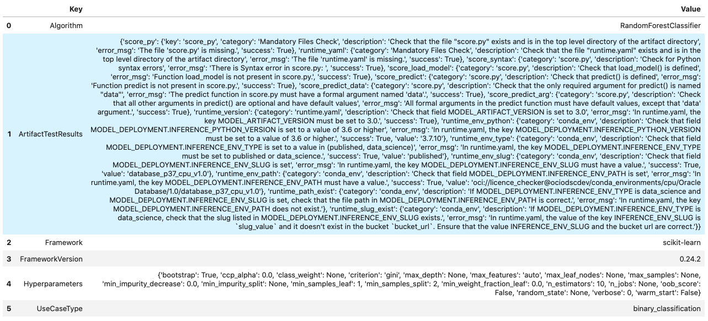
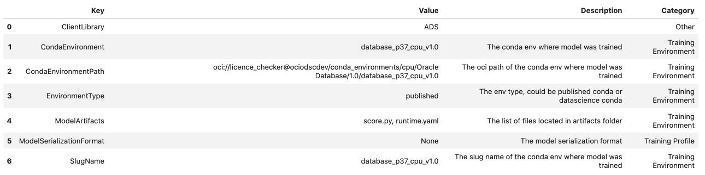
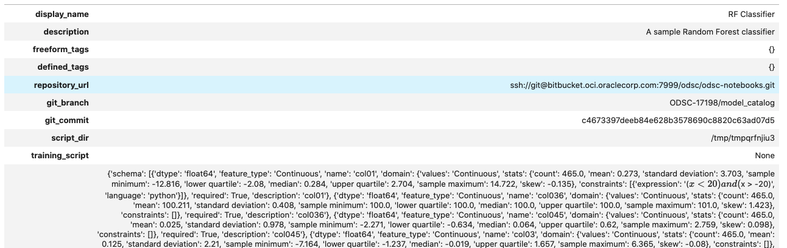
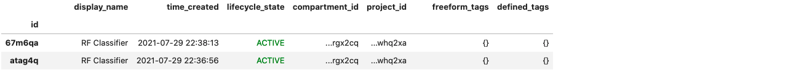
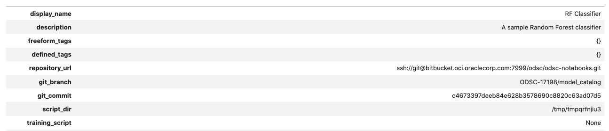
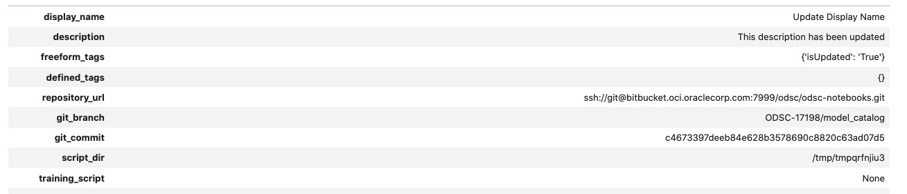

.. _model-catalog-8:

#############
Model Catalog
#############

The model catalog provides a method to track, and immutably store models.  The model catalog allows you to maintain the provenance of models during all phases of a model's life cycle.

A model artifact includes the model, metadata about the model, input, and output schema, and a script to load the model and make predictions. You can share model artifacts among data scientists, tracked for
provenance, reproduced, and deployed.

.. code-block:: python3

    import ads
    import logging
    import os
    import tempfile
    import warnings

    from ads.catalog.model import ModelCatalog
    from ads.common.model import ADSModel
    from ads.common.model_export_util import prepare_generic_model
    from ads.common.model_metadata import (MetadataCustomCategory,
                                           UseCaseType,
                                           Framework)
    from ads.dataset.factory import DatasetFactory
    from ads.feature_engineering.schema import Expression, Schema
    from os import path
    from sklearn.ensemble import RandomForestClassifier

    logging.basicConfig(format='%(levelname)s:%(message)s', level=logging.ERROR)
    warnings.filterwarnings('ignore')

Introduction
************

The purpose of the model catalog is to provide a managed and centralized storage space for models. It ensures that model artifacts are immutable and allows data scientists to share models, and reproduce them as needed.

The model catalog is accessed directly in a notebook session with ADS. Alternatively, the Oracle Cloud Infrastructure (OCI) Console can be used by going to the Data Science projects page, selecting a project, then click **Models**. The models page shows the model artifacts that are in the model catalog for a given project.

After a model and its artifacts are stored in the model catalog, they become available for other data scientists if they have the correct
permissions.

Data scientists can:

*  List, read, download, and load models from the catalog to their own notebook sessions.
*  Download the model artifact from the catalog, and run the model on their laptop or some other machine.
*  Deploy the model artifact as a `model deployment <https://docs.oracle.com/en-us/iaas/data-science/using/model-dep-about.htm>`_.
*  Document the model use case and algorithm using taxonomy metadata.
*  Add custom metadata that describes the model.
*  Document the model provenance including the resources and tags used to create the model (notebook session), and the code used in training.
*  Document the input data schema, and the returned inference schema.
*  Run introspection tests on the model artifact to ensure that common model artifact errors are flagged. Thus, they can be remediated before the model is saved to the catalog.

The ADS SDK automatically captures some of the metadata for you.  It captures provenance, taxonomy, and some custom metadata. It also runs the model introspection tests.

A model can be saved to the model catalog using the generic approach or the ``ADSModel`` approach:

*  The generic approach creates a generic model artifact using ``.prepare_generic_model()``, and saves it to the model catalog.
*  The ``ADSModel`` approach prepares an artifact from the ``ADSModel`` object, and saves it to the model catalog using the ``.prepare()`` method.  ``ADSModel`` objects are typically created from the AutoML engine.  Data scientists can also convert models trained with other machine learning libraries into an ``ADSModel`` object (using the ``.from_estimator()`` method).

**Notes:**

1. ``ADS`` and ``ADSModel`` can only be used within the OCI family of services. If you want to use the model outside of those services, then use the generic approach to create a model artifact.
2. The generic model approach is agnostic to the type of model, and deployment method. The ``ADSModel`` artifact only supports the most common model libraries, see the `ADS documentation <https://docs.cloud.oracle.com/iaas/tools/ads-sdk/latest/>`_ .
3. The ``ADSModel`` model artifact allows access to the full suite of ADS features.
4. The model catalog is agnostic as to which approach was used to create the model artifact.

Prepare
*******

A model artifact is a ZIP archive that contains the ``score.py``, ``runtime.yaml`` files, and other files needed to load and run the model in a different notebook session.

There are two approaches to prepare a model artifact. The approach you take depends on where the model is to be deployed, and if the model class is supported by ``ADSModel``. The following diagram outlines the decision making process to use to determine which approach is best for your use case.

If you choose the ``ADSModel`` approach, then use the ``.prepare()`` method to create the template model artifacts. For most use cases, the template files don't need to be modified and are sufficient for model deployment.  This allows for rapid development though there are a few constraints.

The generic model approach allows for the most flexibility in deploying a model and the supported models. You use the ``.prepare_generic_model()`` method to create a model artifact template. This template must be customized for each model.

No matter which approach you choose, the end result is a model artifact that can be stored in the model catalog.

.. image:: figures/diagram_model.png

ADSModel
========

The steps to prepare an ``ADSModel`` model include training an ``ADSModel``, and then preparing the model artifacts. Optionally, the model artifacts can be customized and reloaded from disk. After you complete these steps, the model artifacts are ready to be stored in the model catalog.

**Train an ADSModel**

The ``oracle_classification_dataset1`` dataset is used to build a Random Forest classifier using the ``RandomForestClassifier`` class. This class is supported by the ``ADSModel`` class. The specifics of the dataset features are not important for this example. The feature engineering is done automatically using the ``.auto_transform()`` method. The value to predict, the target, is ``class``. The data is also split into training and test sets. The test set is used to make predictions.

The ``RandomForestClassifier`` object is converted to into an ``ADSModel`` using the ``.from_estimator()`` method.

.. code-block:: python3

    # Load the dataset
    ds_path = path.join("/", "opt", "notebooks", "ads-examples", "oracle_data", "oracle_classification_dataset1_150K.csv")

    ds = DatasetFactory.open(ds_path, target="class")

    # Data preprocessing
    transformed_ds = ds.auto_transform(fix_imbalance=False)
    train, test = transformed_ds.train_test_split(test_size=0.15)

    # Build the model and convert it to an ADSModel object
    rf_clf = RandomForestClassifier(n_estimators=10).fit(train.X.values, train.y.values)
    rf_model = ADSModel.from_estimator(rf_clf)

**Prepare the Model Artifact**

To prepare the model artifact, the ``.prepare()`` method is used.  This method returns a ``ModelArtifact`` object, and also writes a number of model artifact files to disk. The only required argument to the ``.prepare()`` method is the local path to store the model artifact files in.

The output of the next example lists the temporary directory used for the model artifacts, and the files that compose the artifact.

**Note**:

*  ADS automatically captures the provenance metadata, most of the taxonomy metadata, and a series of custom metadata.
*  ``UseCaseType`` in ``metadata_taxonomy`` can't be automatically populated. One way to populate the use case is to pass ``use_case_type`` to the ``prepare`` method.
*  Model introspection is automatically triggered.

.. code-block:: python3

    # Prepare the model artifacts
    path_to_ADS_model_artifact = tempfile.mkdtemp()
    rf_model_artifact = rf_model.prepare(path_to_ADS_model_artifact, use_case_type=UseCaseType.BINARY_CLASSIFICATION,
                                         force_overwrite=True, data_sample=test, data_science_env=True,
                                         fn_artifact_files_included=False)

    # List the template files
    print("Model Artifact Path: {}\n\nModel Artifact Files:".format(path_to_ADS_model_artifact))
    for file in os.listdir(path_to_ADS_model_artifact):
        if path.isdir(path.join(path_to_ADS_model_artifact, file)):
            for file2 in os.listdir(path.join(path_to_ADS_model_artifact, file)):
                print(path.join(file,file2))
        else:
            print(file)

.. parsed-literal::

    ['output_schema.json', 'score.py', 'runtime.yaml', 'onnx_data_transformer.json', 'model.onnx', '.model-ignore', 'input_schema.json']

**Data Schema**

The data schema provides a definition of the format and nature of the data that the model expects. It also defines the output data from the model inference. The ``.populate_schema()`` method accepts the parameters, ``data_sample`` or ``X_sample``, and ``y_sample``. When using these parameters, the model artifact gets populates the input and output data schemas.

The ``.schema_input`` and ``.schema_output`` properties are ``Schema`` objects that define the schema of each input column and the output.  The ``Schema`` object contains these fields:

*  ``description``: Description of the data in the column.
*  ``domain``: A data structure that defines the domain of the data.  The restrictions on the data and summary statistics of its distribution.

   -  ``constraints``: A data structure that is a list of expression objects that defines the constraints of the data.

      -  ``expression``: A string representation of an expression that can be evaluated by the language corresponding to the value provided in ``language`` attribute. The default value for language is ``python``.

         -  ``expression``: Required. Use the ``string.Template`` format for specifying the expression. ``$x`` is used to represent the variable.
         -  ``language``: The default value is ``python``. Only ``python`` is supported.

   -  ``stats``: A set of summary statistics that defines the distribution of the data. These are determined using the feature type statistics as defined in ADS.
   -  ``values``: A description of the values of the data.

*  ``dtype``: Pandas data type
*  ``feature_type``: The primary feature type as defined by ADS.
*  ``name``: Name of the column.
*  ``required``: Boolean value indicating if a value is always required.

.. code-block:: yaml

   - description: Number of matching socks in your dresser drawer.
     domain:
       constraints:
       - expression: ($x <= 10) and ($x > 0)
         language: python
       - expression: $x in [2, 4, 6, 8, 10]
         language: python
       stats:
         count: 465.0
         lower quartile: 3.2
         mean: 6.3
         median: 7.0
         sample maximum: 10.0
         sample minimum: 2.0
         standard deviation: 2.5
         upper quartile: 8.2
       values: Natural even numbers that are less than or equal to 10.
     dtype: int64
     feature_type: EvenNatural10
     name: sock_count
     required: true

Calling ``.schema_input`` or ``.schema_output`` shows the schema in a YAML format.

Alternatively, you can check the ``output_schema.json`` file for the content of the schema_output:

.. code-block:: python3

    with open(path.join(path_to_ADS_model_artifact, "output_schema.json"), 'r') as f:
        print(f.read())

.. parsed-literal::

    {"schema": [{"dtype": "int64", "feature_type": "Integer", "name": "class", "domain": {"values": "Integer", "stats": {"count": 465.0, "mean": 0.5225806451612903, "standard deviation": 0.5000278079030275, "sample minimum": 0.0, "lower quartile": 0.0, "median": 1.0, "upper quartile": 1.0, "sample maximum": 1.0}, "constraints": []}, "required": true, "description": "class"}]}

**Alternative Ways of Generating the Schema**

You can directly populate the schema by calling ``populate_schema()``:

.. code-block:: python3

    rf_model_artifact.populate_schema(X_sample=test.X, y_sample=test.y)

You can also load your schema from a JSON or YAML file:

.. code-block:: python3

    tempdir = tempfile.mkdtemp()
    schema = '''
    {"schema": [{
      "dtype": "int64",
      "feature_type": "Category",
      "name": "class",
      "domain": {
        "values": "Category type.",
        "stats": {
          "count": 465.0,
          "unique": 2},
        "constraints": [
          {"expression": "($x <= 1) and ($x >= 0)", "language": "python"},
          {"expression": "$x in [0, 1]", "language": "python"}]},
      "required": true,
      "description": "target to predict."}]}
    '''

    with open(path.join(tempdir, "schema.json"), 'w') as f:
        f.write(schema)

.. code-block:: python3

    rf_model_artifact.schema_output = Schema.from_file(os.path.join(tempdir, 'schema.json'))

**Update the Schema**

You can update the fields in the schema:

.. code-block:: python3

    rf_model_artifact.schema_output['class'].description = 'target variable'
    rf_model_artifact.schema_output['class'].feature_type = 'Category'

You can specify a constraint for your data using ``Expression``, and call
``evaluate`` to check if the data satisfies the constraint:

.. code-block:: python3

    rf_model_artifact.schema_input['col01'].domain.constraints.append(Expression('($x < 20) and ($x > -20)'))

0 is between -20 and 20, so ``evaluate`` should return ``True``:

.. code-block:: python3

    rf_model_artifact.schema_input['col01'].domain.constraints[0].evaluate(x=0)

.. parsed-literal::

    True

**Taxonomy Metadata**

Taxonomy metadata includes the type of the model, use case type, libraries, framework, and so on. This metadata provides a way of documenting the schema of the model.  The ``UseCaseType``, ``FrameWork``, ``FrameWorkVersion``, ``Algorithm``, and ``Hyperparameters`` are fixed taxonomy metadata. These fields are automatically populated when the ``.prepare()`` method is called. You can also manually update the values of those fields.

*  ``UseCaseType``: The machine learning problem associated with the Estimator class.  The ``UseCaseType.values()`` method returns the most current list. This is a list of allowed values.:

   -  ``UseCaseType.ANOMALY_DETECTION``
   -  ``UseCaseType.BINARY_CLASSIFICATION``
   -  ``UseCaseType.CLUSTERING``
   -  ``UseCaseType.DIMENSIONALITY_REDUCTION``
   -  ``UseCaseType.IMAGE_CLASSIFICATION``
   -  ``UseCaseType.MULTINOMIAL_CLASSIFICATION``
   -  ``UseCaseType.NER``
   -  ``UseCaseType.OBJECT_LOCALIZATION``
   -  ``UseCaseType.OTHER``
   -  ``UseCaseType.RECOMMENDER``
   -  ``UseCaseType.REGRESSION``
   -  ``UseCaseType.SENTIMENT_ANALYSIS``
   -  ``UseCaseType.TIME_SERIES_FORECASTING``
   -  ``UseCaseType.TOPIC_MODELING``

*  ``FrameWork``: The FrameWork of the ``estimator`` object.  You can get the list of allowed values using ``Framework.values()``:

   -  ``FrameWork.BERT``
   -  ``FrameWork.CUML``
   -  ``FrameWork.EMCEE``
   -  ``FrameWork.ENSEMBLE``
   -  ``FrameWork.FLAIR``
   -  ``FrameWork.GENSIM``
   -  ``FrameWork.H2O``
   -  ``FrameWork.KERAS``
   -  ``FrameWork.LIGHTgbm``
   -  ``FrameWork.MXNET``
   -  ``FrameWork.NLTK``
   -  ``FrameWork.ORACLE_AUTOML``
   -  ``FrameWork.OTHER``
   -  ``FrameWork.PROPHET``
   -  ``FrameWork.PYOD``
   -  ``FrameWork.PYMC3``
   -  ``FrameWork.PYSTAN``
   -  ``FrameWork.PYTORCH``
   -  ``FrameWork.SCIKIT_LEARN``
   -  ``FrameWork.SKTIME``
   -  ``FrameWork.SPACY``
   -  ``FrameWork.STATSMODELS``
   -  ``FrameWork.TENSORFLOW``
   -  ``FrameWork.TRANSFORMERS``
   -  ``FrameWork.WORD2VEC``
   -  ``FrameWork.XGBOOST``

*  ``FrameWorkVersion``: The framework version of the estimator object.  For example, ``2.3.1``.
*  ``Algorithm``: The model class.
*  ``Hyperparameters``: The hyperparameters of the estimator object.

You can't add or delete any of the fields, or change the key of those fields.

You can populate the ``use_case_type`` by passing it in the ``.prepare()`` method. Or you can set and update it directly.

.. code-block:: python3

    rf_model_artifact.metadata_taxonomy['UseCaseType'].value = UseCaseType.BINARY_CLASSIFICATION

**Update metadata_taxonomy**

Update any of the taxonomy fields with allowed values:

.. code-block:: python3

    rf_model_artifact.metadata_taxonomy['FrameworkVersion'].value = '0.24.2'
    rf_model_artifact.metadata_taxonomy['UseCaseType'].update(value=UseCaseType.BINARY_CLASSIFICATION)

You can view the ``metadata_taxonomy`` in the dataframe format by
calling ``to_dataframe``:

.. code-block:: python3

    rf_model_artifact.metadata_taxonomy.to_dataframe()

Alternatively, you can view it directly in a YAML format:

.. code-block:: python3

    rf_model_artifact.metadata_taxonomy

.. parsed-literal::

    data:
    - key: FrameworkVersion
      value: 0.24.2
    - key: ArtifactTestResults
      value:
        runtime_env_path:
          category: conda_env
          description: Check that field MODEL_DEPLOYMENT.INFERENCE_ENV_PATH is set
          error_msg: In runtime.yaml, the key MODEL_DEPLOYMENT.INFERENCE_ENV_PATH must
            have a value.
          success: true
          value: oci://licence_checker@ociodscdev/conda_environments/cpu/Oracle Database/1.0/database_p37_cpu_v1.0
        runtime_env_python:
          category: conda_env
          description: Check that field MODEL_DEPLOYMENT.INFERENCE_PYTHON_VERSION is set
            to a value of 3.6 or higher
          error_msg: In runtime.yaml, the key MODEL_DEPLOYMENT.INFERENCE_PYTHON_VERSION
            must be set to a value of 3.6 or higher.
          success: true
          value: 3.7.10
        runtime_env_slug:
          category: conda_env
          description: Check that field MODEL_DEPLOYMENT.INFERENCE_ENV_SLUG is set
          error_msg: In runtime.yaml, the key MODEL_DEPLOYMENT.INFERENCE_ENV_SLUG must
            have a value.
          success: true
          value: database_p37_cpu_v1.0
        runtime_env_type:
          category: conda_env
          description: Check that field MODEL_DEPLOYMENT.INFERENCE_ENV_TYPE is set to
            a value in (published, data_science)
          error_msg: In runtime.yaml, the key MODEL_DEPLOYMENT.INFERENCE_ENV_TYPE must
            be set to published or data_science.
          success: true
          value: published
        runtime_path_exist:
          category: conda_env
          description: If MODEL_DEPLOYMENT.INFERENCE_ENV_TYPE is data_science and MODEL_DEPLOYMENT.INFERENCE_ENV_SLUG
            is set, check that the file path in MODEL_DEPLOYMENT.INFERENCE_ENV_PATH is
            correct.
          error_msg: In runtime.yaml, the key MODEL_DEPLOYMENT.INFERENCE_ENV_PATH does
            not exist.
        runtime_slug_exist:
          category: conda_env
          description: If MODEL_DEPLOYMENT.INFERENCE_ENV_TYPE is data_science, check that
            the slug listed in MODEL_DEPLOYMENT.INFERENCE_ENV_SLUG exists.
          error_msg: In runtime.yaml, the value of the key INFERENCE_ENV_SLUG is ``slug_value``
            and it doesn't exist in the bucket ``bucket_url``. Ensure that the value INFERENCE_ENV_SLUG
            and the bucket url are correct.
        runtime_version:
          category: runtime.yaml
          description: Check that field MODEL_ARTIFACT_VERSION is set to 3.0
          error_msg: In runtime.yaml, the key MODEL_ARTIFACT_VERSION must be set to 3.0.
          success: true
        runtime_yaml:
          category: Mandatory Files Check
          description: Check that the file "runtime.yaml" exists and is in the top level
            directory of the artifact directory
          error_msg: The file 'runtime.yaml' is missing.
          success: true
        score_load_model:
          category: score.py
          description: Check that load_model() is defined
          error_msg: Function load_model is not present in score.py.
          success: true
        score_predict:
          category: score.py
          description: Check that predict() is defined
          error_msg: Function predict is not present in score.py.
          success: true
        score_predict_arg:
          category: score.py
          description: Check that all other arguments in predict() are optional and have
            default values
          error_msg: All formal arguments in the predict function must have default values,
            except that 'data' argument.
          success: true
        score_predict_data:
          category: score.py
          description: Check that the only required argument for predict() is named "data"
          error_msg: The predict function in score.py must have a formal argument named
            'data'.
          success: true
        score_py:
          category: Mandatory Files Check
          description: Check that the file "score.py" exists and is in the top level directory
            of the artifact directory
          error_msg: The file 'score.py' is missing.
          key: score_py
          success: true
        score_syntax:
          category: score.py
          description: Check for Python syntax errors
          error_msg: 'There is Syntax error in score.py: '
          success: true
    - key: Framework
      value: scikit-learn
    - key: UseCaseType
      value: binary_classification
    - key: Algorithm
      value: RandomForestClassifier
    - key: Hyperparameters
      value:
        bootstrap: true
        ccp_alpha: 0.0
        class_weight: null
        criterion: gini
        max_depth: null
        max_features: auto
        max_leaf_nodes: null
        max_samples: null
        min_impurity_decrease: 0.0
        min_impurity_split: null
        min_samples_leaf: 1
        min_samples_split: 2
        min_weight_fraction_leaf: 0.0
        n_estimators: 10
        n_jobs: null
        oob_score: false
        random_state: null
        verbose: 0
        warm_start: false

**Custom Metadata**

Update your custom metadata using the ``key``, ``value``, ``category``, and ``description`` fields. The ``key``, and ``value`` fields are required.

You can see the allowed values for custom metadata category using ``MetadataCustomCategory.values()``:

* ``MetadataCustomCategory.PERFORMANCE``
* ``MetadataCustomCategory.TRAINING_PROFILE``
* ``MetadataCustomCategory.TRAINING_AND_VALIDATION_DATASETS``
* ``MetadataCustomCategory.TRAINING_ENVIRONMENT``
* ``MetadataCustomCategory.OTHER``

**Add New Custom Metadata**

To add a new custom metadata, call ``.add()``:

.. code-block:: python3

    rf_model_artifact.metadata_custom.add(key='test', value='test', category=MetadataCustomCategory.OTHER, description='test', replace=True)

**Update Custom Metadata**

Use the ``.update()`` method to update the fields of a specific key ensuring that
you pass all the values you need in the ``update``:

.. code-block:: python3

    rf_model_artifact.metadata_custom['test'].update(value='test1', description=None, category=MetadataCustomCategory.TRAINING_ENV)

Alternatively, you can set it directly:

.. code-block:: python3

    rf_model_artifact.metadata_custom['test'].value = 'test1'
    rf_model_artifact.metadata_custom['test'].description = None
    rf_model_artifact.metadata_custom['test'].category = MetadataCustomCategory.TRAINING_ENV

You can view the custom metadata in the dataframe by calling
``.to_dataframe()``:

.. code-block:: python3

    rf_model_artifact.metadata_custom.to_dataframe()

.. image:: figures/custom_metadata.png

Alternatively, you can view the custom metadata in YAML format by calling ``.metadata_custom``:

.. code-block:: python3

    rf_model_artifact.metadata_custom

.. parsed-literal::

    data:
    - category: Training Environment
      description: The conda env where model was trained
      key: CondaEnvironment
      value: database_p37_cpu_v1.0
    - category: Training Environment
      description: null
      key: test
      value: test1
    - category: Training Environment
      description: The env type, could be published conda or datascience conda
      key: EnvironmentType
      value: published
    - category: Training Environment
      description: The list of files located in artifacts folder
      key: ModelArtifacts
      value: score.py, runtime.yaml, onnx_data_transformer.json, model.onnx, .model-ignore
    - category: Training Environment
      description: The slug name of the conda env where model was trained
      key: SlugName
      value: database_p37_cpu_v1.0
    - category: Training Environment
      description: The oci path of the conda env where model was trained
      key: CondaEnvironmentPath
      value: oci://licence_checker@ociodscdev/conda_environments/cpu/Oracle Database/1.0/database_p37_cpu_v1.0
    - category: Other
      description: ''
      key: ClientLibrary
      value: ADS
    - category: Training Profile
      description: The model serialization format
      key: ModelSerializationFormat
      value: onnx

When the combined total size of ``metadata_custom`` and ``metadata_taxonomy`` exceeds 32000 bytes, an error occurs when you save the model to the model catalog. You can save the ``metadata_custom`` and ``metadata_taxonomy`` to the artifacts folder:

.. code-block:: python3

    rf_model_artifact.metadata_custom.to_json_file(path_to_ADS_model_artifact)

You can also save individual items from the custom and taxonomy
metadata:

.. code-block:: python3

    rf_model_artifact.metadata_taxonomy['Hyperparameters'].to_json_file(path_to_ADS_model_artifact)

If you already have the training or validation dataset saved in Object Storage and want to document this information in this model artifact object, you can add that information into ``metadata_custom``:

.. code-block:: python3

    rf_model_artifact.metadata_custom.set_training_data(path='oci://bucket_name@namespace/train_data_filename', data_size='(200,100)')
    rf_model_artifact.metadata_custom.set_validation_data(path='oci://bucket_name@namespace/validation_data_filename', data_size='(100,100)')

**Modify the Model Artifact Files**

With ``ADSModel`` approach, the model is saved in ONNX format as ``model.onnx``.  There are a number of other files that typically don't need to be modified though you could.

**Update score.py**

The ``score.py`` file has two methods, ``.load_model()`` and ``.predict()``. The ``.load_model()`` method deserializes the model and returns it. The ``.predict()`` method accepts data and a model (optional), and returns a dictionary of predicted results. The most common use case for changing the ``score.py`` file is to add preprocessing and postprocessing steps to the ``predict()`` method. The model artifact files that are on disk are decoupled from the ``ModelArtifact`` object that is returned by the ``.prepare()`` method. If changes are made to the model artifact files, you must run the ``.reload()`` method to get the changes.

The next example retrieves the contents of the ``score.py`` file.

.. code-block:: python3

    with open(path.join(path_to_ADS_model_artifact, "score.py"), 'r') as f:
        print(f.read())

.. parsed-literal::

    import json
    import numpy as np
    import onnxruntime as rt
    import os
    import pandas as pd
    from functools import lru_cache
    from sklearn.preprocessing import LabelEncoder

    model_name = 'model.onnx'
    transformer_name = 'onnx_data_transformer.json'

    """
       Inference script. This script is used for prediction by scoring server when schema is known.
    """

    @lru_cache(maxsize=10)
    def load_model(model_file_name=model_name):
        """
        Loads model from the serialized format

        Returns
        -------
        model:  an onnxruntime session instance
        """
        model_dir = os.path.dirname(os.path.realpath(__file__))
        contents = os.listdir(model_dir)
        if model_file_name in contents:
            return rt.InferenceSession(os.path.join(model_dir, model_file_name))
        else:
            raise Exception('{0} is not found in model directory {1}'.format(model_file_name, model_dir))

    def predict(data, model=load_model()):
        """
        Returns prediction given the model and data to predict

        Parameters
        ----------
        model: Model session instance returned by load_model API
        data: Data format as expected by the onnxruntime API

        Returns
        -------
        predictions: Output from scoring server
            Format: {'prediction':output from model.predict method}

        """
        from pandas import read_json, DataFrame
        from io import StringIO
        X = read_json(StringIO(data)) if isinstance(data, str) else DataFrame.from_dict(data)
        model_dir = os.path.dirname(os.path.realpath(__file__))
        contents = os.listdir(model_dir)
        # Note: User may need to edit this
        if transformer_name in contents:
            onnx_data_transformer = ONNXTransformer.load(os.path.join(model_dir, transformer_name))
            X, _ = onnx_data_transformer.transform(X)
        else:
            onnx_data_transformer = None

        onnx_transformed_rows = []
        for name, row in X.iterrows():
            onnx_transformed_rows.append(list(row))
        input_data = {model.get_inputs()[0].name: onnx_transformed_rows}

        pred = model.run(None, input_data)
        return {'prediction':pred[0].tolist()}

    class ONNXTransformer(object):
        """
        This is a transformer to convert X [Dataframe like] and y [array like] data into Onnx
        readable dtypes and formats. It is Serializable, so it can be reloaded at another time.

        Usage:
        >>> from ads.common.model_export_util import ONNXTransformer
        >>> onnx_data_transformer = ONNXTransformer(task="classification")
        >>> train_transformed = onnx_data_transformer.fit_transform(train.X, train.y)
        >>> test_transformed = onnx_data_transformer.transform(test.X, test.y)

        Parameters
        ----------
        task: str
            Either "classification" or "regression". This determines if y should be label encoded
        """

        def __init__(self, task=None):
            self.task = task
            self.cat_impute_values = {}
            self.cat_unique_values = {}
            self.label_encoder = None
            self.dtypes = None
            self._fitted = False

        def _handle_dtypes(self, X):
            # Data type cast could be expensive doing it in for loop
            # Especially with wide datasets
            # So cast the numerical columns first, without loop
            # Then impute categorical columns
            dict_astype = {}
            for k, v in zip(X.columns, X.dtypes):
                if v in ['int64', 'int32', 'int16', 'int8'] or 'float' in str(v):
                    dict_astype[k] = 'float32'
            _X = X.astype(dict_astype)
            for k in _X.columns[_X.dtypes != 'float32']:
                # SimpleImputer is not available for strings in ONNX-ML specifications
                # Replace NaNs with the most frequent category
                self.cat_impute_values[k] = _X[k].value_counts().idxmax()
                _X[k] = _X[k].fillna(self.cat_impute_values[k])
                # Sklearn's OrdinalEncoder and LabelEncoder don't support unseen categories in test data
                # Label encode them to identify new categories in test data
                self.cat_unique_values[k] = _X[k].unique()
            return _X

        def fit(self, X, y=None):
            _X = self._handle_dtypes(X)
            self.dtypes = _X.dtypes
            if self.task == 'classification' and y is not None:
                # Label encoding is required for SVC's onnx converter
                self.label_encoder = LabelEncoder()
                y = self.label_encoder.fit_transform(y)

            self._fitted = True
            return self

        def transform(self, X, y=None):
            assert self._fitted, 'Call fit_transform first!'
            # Data type cast could be expensive doing it in for loop
            # Especially with wide datasets
            # So cast the numerical columns first, without loop
            # Then impute categorical columns
            _X = X.astype(self.dtypes)
            for k in _X.columns[_X.dtypes != 'float32']:
                # Replace unseen categories with NaNs and impute them
                _X.loc[~_X[k].isin(self.cat_unique_values[k]), k] = np.nan
                # SimpleImputer is not available for strings in ONNX-ML specifications
                # Replace NaNs with the most frequent category
                _X[k] = _X[k].fillna(self.cat_impute_values[k])

            if self.label_encoder is not None and y is not None:
                y = self.label_encoder.transform(y)

            return _X, y

        def fit_transform(self, X, y=None):
            return self.fit(X, y).transform(X, y)

        def save(self, filename, \*\*kwargs):
            export_dict = {
                "task": {"value": self.task, "dtype": str(type(self.task))},
                "cat_impute_values": {"value": self.cat_impute_values, "dtype": str(type(self.cat_impute_values))},
                "cat_unique_values": {"value": self.cat_unique_values, "dtype": str(type(self.cat_unique_values))},
                "label_encoder": {"value": {
                    "params": self.label_encoder.get_params() if
                    hasattr(self.label_encoder, "get_params") else {},
                    "classes\_": self.label_encoder.classes\_.tolist() if
                    hasattr(self.label_encoder, "classes\_") else []},
                    "dtype": str(type(self.label_encoder))},
                "dtypes": {"value": {"index": list(self.dtypes.index), "values": [str(val) for val in self.dtypes.values]}
                if self.dtypes is not None else {},
                           "dtype": str(type(self.dtypes))},
                "_fitted": {"value": self._fitted, "dtype": str(type(self._fitted))}
            }
            with open(filename, 'w') as f:
                json.dump(export_dict, f, sort_keys=True, indent=4, separators=(',', ': '))

        @staticmethod
        def load(filename, \*\*kwargs):
            # Make sure you have  pandas, numpy, and sklearn imported
            with open(filename, 'r') as f:
                export_dict = json.load(f)
            try:
                onnx_transformer = ONNXTransformer(task=export_dict['task']['value'])
            except Exception as e:
                print(f"No task set in ONNXTransformer at {filename}")
                raise e
            for key in export_dict.keys():
                if key not in ["task", "label_encoder", "dtypes"]:
                    try:
                        setattr(onnx_transformer, key, export_dict[key]["value"])
                    except Exception as e:
                        print(f"Warning: Failed to reload from {filename} to OnnxTransformer.")
                        raise e
            onnx_transformer.dtypes = pd.Series(data=[np.dtype(val) for val in export_dict["dtypes"]["value"]["values"]], index=export_dict["dtypes"]["value"]["index"])
            le = LabelEncoder()
            le.set_params(\*\*export_dict["label_encoder"]["value"]["params"])
            le.classes\_ = np.asarray(export_dict["label_encoder"]["value"]["classes\_"])
            onnx_transformer.label_encoder = le
            return onnx_transformer

**Update the requirements.txt File**

The ``.prepare()`` method automatically encapsulates the notebook's Python libraries and their versions in the ``requirements.txt`` file. This ensures that the model's dependencies can be reproduced. Typically, this file doesn't need to be modified.

If you install custom libraries in a notebook, then you must update the ``requirements.txt`` file. You can update the file by calling ``pip freeze``, and storing the output into the file. The command in the next example captures all of the packages that are installed. It is likely that only a few of them are required by the model. However, using the command ensures that all of the required packages are present on the system to run the model. We recommend that you update this list to include only what is required if the model is going into a production environment. Typically, you don't need to modify the ``requirements.txt`` file.

.. code-block:: python3

    os.system("pip freeze > '{}'".format(path.join(path_to_ADS_model_artifact, "backup-requirements.txt")))

**Reloading the Model Artifact**

The model artifacts on disk are decoupled from the ``ModelArtifact`` object. Any changes made on disk must be incorporated back into the ``ModelArtifact`` object using the ``.reload()`` method:

.. code-block:: python3

    rf_model_artifact.reload()

.. parsed-literal::

    ['output_schema.json', 'score.py', 'runtime.yaml', 'onnx_data_transformer.json', 'Hyperparameters.json', 'test_json_output.json', 'backup-requirements.txt', 'model.onnx', '.model-ignore', 'input_schema.json', 'ModelCustomMetadata.json']

After the changes made to the model artifacts and those artifacts are incorporated back into the ``ModelArtifact`` object, you can use it to make predictions.  If there weren't any changes made to the model artifacts on disk, then you can use the ``ModelArtifact`` object directly.

This example problem is a binary classification problem. Therefore, the ``predict()`` function returns a one if the observation is predicted to be in the class that is defined as true. Otherwise, it returns a zero. The next example uses the ``.predict()`` method on the ``ModelArtifact`` object to make predictions on the test data.

.. code-block:: python3

    rf_model_artifact.predict(data=test.X.iloc[:10, :], model=rf_model_artifact.load_model())

.. parsed-literal::

    {'prediction': [1, 0, 1, 1, 0, 0, 0, 1, 1, 0]}

**Model Introspection**

The ``.intropect()`` method runs some sanity checks on the ``runtime.yaml``, and ``score.py`` files. This is to help you identify potential errors that might occur during model deployment. It checks fields such as environment path, validates the path's existence on the Object Storage, checks if the ``.load_model()``, and ``.predict()`` functions are defined in ``score.py``, and so on. The result of model introspection is automatically saved to the taxonomy metadata and model artifacts.

.. code-block:: python3

    rf_model_artifact.introspect()

.. parsed-literal::

    ['output_schema.json', 'score.py', 'runtime.yaml', 'onnx_data_transformer.json', 'Hyperparameters.json', 'test_json_output.json', 'backup-requirements.txt', 'model.onnx', '.model-ignore', 'input_schema.json', 'ModelCustomMetadata.json']

.. image:: figures/introspection.png

Reloading model artifacts automatically invokes model introspection.  However, you can invoke introspection manually by calling ``rf_model_artifact.introspect()``:

The ``ArtifactTestResults`` field is populated in ``metadata_taxonomy`` when ``instrospect`` is triggered:

.. code-block:: python3

    rf_model_artifact.metadata_taxonomy['ArtifactTestResults']

.. parsed-literal::

    key: ArtifactTestResults
    value:
      runtime_env_path:
        category: conda_env
        description: Check that field MODEL_DEPLOYMENT.INFERENCE_ENV_PATH is set
      ...

Generic Model
=============

The steps to prepare a generic model are basically the same as those for the ``ADSModel`` approach. However, there are a few more details that you have to specify.  The first step is to train a model. It doesn't have to be based on the ``ADSModel`` class. Next, the model has to be serialized and the model artifacts prepared.  Preparing the model artifacts includes running the ``.prepare_generic_model()`` method, then editing the ``score.py`` file, and optionally the requirements file. Then you load it back from disk with the ``.reload()`` command. After you complete these steps, the model artifacts are ready to be stored in the model catalog.

**Train a Generic Model**

The next example uses a Gamma Regressor Model (Generalized Linear Model with a Gamma distribution and a log link function) from sklearn. ``ADSModel`` doesn't support this class of model so the generic model approach is used.

.. code-block:: python3

    from sklearn import linear_model
    gamma_reg_model = linear_model.GammaRegressor()
    train_X = [[1, 2], [2, 3], [3, 4], [4, 3]]
    train_y = [19, 26, 33, 30]
    gamma_reg_model.fit(train_X, train_y)

.. parsed-literal::

    GammaRegressor()

.. code-block:: python3

    gamma_reg_model.score(train_X, train_y)

.. parsed-literal::

    0.7731843906027439

.. code-block:: python3

    test_X = [[1, 0], [2, 8]]
    gamma_reg_model.predict(test_X)

.. parsed-literal::

    array([19.483558  , 35.79588532])

**Serialize the Model and Prepare the Model Artifact**

To prepare the model artifact, the model must be serialized. In this example, the ``joblib`` serializer is used to write the file ``model.onnx``. The ``.prepare_generic_model()`` method is used to create the model artifacts in the specified folder. This consists of a set of template files, some of which need to be customized.

The call to ``.prepare_generic_model()`` returns a ``ModelArtifact`` object. This is the object that is used to bundle the model, and model artifacts together. It is also used to interact with the model catalog.

The next example serializes the model and prepares the model artifacts. The output is a listing of the temporary directory used for the model artifacts, and the files that comprise the artifact.

The ``.prepare_generic_model()`` and ``.prepare()`` methods allow you to set some of the metadata. When you pass in sample data using ``data_sample`` or ``X_sample`` and ``y_sample``, the ``schema_input``, ``schema_output`` are automatically populated. The ``metadata_taxonomy`` is populated when the variable ``model`` is passed.  You can define the use case type with the ``use_case_type`` parameter.

.. code-block:: python3

    # prepare the model artifact template
    path_to_generic_model_artifact = tempfile.mkdtemp()
    generic_model_artifact = prepare_generic_model(path_to_generic_model_artifact,
                                                   model=gamma_reg_model,
                                                   X_sample=train_X,
                                                   y_sample=train_y,
                                                   fn_artifact_files_included=False,
                                                   force_overwrite=True,
                                                   data_science_env=True,
                                                  )

    # Serialize the model
    import cloudpickle
    with open(path.join(path_to_generic_model_artifact, "model.pkl"), "wb") as outfile:
        cloudpickle.dump(gamma_reg_model, outfile)

    # List the template files
    print("Model Artifact Path: {}\n\nModel Artifact Files:".format(path_to_generic_model_artifact))
    for file in os.listdir(path_to_generic_model_artifact):
        if path.isdir(path.join(path_to_generic_model_artifact, file)):
            for file2 in os.listdir(path.join(path_to_generic_model_artifact, file)):
                print(path.join(file,file2))
        else:
            print(file)

.. parsed-literal::

    Model Artifact Path: /tmp/tmpesx7aa_f

    Model Artifact Files:
    output_schema.json
    score.py
    runtime.yaml
    model.pkl
    input_schema.json

The ``metadata_taxonomy``, ``metadata_custom``, ``schema_input`` and ``schema_output`` are popuated:

.. code-block:: python3

    generic_model_artifact.metadata_taxonomy.to_dataframe()

.. image:: figures/generic_taxonomy.png

.. code-block:: python3

    generic_model_artifact.metadata_custom.to_dataframe()

**Modify the Model Artifact Files**

The generic model approach provides a template that you must customize for your specific use case. Specifically, the ``score.py`` and ``requirements.txt`` files must be updated.

**Update score.py**

Since the generic model approach is agnostic to the model and the serialization method being used, you must provide information about the model. The ``score.py`` file provides the ``load_model()`` and ``predict()`` functions that you have to update.

The ``load_model()`` function takes no parameters and returns the deserialized model object. The template code gives an example of how to do this for the most common serialization method. However, the deserialization method that you use must complement the serialization method used..

The ``score.py`` file also contains a templated function called ``predict()``. This method takes any arbitrary data object and an optional model and returns a dictionary of predictions. The role of this method is to make predictions based on new data. The method can be written to perform any pre-prediction and post-prediction operations that are needed. These would be tasks such as feature engineering the raw input data and logging predictions results.

The next example prints out the contents of the ``score.py`` file:

.. code-block:: python3

    with open(path.join(path_to_generic_model_artifact, "score.py"), 'r') as f:
        print(f.read())

.. parsed-literal::

    import json
    import os
    from cloudpickle import cloudpickle
    from functools import lru_cache

    model_name = 'model.pkl'

    """
       Inference script. This script is used for prediction by scoring server when schema is known.
    """

    @lru_cache(maxsize=10)
    def load_model(model_file_name=model_name):
        """
        Loads model from the serialized format

        Returns
        -------
        model:  a model instance on which predict API can be invoked
        """
        model_dir = os.path.dirname(os.path.realpath(__file__))
        contents = os.listdir(model_dir)
        if model_file_name in contents:
            with open(os.path.join(os.path.dirname(os.path.realpath(__file__)), model_file_name), "rb") as file:
                return cloudpickle.load(file)
        else:
            raise Exception('{0} is not found in model directory {1}'.format(model_file_name, model_dir))

    def pre_inference(data):
        """
        Preprocess data

        Parameters
        ----------
        data: Data format as expected by the predict API of the core estimator.

        Returns
        -------
        data: Data format after any processing.

        """
        return data

    def post_inference(yhat):
        """
        Post-process the model results

        Parameters
        ----------
        yhat: Data format after calling model.predict.

        Returns
        -------
        yhat: Data format after any processing.

        """
        return yhat

    def predict(data, model=load_model()):
        """
        Returns prediction given the model and data to predict

        Parameters
        ----------
        model: Model instance returned by load_model API
        data: Data format as expected by the predict API of the core estimator. For eg. in case of sckit models it could be numpy array/List of list/Pandas DataFrame

        Returns
        -------
        predictions: Output from scoring server
            Format: {'prediction': output from model.predict method}

        """
        features = pre_inference(data)
        yhat = post_inference(
            model.predict(features)
        )
        return {'prediction': yhat}

        The next example updates the ``score.py`` file to support the gamma regression
        model. The ``.load_model()`` method was updated to use the ``joblib.load()``
        function to read in the model and deserialize it. The ``.predict()`` method
        was modified so that it makes calls to the ``_handle_input()`` and
        ``_handle_output()`` methods. This allows the ``.predict()`` method to do
        arbitrary operations before and after the prediction.

.. code-block:: python3

    score = '''
    import json
    import os
    from cloudpickle import cloudpickle

    model_name = 'model.pkl'

    def load_model(model_file_name=model_name):
        """
        Loads model from the serialized format

        Returns
        -------
        model:  a model instance on which predict API can be invoked
        """
        model_dir = os.path.dirname(os.path.realpath(__file__))
        contents = os.listdir(model_dir)
        if model_file_name in contents:
            with open(os.path.join(os.path.dirname(os.path.realpath(__file__)), model_file_name), "rb") as file:
                return cloudpickle.load(file)
        else:
            raise Exception('{0} is not found in model directory {1}'.format(model_file_name, model_dir))

    def predict(data, model=load_model()):
        """
        Returns prediction given the model and data to predict

        Parameters
        ----------
        model: Model instance returned by load_model API
        data: Data format as expected by the predict API of the core estimator. For eg. in case of sckit models it could be numpy array/List of list/Panda DataFrame

        Returns
        -------
        predictions: Output from scoring server
            Format: {'prediction':output from model.predict method}

        """

        # from pandas import read_json, DataFrame
        # from io import StringIO
        # X = read_json(StringIO(data)) if isinstance(data, str) else DataFrame.from_dict(data)
        return {'prediction':model.predict(data).tolist()}
    '''

    with open(path.join(path_to_generic_model_artifact, "score.py"), 'w') as f:
        f.write(score)

**Reloading the Model Artifact**

The model artifacts on disk are decoupled from the ``ModelArtifact`` object.  Any changes you make on disk must be incorporated back into the ``ModelArtifact`` object using the ``.reload()`` method.

**Note**: ``ModelSerializationFormat`` in ``metadata_custom`` is populated when ``model_file_name`` is passed in to ``.reload()``.

.. code-block:: python3

    generic_model_artifact.reload(model_file_name='model.pkl')

After the changes are made to the model artifacts, and those changes have been incorporated back into the ``ModelArtifact`` object, it can be used to make predictions. When the ``.predict()`` method is used, there is no need for the preprocessing to be done before calling ``.predict()``. This is because the preprocessing steps have been coded into the ``score.py`` file. The advantage of this is that the preprocessing is coupled with the model and not the code that is calling the ``.predict()`` method so the code is more maintainable.

.. code-block:: python3

    data =  [[3, 4], [4, 5]]
    generic_model_artifact.model.predict(data).tolist()

.. parsed-literal::

    [29.462982553823185, 33.88604047807801]

Save
*****

You use the ``ModelArtifact`` object to store the model artifacts in the model catalog.  Saving the model artifact requires the `OCID <https://docs.cloud.oracle.com/iaas/Content/General/Concepts/identifiers.htm>`_ for the compartment and project that you want to store it in. Model artifacts can be stored in any project that you have access to. However, the most common use case is to store the model artifacts in the same compartment and project that the notebook session belongs to. There are environmental variables in the notebook session that contain this information. The ``NB_SESSION_COMPARTMENT_OCID`` and ``PROJECT_OCID`` environment variables contain both compartment and project OCIDs that are associated with the notebook session.

Metadata can also be stored with the model artifacts. If the notebook is under Git version control, then the ``.save()`` method automatically captures the relevant information so that there is a link between the code used to create the model and the model artifacts.  The ``.save()`` method doesn't save the notebook or commit any changes. You have to save it before storing the model in the model catalog. Use the ``ignore_pending_changes`` parameter to control changes. The model catalog also accepts a description, display name, a path to the notebook used to train the model, tags, and more.

The ``.save()`` method returns a ``Model`` object that is a connection to the model catalog for the model that was just saved. It contains information about the model catalog entry such as the OCID, the metadata provided to the catalog, the user that stored the model, and so on.

You can use the ``auth`` optional parameter to specify the preferred authentication method.

You can save the notebook session OCID to the provenance metadata by specifying the ``training_id`` in the ``.save()`` method. This validates the existence of the notebook session in the project and the compartment. The ``timeout`` optional parameter controls both connection and read timeout for the client and the value is returned in seconds. By default, the ``.save()`` method doesn't perform a model introspection because this is normally done during the model artifact debugging stage. However, setting ``ignore_introspection`` to ``False`` causes model introspection to be performed during the save operation.

You can also save model tags by specifying optional ``freeform_tags`` and ``defined_tags`` parameters in the ``.save()`` method.  The ``defined_tags`` is automatically populated with oracle-tags by default. You can also `create and manage your own tags <https://docs.oracle.com/en-us/iaas/Content/Tagging/Tasks/managingtagsandtagnamespaces.htm>`_.

.. code-block:: python3

    # Saving the model artifact to the model catalog:
    mc_model = rf_model_artifact.save(project_id=os.environ['PROJECT_OCID'],
                                      compartment_id=os.environ['NB_SESSION_COMPARTMENT_OCID'],
                                      training_id=os.environ['NB_SESSION_OCID'],
                                      display_name="RF Classifier",
                                      description="A sample Random Forest classifier",
                                      ignore_pending_changes=True,
                                      timeout=100,
                                      ignore_introspection=False,
                                      freeform_tags={"key" : "value"}
                                     )
    mc_model

.. parsed-literal::

    ['output_schema.json', 'score.py', 'runtime.yaml', 'onnx_data_transformer.json', 'Hyperparameters.json', 'test_json_output.json', 'backup-requirements.txt', 'model.onnx', '.model-ignore', 'input_schema.json', 'ModelCustomMetadata.json']

.. parsed-literal::

    artifact:/tmp/saved_model_7869b70a-b59c-4ce2-b0e5-86f533cad0f3.zip

Information about the model can also be found in the Console on the Projects page in the Models section.  It should look similar to this:

.. image:: figures/model_catalog_save.png

Large Model Artifacts
*********************

.. versionadded:: 2.6.4

Large models are models with artifacts between 2 and 6 GB. You must first upload large models to an Object Storage bucket, and then transfer them to a model catalog. Follow a similar process to download a model artifact from the model catalog. First download large models from the model catalog to an Object Storage bucket, and then transfer them to local storage. For model artifacts that are less than 2 GB, you can use the same approach, or download them directly to local storage.

ADS :ref:`model serialization` classes save large models using a process almost identical to model artifacts that are less than 2GB. An Object Storage bucket is required with Data Science service access granted to that bucket.

If you don't have an Object Storage bucket, create one using the OCI SDK or the Console. Create an `Object Storage bucket <https://docs.oracle.com/iaas/Content/Object/home.htm>`_. Make a note of the namespace, compartment, and bucket name. Configure the following policies to allow the Data Science service to read and write the model artifact to the Object Storage bucket in your tenancy. An administrator must configure these policies in `IAM <https://docs.oracle.com/iaas/Content/Identity/home1.htm>`_ in the Console.

.. parsed-literal::

        Allow service datascience to manage object-family in compartment <compartment> where ALL {target.bucket.name='<bucket_name>'}

        Allow service objectstorage to manage object-family in compartment <compartment> where ALL {target.bucket.name='<bucket_name>'}

Saving
======

We recommend that you work with model artifacts using the :ref:`model serialization` classes in ADS. After you prepare and verify the model, the model is ready to be stored in the model catalog. The standard method to do this is to use the ``.save()`` method. If the ``bucket_uri`` parameter is present, then the large model artifact is supported.

The URI syntax for the ``bucket_uri`` is:

``oci://<bucket_name>@<namespace>/<path>/``

The following saves the :ref:`model serialization` object, ``model``, to the model catalog and returns the OCID from the model catalog:

.. code-block:: python3

   model_catalog_id = model.save(
        display_name='Model With Large Artifact',
        bucket_uri=<provide bucket url>,
        overwrite_existing_artifact = True,
        remove_existing_artifact = True,
    )

Loading
=======

We recommend that you transfer a model artifact from the model catalog to your notebook session using the :ref:`model serialization` classes in ADS. The ``.from_model_catalog()`` method takes the model catalog OCID and some file parameters. If the ``bucket_uri`` parameter is present, then a large model artifact is used.

The following example downloads a model from the model catalog using the large model artifact approach. The ``bucket_uri`` has the following syntax:

``oci://<bucket_name>@<namespace>/<path>/``

.. code-block:: python3

    large_model = model.from_model_catalog(
        model_id=model_catalog_id,
        model_file_name="model.pkl",
        artifact_dir="./artifact/",
        bucket_uri=<provide bucket url> ,
        force_overwrite=True,
        remove_existing_artifact=True,
    )

List Models
***********

The ``ModelCatalog`` object is used to interact with the model catalog. This class allows access to all models in a compartment. Using this class, entries in the model catalog can be listed, deleted, and downloaded. It also provides access to specific models so that the metadata can be updated, and the model can be activated and deactivated.

When model artifacts are saved to the model catalog, they are associated with a compartment and a project. The ``ModelCatalog`` provides access across projects and all model catalog entries in a compartment are accessible. When creating a ``ModelCatalog`` object, the compartment OCID must be provided. For most use cases, you can access the model catalog associated with the compartment that the notebook is in. The ``NB_SESSION_COMPARTMENT_OCID`` environment variable provides the compartment OCID associated with the current notebook. The ``compartment_id`` parameter is optional. When it is not specified, the compartment for the current notebook is used.

The ``.list_models()`` method returns a list of entries in the model catalog as a ``ModelSummaryList`` object. By default, it only returns the entries that are active.  The parameter ``include_deleted=True`` can override this behavior and return all entries.

.. code-block:: python3

    from ads.catalog.model import ModelCatalog

    from ads.catalog.model import ModelCatalog

    # Create a connection to the current compartment's model catalog
    mc = ModelCatalog(compartment_id=os.environ['NB_SESSION_COMPARTMENT_OCID'])

    # Get a list of the entries in the model catalog
    mc_list = mc.list_models(include_deleted=False)
    mc_list

The ``.filter()`` method accepts a boolean vector and returns a ``ModelSummaryList`` object that has only the selected entries. You can combine it with a lambda function to provide an arbitrary selection of models based on the properties of the ``ModelSummaryList``.  The next example uses this approach to select only entries that are in the current notebook's project:

.. code-block:: python3

    mc_list.filter(lambda x: x.project_id == os.environ['PROJECT_OCID'])

The ``ModelSummaryList`` object can be treated as a list of ``Model`` objects.  An individual compartment can be accessed by providing an index value. In addition, the components of the ``Model`` object can be accessed as attributes of the object.  The next example iterates over the list of models, and prints the model name if the model is in an active state. If the model is not active, an error occurs.

.. code-block:: python3

    for i in range(len(mc_list)):
        try:
            print(mc_list[i].display_name)
        except:
            pass

.. parsed-literal::

    RF Classifier
    ...

A Pandas dataframe representation of a ``ModelSummaryList`` object can be accessed with the ``df`` attribute. Using the dataframe representation standard Pandas operations can be used. The next example sorts entries by the creation time in ascending order.

.. code-block:: python3

    df = mc_list.df
    df.sort_values('time_created', axis=0)

.. image:: figures/sorted_model.png

The ``.list_model_deployment()`` method returns a list of ``oci.resource_search.models.resource_summary.ResourceSummary`` objects.  The ``model_id`` optional parameter is used to return only the details of the specified model.

.. code-block:: python3

    mc.list_model_deployment(model_id=mc_model.id)

Download
********

Use ``.download_model()`` of the ``ModelCatalog`` to retrieve a model artifact from the model catalog. You can use the process to change the model artifacts, or make the model accessible for predictions. While some of the model artifact metadata is mutable, the model and scripts are immutable. When you make changes, you must save the model artifacts back to the model catalog as a new entry.

The ``.download_model()`` method requires a model OCID value and a target directory for the artifact files. This method returns a ``ModelArtifact`` object. You can use it to make predictions by calling the ``.predict()`` method. If you update the model artifact, you have to call the ``.reload()`` method to synchronize the changes on disk with the ``ModelArtifact`` object. Then you can save the model artifact can as a new entry into the model catalog with the ``.save()`` method.

In the next example, the model that was stored in the model catalog is downloaded.  The resulting ``ModelArtifact`` object is then used to make predictions.

.. code-block:: python3

    # Download the model that was saved to the model catalog, if it exists
    if mc.list_models().filter(lambda x: x.id == mc_model.id) is not None:
        download_path = tempfile.mkdtemp()
        dl_model_artifact = mc.download_model(mc_model.id, download_path, force_overwrite=True)
        dl_model_artifact.reload(model_file_name='model.onnx')
        print(dl_model_artifact.predict(data=test.X, model=dl_model_artifact.load_model()))

.. parsed-literal::

    ['output_schema.json', 'score.py', 'runtime.yaml', 'onnx_data_transformer.json', 'Hyperparameters.json', 'test_json_output.json', 'backup-requirements.txt', 'model.onnx', '.model-ignore', 'input_schema.json', 'ModelCustomMetadata.json']
    {'prediction': [1, 0, 1, 1, 0, 0, 0, 1, 1, 0, 1, 0, 0, 0, 0, 1, 0, 0, 0, 1, 0, 0, 0, 1, 1, 0, 1, 1, 0, 1, 0, 1, 1, 1, 1, 0, 1, 1, 0, 0, 1, 0, 0, 0, 0, 0, 1, 1, 0, 0, 0, 0, 0, 0, 1, 0, 1, 0, 1, 0, 1, 0, 0, 0, 0, 1, 1, 1, 0, 1, 1, 0, 0, 0, 0, 1, 0, 0, 1, 0, 1, 1, 1, 0, 1, 0, 0, 1, 0, 0, 0, 0, 0, 1, 0, 0, 0, 1, 1, 1, 0, 1, 1, 1, 0, 0, 1, 1, 0, 0, 1, 0, 0, 1, 1, 0, 1, 0, 1, 1, 0, 1, 0, 1, 0, 0, 0, 1, 1, 0, 1, 0, 0, 0, 0, 0, 1, 0, 1, 0, 0, 1, 1, 1, 1, 1, 1, 0, 0, 0, 0, 0, 1, 1, 1, 1, 0, 1, 0, 1, 1, 0, 1, 0, 0, 0, 0, 1, 1, 0, 0, 0, 0, 0, 0, 1, 0, 0, 1, 1, 0, 1, 0, 1, 0, 1, 1, 0, 0, 0, 0, 1, 0, 0, 1, 0, 0, 0, 0, 1, 1, 0, 0, 1, 0, 0, 0, 1, 0, 1, 1, 1, 1, 0, 0, 0, 0, 1, 1, 0, 1, 0, 0, 0, 0, 1, 0, 0, 0, 0, 0, 0, 0, 1, 1, 0, 0, 1, 1, 1, 0, 0, 0, 1, 1, 0, 1, 0, 0, 1, 0, 1, 1, 1, 1, 0, 1, 1, 0, 0, 1, 0, 0, 0, 0, 1, 1, 0, 0, 0, 0, 1, 0, 1, 1, 0, 1, 1, 0, 0, 1, 0, 1, 1, 0, 1, 1, 0, 1, 1, 0, 0, 0, 1, 1, 1, 0, 0, 1, 1, 1, 0, 1, 0, 1, 0, 0, 0, 0, 0, 1, 0, 1, 1, 0, 0, 1, 0, 0, 0, 1, 0, 1, 1, 0, 0, 0, 0, 1, 0, 1, 0, 0, 1, 1, 0, 1, 1, 0, 0, 0, 1, 0, 1, 1, 1, 0, 0, 0, 1, 0, 0, 0, 0, 0, 0, 0, 0, 1, 0, 0, 0, 0, 0, 1, 0, 1, 1, 1, 0, 0, 0, 0, 1, 0, 0, 0, 1, 1, 0, 0, 1, 1, 1, 1, 0, 0, 0, 0, 0, 0, 1, 1, 0, 0, 0, 0, 0, 0, 1, 0, 1, 1, 0, 0, 1, 1, 0, 0, 0, 0, 0, 1, 0, 0, 0, 1, 0, 0, 0, 0, 0, 1, 0, 1, 1, 0, 0, 0, 0, 0, 0, 0, 0, 0, 1, 0, 0, 1, 0, 1, 0, 1, 0, 0, 0, 1, 0, 1, 0, 0, 0, 0, 1, 0, 1, 1, 1, 1, 0, 0, 1, 1, 1, 0]}

Retrieve a Model
****************

The ``.get_model()`` method of the ``ModelCatalog`` class allows for an entry in the model catalog to be retrieved. The returned object is a ``Model`` object.  The difference between ``.get_model()`` and ``.download_model()`` is that the ``.download_model()`` returns a ``ModelArtifact`` object, and the ``.get_model()`` returns the ``Model`` object.  The ``Model`` object allows for interaction with the entry in the model catalog where the ``ModelArtifact`` allows interaction with the model and its artifacts.

In the next example, the model that was stored in the model catalog is retrieved. The ``.get_model()`` method requires the OCID of the entry in the model catalog.

.. code-block:: python3

    if mc.list_models().filter(lambda x: x.id == mc_model.id) is not None:
        retrieved_model = mc.get_model(mc_model.id)
        retrieved_model.show_in_notebook()

Models can also be retrieved from the model catalog by indexing the results from the ``.list_models()`` method. In the next example, the code iterates through all of the entries in the model catalog and looks for the entry that has an OCID that matches the model that was previously stored in the model catalog the this notebook. If it finds it, the model catalog information is displayed.

.. code-block:: python3

    is_found = False
    for i in range(len(mc_list)):
        try:
            if mc_list[i].id == mc_model.id:
                mc_list[i].show_in_notebook()
                is_found = True
        except:
            pass
    if not is_found:
        print("The model was not found. Could it be disabled?")

Metadata
********

Metadata is stored with the model artifacts and this data can be accessed using the ``Model`` object.

These are the metadata attributes:

*  ``compartment_id``: Compartment OCID. It's possible to move a model catalog entry to a new compartment.
*  ``created_by``: The OCID of the account that created the model artifact.
*  ``defined_tags``: Tags created by the infrastructure.
*  ``description``: A detailed description of the model artifact.
*  ``display_name``: Name to be displayed on the Models page. Names don't have to be unique.
*  ``freeform_tags``: User applied tags.
*  ``id``: Model OCID
*  ``lifecycle_state``: The state of the model. It can be ``ACTIVE`` or ``INACTIVE``.
*  ``metadata_custom``: Customizable metadata.
*  ``metadata_taxonomy``: Model taxonomy metadata.
*  ``project_id``: Project OCID. Each model catalog entry belongs to a compartment and project.
*  ``provenance_metadata``: Information about the:

   *  ``git_branch``: Git branch.
   *  ``git_commit``: Git commit hash.
   *  ``repository_url``: URL of the git repository.
   *  ``script_dir``: The directory of the training script.
   *  ``training_script``: The filename of the training script.

*  ``schema_input``: Input schema. However, this field can't be updated.
*  ``schema_output``: Output schema. However, this field can't be updated.
*  ``time_created``: The date and time that the model artifacts were stored in the model catalog.
*  ``user_name``: User name of the account that created the entry.

The ``provenance_metadata`` attribute returns a `ModelProvenance <https://oracle-cloud-infrastructure-python-sdk.readthedocs.io/en/latest/api/data_science/models/oci.data_science.models.ModelProvenance.html#oci.data_science.models.ModelProvenance>`__ object. This object has the attributes to access the metadata.

Access Metadata
===============

The ``.show_in_notebook()`` method prints a table of the metadata.  Individual metadata can be accessed as an attribute of the ``Model`` object. For example, the model description can be accessed with the ``description`` attribute.

The next example accesses and prints several attributes and also displays the ``.show_in_notebook()`` output:

.. code-block:: python3

    # Print the defined tags in a nice format
    print("defined tags attribute")
    def print_dict(dictionary, level=0):
        for key in dictionary:
            value = dictionary[key]
            print('\t'*level, end='')
            if isinstance(value, dict):
                print("Key: {}".format(key))
                print_dict(value, level+1)
            else:
                print("Key: {}, Value: {}".format(key, value))
    print_dict(mc_model.defined_tags)

    # Print the user_name
    print("\nUser name: {}".format(mc_model.user_name))

    # Print the provenance_metadata
    print("\nTraining script: {}".format(mc_model.provenance_metadata.training_script))

    # Show in notebook
    mc_model.show_in_notebook()

.. parsed-literal::

    defined tags attribute

    User name: user@company.tld

    Training script: None

The ``metadata_custom`` attribute of the ``Model`` object is of the same of type as the one in ``ModelArtifact`` object. A call to ``.to_dataframe()`` allows you to view it in dataframe format or in YAML :.

.. code-block:: python3

    mc_model.metadata_custom.to_dataframe()

.. image:: figures/custom_metadata.png

It works the same way for ``metadata_taxonomy``:

.. code-block:: python3

    mc_model.metadata_taxonomy.to_dataframe()

Update Metadata
---------------

Model artifacts are immutable but the metadata is mutable.  Metadata attributes can be updated in the ``Model`` object. However, those changes aren't made to the model catalog until you call the ``.commit()`` method.

In the next example, the model’s display name and description are updated.  These changes are committed, and then the model is retrieved from the model catalog. The metadata is displayed to demonstrate that it was changed.

Only the ``display_name``, ``description``, ``freeform_tags``, ``defined_tags``, ``metadata_custom``, and ``metadata_taxonomy`` can be updated.

.. code-block:: python3

    # Update some metadata
    mc_model.display_name = "Update Display Name"
    mc_model.description = "This description has been updated"
    mc_model.freeform_tags = {'isUpdated': 'True'}
    if 'CondaEnvironmentPath' in mc_model.metadata_custom.keys:
        mc_model.metadata_custom.remove('CondaEnvironmentPath')

    mc_model.metadata_custom['test'].description = 'test purpose.'
    mc_model.metadata_taxonomy['Hyperparameters'].value = {
                                                             'ccp_alpha': 0.0,
                                                             'class_weight': None,
                                                             'criterion': 'gini',
                                                             'max_depth': None,
                                                             'max_features': 'auto',
                                                             'max_leaf_nodes': None,
                                                             'max_samples': None,
                                                             'min_impurity_decrease': 0.0,
                                                             'min_impurity_split': None,
                                                             'min_samples_leaf': 1,
                                                             'min_samples_split': 2,
                                                             'min_weight_fraction_leaf': 0.0,
                                                             'n_estimators': 10
                                                    }
    assert 'CondaEnvironmentPath' not in mc_model.metadata_custom.keys
    mc_model.commit()

    # Retrieve the updated model from the model catalog
    if mc.list_models().filter(lambda x: x.id == mc_model.id) is not None:
        retrieved_model = mc.get_model(mc_model.id)
        retrieved_model.show_in_notebook()

Activate and Deactivate
***********************

Entries in the model catalog can be set as active or inactive. An inactive model is similar to archiving it. The model artifacts aren't deleted, but deactivated entries aren't returned in default queries. The ``.deactivate()`` method of a ``Model`` object sets a flag in the ``Model`` object that it's inactive. However, you have to call the ``.commit()`` method to update the model catalog to deactivate the entry.

The opposite of ``.deactivate()`` is the ``.activate()`` method. It flags a ``Model`` object as active, and you have to call the ``.commit()`` method to update the model catalog.

In the next example, the model that was stored in the model catalog in this notebook is set as inactive. The ``lifecycle_state`` shows it as ``INACTIVE``.

.. code-block:: python3

    mc_model.deactivate()
    mc_model.commit()
    if mc.list_models().filter(lambda x: x.id == mc_model.id) is not None:
        retrieved_model = mc.get_model(mc_model.id)
        retrieved_model.show_in_notebook()

You can activate the model by calling the ``.activate()`` method followed by ``.commit()``. In this example, the ``lifecycle_state`` is
now ``ACTIVE``:

.. code-block:: python3

    mc_model.activate()
    mc_model.commit()
    if mc.list_models().filter(lambda x: x.id == mc_model.id) is not None:
        retrieved_model = mc.get_model(mc_model.id)
        retrieved_model.show_in_notebook()

Delete
******

The ``.delete_model()`` method of the ``ModelCatalog`` class is used to delete entries from the model catalog. It takes the model artifact's OCID as a parameter. After you delete a model catalog entry, you can't restore it. You can only download the model artifact to store it as a backup.

The ``.delete_model()`` method returns ``True`` if the model was deleted. Repeated calls to ``.delete_model()`` also return ``True``. If the supplied OCID is invalid or the system fails to delete the model catalog entry, it returns ``False``.

The difference between ``.deactive()`` and ``.delete()`` is that ``.deactivate()`` doesn't remove the model artifacts. It marks them as inactive, and the models aren't listed when the ``.list_models()`` method is called. The ``.delete()`` method permanently deletes the model artifact.

In the next example, the model that was stored in the model catalog as part of this notebook is deleted.

.. code-block:: python3

    mc.delete_model(mc_model.id)

