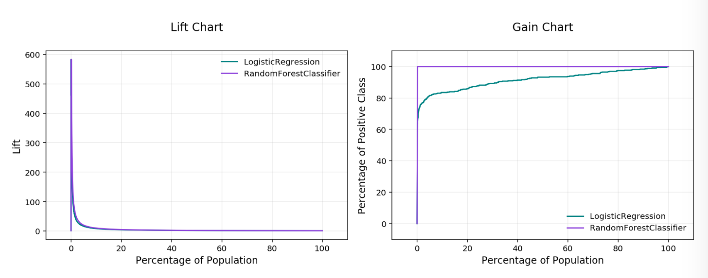
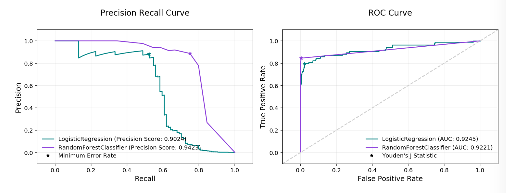

Binary Classification
*********************

Binary classification is a type of modeling wherein the output is binary. For example, Yes or No, Up or Down, 1 or 0. These models are a special case of multinomial classification so have specifically catered metrics.

The prevailing metrics for evaluating a binary classification model are accuracy, hamming loss, kappa score, precision, recall, :math:`F_1` and AUC. Most information about binary classification uses a few of these metrics to speak to the importance of the model.

* **Accuracy**:  The proportion of predictions that were correct. It is generally converted to a percentage where 100% is a perfect classifier. An accuracy of 50% is random (for a balanced dataset) and an accuracy of 0% is a perfectly wrong classifier.
* **AUC**: Area Under the Curve (AUC) refers to the area under an ROC curve. This is a numerical way to summarize the robustness of a model to its discrimination threshold. The AUC is computed by integrating the area under the ROC curve. It is akin to the probability that your model scores better on results to which it accredits a higher score. Thus 1.0 is a perfect score, 0.5 is the average score of a random classifier, and 0.0 is a perfectly backward scoring classifier.
* :math:`\mathbf{F_1}` **Score**: There is generally a trade-off between the precision and recall and the :math:`F_1` score is a metric that combines them into a single number. The :math:`F_1` Score is the harmonic mean of precision and recall:

  .. math::
  
      F_1 = 2  \frac{Precision * Recall}{Precision + Recall}
      
  Therefore a perfect :math:`F_1` score is 1. That is, the classifier has perfect precision and recall. The worst :math:`F_1` score is 0. The :math:`F_1` score of a random classifier is heavily dependent on the nature of the data.
* **Hamming Loss**: The proportion of predictions that were incorrectly classified and is equivalent to :math:`1-accuracy`. This means a Hamming Loss of 0 is a perfect classifier. A score of 0.5 is a random classifier (for a balanced dataset), and 1 is a perfectly incorrect classifier.
* **Kappa Score**: Cohen's :math:`\kappa` coefficient is a statistic that measures inter-annotator agreement. This function computes Cohen's :math:`\kappa`, a score that expresses the level of agreement between two annotators on a classification problem. It is defined as:

  .. math::
  
      \kappa = \frac{p_o - p_e}{1 - p_e}

  :math:`p_o` is the empirical probability of agreement on the label assigned to any sample (the observed agreement ratio). :math:`p_e` is the expected agreement when both annotators assign labels randomly. :math:`p_e` is estimated using a per-annotator empirical prior over the class labels.

* **Precision**: The proportion of the ``True`` class that were predicted to be ``True`` and are actually in the ``True`` class :math:`\frac{TP}{TP + FP}`. This is also known as Positive Predictive Value (PPV). A precision of 1.0 is perfect precision, 0.0 is *bad* precision. However, the precision of a random classifier varies highly based on the nature of the data and to a lesser extent a *bad* precision.
* **Recall**: This is the proportion of the ``True`` class predictions that were correctly predicted over the number of ``True`` predictions (correct or incorrect) :math:`\frac{TP}{TP + FN}`. This is also known as True Positive Rate (TPR) or Sensitivity. A recall of 1.0 is perfect recall, 0.0 is *bad* recall. however, the recall of a random classifier varies highly based on the nature of the data and to a lesser extent a *bad* recall.

The prevailing charts and plots for binary classification are the Precision-Recall Curve, the ROC curve, the Lift Chart, the Gain Chart, and the Confusion Matrix. These are inter-related with the previously described metrics and are commonly used in the binary classification literature.

* Confusion Matrix
* Gain Chart
* Lift Chart
* Precision-Recall Curve
* ROC curve

This code snippet demonstrates how to generate the above metrics and charts. The data has to be split into a testing and training set with the features in `X_train` and `X_test` and the responses in `y_train` and `y_test`.

.. code-block:: python3

    lr_clf = LogisticRegression(random_state=0, solver='lbfgs',
                              multi_class='multinomial').fit(X_train, y_train)
  
    rf_clf = RandomForestClassifier(n_estimators=10).fit(X_train, y_train)
  
    from ads.common.model import ADSModel
    bin_lr_model = ADSModel.from_estimator(lr_clf, classes=[0,1])
    bin_rf_model = ADSModel.from_estimator(rf_clf, classes=[0,1])
  
    from ads.evaluations.evaluator import ADSEvaluator
    from ads.common.data import MLData
  
    evaluator = ADSEvaluator(test, models=[bin_lr_model, bin_rf_model], training_data=train)

To use the ``ADSEvaluator`` the standard sklearn models into ``ADSModels``.

The ``ADSModel`` class in the ADS package has a ``from_estimator`` function that takes as input a fitted estimator and converts it into an ``ADSModel`` object. With classification, the class labels also need to be provided. The ``ADSModel`` object is used for evaluation by the ``ADSEvaluator`` object.

To show all of the metrics in a table, run:

.. code-block:: python3

    evaluator.metrics

.. figure:: figures/binary_eval_metrics.png
   :align: center

   **Evaluator Metrics**

To show all of the charts, run:

.. code-block:: python3

    evaluator.show_in_notebook(perfect=True)

   **Lift & Gain Chart**

   **Precision Recall and ROC Curves**

.. figure:: figures/binary_normalized_confusion_matrix.png
   :align: center

   **Normalized Confusion Matrix**

Important parameters:

* If ``perfect`` is set to True, ADS plots a perfect classifier for comparison in Lift and Gain charts.
* If ``baseline`` is set to True, ADS won't include a baseline for the comparison of various plots.
* If ``use_training_data`` is set True, ADS plots the evaluations of the training data.
* If ``plots`` contain a list of plot types, ADS plots only those plot types.

This code snippet demonstrates how to add a custom metric, a :math:`F_2` score, to the evaluator.

.. code-block:: python3

    from ads.evaluations.evaluator import ADSEvaluator
    evaluator = ADSEvaluator(test, models=[modelA, modelB, modelC modelD])

    from sklearn.metrics import fbeta_score
    def F2_Score(y_true, y_pred):
        return fbeta_score(y_true, y_pred, 2)
    evaluator.add_metrics([F2_Score], ["F2 Score"])
    evaluator.metrics

Fairness Metrics
----------------

.. versionadded:: 2.6.1.

Fairness metrics will be automatically generated for any feature specified in the ``protected_features`` argument to the ``ADSEvaluator`` object. The added metrics are:
  
* **Equal Odds**: For each of the `protected_features` specified, Equal Odds is a ratio between the positive rates for each class within that feature. The closer this value is to 1, the less biased the model and data are with respect to the feature, F. In other terms, for a binary feature F with classes A and B, Equal Odds is calculated using the following formula:

   .. math:: 

       \frac{P(\hat{y}=1 | Y=y,F=A)}{P(\hat{y}=1 | Y=y,F=B)}

* **Equal Opportunity**: For each of the `protected_features` specified, Equal Opportunity is a ratio between the true positive rates for each class within that feature. The closer this value is to 1, the less biased the model is with respect to the feature F. In other terms, for a binary feature F with classes A and B, Equal Opportunity is calculated using the following formula: 

  .. math:: 

    \frac{P(\hat{y}=1 | Y=1,F=A)}{P(\hat{y}=1 | Y=1,F=B)}

* **Statistical Parity**: For each of the `protected_features` specified, Statistical Parity is a ratio between the prediction rates for each class within that feature. The closer this value is to 1, the less biased the model and data are with respect to the feature F. In other terms, for a binary feature F with classes A and B, Statistical Parity is calculated using the following formula: 

  .. math:: 

    \frac{P(\hat{y} | F=A)}{P(\hat{y} | F=B)}

The following plots are added to explain the fairness metrics:

* Equal Odds Bar Chart: False Positive Rate bar chart by protected feature class
* Equal Opportunity Bar Chart: True Positive Rate bar chart by protected feature class
* Statistical Parity Bar Chart: Number of positive predictions by protected feature class

If ``protected_features`` contains a list of column names in data.X, ADS will generate fairness metrics for each of those columns. 
