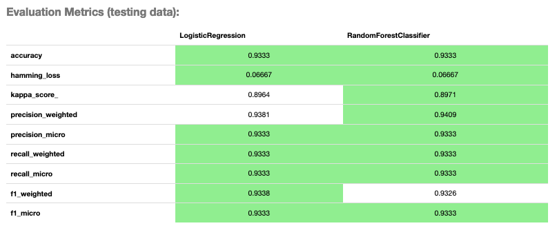
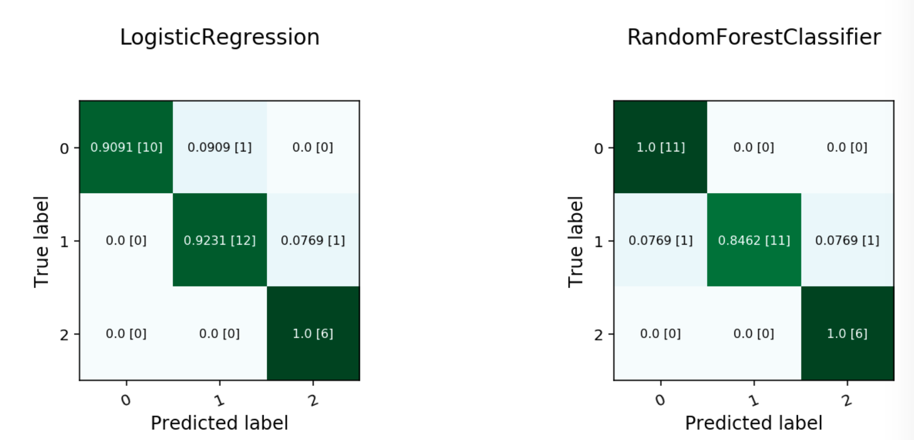
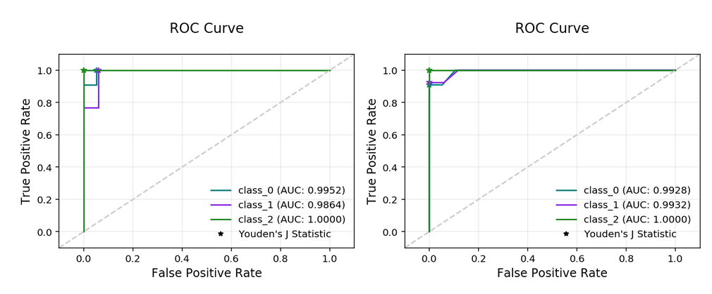
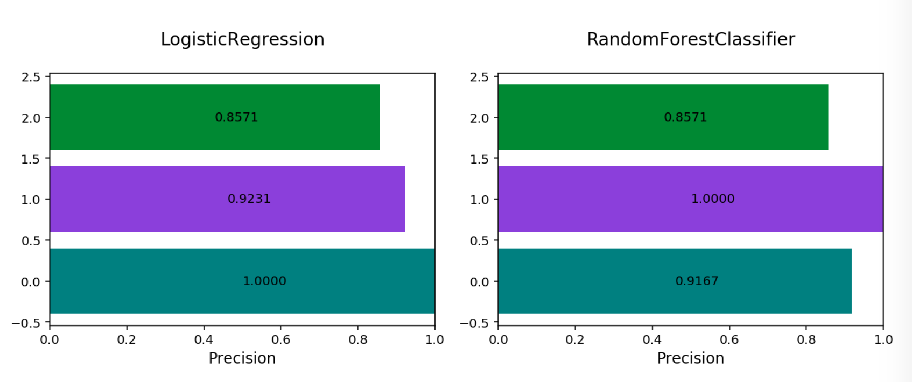
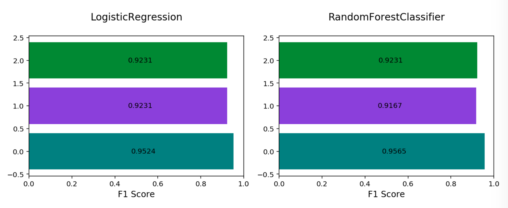

Multinomial Classification
**************************

Multinomial classification is a type of modeling wherein the output is discrete. For example, an integer 1-10, an animal at the zoo, 
or a primary color. These models have a specialized set of charts and metrics for their evaluation.

The prevailing metrics for evaluating a multinomial classification model are:

* **Accuracy**: The proportion of predictions that were correct. It is generally converted to a percentage where 100% is a perfect classifier. For a balanced dataset, an accuracy of :math:`\frac{100\%}{k}` where :math:`k` is the number of classes, is a random classifier. An accuracy of  0% is a perfectly wrong classifier.
* :math:`\mathbf{F_1}` **Score (weighted, macro or micro)**: There is generally a trade-off between the precision and recall and the :math:`F_1` score is a metric that combines them into a single number. The per-class :math:`F_1` score is the harmonic mean of precision and recall:

  .. math::
 
      F_1 = 2 \frac{Precision * Recall}{Precision + Recall} 

  As with precision, there are a number of other versions of :math:`F_1` that are used in multinomial classification. The       micro and weighted :math:`F_1` is computed the same as with precision, but with the per-class :math:`F_1` replacing the per-class precision. However, the macro :math:`F_1` is computed a little differently. The precision and recall are computed by summing the TP, FN, and FP across all classes, and then using them in the standard formulas.
* **Hamming Loss**: The proportion of predictions that were incorrectly classified and is equivalent to :math:`1-accuracy`.      This means a Hamming loss score of 0 is a perfect classifier. A score of :math:`\frac{k-1}{k}` is a random classifier for a balanced dataset, and 1.0 is a perfectly incorrect classifier.
* **Kappa Score**: Cohen's :math:`\kappa` coefficient is a statistic that measures inter-annotator agreement. This function computes Cohen's :math:`\kappa`, a score that expresses the level of agreement between two annotators on a classification problem. It is defined as:

  .. math::
      \kappa = \frac{p_o - p_e}{1 - p_e}
  
  :math:`p_o` is the empirical probability of agreement on the class assigned to any sample (the observed agreement ratio).  :math:`p_e` is the expected agreement when both annotators assign classes randomly. :math:`p_e` is estimated using a per-annotator empirical prior over the class.
* **Precision (weighted, macro or micro)**: This is the proportion of a class that was predicted to be in a given class and are actually in that class. In multinomial classification, it is common to report the precision for each class and this is called the per-class precision. It is computed using the same approach use in binary classification. For example, :math:`\frac{TP}{TP + FP}`, but only the class under consideration is used. A value of 1 means that the classifier was able to perfectly predict, for that class. A value of 0 means that the classifier was never correct, for that class. There are three other versions of precision that are used in multinomial classification and they are weighted, macro and micro-precision.  Weighted precision, :math:`P_w`, combines the per-class precision by the number of true classes:

  .. math::
 
      P_w = W_1 P_1 + \cdots + W_n P_n

  :math:`W_i` is the proportion of the true classes in class i :math:`P_i` is the per-class precision for the :math:`i^{th}` class. The macro-precision, :math:`P_m`, is the mean of all the per-class, :math:`P_i`, precisions.

  .. math::

      P_m = \frac{1}{n} \sum_{i} P_i

  The micro-precision, :math:`P_{\mu}`, is the same as the accuracy, micro-recall, and micro :math:`F_1`. 
* **Recall (weighted, macro or micro)**: This is the proportion of the True class predictions that were correctly predicted over the number of True predictions (correct or incorrect) :math:`\frac{TP}{TP + FN}`. This is also known as the True Positive Rate (TPR) or Sensitivity. In multinomial classification, it is common to report the recall for each class and this is called the micro-recall. It is computed using the same approach as in the case of binary classification, but is reported for each class. A recall of 1 is perfect recall, 0 is "bad" recall. 
      
  As with precision, there are three other versions of recall that are used in multinomial classification. They are weighted, macro and micro-recall. The definitions are the same except the per-class recall replaces the per-class precision in the preceding equations.

Generally, several of these metrics are used in combination to describe the performance of a multinomial classification model.

The prevailing charts and plots for multinomial classification are the Precision-Recall Curve, the ROC curve, the Lift Chart, the Gain Chart, and the Confusion Matrix. These are inter-related with preceding metrics, and are common across most multinomial classification literature.

For multinomial classification you can view the following using ``show_in_notebook()``:

* ``confusion_matrix``: A matrix of the number of actual versus predicted values for each class, see `[Read More] <https://en.wikipedia.org/wiki/Confusion_matrix>`__.
* ``f1_by_label``: Harmonic mean of the precision and recall by class metrics. Compute :math:`F_1` for each class, see `[Read More] <https://en.wikipedia.org/wiki/F1_score>`__
* ``jaccard_by_label``: Computes the similarity for each class distribution, see `[Read More] <https://en.wikipedia.org/wiki/Jaccard_index>`__.
* ``pr_curve``: A plot of a precision versus recall (the proportion of positive class predictions that were correct versus the proportion of positive class objects that were correctly identified), see `[Read More] <https://en.wikipedia.org/wiki/Precision_and_recall>`__.
* ``precision_by_label``: It considers one class as a positive class and rest as negative. Compute precision for each, precision numbers in this example, see `[Read More] <https://en.wikipedia.org/wiki/Precision_(statistics)>`__.
* ``recall_by_label``: It considers one class as a positive class and rest as negative. Compute recall for each, recall numbers in this example, `[Read More] <https://en.wikipedia.org/wiki/Precision_and_recall>`__.
* ``roc_curve``: A plot of a true positive rate versus a false positive rate (recall vs the proportion of negative class objects that were identified incorrectly), see `[Read More] <https://en.wikipedia.org/wiki/Receiver_operating_characteristic>`__.

To generate all of these metrics and charts for a list of multinomial classification models on the test dataset, you can run the following:

.. code-block:: python3

     lr_clf = LogisticRegression(random_state=0, solver='lbfgs',
                               multi_class='multinomial').fit(X_train, y_train)
     rf_clf = RandomForestClassifier(n_estimators=10).fit(X_train, y_train)
   
     from ads.common.model import ADSModel
     lr_model = ADSModel.from_estimator(lr_clf, classes=[0,1,2])
     rf_model = ADSModel.from_estimator(rf_clf, classes=[0,1,2])
   
     from ads.evaluations.evaluator import ADSEvaluator
     from ads.common.data import MLData
   
     multi_evaluator = ADSEvaluator(test, models=[lr_model, rf_model])

To use ``ADSEvaluator``, models have to be converted into ``ADSModel`` types.

The ``ADSModel`` class in the ADS package has a ``from_estimator`` function that takes as input a fitted estimator and converts it into an ``ADSModel`` object. With classification, you have to pass the class labels in the class argument too. The ``ADSModel`` object is used for evaluation using the ``ADSEvaluator`` object.

To show all of the metrics in a table, run:

.. code-block:: python3

    evaluator.metrics

   **Evaluator Metrics**

.. code-block:: python3

  evaluator.show_in_notebook()

   **Multinomial Confusion Matrix**

   **Multinomial ROC Curve**

.. figure:: figures/multinomial_PR_curve.png
   :align: center

   **Multinomial Precision Recall Curve**

   **Multinomial Precision By Class**

   **Multinomial F1 By Class**

.. figure:: figures/multinomial_jaccard_by_label.png
   :align: center

   **Multinomial Jaccard By Class**

Multinomial classification includes the following metrics:

* ``accuracy``: The number of correctly classified examples divided by total examples.
* ``hamming_loss``: 1 - accuracy
* ``precision_weighted``: The weighted average of ``precision_by_label``. Weights are proportional to the number of true instances for each class.
* ``precision_micro``: Global precision. Calculated by using global true positives and false positives.
* ``recall_weighted``: The weighted average of ``recall_by_label``. Weights are proportional to the number of true instances for each class.
* ``recall_micro``: Global recall. Calculated by using global true positives and false negatives.
* ``f1_weighted``: The weighted average of ``f1_by_label``. Weights are proportional to the number of true instances for each class.
* ``f1_micro``: Global :math:`F_1`. It is calculated using the harmonic mean of micro precision and recall metrics.

All of these metrics can be computed directly from the confusion matrix.

If the preceding metrics don't include the specific metric you want to use, maybe an F2 score, simply add it to your evaluator object as in this example:

.. code-block:: python3

    from ads.evaluations.evaluator import ADSEvaluator
    evaluator = ADSEvaluator(test, models=[modelA, modelB, modelC modelD])

    from sklearn.metrics import fbeta_score
    def F2_Score(y_true, y_pred):
        return fbeta_score(y_true, y_pred, 2)
    evaluator.add_metrics([F2_Score], ["F2 Score"])
    evaluator.metrics
