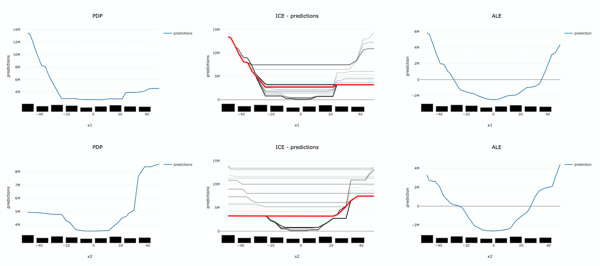
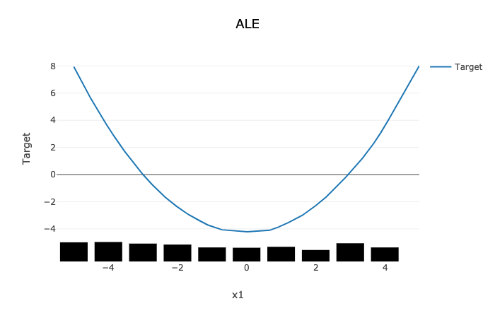

Accumulated Local Effects
*************************

Overview
========

Similar to Partial Dependence Plots (PDP), Accumulated Local Effects (ALE) is a model-agnostic global explanation method that evaluates the relationship between feature values and target variables. However, in the event that features are highly correlated, PDP may include unlikely combinations of feature values in the average prediction calculation due to the independent manipulation of feature values across the marginal distribution. This lowers the trust in the PDP explanation when features have strong correlation. Unlike PDP, ALE handles feature correlations by averaging and accumulating the difference in predictions across the conditional distribution, which isolates the effects of the specific feature. This comes at the cost of requiring a larger number of observations and a near uniform distribution of those observations so that the conditional distribution can be reliably determined.

Description
===========

ALE highlights the effects that specific features have on the predictions of a machine learning model by partially isolating the effects of other features. Therefore, it tends to be robust against correlated features. The resulting ALE explanation is centered around the mean effect of the feature, such that the main feature effect is compared relative to the average prediction of the data.

Correlated features can negatively affect the quality of many explanation techniques. Specifically, many challenges arise when the black-box model is used to make predictions on unlikely artificial data. That is data that that fall outside of the expected data distribution but are used in an explanation because they are not independent and the technique is not sensitive to this possibility. This can occur, for example, when the augmented data samples are not generated according the feature correlations or the effects of other correlated features are included in the evaluation of the feature of interest. Consequently, the resulting explanations may be misleading. In the context of PDP, the effect of a given feature may be heavily biased by the interactions with other features.

To address the issues associated with correlated features, ALE:

* Uses the conditional distribution of the feature of interest to generate augmented data. This tends to create more realistic data that using marginal distribution. This helps to ensure that evaluated feature values, e.g., ``xi``, are only compared with instances from the dataset that have similar values to ``xi``.
* Calculates the average of the differences in model predictions over the augmented data, instead of the average of the predictions themselves. This helps to isolate the effect of the feature of interest. For example, assuming we are evaluating the effect of a feature at value ``xi``, ALE computes the average of the difference in model predictions of the values in the neighborhood of ``xi``. That is, that observation within ``xi`` ±ϵ that meet the conditional requirement. This helps to reduce the effects of correlated features.

The following example demonstrates the challenges with accurately evaluating the effect of a feature on a model’s predictions when features are highly correlated. Let us assume that features ``x1`` and ``x2`` are highly correlated. We can artificially construct ``x2`` by starting with ``x1`` and adding a small amount of random noise. Further assume that the target value is the product of these two features (e.g., y = ``x1`` * ``x2``). Since ``x1`` and ``x2`` are almost identical, the target value has a quadratic relationship with them. 
A decision tree is trained on this dataset. Then different explanation techniques, PDP (first column), ICE (second column), and ALE (third column), are used to evaluate the effect of the features on the model predictions. Features ``x1`` and ``x2`` are evaluated in the first and second row, respectively. The following image demonstrates that PDP is unable to accurately identify the expected relationship due to the assumption that the features are not correlated. An examination of the ICE plots revels the quadratic relationship between the features and the target. However, the when taking as an aggregate, this effect disappears. In contrast, ALE is able to properly capture the isolated effect of each feature, highlighting the quadratic relationship.

The following summarizes the steps in computing ALE explanation (note: MLX supports one-feature ALE):

* Start with a trained model.
* Select a feature to explain (for example, one of the important features identified in the global feature importance explanations).
* Compute the intervals of the selected feature to define the upper and lower bounds used to compute the difference in model predictions when the feature is increased or decreased.

  - Numerical features: using the selected feature’s value distribution extracted from the train dataset, MLX selects multiple different intervals from the feature’s distribution to evaluate (e.g., based on percentiles). The number of intervals to use and the range of the feature’s distribution to consider are configurable.
  - Categorical features: since ALE computes the difference in model predictions between an increase and decrease in a feature’s value, features must have some notion of order. This can be challenging for categorical features, as there may not be a notion of order (e.g., eye color). To address this, MLX estimates the order of categorical feature values based on a categorical feature encoding technique. MLX provides multiple different encoding techniques based on the input data (e.g., ``distance_similarity``: computes a similarity matrix between all categorical feature values and the other feature values, and orders based on similarity.   Target-based approaches estimate the similarity/order based on the relationship of categorical feature values with the target variable. The supported techniques include, target encoding, ``target``, James-Stein encoding, ``jamesstein``, Generalized Linear Mixed Model encoding, ``glmm``, M-estimate encoding, ``mestimate``, and Weight of Evidence encoding, ``woe``. The categorical feature value order is then used to compute the upper (larger categorical value) and lower (smaller categorical value) bounds for the selected categorical feature.

* For each interval, MLX approximates the conditional distribution by identifying the samples that are in the neighborhood of the sample of interest. It then calculates the difference in the model prediction when the selected feature’s value of the samples is replaced by the upper and lower limits of the interval. If **N** different intervals are selected from the feature’s distribution, this process results in **2N** different augmented datasets It is **2N** as each selected feature of the sample are replaced with the upper and lower limits of the interval. The model inference then generates **2N** different model predictions, which are used to calculate the **N** differences.
* The prediction differences within each interval are averaged and accumulated in order, such that the ALE of a feature value that lies in the **k-th** interval is the sum of the effects of the first through the **k-th** interval.
* Finally, the accumulated feature effects at each interval is centered, such that the mean effect is zero.

Interpretation
==============

* Continuous or discrete numerical features: Visualized as line graphs. Each line represents the change in the model prediction when the selected feature has the given value compared to the average prediction. For example, an ALE value of ±b at xj = k indicates that when the value of feature j is equal to k, the model prediction is higher/lower by b compared to the average prediction. The x-axis shows the selected feature values and the y-axis shows the delta in the target prediction variable relative to the average prediction (e.g., the prediction probability for classification tasks and the raw predicted values for regression tasks).
* Categorical features: Visualized as vertical bar charts. Each bar represents the change in the model prediction when the selected feature has the given value compared to the average prediction. The interpretation of the value of the bar is similar to continuous features. The x-axis shows the different categorical values for the selected feature and the y-axis shows the change in the predicted value relative to the average prediction. This would be the prediction probability for classification tasks and the raw predicted values for regression tasks.

Limitations
===========

There is an increased computational cost for performing an ALE analysis because of the large number of models that need to be computed relative to PDP. On a small dataset, this is generally not an issue. However, on larger datasets it can be. It is possible to parallelize the process and to also compute it in a distributed manner.

The main disadvantage comes from the problem of sparsity of data. There needs to be sufficient number of observations in each neighborhood that is used in order to make a reasonable estimation. Even with large dataset this can be problematic if the data is not uniformly sampled, which is rarely the case. Also, with higher dimensionality the problem is made increasingly more difficult because of this curse of dimensionality.

Depending on the class of model that is being use, it is common practice to remove highly correlated features. In this cases there is some rational to using a PDP for interpretation. However, if there is correlation in the data and the sampling of the data is suitable for an ALE analysis, it may be the preferred approach.

Examples
========

The following is a purposefully extreme, but realistic, example that demonstrates the effects of highly correlated features on PDP and ALE explanations. The data set has three columns, ``x1``, ``x2`` and ``y``.

* ``x1`` is generated from a uniform distribution with a range of [-5, 5]. 
* ``x2`` is ``x1`` with some noise. ``x1`` and ``x2`` are highly correlated for illustration purposes.
* ``y`` is our target which is generated from an interaction term of ``x1 * x2`` and ``x2``.  

This model is trained using a Sklearn RegressorMixin model and wrapped in an ``ADSModel`` object. Please note that the ADS model explainers work with any model that is wrapped in an ADSModel object.

.. code-block:: python3

    import numpy as np
    import pandas as pd
    from ads.dataset.factory import DatasetFactory
    from ads.common.model import ADSModel
    from sklearn.base import RegressorMixin

    x1 = (np.random.rand(500) - 0.5) * 10
    x2 =  x1 + np.random.normal(loc=0, scale=0.5, size=500)
    y = x1 * x2

    correlated_df = pd.DataFrame(np.stack((x1, x2, y), axis=1), columns=['x1', 'x2', 'y'])
    correlated_ds = DatasetFactory.open(correlated_df, target='y')

    correlated_train, _ = correlated_ds.train_test_split(test_size=0)

    class CorrelatedRegressor(RegressorMixin):
        '''
        implement the true model
        '''
        def fit(self, X=None, y=None):
            self.y_bar_ = X.iloc[:, 0].to_numpy() * X.iloc[:, 1].to_numpy() + X.iloc[:, 1].to_numpy()
            
        def predict(self, X=None):
            return X.iloc[:, 0].to_numpy() * X.iloc[:, 1].to_numpy() + X.iloc[:, 1].to_numpy()
    

    # train a RegressorMixin model
    # Note that the ADSExplainer below works with any model (classifier or
    # regressor) that is wrapped in an ADSModel
    correlated_regressor = CorrelatedRegressor()
    correlated_regressor.fit(correlated_train.X, correlated_train.y)

    # Build ads models from ExtraTrees regressor
    correlated_model = ADSModel.from_estimator(correlated_regressor, name="TrueModel")

    # Create the ADS explainer object, which is used to construct
    # global and local explanation objects. The ADSExplainer takes
    # as input the model to explain and the train/test dataset
    from ads.explanations.explainer import ADSExplainer
    correlated_explainer = ADSExplainer(correlated_train, correlated_model, training_data=correlated_train)

    # With ADSExplainer, create a global explanation object using
    # the MLXGlobalExplainer provider
    from ads.explanations.mlx_global_explainer import MLXGlobalExplainer
    correlated_global_explainer = correlated_explainer.global_explanation(provider=MLXGlobalExplainer())    

    # A summary of the global accumulated local effects explanation
    # algorithm and how to interpret the output
    correlated_global_explainer.accumulated_local_effects_summary()

    # compute a PDP between x1 and the target, y
    pdp_x1 = correlated_global_explainer.compute_partial_dependence("x1")
    pdp_x1.show_in_notebook()

.. image:: figures/ads_mlx_ale_pdp_x1.png

The PDP plot shows a rug plot of the actual ``x1`` values along the x-axis and the relationship between ``x1`` and ``y`` appears as a line. However, it is known that the true relationship is not linear. ``y`` is the product of ``x1`` and ``x2``. Since ``x2`` nearly identical to ``x1``, effectively the relationship between ``x1`` and ``y`` is quadratic.  The high level of correlation between ``x1`` and ``x2`` violates one of the assumptions of the PDP. As demonstrated, the bias created by this correlation results in a poor representation of the global relationship between ``x1`` and ``y``.

.. code-block:: python3

    # Compute the ALE on x1
    ale_x1 = correlated_global_explainer.compute_accumulated_local_effects("x1")
    ale_x1.show_in_notebook()

In comparison, the ALE plot does not have as strong a requirement that the features are uncorrelated. As such, there is very little bias introduced when they are. The following ALE plot demonstrates that it is able to accurately represent the relationship between ``x1`` and ``y`` as being quadratic. This is due to the fact that ALE uses the conditional distribution of these two features. This can be thought of as only using those instances where the values of ``x1`` and ``x2`` are close.

In general, ALE plots are unbiased with correlated features as they use conditional probabilities. The PDP method uses the marginal probability and that can introduce a bias when there are highly correlated features. The advantage is that when the data is not rich enough to adequately determine all of the conditional probabilities or when the features are not highly correlated, it can be an effective method to assess the global impact of a feature in a model.

References
==========

- `Accumulated Local Effects (ALE) Plot <https://christophm.github.io/interpretable-ml-book/ale.html>`_
- `Visualizing the effects of predictor variables in black box supervised learning models <https://arxiv.org/abs/1612.08468>`_

