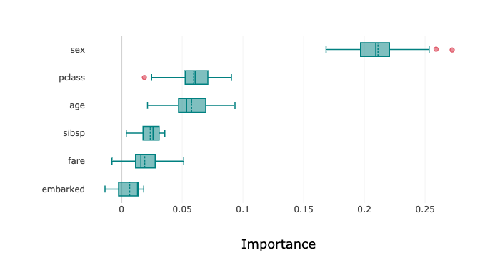

Feature Importance Explanations
*******************************

Overview
=========

Feature permutation importance is a model-agnostic global explanation method that provides insights into a machine learning model's behavior. It estimates and ranks feature importance based on the impact each feature has on the trained machine learning model's predictions.

Description
===========

Feature permutation importance measures the predictive value of a feature for any black box estimator, classifier, or regressor. It does this by evaluating how the prediction error increases when a feature is not available. Any scoring metric can be used to measure the prediction error. For example, :math:`F_1` for classification or R\ :sup:`2` \ for regression. To avoid actually removing features and retraining the estimator for each feature, the algorithm randomly shuffles the feature values effectively adding noise to the feature. Then, the prediction error of the new dataset is compared with the prediction error of the original dataset. If the model heavily relies on the column being shuffled to accurately predict the target variable, this random re-ordering causes less accurate predictions. If the model does not rely on the feature for its predictions, the prediction error remains unchanged.

The following summarizes the main steps in computing feature permutation importance explanations:

* Start with a trained machine learning model.
* Calculate the baseline prediction error on the given dataset. For example, train dataset or test dataset.
* For each feature:

  1. Randomly shuffle the feature column in the given dataset.
  2. Calculate the prediction error on the shuffled dataset.
  3. Store the difference between the baseline score and the shuffled dataset score as the feature importance. For example, baseline score -  shuffled score.

* Repeat the preceding three steps multiple times then report the average. Averaging mitigates the effects of random shuffling.
* Rank the features based on the average impact each feature has on the model's score. Features that have a larger impact on the score when shuffled are assigned higher importance than features with minimal impact on the model's score.
* In some cases, randomly permuting an unimportant feature can actually have a positive effect on the model's prediction so the feature's contribution to the model's predictions is effectively noise. In the feature permutation importance visualizations, ADS caps any negative feature importance values at zero.

Interpretation
==============

Feature permutation importance explanations generate an ordered list of features along with their importance values. Interpreting the output of this algorithm is straightforward. Features located at higher ranks have more impact on the model predictions. Features at lower ranks have less impact on the model predictions. Additionally, the importance values represent the relative importance of features.

The output supports three types of visualizations. They are all based on the same data but present the data differently for various use cases:

* **Bar chart** (``'bar'``): The bar chart shows the model's view of the relative feature importance. The x-axis highlights feature importance. A longer bar indicates higher importance than a shorter bar. Each bar also shows the average feature importance value along with the standard deviation of importance values across all iterations of the algorithm (mean importance +/- standard deviation*). Negative importance values are capped at zero. The y-axis shows the different features in the relative importance order. The top being the most important, and the bottom being the least important.
* **Box plot** (``'box_plot'``): The detailed box plot shows the feature importance values across the iterations of the algorithm. These values are used to compute the average feature importance and the corresponding standard deviations shown in the bar chart. The x-axis shows the impact that permuting a given feature had on the model's prediction score. The y-axis shows the different features in the relative importance order. The top being the most important, and the bottom being the least important. The minimum, first   quartile, median, third quartile, and a maximum of the feature importance values across different iterations of the algorithm are shown by each box.
* **Detailed scatter plot** (``'detailed'``): The detailed bar chart shows the feature importance values for each iteration of the algorithm. These values are used to compute the average feature importance values and the corresponding standard deviations shown in the bar chart. The x-axis shows the impact that permuting a given feature had on the model's prediction score. The y-axis shows the different features in the relative importance order. The top being the most important, and the bottom being the least important. The color of each dot in the graph indicates the quality of the permutation for this iteration, which is computed by measuring the correlation of the permuted feature column relative to the original feature colum. For example, how different is the permuted feature column versus the original feature column.

Examples
========

This example generates and visualizes a global feature permutation importance explanation on the `Titanic dataset <https://www.openml.org/d/40945>`_. The model is constructed using the ADS ``OracleAutoMLProvider``. However, the ADS model explainers work with any model (classifier or regressor) that is wrapped in an ``ADSModel`` object.

.. code-block:: python3

    import logging
    import requests
    
    from ads.automl.driver import AutoML
    from ads.automl.provider import OracleAutoMLProvider
    from ads.dataset.factory import DatasetFactory
    from os import path

    # Prepare and load the dataset
    titanic_data_file = '/tmp/titanic.csv'
    if not path.exists(titanic_data_file):
        # fetch sand save some data
        print('fetching data from web...', end=" ")
        # Data source: https://www.openml.org/d/40945
        r = requests.get('https://www.openml.org/data/get_csv/16826755/phpMYEkMl')
        with open(titanic_data_file, 'wb') as fd:
            fd.write(r.content)
        print("Done")
    ds = DatasetFactory.open(
           titanic_data_file, target="survived").set_positive_class(True)
    ds = ds.drop_columns(['name', 'ticket', 'cabin', 'boat',
                          'body', 'home.dest'])
    ds = ds[ds['age'] != '?'].astype({'age': 'float64'})
    ds = ds[ds['fare'] != '?'].astype({'fare': 'float64'})
    train, test = ds.train_test_split(test_size=0.2)

    # Build the model using AutoML. 'model' is a subclass of type ADSModel.
    # Note that the ADSExplainer below works with any model (classifier or
    # regressor) that is wrapped in an ADSModel
    ml_engine = OracleAutoMLProvider(n_jobs=-1, loglevel=logging.ERROR)
    oracle_automl = AutoML(train, provider=ml_engine)
    model, baseline = oracle_automl.train()

    # Create the ADS explainer object, which is used to construct global
    # and local explanation objects. The ADSExplainer takes as input the
    # model to explain and the train/test dataset
    from ads.explanations.explainer import ADSExplainer
    explainer = ADSExplainer(test, model, training_data=train)

    # With ADSExplainer, create a global explanation object using
    # the MLXGlobalExplainer provider
    from ads.explanations.mlx_global_explainer import MLXGlobalExplainer
    global_explainer = explainer.global_explanation(
                         provider=MLXGlobalExplainer())

    # A summary of the global feature permutation importance algorithm and
    # how to interpret the output can be displayed with
    global_explainer.feature_importance_summary()

    # Compute the global Feature Permutation Importance explanation
    importances = global_explainer.compute_feature_importance()

    # ADS supports multiple visualizations for the global Feature
    # Permutation Importance explanations (see "Interpretation" above)

    # Simple bar chart highlighting the average impact on model score
    # across multiple iterations of the algorithm
    importances.show_in_notebook()

.. image:: figures/ads_mlx_titanic_pi_bar.png

.. code-block:: python3

    # Box plot highlighting the mean, median, quartiles, and min/max
    # impact on model score across multiple iterations of the algorithm
    importances.show_in_notebook('box_plot')

.. code-block:: python3

    # Detailed scatter plot highlighting the individual impacts on
    # model score across multiple iterations of the algorithm
    importances.show_in_notebook('detailed')

.. image:: figures/ads_mlx_titanic_pi_scatter.png

.. code-block:: python3

    # The raw explanaiton data used to generate the visualizations, as well
    # as the runtime performance information can be extracted with
    importances.get_diagnostics()

.. image:: figures/ads_mlx_titanic_pi_diagnostics.png

References
==========

* `Feature importance <https://christophm.github.io/interpretable-ml-book/feature-importance.html>`_
* `Perutation importance <https://eli5.readthedocs.io/en/latest/blackbox/permutation_importance.html>`_
* `Vanderbilt Biostatistics - titanic data <http://biostat.mc.vanderbilt.edu/wiki/pub/Main/DataSets/titanic.html>`_

