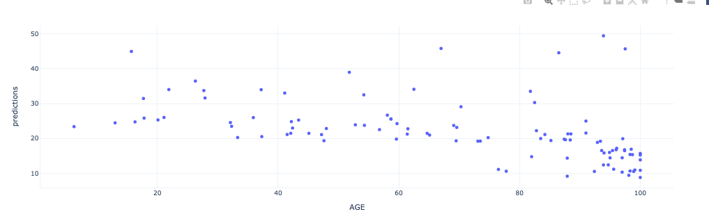
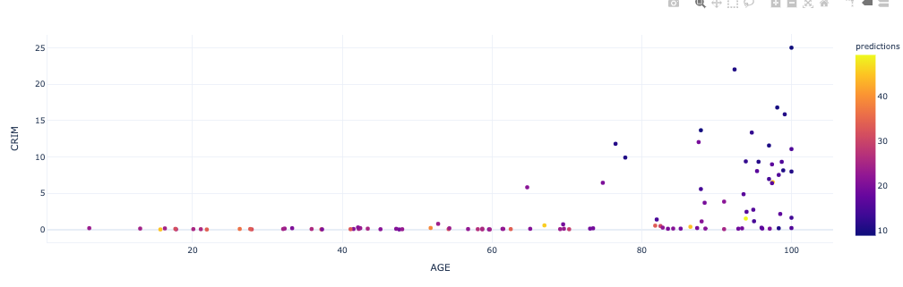

WhatIf Explainer
****************

Description
===========

The WhatIf explainer tool helps to understand how changes in an observation affect a model's prediction. Use it to explore a model's behavior on a single observation or the entire dataset by asking "what if" questions.

The WhatIf explainer has the following methods:

* ``explore_predictions``: Explore the relationship between feature values and the model predictions.
* ``explore_sample``: Modify the values in an observation and see how the prediction changes.

Example
========

In this example, a WhatIf explainer is created, and then the ``explore_predictions()``, and ``explore_sample()`` methods are demonstrated. A tree-based model is used to make predictions on the Boston housing dataset.

.. code-block:: python3

    from ads.common.model import ADSModel
    from ads.dataset.dataset_browser import DatasetBrowser
    from ads.dataset.label_encoder import DataFrameLabelEncoder
    from ads.explanations.explainer import ADSExplainer
    from ads.explanations.mlx_whatif_explainer import MLXWhatIfExplainer
    from sklearn.ensemble import ExtraTreesRegressor
    from sklearn.pipeline import make_pipeline
    from sklearn.preprocessing import LabelEncoder
    import logging
    import warnings

    logging.basicConfig(format='%(levelname)s:%(message)s', level=logging.ERROR)
    warnings.filterwarnings('ignore')

    ds = DatasetBrowser.sklearn().open("boston").set_target("target")
    train, test = ds.train_test_split(test_size=0.2)

    X_boston = train.X.copy()
    y_boston = train.y.copy()

    le = DataFrameLabelEncoder()
    X_boston = le.fit_transform(X_boston)

    # Model Training
    ensemble_regressor = ExtraTreesRegressor(n_estimators=245, random_state=42)
    ensemble_regressor.fit(X_boston, y_boston)
    model = ADSModel.from_estimator(make_pipeline(le, ensemble_regressor), name="ExtraTreesRegressor")
    
    # Build a WhatIf Explainer
    explainer = ADSExplainer(test, model, training_data=train)
    whatif_explainer = explainer.whatif_explanation(provider=MLXWhatIfExplainer())

The Sample Explorer method, ``explore_sample()``, opens a GUI that has a single observation. The values of that sample can then be changed. By clicking **Run Inference**, the model computes the prediction with the updated feature values. The interface shows the original values and the values that have been changed.

``example_sample()`` accepts the ``row_idx`` parameter that specifies the index of the observation that is to be evaluated. The default is zero (0). The ``features`` parameter lists the feature names that are shown in the interface.  By default, it displays all features. For datasets with a large number of features, this can be cumbersome so the ``max_features`` parameter can be used to display only the first *n* features.

The following command opens the Sample Explorer. Change the values then click **Run Inference** to see how the prediction changes.

.. code-block:: python3

    whatif_explainer.explore_sample()

.. image:: figures/ads_mlx_boston_whatif_explore_sample.png

The Predictions Explorer method, ``explore_predictions()``, allows the exploration of model predictions across either the marginal distribution (1-feature) or the joint distribution (2-features).

The method ``explore_predictions()`` has several optional parameters including:

* ``discretization``: (str, optional) Discretization method applies the x-axis if the feature ``x`` is continuous. The valid options are 'quartile', 'decile', or 'percentile'. The default is None.
* ``label``: (str or int, optional) Target label or target class name to explore only for classification problems. The default is None.
* ``plot_type``: (str, optional) Type of plot. For classification problems the valid options are 'scatter', 'box', or 'bar'. For a regression problem, the valid options are 'scatter' or 'box'. The default is 'scatter'.
* ``x``: (str, optional) Feature column on x-axis. The default is None.
* ``y``: (str, optional) Feature column or model prediction column on the y-axis, by default it is the target.

When only ``x`` is set, the chart shows the relationship between the features ``x`` and the target ``y``.

.. code-block:: python3

    whatif_explainer.explore_predictions(x='AGE')

If features are specified for both ``x`` and ``y``, the plot uses color to indicate the value of the target.

.. code-block:: python3

    whatif_explainer.explore_predictions(x='AGE', y='CRIM')

.. code-block:: python3

    whatif_explainer.explore_predictions(x='RAD', plot_type='box', discretization='decile')

.. image:: figures/ads_mlx_boston_whatif_explore_predictions_3.png

