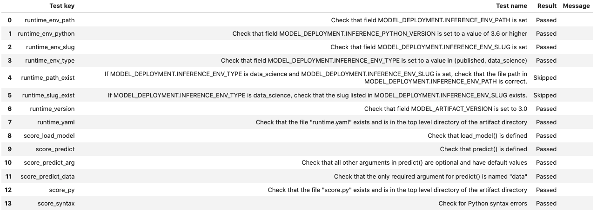

==================
Model Registration
==================

Model Artifact
--------------

To save a trained model on OCI Data Science, prepare a ``Model Artifact``.

Model Artifact is a zip file which contains the following artifacts -

 - Serialized model or models
 - ``runtime.yaml`` - This yaml captures provenance information and deployment conda environment
 - score.py - Entry module which is used by the model deployment server to load the model and run prediction
 - input_schema.json - Describes the schema of the features that will be used within predict function
 - output_schema.json - Describes the schem of the prediction values
 - Any other artifcat that are required during inference time.

ADS can auto generate all the mandatory files to help save the models that are compliant with the ``OCI Data Science Model Deployment`` service.

Auto generation of ``score.py`` with framework specific code for loading models and fetching prediction is available for following frameworks-

* scikit-learn
* XGBoost
* LightGBM
* PyTorch
* SparkPipelineModel
* TensorFlow

To accomodate for other frameworks that are unknown to ADS, a template code for ``score.py`` is generated in the provided artificat directory location.

Prepare the Model Artifact
--------------------------

To prepare the model artifact -

* Train a model using the framework of your choice
* Create a Model object from one of the framework specific Models available under ads.model.framework.*. The Model class takes two parameters - estimator object and a directory location to store autogenerated artifacts.
* call ``prepare()`` to generate all the files.

See `API documentation <../../ads.model.html#id7>`__ for more details about the parameters.

Here is an example for preparing a model artifact for ``TensorFlow`` model.

.. code-block:: python3

    from ads.model.framework.tensorflow_model import TensorFlowModel
    import tempfile
    import tensorflow as tf
    from ads.common.model_metadata import UseCaseType

    mnist = tf.keras.datasets.mnist
    (x_train, y_train), (x_test, y_test) = mnist.load_data()
    x_train, x_test = x_train / 255.0, x_test / 255.0

    tf_estimator = tf.keras.models.Sequential(
            [
                tf.keras.layers.Flatten(input_shape=(28, 28)),
                tf.keras.layers.Dense(128, activation="relu"),
                tf.keras.layers.Dropout(0.2),
                tf.keras.layers.Dense(10),
            ]
        )
    loss_fn = tf.keras.losses.SparseCategoricalCrossentropy(from_logits=True)
    tf_estimator.compile(optimizer="adam", loss=loss_fn, metrics=["accuracy"])
    tf_estimator.fit(x_train, y_train, epochs=1)

    tf_model = TensorFlowModel(tf_estimator, artifact_dir=tempfile.mkdtemp())

    # Autogenerate score.py, pickled model, runtime.yaml, input_schema.json and output_schema.json
    tf_model.prepare(inference_conda_env="generalml_p38_cpu_v1",
                        use_case_type=UseCaseType.MULTINOMIAL_CLASSIFICATION,
                        X_sample=trainx,
                        y_sample=trainy
                    )

    # Verify generated artifacts
    tf_model.verify(x_test[:1])

    # Register TensorFlow model
    model_id = tf_model.save()

.. parsed-literal::

    ['output_schema.json', 'score.py', 'runtime.yaml',  'model.h5', '.model-ignore', 'input_schema.json']

ADS automatically captures:

 * Provenance metadata - commit id, git branch, etc
 * Taxonomy metadata such as model hyperparameters, framework name.
 * Custom metadata such as Data science conda environment when available, Model artifact inventory, model serialization format, etc.
 * Schema of input and target variables. This requires input sample and target sample to be passed while calling ``prepare``

**Note**:

*  ``UseCaseType`` in ``metadata_taxonomy`` cannot be automatically populated. One way to populate the use case is to pass ``use_case_type`` to the ``prepare`` method.
*  Model introspection is automatically triggered.

.. include:: _template/score.rst

Model Introspection
-------------------

The ``.intropect()`` method runs some sanity checks on the ``runtime.yaml``, and ``score.py`` files. This is to help you identify potential errors that might occur during model deployment. It checks fields such as environment path, validates the path's existence on the Object Storage, checks if the ``.load_model()``, and ``.predict()`` functions are defined in ``score.py``, and so on. The result of model introspection is automatically saved to the taxonomy metadata and model artifacts.

.. code-block:: python3

    tf_model.introspect()

.. parsed-literal::

    ['output_schema.json', 'runtime.yaml', 'model.joblib', 'input_schema.json', 'score.py']

Reloading model artifacts automatically invokes model introspection.  However, you can invoke introspection manually by calling ``tf_model.introspect()``:

The ``ArtifactTestResults`` field is populated in ``metadata_taxonomy`` when ``instrospect`` is triggered:

.. code-block:: python3

    tf_model.metadata_taxonomy['ArtifactTestResults']

.. parsed-literal::

    key: ArtifactTestResults
    value:
      runtime_env_path:
        category: conda_env
        description: Check that field MODEL_DEPLOYMENT.INFERENCE_ENV_PATH is set
      ...

Save Model
----------

The `.save()` method saves the model artifacts, introspection results, schema, metadata, etc on OCI Data Science Service and returns a model OCID.
See `API documentation <../../ads.model.html#id15>`__ for more details.

.. code-block:: python3

    model_catalog_id = tf_model.save(display_name='TF Model')

You can print a model to see some details about it.

.. code-block:: python3

    print(tf_model)

You can also print a summary status of the model.

.. code-block:: python3

    lgbm_model.summary_status()

Save Large Model
----------------

.. versionadded:: 2.6.4

Large models are models with artifacts between 2 and 6 GB. You must first upload large models to an Object Storage bucket, and then transfer them to a model catalog.

ADS :doc:`framework specific wrapper <quick_start>` classes save large models using a process almost identical to model artifacts that are less than 2GB. An Object Storage bucket is required with Data Science service access granted to that bucket.

If you don't have an Object Storage bucket, create one using the OCI SDK or the Console. Create an `Object Storage bucket <https://docs.oracle.com/iaas/Content/Object/home.htm>`_. Make a note of the namespace, compartment, and bucket name. Configure the following policies to allow the Data Science service to read and write the model artifact to the Object Storage bucket in your tenancy. An administrator must configure these policies in `IAM <https://docs.oracle.com/iaas/Content/Identity/home1.htm>`_ in the Console.

.. parsed-literal::

        Allow service datascience to manage object-family in compartment <compartment> where ALL {target.bucket.name='<bucket_name>'}

        Allow service objectstorage to manage object-family in compartment <compartment> where ALL {target.bucket.name='<bucket_name>'}

See `API documentation <../../ads.model.html#id15>`__ for more details.

The following saves the :doc:`framework specific wrapper <quick_start>` object, ``model``, to the model catalog and returns the OCID from the model catalog:

.. code-block:: python3

    model_catalog_id = tf_model.save(
        display_name='TF Model'
        bucket_uri=<oci://<bucket_name>@<namespace>/<path>/>,
        overwrite_existing_artifact = True,
        remove_existing_artifact = True,

    )

Export Model Artifact to Object Storage
---------------------------------------

The model artifacts can be uploaded to the Object Storage bucket. The ``.upload_artifact()`` method archives all files located in the artifact folder and uploads it to the Object Storage bucket.

.. code-block:: python3

    tf_model.upload_artifact(uri="<oci://bucket@namespace/prefix/tf_model.zip>")

Uploaded artifacts can be used to :doc:`load <model_load>` and recreate :doc:`framework specific wrapper <framework_specific_instruction>` objects from the existing model artifact archive. To construct the model back from the existing artifact, use the ``.from_model_artifact()`` method.

.. code-block:: python3

    from ads.model.framework.tensorflow_model import TensorFlowModel

    tf_model = TensorFlowModel.from_model_artifact(
        "<oci://bucket@namespace/prefix/tf_model.zip>"
    )