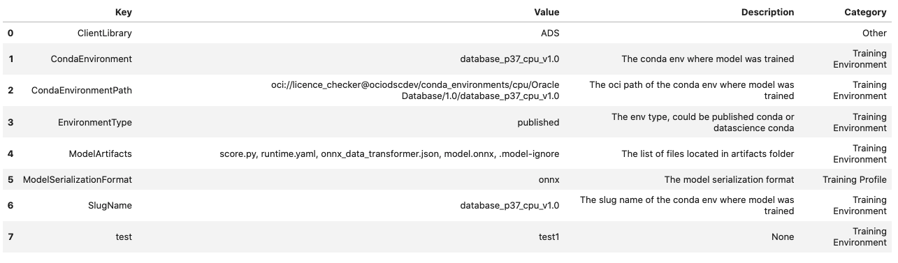

Model Metadata
**************

When you register a model, you can add metadata to help with the documentation of the model. Service defined metadata fields are  known as ``Taxonomy Metadata`` and user defined metadata fields are known as ``Custom Metadata``

Taxonomy Metadata
-----------------

Taxonomy metadata includes the type of the model, use case type, libraries, framework, and so on. This metadata provides a way of documenting the schema of the model.  The ``UseCaseType``, ``FrameWork``, ``FrameWorkVersion``, ``Algorithm``, and ``Hyperparameters`` are fixed taxonomy metadata. These fields are automatically populated when the ``.prepare()`` method is called. You can also manually update the values of those fields.

*  ``ads.common.model_metadata.UseCaseType``: The machine learning problem associated with the Estimator class.  The ``UseCaseType.values()`` method returns the most current list. This is a list of allowed values.:

   -  ``UseCaseType.ANOMALY_DETECTION``
   -  ``UseCaseType.BINARY_CLASSIFICATION``
   -  ``UseCaseType.CLUSTERING``
   -  ``UseCaseType.DIMENSIONALITY_REDUCTION``
   -  ``UseCaseType.IMAGE_CLASSIFICATION``
   -  ``UseCaseType.MULTINOMIAL_CLASSIFICATION``
   -  ``UseCaseType.NER``
   -  ``UseCaseType.OBJECT_LOCALIZATION``
   -  ``UseCaseType.OTHER``
   -  ``UseCaseType.RECOMMENDER``
   -  ``UseCaseType.REGRESSION``
   -  ``UseCaseType.SENTIMENT_ANALYSIS``
   -  ``UseCaseType.TIME_SERIES_FORECASTING``
   -  ``UseCaseType.TOPIC_MODELING``

*  ``ads.common.model_metadata.FrameWork``: The FrameWork of the ``estimator`` object.  You can get the list of allowed values using ``Framework.values()``:

   -  ``FrameWork.BERT``
   -  ``FrameWork.CUML``
   -  ``FrameWork.EMCEE``
   -  ``FrameWork.ENSEMBLE``
   -  ``FrameWork.FLAIR``
   -  ``FrameWork.GENSIM``
   -  ``FrameWork.H2O``
   -  ``FrameWork.KERAS``
   -  ``FrameWork.LIGHTgbm``
   -  ``FrameWork.MXNET``
   -  ``FrameWork.NLTK``
   -  ``FrameWork.ORACLE_AUTOML``
   -  ``FrameWork.OTHER``
   -  ``FrameWork.PROPHET``
   -  ``FrameWork.PYOD``
   -  ``FrameWork.PYMC3``
   -  ``FrameWork.PYSTAN``
   -  ``FrameWork.PYTORCH``
   -  ``FrameWork.SCIKIT_LEARN``
   -  ``FrameWork.SKTIME``
   -  ``FrameWork.SPACY``
   -  ``FrameWork.STATSMODELS``
   -  ``FrameWork.TENSORFLOW``
   -  ``FrameWork.TRANSFORMERS``
   -  ``FrameWork.WORD2VEC``
   -  ``FrameWork.XGBOOST``

*  ``FrameWorkVersion``: The framework version of the estimator object.  For example, ``2.3.1``.
*  ``Algorithm``: The model class.
*  ``Hyperparameters``: The hyperparameters of the estimator object.

You can't add or delete any of the fields, or change the key of those fields.

You can populate the ``use_case_type`` by passing it in the ``.prepare()`` method. Or you can set and update it directly.

.. code-block:: python3

    import tempfile
    from ads.model.framework.sklearn_model import SklearnModel
    from sklearn.datasets import load_iris
    from sklearn.linear_model import LogisticRegression
    from sklearn.model_selection import train_test_split
    from ads.common.model_metadata import UseCaseType

    # Load dataset and Prepare train and test split 
    iris = load_iris()
    X, y = iris.data, iris.target
    X_train, X_test, y_train, y_test = train_test_split(X, y, test_size=0.25)
    
    # Train a LogisticRegression model 
    sklearn_estimator = LogisticRegression()
    sklearn_estimator.fit(X_train, y_train)

    # Instantite ads.model.SklearnModel using the sklearn LogisticRegression model
    sklearn_model = SklearnModel(estimator=sklearn_estimator, artifact_dir=tempfile.mkdtemp())

    # Autogenerate score.py, pickled model, runtime.yaml, input_schema.json and output_schema.json
    sklearn_model.prepare(inference_conda_env="dataexpl_p37_cpu_v3", X_sample=trainx, y_sample=trainy)

    sklearn_model.metadata_taxonomy['UseCaseType'].value = UseCaseType.BINARY_CLASSIFICATION

**Update metadata_taxonomy**

Update any of the taxonomy fields with allowed values:

.. code-block:: python3

    sklearn_model.metadata_taxonomy['FrameworkVersion'].value = '0.24.2'
    sklearn_model.metadata_taxonomy['UseCaseType'].update(value=UseCaseType.BINARY_CLASSIFICATION)

You can view the ``metadata_taxonomy`` in the dataframe format by
calling ``to_dataframe``:

.. code-block:: python3

    sklearn_model.metadata_taxonomy.to_dataframe()

.. image:: figures/metadata_taxonomy.png

Alternatively, you can view it directly in a YAML format:

.. code-block:: python3

    sklearn_model.metadata_taxonomy

.. parsed-literal::

    data:
    - key: FrameworkVersion
      value: 0.24.2
    - key: ArtifactTestResults
      value:
        runtime_env_path:
          category: conda_env
          description: Check that field MODEL_DEPLOYMENT.INFERENCE_ENV_PATH is set
          error_msg: In runtime.yaml, the key MODEL_DEPLOYMENT.INFERENCE_ENV_PATH must
            have a value.
          success: true
          value: oci://licence_checker@ociodscdev/conda_environments/cpu/Oracle Database/1.0/database_p37_cpu_v1.0
        runtime_env_python:
          category: conda_env
          description: Check that field MODEL_DEPLOYMENT.INFERENCE_PYTHON_VERSION is set
            to a value of 3.6 or higher
          error_msg: In runtime.yaml, the key MODEL_DEPLOYMENT.INFERENCE_PYTHON_VERSION
            must be set to a value of 3.6 or higher.
          success: true
          value: 3.7.10
        runtime_env_slug:
          category: conda_env
          description: Check that field MODEL_DEPLOYMENT.INFERENCE_ENV_SLUG is set
          error_msg: In runtime.yaml, the key MODEL_DEPLOYMENT.INFERENCE_ENV_SLUG must
            have a value.
          success: true
          value: database_p37_cpu_v1.0
        runtime_env_type:
          category: conda_env
          description: Check that field MODEL_DEPLOYMENT.INFERENCE_ENV_TYPE is set to
            a value in (published, data_science)
          error_msg: In runtime.yaml, the key MODEL_DEPLOYMENT.INFERENCE_ENV_TYPE must
            be set to published or data_science.
          success: true
          value: published
        runtime_path_exist:
          category: conda_env
          description: If MODEL_DEPLOYMENT.INFERENCE_ENV_TYPE is data_science and MODEL_DEPLOYMENT.INFERENCE_ENV_SLUG
            is set, check that the file path in MODEL_DEPLOYMENT.INFERENCE_ENV_PATH is
            correct.
          error_msg: In runtime.yaml, the key MODEL_DEPLOYMENT.INFERENCE_ENV_PATH does
            not exist.
        runtime_slug_exist:
          category: conda_env
          description: If MODEL_DEPLOYMENT.INFERENCE_ENV_TYPE is data_science, check that
            the slug listed in MODEL_DEPLOYMENT.INFERENCE_ENV_SLUG exists.
          error_msg: In runtime.yaml, the value of the key INFERENCE_ENV_SLUG is ``slug_value``
            and it doesn't exist in the bucket ``bucket_url``. Ensure that the value INFERENCE_ENV_SLUG
            and the bucket url are correct.
        runtime_version:
          category: runtime.yaml
          description: Check that field MODEL_ARTIFACT_VERSION is set to 3.0
          error_msg: In runtime.yaml, the key MODEL_ARTIFACT_VERSION must be set to 3.0.
          success: true
        runtime_yaml:
          category: Mandatory Files Check
          description: Check that the file "runtime.yaml" exists and is in the top level
            directory of the artifact directory
          error_msg: The file 'runtime.yaml' is missing.
          success: true
        score_load_model:
          category: score.py
          description: Check that load_model() is defined
          error_msg: Function load_model is not present in score.py.
          success: true
        score_predict:
          category: score.py
          description: Check that predict() is defined
          error_msg: Function predict is not present in score.py.
          success: true
        score_predict_arg:
          category: score.py
          description: Check that all other arguments in predict() are optional and have
            default values
          error_msg: All formal arguments in the predict function must have default values,
            except that 'data' argument.
          success: true
        score_predict_data:
          category: score.py
          description: Check that the only required argument for predict() is named "data"
          error_msg: The predict function in score.py must have a formal argument named
            'data'.
          success: true
        score_py:
          category: Mandatory Files Check
          description: Check that the file "score.py" exists and is in the top level directory
            of the artifact directory
          error_msg: The file 'score.py' is missing.
          key: score_py
          success: true
        score_syntax:
          category: score.py
          description: Check for Python syntax errors
          error_msg: 'There is Syntax error in score.py: '
          success: true
    - key: Framework
      value: scikit-learn
    - key: UseCaseType
      value: binary_classification
    - key: Algorithm
      value: RandomForestClassifier
    - key: Hyperparameters
      value:
        bootstrap: true
        ccp_alpha: 0.0
        class_weight: null
        criterion: gini
        max_depth: null
        max_features: auto
        max_leaf_nodes: null
        max_samples: null
        min_impurity_decrease: 0.0
        min_impurity_split: null
        min_samples_leaf: 1
        min_samples_split: 2
        min_weight_fraction_leaf: 0.0
        n_estimators: 10
        n_jobs: null
        oob_score: false
        random_state: null
        verbose: 0
        warm_start: false

Custom Metadata
---------------

Update your custom metadata using the ``key``, ``value``, ``category``, and ``description`` fields. The ``key``, and ``value`` fields are required.

You can see the allowed values for custom metadata category using ``MetadataCustomCategory.values()``:

* ``MetadataCustomCategory.PERFORMANCE``
* ``MetadataCustomCategory.TRAINING_PROFILE``
* ``MetadataCustomCategory.TRAINING_AND_VALIDATION_DATASETS``
* ``MetadataCustomCategory.TRAINING_ENVIRONMENT``
* ``MetadataCustomCategory.OTHER``

**Add New Custom Metadata**

To add a new custom metadata, call ``.add()``:

.. code-block:: python3

    sklearn_model.metadata_custom.add(key='test', value='test', category=MetadataCustomCategory.OTHER, description='test', replace=True)

**Update Custom Metadata**

Use the ``.update()`` method to update the fields of a specific key ensuring that
you pass all the values you need in the ``update``:

.. code-block:: python3

    sklearn_model.metadata_custom['test'].update(value='test1', description=None, category=MetadataCustomCategory.TRAINING_ENV)

Alternatively, you can set it directly:

.. code-block:: python3

    sklearn_model.metadata_custom['test'].value = 'test1'
    sklearn_model.metadata_custom['test'].description = None
    sklearn_model.metadata_custom['test'].category = MetadataCustomCategory.TRAINING_ENV

You can view the custom metadata in the dataframe by calling
``.to_dataframe()``:

.. code-block:: python3

    sklearn_model.metadata_custom.to_dataframe()

Alternatively, you can view the custom metadata in YAML format by calling ``.metadata_custom``:

.. code-block:: python3

    sklearn_model.metadata_custom

.. parsed-literal::

    data:
    - category: Training Environment
      description: The conda env where model was trained
      key: CondaEnvironment
      value: database_p37_cpu_v1.0
    - category: Training Environment
      description: null
      key: test
      value: test1
    - category: Training Environment
      description: The env type, could be published conda or datascience conda
      key: EnvironmentType
      value: published
    - category: Training Environment
      description: The list of files located in artifacts folder
      key: ModelArtifacts
      value: score.py, runtime.yaml, onnx_data_transformer.json, model.onnx, .model-ignore
    - category: Training Environment
      description: The slug name of the conda env where model was trained
      key: SlugName
      value: database_p37_cpu_v1.0
    - category: Training Environment
      description: The oci path of the conda env where model was trained
      key: CondaEnvironmentPath
      value: oci://licence_checker@ociodscdev/conda_environments/cpu/Oracle Database/1.0/database_p37_cpu_v1.0
    - category: Other
      description: ''
      key: ClientLibrary
      value: ADS
    - category: Training Profile
      description: The model serialization format
      key: ModelSerializationFormat
      value: onnx

When the combined total size of ``metadata_custom`` and ``metadata_taxonomy`` exceeds 32000 bytes, an error occurs when you save the model to the model catalog. You can save the ``metadata_custom`` and ``metadata_taxonomy`` to the artifacts folder:

.. code-block:: python3

    sklearn_model.metadata_custom.to_json_file(path_to_ADS_model_artifact)

You can also save individual items from the custom and taxonomy
metadata:

.. code-block:: python3

    sklearn_model.metadata_taxonomy['Hyperparameters'].to_json_file(path_to_ADS_model_artifact)

If you already have the training or validation dataset saved in Object Storage and want to document this information in this model artifact object, you can add that information into ``metadata_custom``:

.. code-block:: python3

    sklearn_model.metadata_custom.set_training_data(path='oci://bucket_name@namespace/train_data_filename', data_size='(200,100)')
    sklearn_model.metadata_custom.set_validation_data(path='oci://bucket_name@namespace/validation_data_filename', data_size='(100,100)')
