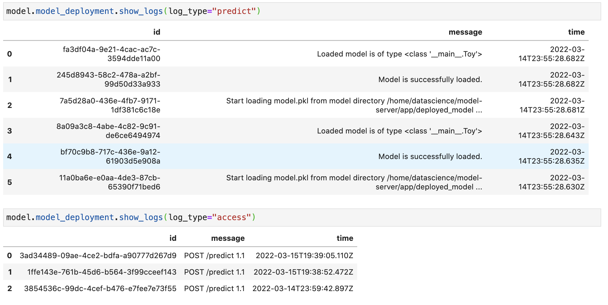
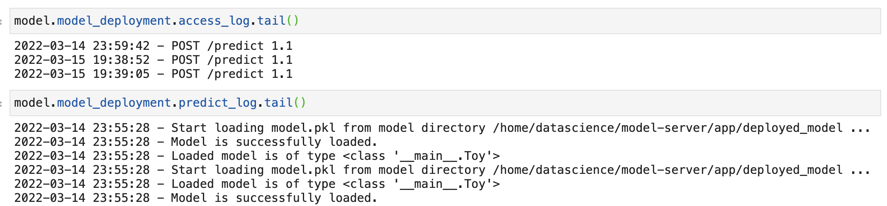

Introduction to GenericModel
============================

Overview:
---------

The ``GenericModel`` module in ADS provides different ways of serializing a
trained model. This example demonstrates how to utilize the
``GenericModel`` module to prepare model artifacts, and save models to the
model catalog then deploy any unsupported model framework.

A `model artifact <https://docs.oracle.com/en-us/iaas/data-science/using/models-prepare-artifact.htm>`_ includes the model, metadata about the model, input and output schema, and a script to load the model and make predictions. You can share model artifacts among data scientists, tracked for provenance, reproduced, and deployed.

Initialize
----------
``GenericModel()`` initiates a generic model instance. It accepts the following variables:

- ``estimator: (Callable)``. Trained model.
- ``artifact_dir: str``. Artifact directory to store the files needed for deployment.
- ``properties: (ModelProperties, optional)``. Defaults to ``None``. ModelProperties object required to save and deploy model.
- ``auth :(Dict, optional)``. Defaults to ``None``. The default authentication is set using the ``ads.set_auth`` API. If you need to override the default, use ``ads.common.auth.api_keys`` or ``ads.common.auth.resource_principal`` to create appropriate authentication signer and kwargs required to instantiate the ``IdentityClient`` object.
- ``serialize: (bool, optional)``. Defaults to ``True``. Whether to serialize the model to a pkl file by default. If ``False``, you must set the ``model_file_name`` in ``.prepare`` function, serialize the model manually, save it under ``artifact_dir``, and update the ``score.py`` file manually.

If you would like to serialize a model your way, you can set ``serialize=False``, and then save the serialized model into the ``artifact_dir``. However, you are also responsible for setting the ``model_file_name`` in ``.prepare`` function, making changes to ``load_model`` and other functions in ``score.py``. Also, in ``score.py``, ``pre_inference`` and ``post_inference`` are currently not used.

``properties`` is an instance of ``ModelProperties`` and has the following predefined fields:

- ``inference_conda_env: str``
- ``inference_python_version: str``
- ``training_conda_env: str``
- ``training_python_version: str``
- ``training_resource_id: str``
- ``training_script_path: str``
- ``training_id: str``
- ``compartment_id: str``
- ``project_id: str``
- ``deployment_instance_shape: str``
- ``deployment_instance_count: int``
- ``deployment_bandwidth_mbps: int``
- ``deployment_log_group_id: str``
- ``deployment_access_log_id: str``
- ``deployment_predict_log_id: str``

By default, ``properties`` is populated from environment variables if it's
not specified. For example, in the notebook session the environment variables
for project id and compartment id are preset and stored in ``PROJECT_OCID`` and
``NB_SESSION_COMPARTMENT_OCID``by default. And ``properties`` populates these variables 
from the environment variables, and uses the values in functions such as ``.save()``, ``.deploy()`` by default.
However, if these aren't the values you want, you can always explicitly pass the variables into functions to overwrite 
those values. For the fields that ``properties`` has, it records the values that you pass into the functions. 
For example, when you pass ``inference_conda_env`` into ``.prepare()``, then ``properties`` records this value.
Later you can export it using ``.to_yaml()``, and reload it using ``.from_yaml()`` from any machine. 
This allows you to reuse the properties in different places.

Summary_status
--------------
You can call the ``summary_status()`` function any time after the ``GenericModel`` instance is created. This applies to other model frameworks such as ``SklearnModel`` and so on. It returns a Pandas dataframe that guides you though the whole workflow. It shows which function is available to call, which ones aren't and what each function is doing. If extra actions are required, it also shows those.

An example of a summary status table looks similar to the following after you initiate the model instance. The step column shows all the functions. It shows that ``init`` step is completed where the ``Details`` column explained that what the ``init`` step did and now ``prepare()`` is available. The next step is to call ``prepare()``. 

.. figure:: figure/summary_status.png
   :align: center

Prepare
-------
``.prepare()`` takes the following parameters:

- ``inference_conda_env: (str, optional)``. Defaults to ``None``. Can be either a slug or an object storage path of the conda environment. You can only pass in slugs if the conda pack is a service environment.
- ``inference_python_version: (str, optional)``. Defaults to ``None``. Python version to use in deployment.
- ``training_conda_env: (str, optional)``. Defaults to ``None``. Can be either a slug or an object storage path of the conda environment. You can only pass in slugs if the conda environment is a service environment.
- ``training_python_version: (str, optional)``. Defaults to ``None``. Python version used during training.
- ``model_file_name: (str)``. Name of the serialized model.
- ``as_onnx: (bool, optional)``. Defaults to ``False``. Whether to serialize as Onnx model. This will only enforce the ``model_file_name`` to have a suffix of ``.onnx``. The actually onnx serialization is not implemented here.
- ``force_overwrite: (bool, optional)``. Defaults to ``False``. Whether to overwrite existing files.
- ``namespace: (str, optional)``. Namespace of region. This is used for identifying which region the service environment is from when you pass a slug to ``inference_conda_env`` and ``training_conda_env``.
- ``use_case_type: str``. The use case type of the model. Use it through ``UserCaseType`` class or string provided in ``UseCaseType``. For example, ``use_case_type=UseCaseType.BINARY_CLASSIFICATION`` or ``use_case_type="binary_classification"``. Check using ``UseCaseType`` class to see all of the supported types.
- ``X_sample: Union[list, pd.Series, np.ndarray, pd.DataFrame]``. Defaults to ``None``. A sample of input data to use to generate input schema.
- ``y_sample: Union[list, pd.Series, np.ndarray, pd.DataFrame]``. Defaults to ``None``. A sample of output data to use to generate output schema.
- ``training_script_path: str``. Defaults to ``None``. Training script path.
- ``training_id: (str, optional)``. Defaults to the value from environment variables. The training OCID for model. Can be a notebook session or job OCID.
- ``ignore_pending_changes: bool``. Defaults to ``False``. Whether to ignore the pending changes in Git.
- ``max_col_num: (int, optional)``. Defaults to ``utils.DATA_SCHEMA_MAX_COL_NUM``. The maximum column size of the data that allows you to automatically a generate schema.

``kwargs``:
``impute_values: (dict, optional)``. The dictionary where the key is the column index (or names is accepted for pandas dataframe), and the value is the impute value for the corresponding column.

It  automatically generates the following files.

- ``runtime.yaml``
- ``score.py``. ``load_model`` function is only implemented when ``serialize=True``, otherwise, you need to implement it on your own.
- ``model.pkl`` by default model is serialized in pkl format when ``serialize=True`` in the ``init`` function. If ``serialize=False``, the model isn't automatically serialized.
- ``input_schema.json`` when ``X_sample`` is passed in and the schema is more than 32 KB.
- ``output_schema.json`` when ``y_sample`` is passed in and the schema is more than 32 KB.
- ``hyperparameters.json`` if the extracted hyperparameters are more than 32KB.

Verify
------
The ``.verify()`` function takes one parameter:

- ``data (Union[dict, str, tuple, list])``. Data used to test if deployment works in a local environment.

You use it to test if deployment would work in the local environment. Before saving and deploying the model, we recommended that you call this function to check if the ``load_model`` and ``predict`` functions in ``score.py`` work. It takes and returns the same data as model deployment predict takes and returns.

In ``GenericModel`` data serialization is not supported, which means that you still must ensure that you pass in JSON serializable data to the ``verify`` and ``predict`` functions unless you implement extra data serialization and deserialization. Also, in the generated ``score.py`` template, 

Save
----
The ``Save`` function takes the following parameters:

- ``display_name: (str, optional)``. Defaults to ``None``. The name of the model.
- ``description: (str, optional)``. Defaults to ``None``. The description of the model.
- ``freeform_tags : Dict(str, str)``. Defaults to ``None.`` Free form tags for the model.
- ``defined_tags : (Dict(str, dict(str, object)), optional)``. Defaults to ``None``. Defined tags for the model.
- ``ignore_introspection: (bool, optional)``. Defaults to ``None``. Determines whether to ignore the result of model introspection or not. If set to True, the save ignores all model introspection errors.

``kwargs``:
- ``project_id: (str, optional)``. Project OCID. If not specified, the value is taken either from the environment variables or model properties.
- ``compartment_id : (str, optional)``. Compartment OCID. If not specified, the value is taken either from the environment variables or model properties.
- ``timeout: (int, optional)``. Defaults to 10 seconds. The connection timeout in seconds for the client.

It first reloads the ``score.py`` and ``runtime.yaml`` files from disk so that any changes made to those files are used. Then it conducts an introspection test by default. However, you can set ``ignore_introspection=False`` to avoid it. Introspection tests check if ``.deployment()`` could have some issues and suggests necessary actions about how to fix them. Lastly, it uploads the artifacts to the model catalog, and returns a ``model_id`` for the saved model.
You can also call ``.instrospect()`` to conduct the test any time after you call ``.prepare()``.

Deploy
------
``.deploy()`` takes the following parameters:

- ``wait_for_completion : (bool, optional)``. Defaults to ``True``. Set to wait for the deployment to complete before proceeding.
- ``display_name: (str, optional)``. Defaults to ``None``. The name of the model.
- ``description: (str, optional)``. Defaults to ``None``. The description of the model.
- ``deployment_instance_shape: (str, optional)``. Default to ``VM.Standard2.1``. The shape of the instance used for deployment.
- ``deployment_instance_count: (int, optional)``. Defaults to 1. The number of instances used for deployment.
- ``deployment_bandwidth_mbps: (int, optional)``. Defaults to 10. The bandwidth limit on the load balancer in Mbps.
- ``deployment_log_group_id: (str, optional)``. Defaults to ``None``. The oci logging group id. The access log and predict log share the same log group.
- ``deployment_access_log_id: (str, optional)``. Defaults to ``None``. The access log OCID for the access logs, see `link <https://docs.oracle.com/en-us/iaas/data-science/using/model_dep_using_logging.htm>`__
- ``deployment_predict_log_id: (str, optional)``. Defaults to ``None``. The predict log OCID for the predict logs, see `link <https://docs.oracle.com/en-us/iaas/data-science/using/model_dep_using_logging.htm>`__

``kwargs``:
- ``project_id: (str, optional)``. Project OCID. If not specified, the value is taken from the environment variables.
- ``compartment_id : (str, optional)``. Compartment OCID. If not specified, the value is taken from the environment variables.
- ``max_wait_time : (int, optional)``. Defaults to 1200 seconds. Maximum amount of time to wait in seconds. Negative implies an infinite wait time.
- ``poll_interval : (int, optional)``. Defaults to 60 seconds. Poll interval in seconds.

It deploys the model. In order to make deployment more smooth, we suggest using exactly the same conda environments for both local development and deployment. Discrepancy between the two could cause problems. 

You can pass in ``deployment_log_group_id``, ``deployment_access_log_id`` and ``deployment_predict_log_id`` to enable the logging. To create a log group, you can reference :ref:`Logging <logging>`.

.. _logging_example:

Logging Example
~~~~~~~~~~~~~~~

.. code:: python3

    import tempfile
    from ads.model.generic_model import GenericModel

    log_group_ocid = 'ocid1.loggroup.oc1.iad.amaaaaaav...'
    log_ocid = 'ocid1.log.oc1.iad.amaaaaaav66vvniagrvj...'

    class Toy:
        def predict(self, x):
            return x ** 2
    estimator = Toy()

    model = GenericModel(estimator=estimator, artifact_dir=tempfile.mkdtemp())
    model.summary_status()
    model.prepare(inference_conda_env="dataexpl_p37_cpu_v3")
    model.verify(2)
    model.save()
    model.deploy(
        deployment_log_group_id=log_group_ocid,
        deployment_access_log_id=log_ocid,
        deployment_predict_log_id =log_ocid,
    )

    model.predict(2)
    model.model_deployment.show_logs(log_type="predict")
    model.model_deployment.show_logs(log_type="access")
    model.model_deployment.access_log.tail()
    model.model_deployment.predict_log.tail()

        

Predict
-------
``.predict()`` takes one parameter:
- ``data: Union[dict, str, tuple, list]``. JSON serializable data for the prediction for Onnx models. For the local serialization method, the data can be the data types that each framework support.

``.predict()``takes the same data  that ``.verify()`` takes. You must ensure that the data passed and returned by ``predict`` in the ``score.py`` is JSON serializable. It passes the data to the model deployment endpoint and calls the ``predict`` function in ``score.py``.

Delete_deployment
-----------------
``.delete_deployment()`` takes one parameter:

- ``wait_for_completion: (bool, optional)``. Defaults to False. Whether to wait till completion.

When you don't need the deployment any more, call ``delete_deployment`` to delete the current deployment that is attached to the model. Note that each time you call deploy, it creates a new deployment and only the new deployment is attached to the model. 

from_model_artifact
-------------------

``.from_model_artifact()`` allows to load a model from a folder, zip or tar achive files, where the folder/zip/tar files should contain the files such as runtime.yaml, score.py, the serialized model file needed for deployments. It takes the following parameters:

- ``uri: str``: The folder path, ZIP file path, or TAR file path. It could contain a seriliazed model(required) as well as any files needed for deployment including: serialized model, runtime.yaml, score.py and etc. The content of the folder will be copied to the ``artifact_dir`` folder.
- ``model_file_name: str``: The serialized model file name.
- ``artifact_dir: str``: The artifact directory to store the files needed for deployment.
- ``auth: (Dict, optional)``: Defaults to None. The default authetication is set using ``ads.set_auth`` API. If you need to override the default, use the `ads.common.auth.api_keys` or `ads.common.auth.resource_principal` to create appropriate authentication signer and kwargs required to instantiate IdentityClient object.
- ``force_overwrite: (bool, optional)``: Defaults to False. Whether to overwrite existing files or not.
- ``properties: (ModelProperties, optional)``: Defaults to None. ModelProperties object required to save and deploy model.

After this is called, you can call ``.verify()``, ``.save()`` and etc.

from_model_catalog
------------------

``from_model_catalog`` allows to load a remote model from model catalog using a model id , which should contain the files such as runtime.yaml, score.py, the serialized model file needed for deployments. It takes the following parameters:

- ``model_id: str``. The model OCID.
- ``model_file_name: (str)``. The name of the serialized model.
- ``artifact_dir: str``. The artifact directory to store the files needed for deployment. Will be created if not exists.
- ``auth: (Dict, optional)``. Defaults to None. The default authetication is set using ``ads.set_auth`` API. If you need to override the default, use the ``ads.common.auth.api_keys`` or ``ads.common.auth.resource_principal`` to create appropriate authentication signer and kwargs required to instantiate IdentityClient object.
- ``force_overwrite: (bool, optional)``. Defaults to False. Whether to overwrite existing files or not.
- ``properties: (ModelProperties, optional)``. Defaults to None. ModelProperties object required to save and deploy model.

``kwargs``:

- ``compartment_id : (str, optional)``. Compartment OCID. If not specified, the value will be taken from the environment variables.
- ``timeout : (int, optional)``. Defaults to 10 seconds. The connection timeout in seconds for the client.

Examples
--------

Serialize the Model to pkl Format by Default
~~~~~~~~~~~~~~~~~~~~~~~~~~~~~~~~~~~~~~~~~~~~

.. code:: python3

    import tempfile
    from ads.model.generic_model import GenericModel

    class Toy:
        def predict(self, x):
            return x ** 2
    estimator = Toy()

    model = GenericModel(estimator=estimator, artifact_dir=tempfile.mkdtemp())
    model.summary_status()
    model.prepare(inference_conda_env="oci://service-conda-packs@id19sfcrra6z/service_pack/cpu/Data Exploration and Manipulation for CPU Python 3.7/3.0/dataexpl_p37_cpu_v3",
                  inference_python_version="3.7",
                  model_file_name="toy_model.pkl",
                  training_id=None,
                  force_overwrite=True
                )
    model.verify(2)
    model.save()
    model.deploy()
    model.predict(2)
    model.delete_deployment()

Serialize the Model In Your Way
~~~~~~~~~~~~~~~~~~~~~~~~~~~~~~~

.. code:: python3

    import tempfile
    from ads.model.generic_model import GenericModel

    class Toy:
        def predict(self, x):
            return x ** 2
    estimator = Toy()
    model = GenericModel(estimator=estimator, 
                         artifact_dir=tempfile.mkdtemp(), 
                         serialize=False)
    model.summary_status()
    model.prepare(inference_conda_env="oci://service-conda-packs@id19sfcrra6z/service_pack/cpu/Data Exploration and Manipulation for CPU Python 3.7/3.0/dataexpl_p37_cpu_v3",
                  inference_python_version="3.7",
                  model_file_name="toy_model.pkl",
                  training_id=None,
                  force_overwrite=True
                )
    model.summary_status()

    # Serialize the model
    import cloudpickle
    import os

    with open(os.path.join(model.artifact_dir, "toy_model.pkl"), "wb") as outfile:
        cloudpickle.dump(estimator, outfile)
    # Finish implementing the score.py
    score = '''
    import json
    import os
    from cloudpickle import cloudpickle

    model_name = 'toy_model.pkl'

    def load_model(model_file_name=model_name):
        """
        Loads model from the serialized format

        Returns
        -------
        model:  a model instance on which predict API can be invoked
        """
        model_dir = os.path.dirname(os.path.realpath(__file__))
        contents = os.listdir(model_dir)
        if model_file_name in contents:
            with open(os.path.join(os.path.dirname(os.path.realpath(__file__)), model_file_name), "rb") as file:
                return cloudpickle.load(file)
        else:
            raise Exception('{0} is not found in model directory {1}'.format(model_file_name, model_dir))

    def predict(data, model=load_model()):
        """
        Returns prediction given the model and data to predict

        Parameters
        ----------
        model: Model instance returned by load_model API
        data: Data format as expected by the predict API of the core estimator. For eg. in case of sckit models it could be numpy array/List of list/Panda DataFrame

        Returns
        -------
        predictions: Output from scoring server
            Format: {'prediction':output from model.predict method}

        """
        
        return {'prediction':model.predict(data)}
    '''

    with open(os.path.join(model.artifact_dir, "score.py"), 'w') as f:
        print(f.write(score))
    model.verify(2)
    model.save()
    model.deploy(deployment_log_group_id="ocid1.loggroup.oc1.iad.amaaaa...",
                deployment_access_log_id="ocid1.log.oc1.iad.amaaaaaav...",
                deployment_predict_log_id="ocid1.log.oc1.iad.amaaaaaav...")
    model.delete_deployment()

Loading Model From a Zip Archive
~~~~~~~~~~~~~~~~~~~~~~~~~~~~~~~~

.. code:: python3

   model = GenericModel.from_model_artifact("/folder_to_your/artifact.zip",
                                         model_file_name="your_model_file_name",
                                         artifact_dir=tempfile.mkdtemp())

   model.verify(your_data)

Loading Model From Model Catalog
~~~~~~~~~~~~~~~~~~~~~~~~~~~~~~~~

.. code:: python3

   model = GenericModel.from_model_catalog(model_id="ocid1.datasciencemodel.oc1.iad.amaaaa....",
                                         model_file_name="your_model_file_name",
                                         artifact_dir=tempfile.mkdtemp())
   model.verify(your_data)
