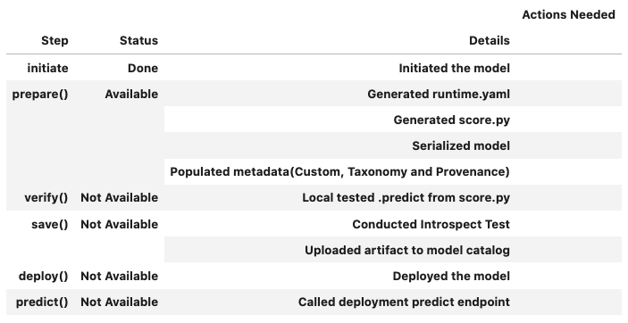

.. LightGBMModel:

LightGBMModel
*************

Overview
========

The ``LightGBMModel`` class in ADS is designed to allow you to rapidly get a LightGBM model into production. The ``.prepare()`` method creates the model artifacts that are needed to deploy a functioning model without you having to configure it or write code. However, you can customize the required ``score.py`` file.

.. include:: _template/overview.rst

The following steps take your trained ``LightGBM`` model and deploy it into production with a few lines of code.

The ``LightGBMModel`` module in ADS supports serialization for models generated from both the  `Training API <https://lightgbm.readthedocs.io/en/latest/Python-API.html#training-api>`_ using ``lightgbm.train()`` and the `Scikit-Learn API <https://lightgbm.readthedocs.io/en/latest/Python-API.html#scikit-learn-api>`_ using ``lightgbm.LGBMClassifier()``. Both of these interfaces are defined by `LightGBM <https://lightgbm.readthedocs.io/en/latest/>`_.

The Training API in ``LightGBM`` contains training and cross-validation routines. The ``Dataset`` class is an internal data structure that is used by LightGBM when using the ``lightgbm.train()`` method. You can also create LightGBM models using the Scikit-Learn Wrapper interface. The `LightGBMModel` class handles the differences between the LightGBM Training and SciKit-Learn APIs seamlessly.

**Create Training API and Scikit-Learn Wrapper LightGBM Models**

In the following several code snippets you will prepare the data and train LightGBM models. In the first snippet, the data will be prepared. This will involved loading a dataset, splitting it into dependent and independent variables and into test and training sets. The data will be encoded and a preprocessing pipeline will be defined. In the second snippet, the LightGBM Training API will be used to train the model. In the third and final code snippet, the Scikit-Learn Wrapper interface is used to create another LightGBM model.

.. code-block:: python3

    import lightgbm as lgb
    import pandas as pd
    import os

    from sklearn.compose import ColumnTransformer
    from sklearn.model_selection import train_test_split
    from sklearn.pipeline import Pipeline
    from sklearn.preprocessing import LabelEncoder, OrdinalEncoder

    df_path = os.path.join("/", "opt", "notebooks", "ads-examples", "oracle_data", "orcl_attrition.csv")
    df = pd.read_csv(df_path)
    y = df["Attrition"]
    X = df.drop(columns=["Attrition", "name"])

    X_train, X_test, y_train, y_test = train_test_split(X, y, test_size=0.1, random_state=42)

    # Label encode the y values
    le = LabelEncoder()
    y_train_transformed = le.fit_transform(y_train)
    y_test_transformed = le.transform(y_test)

    # Extract numerical columns and categorical columns
    categorical_cols = []
    numerical_cols = []
    for i, col in X.iteritems():
        if col.dtypes == "object":
            categorical_cols.append(col.name)
        else:
            numerical_cols.append(col.name)

    categorical_transformer = Pipeline(
        steps=[('encoder', OrdinalEncoder())]
    )

    # Build a pipeline
    preprocessor = ColumnTransformer(
        transformers=[('cat', categorical_transformer, categorical_cols)]
    )

    preprocessor_pipeline = Pipeline(steps=[('preprocessor', preprocessor)])
    preprocessor_pipeline.fit(X_train)

    X_train_transformed = preprocessor_pipeline.transform(X_train)
    X_test_transformed = preprocessor_pipeline.transform(X_test)

Create a LightGBM model using the Training API.

.. code-block:: python3

    dtrain = lgb.Dataset(X_train_transformed, label=y_train_transformed)
    dtest = lgb.Dataset(X_test_transformed, label=y_test_transformed)

    model_train = lgb.train(
        params={'num_leaves': 31, 'objective': 'binary', 'metric': 'auc'},
        train_set=dtrain, num_boost_round=10)

Create a LightGBM model using the Scikit-Learn Wrapper interface.

.. code-block:: python3

    model = lgb.LGBMClassifier(
        n_estimators=100, learning_rate=0.01, random_state=42
    )
    model.fit(
        X_train_transformed,
        y_train_transformed,
    )

Initialize
==========

Instantiate a ``LightGBMModel()`` object with a LightGBM model. Each instance accepts the following parameters:

* ``artifact_dir: str``: Artifact directory to store the files needed for deployment.
* ``auth: (Dict, optional)``: Defaults to ``None``. The default authentication is set using the ``ads.set_auth`` API. To override the default, use ``ads.common.auth.api_keys()`` or ``ads.common.auth.resource_principal()`` and create the appropriate authentication signer and the ``**kwargs`` required to instantiate the ``IdentityClient`` object.
* ``estimator: (Callable)``: Trained LightGBM model using the Training API or the Scikit-Learn Wrapper interface.
* ``properties: (ModelProperties, optional)``: Defaults to ``None``. The ``ModelProperties`` object required to save and deploy a  model.

.. include:: _template/initialize.rst

Summary Status
==============

.. include:: _template/summary_status.rst

Model Deployment
================

Prepare
-------

The prepare step is performed by the ``.prepare()`` method. It creates several customized files used to run the model after it is deployed. These files include:

* ``input_schema.json``: A JSON file that defines the nature of the features of the ``X_sample`` data. It includes metadata such as the data type, name, constraints, summary statistics, feature type, and more.
* ``model.joblib``: This is the default filename of the serialized model for Training API. For sklearn API, the default file name is ``model.joblib``. You can change it with the `model_file_name` attribute. By default, the model is stored in a joblib.txt file. You can use the ``as_onnx`` parameter to save in the file in ONNX format, and the model name defaults to ``model.onnx``.
* ``output_schema.json``: A JSON file that defines the nature of the dependent variable in the ``y_sample`` data. It includes metadata such as the data type, name, constraints, summary statistics, feature type, and more.
* ``runtime.yaml``: This file contains information that is needed to set up the runtime environment on the deployment server. It has information about what conda environment was used to train the model and what environment to use to deploy the model. The file also specifies what version of Python should be used.
* ``score.py``: This script contains the ``load_model()`` and ``predict()`` functions. The ``load_model()`` function understands the format the model file was saved in and loads it into memory. The ``.predict()`` method is used to make inferences in a deployed model. There are also hooks that allow you to perform operations before and after inference. You can modify this script to fit your specific needs.

To create the model artifacts, use the ``.prepare()`` method. The ``.prepare()`` method includes parameters for storing model provenance information.

To serialize the model to ONNX format, set the ``as_onnx`` parameter to ``True``. You can provide the ``initial_types`` parameter, which is a Python list describing the variable names and types. Alternatively, the system tries to infer this information from the data in the ``X_sample`` parameter. ``X_sample`` only supports List, Numpy array, or Pandas dataframe. ``Dataset`` class isn't supported because this format can't convert into JSON serializable format, see the `ONNX documentation <http://onnx.ai/sklearn-onnx/api_summary.html>`_.

.. include:: _template/prepare.rst

When using the Scikit-Learn Wrapper interface, the ``.prepare()`` method accepts any parameters that ``skl2onnx.convert_sklearn`` accepts. When using the Training API, the ``.prepare()`` method accepts any parameters that ``onnxmltools.convert_lightgbm`` accepts.

Verify
------

.. include:: _template/verify.rst

* ``data: Any``: Data used to test if deployment works in local environment.

Save
----

.. include:: _template/save.rst

Deploy
------

.. include:: _template/deploy.rst

Predict
-------

.. include:: _template/predict.rst

* ``data: Any``: Data used for making inferences.

The ``.predict()`` and ``.verify()`` methods take the same data format. 

Load
====

You can restore serialization models from model artifacts, from model deployments or from models in the model catalog. This section provides details on how to restore serialization models.

.. include:: _template/loading_model_artifact.rst

.. code-block:: python3

    from ads.model.framework.lightgbm_model import LightGBMModel

    model = LightGBMModel.from_model_artifact(
                    uri="/folder_to_your/artifact.zip",
                    model_file_name="model.joblib",
                    artifact_dir="/folder_store_artifact"
                )

.. include:: _template/loading_model_catalog.rst

.. code-block:: python3

    from ads.model.framework.lightgbm_model import LightGBMModel

    model = LightGBMModel.from_model_catalog(model_id="<model_id>",
                                             model_file_name="model.joblib",
                                             artifact_dir=tempfile.mkdtemp())

.. include:: _template/loading_model_deployment.rst

.. code-block:: python3

    from ads.model.generic_model import LightGBMModel

    model = LightGBMModel.from_model_deployment(
        model_deployment_id="<model_deployment_id>",
        model_file_name="model.pkl",
        artifact_dir=tempfile.mkdtemp())

Delete a Deployment
===================

.. include:: _template/delete_deployment.rst

Example
=======

.. code-block:: python3

    import lightgbm as lgb
    import pandas as pd
    import os
    import tempfile

    from ads.catalog.model import ModelCatalog
    from ads.model.framework.lightgbm_model import LightGBMModel
    from sklearn.compose import ColumnTransformer
    from sklearn.model_selection import train_test_split
    from sklearn.pipeline import Pipeline
    from sklearn.preprocessing import LabelEncoder, OrdinalEncoder

    # Load data
    df_path = os.path.join("/", "opt", "notebooks", "ads-examples", "oracle_data", "orcl_attrition.csv")
    df = pd.read_csv(df_path)
    y = df["Attrition"]
    X = df.drop(columns=["Attrition", "name"])

    X_train, X_test, y_train, y_test = train_test_split(X, y, test_size=0.1, random_state=42)

    # Label encode the y values
    le = LabelEncoder()
    y_train_transformed = le.fit_transform(y_train)
    y_test_transformed = le.transform(y_test)

    # Extract numerical columns and categorical columns
    categorical_cols = []
    numerical_cols = []
    for i, col in X.iteritems():
        if col.dtypes == "object":
            categorical_cols.append(col.name)
        else:
            numerical_cols.append(col.name)

    categorical_transformer = Pipeline(
        steps=[
            ('encoder', OrdinalEncoder())
        ]
    )

    # Build a pipeline
    preprocessor = ColumnTransformer(
        transformers=[
            ('cat', categorical_transformer, categorical_cols)
        ]
    )

    preprocessor_pipeline = Pipeline(steps=[('preprocessor', preprocessor)])
    preprocessor_pipeline.fit(X_train)
    X_train_transformed = preprocessor_pipeline.transform(X_train)
    X_test_transformed = preprocessor_pipeline.transform(X_test)

    # LightGBM Scikit-Learn API
    model = lgb.LGBMClassifier(
        n_estimators=100, learning_rate=0.01, random_state=42
    )
    model.fit(
        X_train_transformed,
        y_train_transformed,
    )

    # Deploy the model, test it and clean up.
    artifact_dir = tempfile.mkdtemp()
    lightgbm_model = LightGBMModel(estimator=model, artifact_dir=artifact_dir)
    lightgbm_model.prepare(
        inference_conda_env="generalml_p37_cpu_v1",
        training_conda_env="generalml_p37_cpu_v1",
        X_sample=X_train_transformed[:10],
        as_onnx=False,
        force_overwrite=True,
    )
    lightgbm_model.verify(X_test_transformed[:10])['prediction']
    model_id = lightgbm_model.save()
    lightgbm_model.deploy()
    lightgbm_model.predict(X_test_transformed[:10])['prediction']
    lightgbm_model.delete_deployment(wait_for_completion=True)
    ModelCatalog(compartment_id=os.environ['NB_SESSION_COMPARTMENT_OCID']).delete_model(model_id)

