Overview
--------

After you have trained the model, next step is to save the model to the model catalog, conduct deployment, and then do prediction.
This module provides a continuous experience to finish those steps.

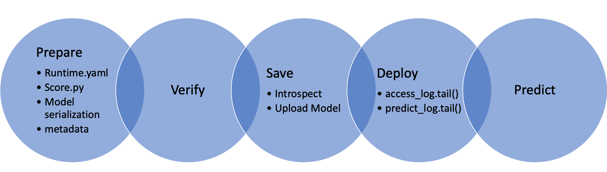

Quick Start
-----------

GenericModel
++++++++++++

.. code:: python3

    import tempfile
    from ads.model.generic_model import GenericModel

    class Toy:
        def predict(self, x):
            return x ** 2
    estimator = Toy()

    model = GenericModel(estimator=estimator, artifact_dir=tempfile.mkdtemp())
    model.summary_status()
    model.prepare(inference_conda_env="dataexpl_p37_cpu_v3")
    model.verify(2)
    model.save()
    model.deploy()
    model.predict(2)
    model.delete_deployment()

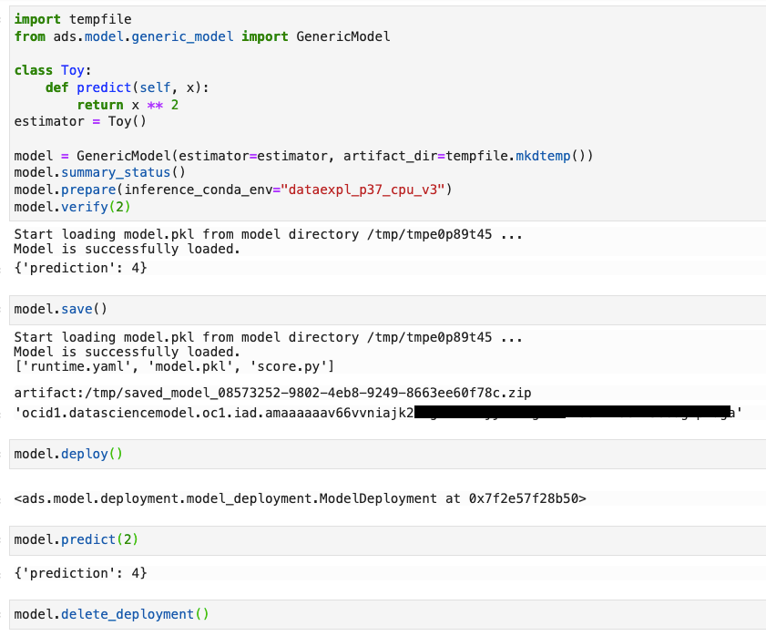

.. code:: python3

   # loading model from a or zip archive.
   model = GenericModel.from_model_artifact("/folder_to_your/artifact.zip",
                                             model_file_name="your_model_file_name",
                                             artifact_dir=tempfile.mkdtemp())

   model.verify(your_data)

   # loading a remote model from the model catalog.
   model = GenericModel.from_model_catalog(model_id="ocid1.datasciencemodel.oc1.iad.amaaaa....",
                                          model_file_name="your_model_file_name",
                                          artifact_dir=tempfile.mkdtemp())
   model.verify(your_data)

SklearnModel
++++++++++++

.. code:: python3

    import tempfile
    from sklearn.model_selection import train_test_split
    from ads.model.framework.sklearn_model import SklearnModel
    from sklearn.linear_model import LogisticRegression
    from sklearn.datasets import load_iris

    iris = load_iris()
    X, y = iris.data, iris.target
    X_train, X_test, y_train, y_test = train_test_split(X, y, test_size=0.25)
    sklearn_estimator = LogisticRegression()
    sklearn_estimator.fit(X_train, y_train)

    sklearn_model = SklearnModel(estimator=sklearn_estimator, artifact_dir=tempfile.mkdtemp())
    sklearn_model.prepare(inference_conda_env="dataexpl_p37_cpu_v3")
    sklearn_model.verify(X_test[:2])
    sklearn_model.save()
    model_deployment = sklearn_model.deploy()
    sklearn_model.predict(X_test[:2])
    sklearn_model.delete_deployment()

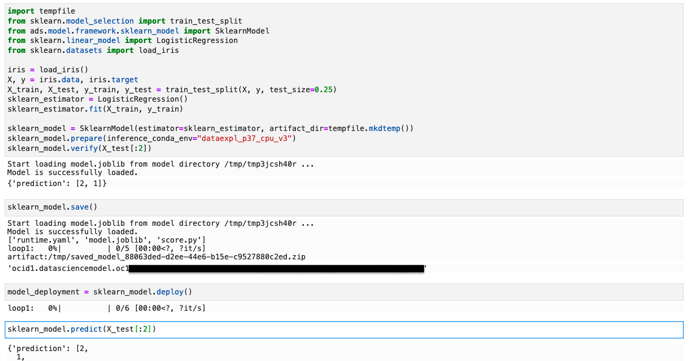

.. code:: python3

   # loading model from a or zip archive.
   model = SklearnModel.from_model_artifact("/folder_to_your/artifact.zip",
                                         model_file_name="your_model_file_name",
                                         artifact_dir=tempfile.mkdtemp())

   model.verify(your_data)

   # loading a remote model from the model catalog.
   model = SklearnModel.from_model_catalog(model_id="ocid1.datasciencemodel.oc1.iad.amaaaa....",
                                          model_file_name="your_model_file_name",
                                          artifact_dir=tempfile.mkdtemp())
   model.verify(your_data)

XGBoostModel
++++++++++++

.. code:: python3

    import xgboost as xgb
    import tempfile
    from sklearn.datasets import make_classification
    from sklearn.model_selection import train_test_split
    from sklearn.datasets import load_iris
    from ads.model.framework.xgboost_model import XGBoostModel

    iris = load_iris()
    X, y = iris.data, iris.target

    X_train, X_test, y_train, y_test = train_test_split(X, y, test_size=0.25)
    xgboost_estimator = xgb.XGBClassifier()
    xgboost_estimator.fit(X_train, y_train)
    xgboost_model = XGBoostModel(estimator=xgboost_estimator, artifact_dir=tempfile.mkdtemp())
    xgboost_model.prepare(inference_conda_env="generalml_p37_cpu_v1")
    xgboost_model.verify(X_test[:2])
    xgboost_model.save()
    model_deployment = xgboost_model.deploy()
    xgboost_model.predict(X_test[:2])
    xgboost_model.delete_deployment()

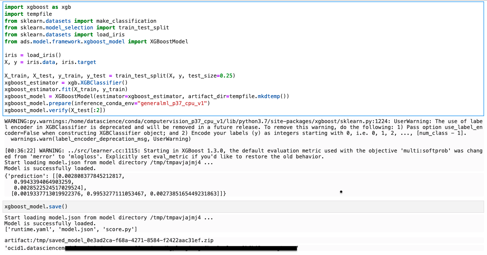
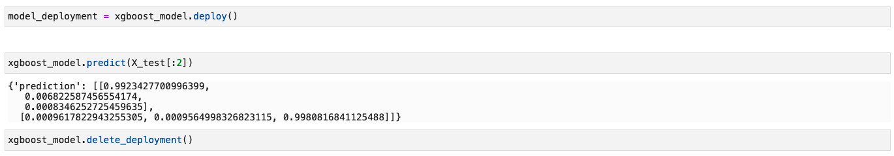

.. code:: python3

   # loading model from a or zip archive.
   model = XGBoostModel.from_model_artifact("/folder_to_your/artifact.zip",
                                         model_file_name="your_model_file_name",
                                         artifact_dir=tempfile.mkdtemp())

   model.verify(your_data)

   # loading a remote model from the model catalog.
   model = XGBoostModel.from_model_catalog(model_id="ocid1.datasciencemodel.oc1.iad.amaaaa....",
                                          model_file_name="your_model_file_name",
                                          artifact_dir=tempfile.mkdtemp())
   model.verify(your_data)

LightGBMModel
+++++++++++++

.. code:: python3

    import lightgbm as lgb
    import tempfile
    from sklearn.model_selection import train_test_split
    from sklearn.datasets import load_iris
    from ads.model.framework.lightgbm_model import LightGBMModel

    iris = load_iris()
    X, y = iris.data, iris.target

    X_train, X_test, y_train, y_test = train_test_split(X, y, test_size=0.25)
    train = lgb.Dataset(X_train, label=y_train)
    param = {
      'objective': 'multiclass', 'num_class': 3,
    }
    lightgbm_estimator = lgb.train(param, train)
    lightgbm_model = LightGBMModel(estimator=lightgbm_estimator, artifact_dir=tempfile.mkdtemp())
    lightgbm_model.prepare(inference_conda_env="generalml_p37_cpu_v1")
    lightgbm_model.verify(X_test[:2])
    lightgbm_model.save()
    model_deployment = lightgbm_model.deploy()
    lightgbm_model.predict(X_test[:2])
    lightgbm_model.delete_deployment()

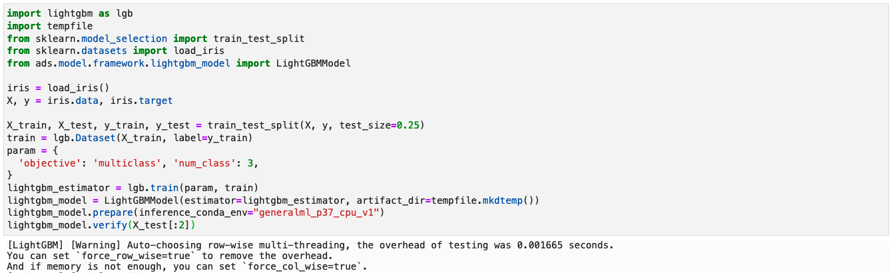
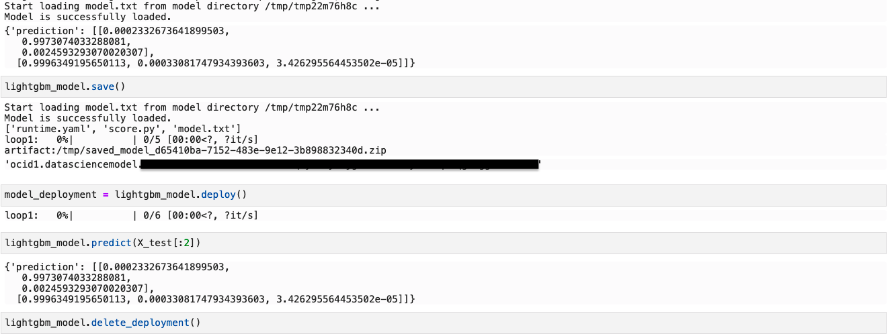

.. code:: python3

   # loading model from a or zip archive.
   model = LightGBMModel.from_model_artifact("/folder_to_your/artifact.zip",
                                         model_file_name="your_model_file_name",
                                         artifact_dir=tempfile.mkdtemp())

   model.verify(your_data)

   # loading a remote model from the model catalog.
   model = LightGBMModel.from_model_catalog(model_id="ocid1.datasciencemodel.oc1.iad.amaaaa....",
                                         model_file_name="your_model_file_name",
                                         artifact_dir=tempfile.mkdtemp())
   model.verify(your_data)

PyTorchModel
++++++++++++

.. code:: python3

    from ads.model.framework.pytorch_model import PyTorchModel
    import tempfile

    import torch
    import torchvision

    torch_estimator = torchvision.models.resnet18(pretrained=True)
    torch_estimator.eval()

    # create fake test data
    test_data = torch.randn(1, 3, 224, 224)

    artifact_dir = tempfile.mkdtemp()
    torch_model = PyTorchModel(torch_estimator, artifact_dir=artifact_dir)
    torch_model.prepare(inference_conda_env="computervision_p37_cpu_v1")

    # Update ``score.py`` by constructing the model class instance first. 
    added_line = """
    import torchvision
    the_model = torchvision.models.resnet18()
    """
    with open(artifact_dir + "/score.py", 'r+') as f:
          content = f.read()
          f.seek(0, 0)
          f.write(added_line.rstrip('\r\n') + '\n' + content)

    # continue to save and deploy the model.
    torch_model.verify(test_data)
    torch_model.save(timeout=200)
    model_deployment = torch_model.deploy()
    torch_model.predict(test_data)
    torch_model.delete_deployment()

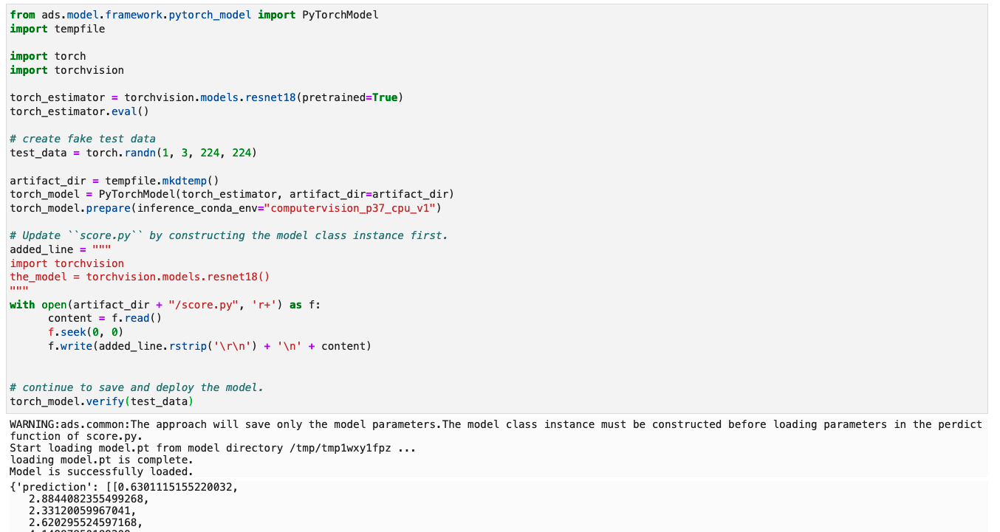

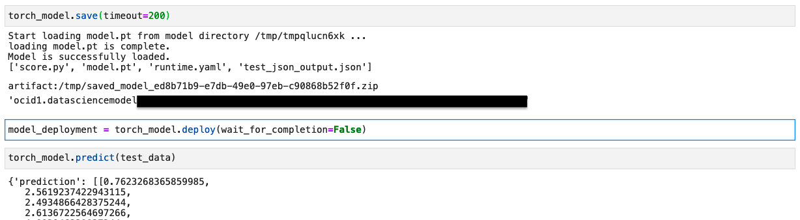

.. code:: python3

   # loading model from a or zip archive.
   model = PyTorchModel.from_model_artifact("/folder_to_your/artifact.zip",
                                         model_file_name="your_model_file_name",
                                         artifact_dir=tempfile.mkdtemp())

   model.verify(your_data)

   # loading a remote model from the model catalog.
   model = PyTorchModel.from_model_catalog(model_id="ocid1.datasciencemodel.oc1.iad.amaaaa....",
                                          model_file_name="your_model_file_name",
                                          artifact_dir=tempfile.mkdtemp())
   model.verify(your_data)

TensorFlowModel
+++++++++++++++

.. code:: python3

    from ads.model.framework.tensorflow_model import TensorFlowModel
    import tempfile
    import tensorflow as tf

    mnist = tf.keras.datasets.mnist
    (x_train, y_train), (x_test, y_test) = mnist.load_data()
    x_train, x_test = x_train / 255.0, x_test / 255.0

    tf_estimator = tf.keras.models.Sequential(
                [
                    tf.keras.layers.Flatten(input_shape=(28, 28)),
                    tf.keras.layers.Dense(128, activation="relu"),
                    tf.keras.layers.Dropout(0.2),
                    tf.keras.layers.Dense(10),
                ]
            )
    loss_fn = tf.keras.losses.SparseCategoricalCrossentropy(from_logits=True)
    tf_estimator.compile(optimizer="adam", loss=loss_fn, metrics=["accuracy"])
    tf_estimator.fit(x_train, y_train, epochs=1)

    tf_model = TensorFlowModel(tf_estimator, artifact_dir=tempfile.mkdtemp())
    tf_model.prepare(inference_conda_env="generalml_p37_cpu_v1")
    tf_model.verify(x_test[:1])
    tf_model.save()
    model_deployment = tf_model.deploy()
    tf_model.predict(x_test[:1])
    tf_model.delete_deployment()

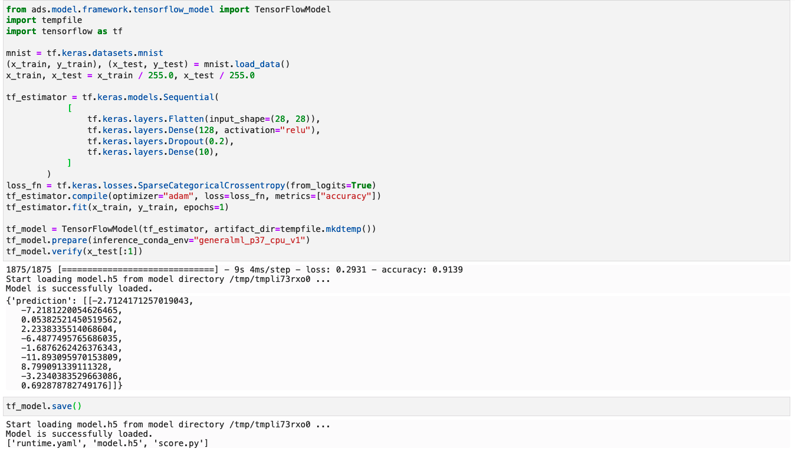
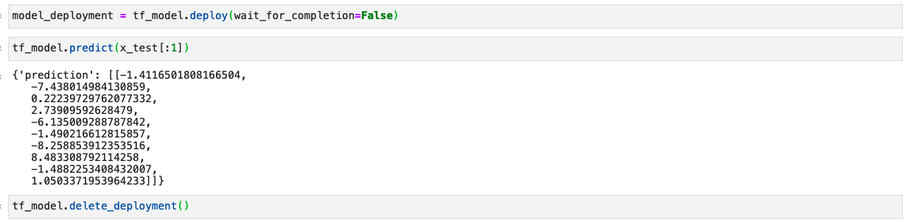

.. code:: python3

   # loading model from a or zip archive.
   model = TensorFlowModel.from_model_artifact("/folder_to_your/artifact.zip",
                                         model_file_name="your_model_file_name",
                                         artifact_dir=tempfile.mkdtemp())

   model.verify(your_data)

   # loading a remote model from the model catalog.
   model = TensorFlowModel.from_model_catalog(model_id="ocid1.datasciencemodel.oc1.iad.amaaaa....",
                                             model_file_name="your_model_file_name",
                                             artifact_dir=tempfile.mkdtemp())
   model.verify(your_data)

AutoMLModel
+++++++++++

.. code:: python3

  import tempfile
  import logging
  import warnings
  from ads.automl.driver import AutoML
  from ads.automl.provider import OracleAutoMLProvider
  from ads.dataset.dataset_browser import DatasetBrowser
  from ads.model.framework.automl_model import AutoMLModel
  from ads.common.model_metadata import UseCaseType

  ds = DatasetBrowser.sklearn().open("wine").set_target("target")
  train, test = ds.train_test_split(test_size=0.1, random_state = 42)

  ml_engine = OracleAutoMLProvider(n_jobs=-1, loglevel=logging.ERROR)
  oracle_automl = AutoML(train, provider=ml_engine)
  model, baseline = oracle_automl.train(
              model_list=['LogisticRegression', 'DecisionTreeClassifier'],
              random_state = 42,
              time_budget = 500
      )

  artifact_dir = tempfile.mkdtemp()
  automl_model = AutoMLModel(estimator=model, artifact_dir=artifact_dir)
  automl_model.prepare(inference_conda_env="generalml_p37_cpu_v1",
                      training_conda_env="generalml_p37_cpu_v1",
                      use_case_type=UseCaseType.BINARY_CLASSIFICATION,
                      X_sample=test.X,
                      force_overwrite=True)
  automl_model.verify(test.X.iloc[:10])
  model_id = automl_model.save(display_name='Demo AutoMLModel model')
  deploy = automl_model.deploy(display_name='Demo AutoMLModel deployment')
  automl_model.predict(test.X.iloc[:10])
  automl_model.delete_deployment()

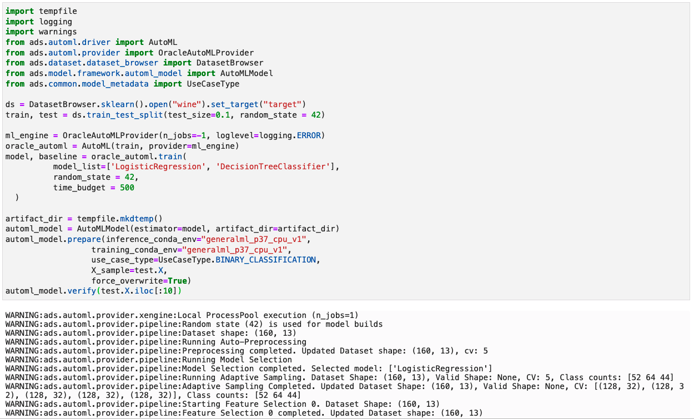
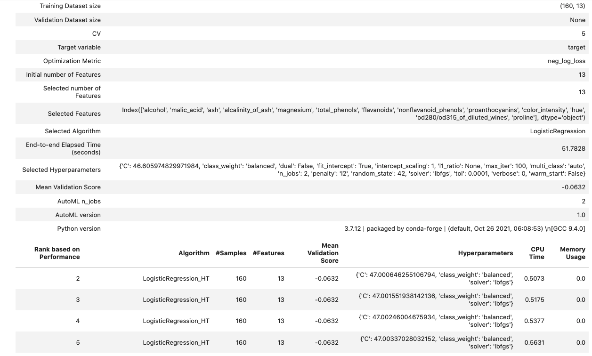
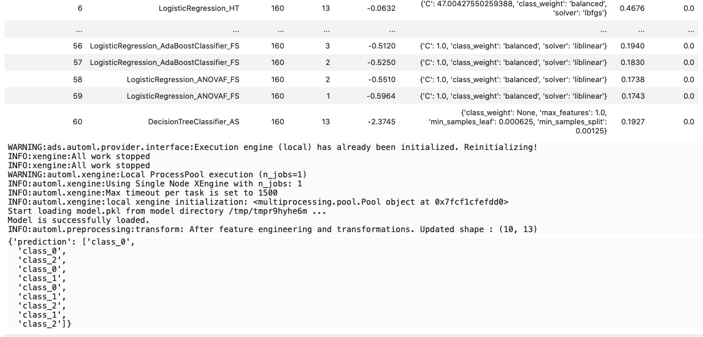
.. figure:: figure/AutoMLModel3.png
   :align: center

.. code:: python3

   # loading model from a or zip archive.
   model = AutoMLModel.from_model_artifact("/folder_to_your/artifact.zip",
                                         model_file_name="your_model_file_name",
                                         artifact_dir=tempfile.mkdtemp())

   model.verify(your_data)

   # loading a remote model from the model catalog.
   model = AutoMLModel.from_model_catalog(model_id="ocid1.datasciencemodel.oc1.iad.amaaaa....",
                                          model_file_name="your_model_file_name",
                                          artifact_dir=tempfile.mkdtemp())
   model.verify(your_data)
