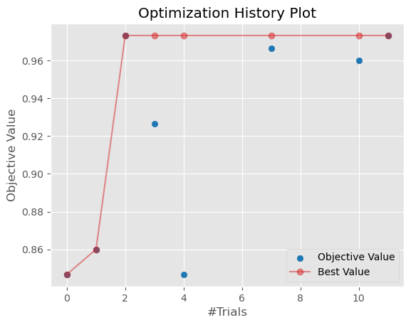

ADSTuner
--------

In addition to the other services for training models, ADS includes a hyperparameter tuning framework called ``ADSTuner``.

``ADSTuner`` supports using several hyperparameter search strategies that plug into common model architectures like ``sklearn``.

``ADSTuner`` further supports users defining their own search spaces and strategies. This makes ADSTuner functional and useful with any ML library that doesn't include hyperparameter tuning.

First, import the packages:

.. code-block:: python3

  import category_encoders as ce
  import lightgbm
  import logging
  import numpy as np
  import os
  import pandas as pd
  import pytest
  import sklearn
  import xgboost

  from ads.hpo.stopping_criterion import *
  from ads.hpo.distributions import *
  from ads.hpo.search_cv import ADSTuner

  from lightgbm import LGBMClassifier
  from sklearn import preprocessing
  from sklearn.compose import ColumnTransformer
  from sklearn.datasets import load_iris, load_boston
  from sklearn.decomposition import PCA
  from sklearn.ensemble import AdaBoostRegressor, AdaBoostClassifier
  from sklearn.impute import SimpleImputer
  from sklearn.linear_model import SGDClassifier, LogisticRegression
  from sklearn.metrics import make_scorer, f1_score
  from sklearn.model_selection import train_test_split
  from sklearn.pipeline import Pipeline
  from sklearn.preprocessing import StandardScaler
  from sklearn.feature_selection import SelectKBest, f_classif
  from xgboost import XGBClassifier

This is an example of running the ADSTuner on a support model SGD from ``sklearn``:

.. code-block:: python3

  model = SGDClassifier() ##Initialize the model
  X, y = load_iris(return_X_y=True)
  X_train, X_valid, y_train, y_valid = train_test_split(X, y)
  tuner = ADSTuner(model, cv=3) ## cv is cross validation splits
  tuner.search_space() ##This is the default search space
  tuner.tune(X_train, y_train, exit_criterion=[NTrials(10)])

ADSTuner generates a tuning report that lists its trials, best performing hyperparameters, and performance statistics with:

.. image:: figures/adstuner.png

You can use ``tuner.best_score`` to get the best score on the scoring metric used (accessible as ``tuner.scoring_name``).
The best selected parameters are obtained with ``tuner.best_params`` and the complete record of trials with ``tuner.trials``

If you have further compute resources and want to continue hyperparameter optimization on a model that has already been optimized, you can use:

.. code-block:: python3

  tuner.resume()
  print('So far the best {} score is {}'.format(tuner.scoring_name, tuner.best_score))
  print("The best trial found was number: " + str(tuner.best_index))

``ADSTuner`` has some robust visualization and plotting capabilities:

.. code-block:: python3

  tuner.plot_best_scores()
  tuner.plot_intermediate_scores()
  tuner.search_space()
  tuner.plot_contour_scores(params=['penalty', 'alpha'])
  tuner.plot_parallel_coordinate_scores(params=['penalty', 'alpha'])
  tuner.plot_edf_scores()

These commands produce the following plots:

.. image:: figures/contourplot.png
.. image:: figures/empiricaldistribution.png
.. image:: figures/intermediatevalues.png
.. image:: figures/optimizationhistory.png
.. image:: figures/parallelcoordinate.png

``ADSTuner`` supports custom scoring functions and custom search spaces. This example uses a different model:

.. code-block:: python3

  model2 = LogisticRegression()
  tuner = ADSTuner(model2,
                   strategy = {
                   'C': LogUniformDistribution(low=1e-05, high=1),
                   'solver': CategoricalDistribution(['saga']),
                   'max_iter': IntUniformDistribution(500, 1000, 50)},
                   scoring=make_scorer(f1_score, average='weighted'),
                   cv=3)
  tuner.tune(X_train, y_train, exit_criterion=[NTrials(5)])

``ADSTuner`` doesn't support every model. The supported models are:

  - 'Ridge',
  - 'RidgeClassifier',
  - 'Lasso',
  - 'ElasticNet',
  - 'LogisticRegression',
  - 'SVC',
  - 'SVR',
  - 'LinearSVC',
  - 'LinearSVR',
  - 'DecisionTreeClassifier',
  - 'DecisionTreeRegressor',
  - 'RandomForestClassifier',
  - 'RandomForestRegressor',
  - 'GradientBoostingClassifier',
  - 'GradientBoostingRegressor',
  - 'XGBClassifier',
  - 'XGBRegressor',
  - 'ExtraTreesClassifier',
  - 'ExtraTreesRegressor',
  - 'LGBMClassifier',
  - 'LGBMRegressor',
  - 'SGDClassifier',
  - 'SGDRegressor'

The ``AdaBoostRegressor`` model is not supported. This is an example of a custom strategy to use with this model:

.. code-block:: python3

  model3 = AdaBoostRegressor()
  X, y = load_boston(return_X_y=True)
  X_train, X_valid, y_train, y_valid = train_test_split(X, y)
  tuner = ADSTuner(model3, strategy={'n_estimators': IntUniformDistribution(50, 100)})
  tuner.tune(X_train, y_train, exit_criterion=[TimeBudget(5)])

Finally, ``ADSTuner`` supports ``sklearn`` pipelines:

.. code-block:: python3

  df, target = pd.read_csv(os.path.join('~', 'advanced-ds', 'tests', 'vor_datasets', 'vor_titanic.csv')), 'Survived'
  X = df.drop(target, axis=1)
  y = df[target]

  numeric_features = X.select_dtypes(include=['int64', 'float64', 'int32', 'float32']).columns
  categorical_features = X.select_dtypes(include=['object', 'category', 'bool']).columns

  y = preprocessing.LabelEncoder().fit_transform(y)

  X_train, X_valid, y_train, y_valid = train_test_split(X, y, test_size=0.3, random_state=42)

  num_features = len(numeric_features) + len(categorical_features)

  numeric_transformer = Pipeline(steps=[
      ('num_imputer', SimpleImputer(strategy='median')),
      ('num_scaler', StandardScaler())
  ])

  categorical_transformer = Pipeline(steps=[
      ('cat_imputer', SimpleImputer(strategy='constant', fill_value='missing')),
      ('cat_encoder', ce.woe.WOEEncoder())
  ])

  preprocessor = ColumnTransformer(
      transformers=[
          ('num', numeric_transformer, numeric_features),
          ('cat', categorical_transformer, categorical_features)
      ]
  )

  pipe = Pipeline(
      steps=[
          ('preprocessor', preprocessor),
          ('feature_selection', SelectKBest(f_classif, k=int(0.9 * num_features))),
          ('classifier', LogisticRegression())
      ]
  )

  def customerize_score(y_true, y_pred, sample_weight=None):
      score = y_true == y_pred
      return np.average(score, weights=sample_weight)

  score = make_scorer(customerize_score)
  ads_search = ADSTuner(
      pipe,
      scoring=score,
      strategy='detailed',
      cv=2,
      random_state=42
  )
  ads_search.tune(X=X_train, y=y_train, exit_criterion=[NTrials(20)])

---------------------------------------------------------------
**Notebook Example: Hyperparameter Optimization with ADSTuner**
---------------------------------------------------------------

**Overview:**

A hyperparameter is a parameter that is used to control a learning
process. This is in contrast to other parameters that are learned in the
training process. The process of hyperparameter optimization is to
search for hyperparameter values by building many models and assessing
their quality. This notebook provides an overview of the ``ADSTuner``
hyperparameter optimization engine. ``ADSTuner`` can optimize any
estimator object that follows the `scikit-learn
API <https://scikit-learn.org/stable/modules/classes.html>`__.

**Objectives:**

-  Introduction

   -  Synchronous Tuning with Exit Criterion Based on Number of Trials
   -  Asynchronously Tuning with Exit Criterion Based on Time Budget
   -  Inspecting the Tuning Trials

-  Defining a Custom Search Space and Score

   -  Changing the Search Space Strategy

-  Optimizing a scikit-learn ``Pipeline()``\
-  References

--------------

**Important:**

Placeholder text for required values are surrounded by angle brackets
that must be removed when adding the indicated content. For example,
when adding a database name to ``database_name = "<database_name>"``
would become ``database_name = "production"``.

--------------

Datasets are provided as a convenience. Datasets are considered third
party content and are not considered materials under your agreement with
Oracle applicable to the services. The iris dataset is distributed under
the `BSD
license <https://github.com/scikit-learn/scikit-learn/blob/master/COPYING>`__.

.. code:: ipython3

    import category_encoders as ce
    import lightgbm
    import logging
    import numpy as np
    import os
    import pandas as pd
    import sklearn
    import time

    from ads.hpo.stopping_criterion import *
    from ads.hpo.distributions import *
    from ads.hpo.search_cv import ADSTuner, State

    from sklearn import preprocessing
    from sklearn.compose import ColumnTransformer
    from sklearn.datasets import load_iris, load_boston
    from sklearn.decomposition import PCA
    from sklearn.impute import SimpleImputer
    from sklearn.linear_model import SGDClassifier, LogisticRegression
    from sklearn.metrics import make_scorer, f1_score
    from sklearn.model_selection import train_test_split
    from sklearn.pipeline import Pipeline
    from sklearn.preprocessing import StandardScaler
    from sklearn.feature_selection import SelectKBest, f_classif

**Introduction**

Hyperparameter optimization requires a model, dataset, and an
``ADSTuner`` object to perform the search.

``ADSTuner()`` Performs a hyperparameter search using
`cross-validation <https://en.wikipedia.org/wiki/Cross-validation_(statistics)>`__.
You can specify the number of folds you want to use with the ``cv``
parameter.

Because the ``ADSTuner()`` needs a search space in which to tune the hyperparameters,
you must use the ``strategy`` parameter. This parameter can be set in two
ways. You can specify detailed search criteria or you can use the
built-in defaults. For the supported model classes, ``ADSTuner``
provides ``perfunctory``\ and ``detailed`` search spaces that are
optimized for the chosen class of model. The ``perfunctory``
option is optimized for a small search space so that the most important
hyperparameters are tuned. Generally, this option is used early in your
search as it reduces the computational cost and allows you to assess the
quality of the model class that you are using. The ``detailed`` search
space instructs ``ADSTuner`` to cover a broad search space by tuning
more hyperparameters. Typically, you would use it when you have
determined what class of model is best suited for the dataset and type
of problem you are working on. If you have experience with the dataset
and have a good idea of what the best hyperparameter values are, you can
explicitly specify the search space. You pass a dictionary that defines
the search space into the ``strategy``.

The parameter ``storage`` takes a database URL. For example,
``sqlite:////home/datascience/example.db``. When ``storage`` is set to
the default value ``None``, a new sqlite database file is created
internally in the ``tmp`` folder with a unique name. The name format is
``sqlite:////tmp/hpo_*.db``. ``study_name`` is the name of this study
for this ``ADSTuner`` object. Each ``ADSTuner`` object has a unique
``study_name``. However, one database file can be shared among different
``ADSTuner`` objects. ``load_if_exists`` controls whether to load an
existing study from an existing database file. If ``False``, it raises a
``DuplicatedStudyError`` when the ``study_name`` exists.

The ``loglevel`` parameter controls the amount of logging information
displayed in the notebook.

This notebook uses the scikit-learn ``SGDClassifer()`` model and the
iris dataset. This model object is a regularized linear model with
`stochastic gradient
descent <https://en.wikipedia.org/wiki/Stochastic_gradient_descent>`__
(SGD) used to optimize the model parameters.

The next cell creates the ``SGDClassifer()`` model, initialize san
``ADSTuner`` object, and loads the iris data.

.. code:: ipython3

    tuner = ADSTuner(SGDClassifier(), cv=3, loglevel=logging.WARNING)
    X, y = load_iris(return_X_y=True)

.. parsed-literal::

    [I 2023-07-18 15:40:56,115] A new study created in RDB with name: hpo_9933857f-c10a-4ece-9828-434aea4b07c2

Each model class has a set of hyperparameters that you need to
optimized. The ``strategy`` attribute returns what strategy is being
used. This can be ``perfunctory``, ``detailed``, or a dictionary that
defines the strategy. The method ``search_space()`` always returns a
dictionary of hyperparameters that are to be searched. Any
hyperparameter that is required by the model, but is not listed, uses
the default value that is defined by the model class. To see what search
space is being used for your model class when ``strategy`` is
``perfunctory`` or ``detailed`` use the ``search_space()`` method to see
the details.

The ``adstuner_search_space_update.ipynb`` notebook has detailed
examples about how to work with and update the search space.

The next cell displaces the search strategy and the search space.

.. code:: ipython3

    print(f'Search Space for strategy "{tuner.strategy}" is: \n {tuner.search_space()}')

.. parsed-literal::

    Search Space for strategy "perfunctory" is:
     {'alpha': LogUniformDistribution(low=0.0001, high=0.1), 'penalty': CategoricalDistribution(choices=['l1', 'l2', 'none'])}

The ``tune()`` method starts a tuning process. It has a synchronous and
asynchronous mode for tuning. The mode is set with the ``synchronous``
parameter. When it is set to ``False``, the tuning process runs
asynchronously so it runs in the background and allows you to continue
your work in the notebook. When ``synchronous`` is set to ``True``, the
notebook is blocked until ``tune()`` finishes running. The
``adntuner_sync_and_async.ipynb`` notebook illustrates this feature in a
more detailed way.

The ``ADSTuner`` object needs to know when to stop tuning. The
``exit_criterion`` parameter accepts a list of criteria that cause the
tuning to finish. If any of the criteria are met, then the tuning
process stops. Valid exit criteria are:

-  ``NTrials(n)``: Run for ``n`` number of trials.
-  ``TimeBudget(t)``: Run for ``t`` seconds.
-  ``ScoreValue(s)``: Run until the score value exceeds ``s``.

The default behavior is to run for 50 trials (``NTrials(50)``).

The stopping criteria are listed in the
``ads.hpo.stopping_criterion`` module.

**Synchronous Tuning with Exit Criterion Based on Number of Trials**

This section demonstrates how to perform a synchronous tuning process
with the exit criteria based on the number of trials. In the next cell,
the ``synchronous`` parameter is set to ``True`` and the
``exit_criterion`` is set to ``[NTrials(5)]``.

.. code:: ipython3

    tuner.tune(X, y, exit_criterion=[NTrials(5)], synchronous=True)

You can access a summary of the trials by looking at the various
attributes of the ``tuner`` object. The ``scoring_name`` attribute is a
string that defines the name of the scoring metric. The ``best_score``
attribute gives the best score of all the completed trials. The
``best_params`` parameter defines the values of the hyperparameters that
have to lead to the best score. Hyperparameters that are not in the
search criteria are not reported.

.. code:: ipython3

    print(f"So far the best {tuner.scoring_name} score is {tuner.best_score} and the best hyperparameters are {tuner.best_params}")

.. parsed-literal::

    So far the best mean accuracy score is 0.9733333333333333 and the best hyperparameters are {'alpha': 0.04730029773763652, 'penalty': 'none'}

You can also look at the detailed table of all the trials attempted:

.. code:: ipython3

    tuner.trials.tail()

.. raw:: html

    

    

    

    
    <table border="1" class="dataframe">
      <thead>
        <tr style="text-align: right;">
          <th></th>
          <th>number</th>
          <th>value</th>
          <th>datetime_start</th>
          <th>datetime_complete</th>
          <th>duration</th>
          <th>params_alpha</th>
          <th>params_penalty</th>
          <th>user_attrs_mean_fit_time</th>
          <th>user_attrs_mean_score_time</th>
          <th>user_attrs_mean_test_score</th>
          <th>user_attrs_metric</th>
          <th>user_attrs_split0_test_score</th>
          <th>user_attrs_split1_test_score</th>
          <th>user_attrs_split2_test_score</th>
          <th>user_attrs_std_fit_time</th>
          <th>user_attrs_std_score_time</th>
          <th>user_attrs_std_test_score</th>
          <th>state</th>
        </tr>
      </thead>
      <tbody>
        <tr>
          <th>0</th>
          <td>0</td>
          <td>0.846667</td>
          <td>2023-07-18 15:40:56.236058</td>
          <td>2023-07-18 15:40:57.815838</td>
          <td>0 days 00:00:01.579780</td>
          <td>0.000269</td>
          <td>l2</td>
          <td>0.130862</td>
          <td>0.025274</td>
          <td>0.846667</td>
          <td>mean accuracy</td>
          <td>0.76</td>
          <td>0.88</td>
          <td>0.90</td>
          <td>0.004218</td>
          <td>0.000925</td>
          <td>0.061824</td>
          <td>COMPLETE</td>
        </tr>
        <tr>
          <th>1</th>
          <td>1</td>
          <td>0.860000</td>
          <td>2023-07-18 15:40:57.829067</td>
          <td>2023-07-18 15:40:59.349433</td>
          <td>0 days 00:00:01.520366</td>
          <td>0.000125</td>
          <td>l2</td>
          <td>0.128980</td>
          <td>0.025028</td>
          <td>0.860000</td>
          <td>mean accuracy</td>
          <td>0.80</td>
          <td>0.94</td>
          <td>0.84</td>
          <td>0.003289</td>
          <td>0.000634</td>
          <td>0.058878</td>
          <td>COMPLETE</td>
        </tr>
        <tr>
          <th>2</th>
          <td>2</td>
          <td>0.973333</td>
          <td>2023-07-18 15:40:59.358309</td>
          <td>2023-07-18 15:41:00.814785</td>
          <td>0 days 00:00:01.456476</td>
          <td>0.047300</td>
          <td>none</td>
          <td>0.122376</td>
          <td>0.023761</td>
          <td>0.973333</td>
          <td>mean accuracy</td>
          <td>1.00</td>
          <td>0.96</td>
          <td>0.96</td>
          <td>0.002859</td>
          <td>0.000554</td>
          <td>0.018856</td>
          <td>COMPLETE</td>
        </tr>
        <tr>
          <th>3</th>
          <td>3</td>
          <td>0.926667</td>
          <td>2023-07-18 15:41:00.823800</td>
          <td>2023-07-18 15:41:02.285543</td>
          <td>0 days 00:00:01.461743</td>
          <td>0.000798</td>
          <td>l2</td>
          <td>0.122965</td>
          <td>0.023687</td>
          <td>0.926667</td>
          <td>mean accuracy</td>
          <td>0.98</td>
          <td>0.88</td>
          <td>0.92</td>
          <td>0.002738</td>
          <td>0.000463</td>
          <td>0.041096</td>
          <td>COMPLETE</td>
        </tr>
        <tr>
          <th>4</th>
          <td>4</td>
          <td>0.846667</td>
          <td>2023-07-18 15:41:02.294516</td>
          <td>2023-07-18 15:41:03.768919</td>
          <td>0 days 00:00:01.474403</td>
          <td>0.061982</td>
          <td>l2</td>
          <td>0.122523</td>
          <td>0.023601</td>
          <td>0.846667</td>
          <td>mean accuracy</td>
          <td>0.74</td>
          <td>0.94</td>
          <td>0.86</td>
          <td>0.003231</td>
          <td>0.000534</td>
          <td>0.082192</td>
          <td>COMPLETE</td>
        </tr>
      </tbody>
    </table>
    

**Asynchronously Tuning with Exit Criterion Based on Time Budget**

``ADSTuner()`` tuner can be run in an asynchronous mode by setting
``synchronous=False`` in the ``tune()`` method. This allows you to run
other Python commands while the tuning process is executing in the
background. This section demonstrates how to run an asynchronous search
for the optimal hyperparameters. It uses a stopping criteria of five
seconds. This is controlled by the parameter
``exit_criterion=[TimeBudget(5)]``.

The next cell starts an asynchronous tuning process. A loop is created
that prints the best search results that have been detected so far by
using the ``best_score`` attribute. It also displays the remaining time
in the time budget by using the ``time_remaining`` attribute. The
attribute ``status`` is used to exit the loop.

.. code:: ipython3

    # This cell will return right away since it's running asynchronous.
    tuner.tune(exit_criterion=[TimeBudget(5)])
    while tuner.status == State.RUNNING:
        print(f"So far the best score is {tuner.best_score} and the time left is {tuner.time_remaining}")
        time.sleep(1)

.. parsed-literal::

    So far the best score is 0.9733333333333333 and the time left is 4.972609996795654
    So far the best score is 0.9733333333333333 and the time left is 3.959090232849121
    So far the best score is 0.9733333333333333 and the time left is 2.943150043487549
    So far the best score is 0.9733333333333333 and the time left is 1.9304382801055908
    So far the best score is 0.9733333333333333 and the time left is 0.9201889038085938

The attribute ``best_index`` givse you the index in the ``trials`` data
frame where the best model is located.

.. code:: ipython3

    tuner.trials.loc[tuner.best_index, :]

.. parsed-literal::

    number                                                   2
    value                                             0.973333
    datetime_start                  2023-07-18 15:40:59.358309
    datetime_complete               2023-07-18 15:41:00.814785
    duration                            0 days 00:00:01.456476
    params_alpha                                        0.0473
    params_penalty                                        none
    user_attrs_mean_fit_time                          0.122376
    user_attrs_mean_score_time                        0.023761
    user_attrs_mean_test_score                        0.973333
    user_attrs_metric                            mean accuracy
    user_attrs_split0_test_score                           1.0
    user_attrs_split1_test_score                          0.96
    user_attrs_split2_test_score                          0.96
    user_attrs_std_fit_time                           0.002859
    user_attrs_std_score_time                         0.000554
    user_attrs_std_test_score                         0.018856
    state                                             COMPLETE
    Name: 2, dtype: object

The attribute ``n_trials`` reports the number of successfully completed
trials.

.. code:: ipython3

    print(f"The total of trials was: {tuner.n_trials}.")

.. parsed-literal::

    The total of trials was: 12.

**Inspecting the Tuning Trials**

You can inspect the tuning trials performance using several built-in
plots.

**Note**: If the tuning process is still running in the background, the
plot runs in real time to update the new changes until the tuning
process completes.

.. code:: ipython3

    # tuner.tune(exit_criterion=[NTrials(5)], loglevel=logging.WARNING) # uncomment this line to see the real-time plot.
    tuner.plot_best_scores()

.. code:: ipython3

    tuner.plot_intermediate_scores()

.. code:: ipython3

    tuner.plot_contour_scores(params=['penalty', 'alpha'])

.. code:: ipython3

    tuner.plot_parallel_coordinate_scores(params=['penalty', 'alpha'])

.. code:: ipython3

    tuner.plot_edf_scores()

.. code:: ipython3

    tuner.plot_param_importance()

.. parsed-literal::

    Waiting for more trials before evaluating the param importance.

**Defining a Custom Search Space and Score**

Instead of using a ``perfunctory`` or ``detailed`` strategy, define a
custom search space strategy.

The next cell, creates a ``LogisticRegression()`` model instance then
defines a custom search space strategy for the three
``LogisticRegression()`` hyperparameters, ``C``, ``solver``, and
``max_iter`` parameters.

You can define a custom ``scoring`` parameter, see Optimizing a
scikit-learn ``Pipeline()``\  though this example uses the standard
weighted average :math:`F_1`, ``f1_score``.

.. code:: ipython3

    tuner = ADSTuner(LogisticRegression(),
                     strategy = {'C': LogUniformDistribution(low=1e-05, high=1),
                                 'solver': CategoricalDistribution(['saga']),
                                 'max_iter': IntUniformDistribution(500, 2000, 50)},
                     scoring=make_scorer(f1_score, average='weighted'),
                     cv=3)
    tuner.tune(X, y, exit_criterion=[NTrials(5)], synchronous=True, loglevel=logging.WARNING)

**Changing the Search Space Strategy**

You can change the search space in the following three ways:

-  Add new hyperparameters
-  Remove existing hyperparameters
-  Modify the range of existing non-categorical hyperparameters

**Note**: You can’t change the distribution of an existing
hyperparameter or make any changes to a hyperparameter that is based on
a categorical distribution. You need to initiate a new ``ADSTuner``
object for those cases. For more detailed information, review the
``adstuner_search_space_update.ipynb`` notebook.

The next cell switches to a ``detailed`` strategy. All previous values
set for ``C``, ``solver``, and ``max_iter`` are kept, and ``ADSTuner``
infers distributions for the remaining hyperparameters. You can force an
overwrite by setting ``overwrite=True``.

.. code:: ipython3

    tuner.search_space(strategy='detailed')

.. parsed-literal::

    {'C': LogUniformDistribution(low=1e-05, high=10),
     'solver': CategoricalDistribution(choices=['saga']),
     'max_iter': IntUniformDistribution(low=500, high=2000, step=50),
     'dual': CategoricalDistribution(choices=[False]),
     'penalty': CategoricalDistribution(choices=['elasticnet']),
     'l1_ratio': UniformDistribution(low=0, high=1)}

Alternatively, you can edit a subset of the search space by changing the
range.

.. code:: ipython3

    tuner.search_space(strategy={'C': LogUniformDistribution(low=1e-05, high=1)})

.. parsed-literal::

    {'C': LogUniformDistribution(low=1e-05, high=1),
     'solver': CategoricalDistribution(choices=['saga']),
     'max_iter': IntUniformDistribution(low=500, high=2000, step=50),
     'dual': CategoricalDistribution(choices=[False]),
     'penalty': CategoricalDistribution(choices=['elasticnet']),
     'l1_ratio': UniformDistribution(low=0, high=1)}

Here’s an example of using ``overwrite=True`` to reset to the default
values for ``detailed``:

.. code:: ipython3

    tuner.search_space(strategy='detailed', overwrite=True)

.. parsed-literal::

    {'C': LogUniformDistribution(low=1e-05, high=10),
     'dual': CategoricalDistribution(choices=[False]),
     'penalty': CategoricalDistribution(choices=['elasticnet']),
     'solver': CategoricalDistribution(choices=['saga']),
     'l1_ratio': UniformDistribution(low=0, high=1)}

.. code:: ipython3

    tuner.tune(X, y, exit_criterion=[NTrials(5)], synchronous=True, loglevel=logging.WARNING)

**Optimizing a scikit-learn Pipeline**

The following example demonstrates how the ``ADSTuner`` hyperparameter
optimization engine can optimize the **sklearn** ``Pipeline()`` objects.

You create a scikit-learn ``Pipeline()`` model object and use
``ADSTuner`` to optimize its performance on the iris dataset from
sklearn.

The dataset is then split into X and y, which refers to the training
features and the target feature respectively. Again, applying a
``train_test_split()`` call splits the data into training and validation
datasets.

.. code:: ipython3

    X, y = load_iris(return_X_y=True)
    X = pd.DataFrame(data=X, columns=["sepal_length", "sepal_width", "petal_length", "petal_width"])
    y = pd.DataFrame(data=y)

    numeric_features = X.select_dtypes(include=['int64', 'float64', 'int32', 'float32']).columns
    categorical_features = y.select_dtypes(include=['object', 'category', 'bool']).columns

    y = preprocessing.LabelEncoder().fit_transform(y)

    num_features = len(numeric_features) + len(categorical_features)

    numeric_transformer = Pipeline(steps=[
        ('num_imputer', SimpleImputer(strategy='median')),
        ('num_scaler', StandardScaler())
    ])

    categorical_transformer = Pipeline(steps=[
        ('cat_imputer', SimpleImputer(strategy='constant', fill_value='missing')),
        ('cat_encoder', ce.woe.WOEEncoder())
    ])

    preprocessor = ColumnTransformer(
        transformers=[
            ('num', numeric_transformer, numeric_features),
            ('cat', categorical_transformer, categorical_features)
        ]
    )

    pipe = Pipeline(
        steps=[
            ('preprocessor', preprocessor),
            ('feature_selection', SelectKBest(f_classif, k=int(0.9 * num_features))),
            ('classifier', LogisticRegression())
        ]
    )

You can define a custom score function. In this example, it is directly
measuring how close the predicted y-values are to the true y-values by
taking the weighted average of the number of direct matches between the
y-values.

.. code:: ipython3

    def custom_score(y_true, y_pred, sample_weight=None):
        score = (y_true == y_pred)
        return np.average(score, weights=sample_weight)

    score = make_scorer(custom_score)

Again, you instantiate the ``ADSTuner()`` object and use it to tune the
iris\` dataset:

.. code:: ipython3

    ads_search = ADSTuner(
        pipe,
        scoring=score,
        strategy='detailed',
        cv=2,
        random_state=42)

    ads_search.tune(X=X, y=y, exit_criterion=[NTrials(20)], synchronous=True, loglevel=logging.WARNING)

The ``ads_search`` tuner can provide useful information about the tuning
process, like the best parameter that was optimized, the best score
achieved, the number of trials, and so on.

.. code:: ipython3

    ads_search.sklearn_steps

.. parsed-literal::

    {'classifier__C': 9.47220908749299,
     'classifier__dual': False,
     'classifier__l1_ratio': 0.9967712201895031,
     'classifier__penalty': 'elasticnet',
     'classifier__solver': 'saga'}

.. code:: ipython3

    ads_search.best_params

.. parsed-literal::

    {'C': 9.47220908749299,
     'dual': False,
     'l1_ratio': 0.9967712201895031,
     'penalty': 'elasticnet',
     'solver': 'saga'}

.. code:: ipython3

    ads_search.best_score

.. parsed-literal::

    0.9733333333333334

.. code:: ipython3

    ads_search.best_index

.. parsed-literal::

    12

.. code:: ipython3

    ads_search.trials.head()

.. raw:: html

    

    

    

    
    <table border="1" class="dataframe">
      <thead>
        <tr style="text-align: right;">
          <th></th>
          <th>number</th>
          <th>value</th>
          <th>datetime_start</th>
          <th>datetime_complete</th>
          <th>duration</th>
          <th>params_classifier__C</th>
          <th>params_classifier__dual</th>
          <th>params_classifier__l1_ratio</th>
          <th>params_classifier__penalty</th>
          <th>params_classifier__solver</th>
          <th>user_attrs_mean_fit_time</th>
          <th>user_attrs_mean_score_time</th>
          <th>user_attrs_mean_test_score</th>
          <th>user_attrs_metric</th>
          <th>user_attrs_split0_test_score</th>
          <th>user_attrs_split1_test_score</th>
          <th>user_attrs_std_fit_time</th>
          <th>user_attrs_std_score_time</th>
          <th>user_attrs_std_test_score</th>
          <th>state</th>
        </tr>
      </thead>
      <tbody>
        <tr>
          <th>0</th>
          <td>0</td>
          <td>0.333333</td>
          <td>2021-04-21 20:04:24.353482</td>
          <td>2021-04-21 20:04:24.484466</td>
          <td>0 days 00:00:00.130984</td>
          <td>0.001479</td>
          <td>False</td>
          <td>0.651235</td>
          <td>elasticnet</td>
          <td>saga</td>
          <td>0.011303</td>
          <td>0.002970</td>
          <td>0.333333</td>
          <td>custom_score</td>
          <td>0.333333</td>
          <td>0.333333</td>
          <td>0.003998</td>
          <td>0.000048</td>
          <td>0.000000</td>
          <td>COMPLETE</td>
        </tr>
        <tr>
          <th>1</th>
          <td>1</td>
          <td>0.953333</td>
          <td>2021-04-21 20:04:24.494040</td>
          <td>2021-04-21 20:04:24.580134</td>
          <td>0 days 00:00:00.086094</td>
          <td>0.282544</td>
          <td>False</td>
          <td>0.498126</td>
          <td>elasticnet</td>
          <td>saga</td>
          <td>0.008456</td>
          <td>0.003231</td>
          <td>0.953333</td>
          <td>custom_score</td>
          <td>0.946667</td>
          <td>0.960000</td>
          <td>0.000199</td>
          <td>0.000045</td>
          <td>0.006667</td>
          <td>COMPLETE</td>
        </tr>
        <tr>
          <th>2</th>
          <td>2</td>
          <td>0.333333</td>
          <td>2021-04-21 20:04:24.587609</td>
          <td>2021-04-21 20:04:24.669303</td>
          <td>0 days 00:00:00.081694</td>
          <td>0.003594</td>
          <td>False</td>
          <td>0.408387</td>
          <td>elasticnet</td>
          <td>saga</td>
          <td>0.007790</td>
          <td>0.002724</td>
          <td>0.333333</td>
          <td>custom_score</td>
          <td>0.333333</td>
          <td>0.333333</td>
          <td>0.000228</td>
          <td>0.000074</td>
          <td>0.000000</td>
          <td>COMPLETE</td>
        </tr>
        <tr>
          <th>3</th>
          <td>3</td>
          <td>0.333333</td>
          <td>2021-04-21 20:04:24.677784</td>
          <td>2021-04-21 20:04:24.760785</td>
          <td>0 days 00:00:00.083001</td>
          <td>0.003539</td>
          <td>False</td>
          <td>0.579841</td>
          <td>elasticnet</td>
          <td>saga</td>
          <td>0.007870</td>
          <td>0.002774</td>
          <td>0.333333</td>
          <td>custom_score</td>
          <td>0.333333</td>
          <td>0.333333</td>
          <td>0.000768</td>
          <td>0.000146</td>
          <td>0.000000</td>
          <td>COMPLETE</td>
        </tr>
        <tr>
          <th>4</th>
          <td>4</td>
          <td>0.333333</td>
          <td>2021-04-21 20:04:24.768813</td>
          <td>2021-04-21 20:04:24.852988</td>
          <td>0 days 00:00:00.084175</td>
          <td>0.000033</td>
          <td>False</td>
          <td>0.443814</td>
          <td>elasticnet</td>
          <td>saga</td>
          <td>0.008013</td>
          <td>0.003109</td>
          <td>0.333333</td>
          <td>custom_score</td>
          <td>0.333333</td>
          <td>0.333333</td>
          <td>0.000185</td>
          <td>0.000486</td>
          <td>0.000000</td>
          <td>COMPLETE</td>
        </tr>
      </tbody>
    </table>
    

.. code:: ipython3

    ads_search.n_trials

.. parsed-literal::

    20

**References**

-  `ADS Library
   Documentation <https://docs.cloud.oracle.com/en-us/iaas/tools/ads-sdk/latest/index.html>`__
-  `Cross-Validation <https://en.wikipedia.org/wiki/Cross-validation_(statistics)>`__
-  `OCI Data Science
   Documentation <https://docs.cloud.oracle.com/en-us/iaas/data-science/using/data-science.htm>`__
-  `Oracle Data & AI Blog <https://blogs.oracle.com/datascience/>`__
-  `Stochastic Gradient
   Descent <https://en.wikipedia.org/wiki/Stochastic_gradient_descent>`__
