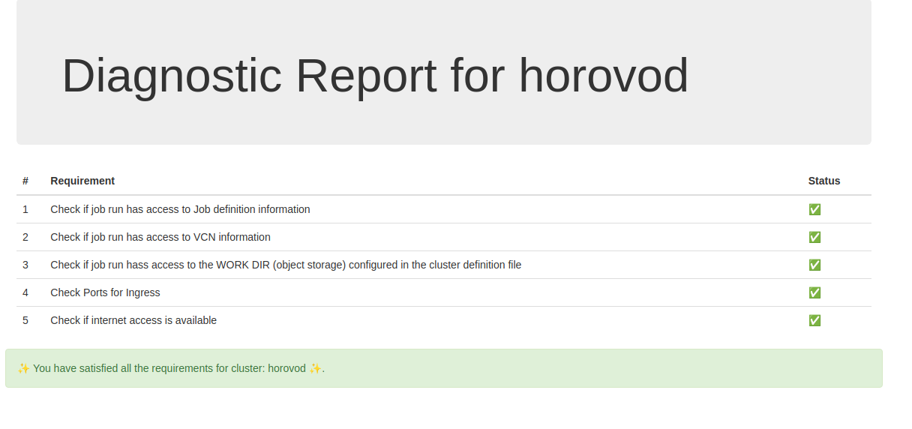

===============
Developer Guide
===============

.. include:: ../_prerequisite

Build Image
-----------

.. admonition:: Tip

    Use `-h` option to see options and usage help

    .. code-block:: bash

        ads opctl distributed-training build-image -h

**Args**

* -t: Tag of the docker image
* -reg: Docker Repository 
* -df: Dockerfile using which docker will be build 
* -push: push the image to oci registry
* -s: source code dir

.. code-block:: bash

    ads opctl distributed-training build-image \
    -t $TAG \
    -reg $NAME_OF_REGISTRY \
    -df $PATH_TO_DOCKERFILE \
    -s $MOUNT_FOLDER_PATH

**Note** : 

This command can be used to build a docker image from ads CLI. It writes the config.ini file in the user's runtime environment which can be used further referred by other CLI commands.

If ``-push`` tag is used in command then docker image is pushed to mentioned repository

*Sample config.ini file*

.. parsed-literal:: 
    [main]
    tag = $TAG
    registry = $NAME_OF_REGISTRY
    dockerfile = $PATH_TO_DOCKERFILE
    source_folder = $MOUNT_FOLDER_PATH
    ; mount oci keys for local testing 
    oci_key_mnt = ~/.oci:/home/oci_dist_training/.oci

Publish Docker Image
--------------------

**Args**

* -image: Name of the Docker image (default value is picked from config.ini file)

**Command**

.. code-block:: bash

    ads opctl distributed-training publish-image

**Note**

This command can be used to push images to the OCI repository. In case the name of the image is not mentioned it refers to the image name from the config.ini file.

Run the container Image on the OCI Data Science or local
--------------------------------------------------------

.. admonition:: Tip

    Use `-h` option to see options and usage help

    .. code-block:: bash

        ads opctl run -h

**Args**

* -f: Path to train.yaml file (required argument)
* -b : 
   
   * ``local`` → Run DT workflow on the local environment
   * ``job`` → Run DT workflow on the OCI ML Jobs 
   * **Note** : default value is set to jobs
   
* -i: Auto increments the tag of the image 
* -nopush: Doesn't Push the latest image to OCIR
* -nobuild: Doesn't build the image
* -t: Tag of the docker image
* -reg: Docker Repository 
* -df: Dockerfile using which docker will be build
* -s: source code dir

**Note** : The value "@image" for ``image`` attribute in ``train.yaml`` is replaced at runtime using combination of  ``-t`` and ``-r`` params.

**Command**

*Local Command*

.. code-block:: bash

    ads opctl run
            -f train.yaml
            -b local
            -i

*Jobs Command*

.. code-block:: bash

    ads opctl run
            -f train.yaml

**Note**

The command ``ads opctl run -f train.yaml`` is used to run distributed training jobs on OCI Data Science. By default, it builds the new image and pushes it to the OCIR. 

If required OCI API keys can be mounted by specifying the location in the config.ini file

Development Flow
-----------------

**Step 1**: 

Build the Docker and run it locally.

If required mount the code folder using the ``-s`` tag 

.. code-block::bash

    ads opctl run
            -f train.yaml 
            -b local
            -t $TAG
            -reg $NAME_OF_REGISTRY 
            -df $PATH_TO_DOCKERFILE
            -s $MOUNT_FOLDER_PATH

**Step 2**: 

If the user has changed files only in the mounted folder and needs to run it locally. *{Build is not required}*

.. code-block:: bash

    ads opctl run
            -f train.yaml
            -b local
            -nobuild

In case there are some changes apart from the mounted folder and needs to run it locally. *{Build is required}*

``-i`` tag is required only if the user needs to increment the tag of the image 

.. code-block:: bash

    ads opctl run
            -f train.yaml
            -b local
            -i

**Step 3**: 

Finally, to run on a jobs platform

.. code-block:: bash

    ads opctl run
            -f train.yaml

Diagnosing Infrastructure Setup
-------------------------------

Before submitting your code to Data Science Jobs, check if the infra setup meets the framework requirement. Each framework has a specific set of requirements.

``ads opctl check`` runs diagnosis by starting a single node ``jobrun`` using the container image specified in the ``train.yaml`` file.

.. code-block:: bash

    ads opctl check -f train.yaml --output infra_report.html

The `train.yaml` is the same yaml file that is defined for running distributed training code. The diagnostic report is saved in the file provided in ``--output`` option.

Here is a sample report generated for Horovod cluster - 

