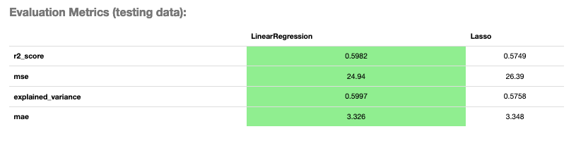
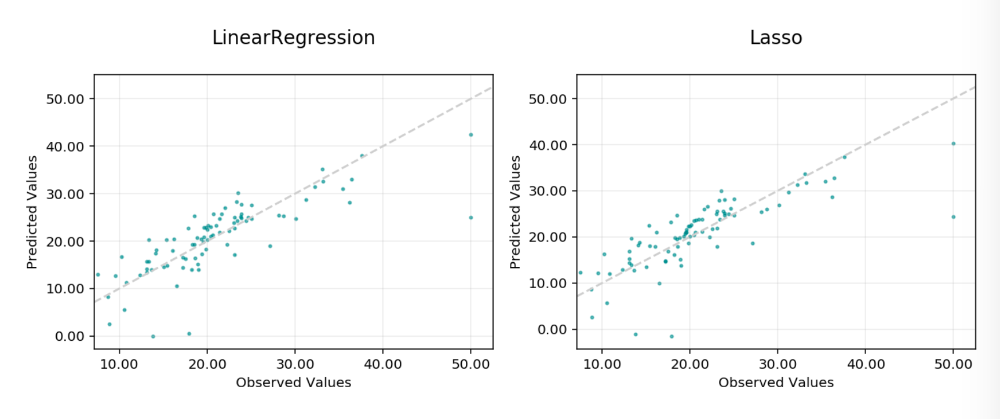
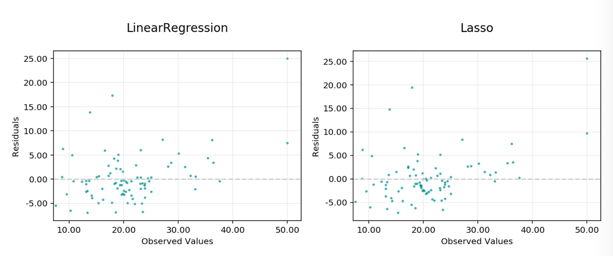

Regression
**********

Regression is a type of modeling wherein the output is continuous. For example, price, height, sales, length. These models have their own specific metrics that help to benchmark the model. How close is close enough?

The prevailing metrics for evaluating a regression model are:

* **Explained variance score**: The variance of the model's predictions. The mean of the squared difference between the predicted values and the true mean of the data, see `[Read More] <https://en.wikipedia.org/wiki/Explained_variation>`__.
* **Mean absolute error (MAE)**: The mean of the absolute difference between the true values and predicted values, see `[Read More] <https://en.wikipedia.org/wiki/Mean_absolute_error>`__.
* **Mean squared error (MSE)**: The mean of the squared difference between the true values and predicted values, see `[Read More] <https://en.wikipedia.org/wiki/Mean_squared_error>`__.
* **R-squared**: Also known as the **coefficient of determination**. It is the proportion in the data of the variance that is explained by the model, see `[Read More] <https://en.wikipedia.org/wiki/Coefficient_of_determination>`__.
* **Root mean squared error (RMSE)**: The square root of the **mean squared error**, see `[Read More] <https://en.wikipedia.org/wiki/Root-mean-square_deviation>`__.
* **Mean residuals**: The mean of the difference between the true values and predicted values, see `[Read More] <https://en.wikipedia.org/wiki/Errors_and_residuals>`__.

The prevailing charts and plots for regression are:

* **Observed vs. predicted**: A plot of the observed, or actual values, against the predicted values output by the models.
* **Residuals QQ**: The quantile-quantile plot, shows the residuals and quantiles of a standard normal distribution. It should be close to a straight line for a good model.
* **Residuals vs observed**: A plot of residuals vs observed values. This should not carry a lot of structure in a good model.
* **Residuals vs. predicted**: A plot of residuals versus predicted values. This should not carry a lot of structure in a good model.

This code snippet demonstrates how to generate the above metrics and charts. The data has to be split into a testing and training set with the features in `X_train` and `X_test` and the responses in `y_train` and `y_test`.

.. code-block:: python3

    from sklearn.datasets import make_regression
    from sklearn.model_selection import train_test_split
    from sklearn.linear_model import LinearRegression, Lasso
    from sklearn.ensemble import RandomForestClassifier

    from ads.common.model import ADSModel
    from ads.common.data import ADSData
    from ads.evaluations.evaluator import ADSEvaluator

    seed = 42

    X, y = make_regression(n_samples=10000, n_features=10, n_informative=2, random_state=42)

    trainx, testx, trainy, testy = train_test_split(X, y, test_size=0.3, random_state=seed)

    lin_reg = LinearRegression().fit(trainx, trainy)

    lasso_reg = Lasso(alpha=0.1).fit(trainx, trainy)

    lin_reg_model = ADSModel.from_estimator(lin_reg)
    lasso_reg_model = ADSModel.from_estimator(lasso_reg)

    reg_evaluator = ADSEvaluator(
        ADSData(testx, testy), models=[lin_reg_model, lasso_reg_model]
    )

    print(reg_evaluator.metrics)

To show all of the metrics in a table, run:

.. code-block:: python3

  evaluator.metrics

   **Evaluator Metrics**

To show all of the charts, run:

.. code-block:: python3

    evaluator.show_in_notebook()

   **Observed vs Predicted**

.. figure:: figures/regression_residual_qq.png
   :align: center

   **Residual Q-Q Plot**

.. figure:: figures/regression_residual_vs_predicted.png
   :align: center

   **Residual vs Predicted**

   **Residual vs Observed**

This code snippet demonstrates how to add a custom metric, `Number Correct`, to the evaluator.

.. code-block:: python3

    from ads.evaluations.evaluator import ADSEvaluator
    evaluator = ADSEvaluator(test, models=[modelA, modelB, modelC modelD])

    def num_correct(y_true, y_pred):
        return sum(y_true == y_pred)
    evaluator.add_metrics([num_correct], ["Number Correct"])
    evaluator.metrics

