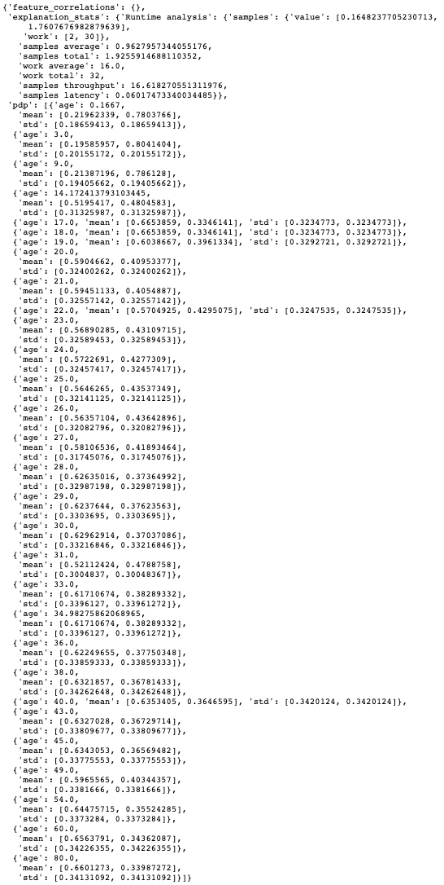

Feature Dependence Explanations
*******************************

Overview
========

Feature Dependence Explanations (PDP and ICE) are model-agnostic global explanation methods that evaluate the relationship between feature values and model target predictions.

Description
===========

PDP and ICE highlight the marginal effect that specific features have on the predictions of a machine learning model. These explanation methods visualize the effects that different feature values have on the model's predictions.

These are the main steps in computing PDP or ICE explanations:

* Start with a trained machine learning model.
* Select a feature to explain (for example, one of the important features identified in the global feature permutation importance explanations.)
* Using the selected feature's value distribution extracted from the training dataset, ADS selects multiple different values from the feature's distribution to evaluate. The number of values to use and the range of the feature's distribution to consider are configurable.
* ADS replaces every sample in the provided dataset with the same feature value from the feature distribution and computes the model inference on the augmented dataset. This process is repeated for all of the selected values from the feature's distribution. If *N* different values are selected from the feature's distribution, this process results in *N* different datasets. Each with the selected feature having the same value for all samples in the corresponding dataset. The model inference then generates *N* different model predictions, each with *M* values (one for each sample in the augmented dataset.)
* For ICE, the model predictions for each augmented sample in the provided dataset are considered separately when the selected feature's value is replaced with a value from the feature distribution. This results in *N x M* different values.
* For PDP, the average model prediction is computed across all augmented dataset samples. This results in *N* different values (each an average of *M* predictions).

The preceding is an example of one-feature PDP and ICE explanations. PDP also supports two-feature explanations while ICE only supports one feature. The main steps of the algorithm are the same though the explanation is computed on two features instead of one.

* Select two features to explain.
* ADS computes the cross-product of values selected from the feature distributions to generate a list of different value combinations for the two selected features. For example, assuming we have selected *N* values from the feature distribution for each feature:
  
  [(:math:`X_{1}^{1}`, :math:`X_{2}^{1}`),
  (:math:`X_{1}^{1}`, :math:`X_{2}^{2}`), :math:`\dots`,
  (:math:`X_{1}^{1}`, :math:`X_{2}^{N-1}`),
  (:math:`X_{1}^{1}`, :math:`X_{2}^{N}`),
  (:math:`X_{1}^{2}`, :math:`X_{2}^{1}`),
  (:math:`X_{1}^{2}`, :math:`X_{2}^{2}`), :math:`\dots`,
  (:math:`X_{1}^{N}`, :math:`X_{2}^{N-1}`),
  (:math:`X_{1}^{N}`, :math:`X_{2}^{N}`)]

* For each feature value combination, ADS replaces every sample in the provided set with these two feature values and computes the model inference on the augmented dataset. There are *M* different samples in the provided dataset and *N* different values for each selected feature. This results in :math:`N^{2}` predictions from the model, each an average of *M* predictions.

Interpretation
==============

PDP
---

* One-feature

  - Continuous or discrete numerical features: Visualized as line graphs, each line represents the average prediction from the model (across all samples in the provided dataset) when the selected feature is replaced with the given value. The x-axis shows the selected feature values and the y-axis shows the predicted target (e.g., the prediction probability for classification tasks and the raw predicted values for regression tasks).
  - Categorical features: Visualized as vertical bar charts. Each bar represents the average prediction from the model (across all samples in the provided dataset) when the selected feature is replaced with the given value. The x-axis shows the different values for the selected feature and the y-axis shows the predicted target (e.g., the prediction probability for classification tasks and the raw predicted values for regression tasks).

* Two-feature

  - Visualized as a heat map. The x and y-axis both show the selected feature values. The heat map color represents the average
    prediction from the model (across all samples in the provided dataset) when the selected features are replaced with the corresponding values.

ICE
---

* Continuous or discrete numerical features: Visualized as line graphs. While PDP shows the average prediction across all samples in the provided dataset, ICE plots every sample from the provided dataset (when the selected feature is replaced with the given value) separately. The x-axis shows the selected feature values and the y-axis shows the predicted target (for example, the prediction probability for classification tasks and the raw predicted values for regression tasks). The median value can be plotted to highlight the trend. The ICE plots can also be centered around the first prediction from the feature distribution (for example, each prediction subtracts the predicted value from the first sample).
* Categorical features: Visualized as violin plots. The x-axis shows the different values for the selected feature and the y-axis shows the predicted target (for example, the prediction probability for classification tasks and the raw predicted values for regression tasks).

Both PDP and ICE visualizations display the feature value distribution from the training dataset on the corresponding axis. For example, the one-feature line graphs, bar charts, and violin plots show the feature value distribution on the x-axis. The heat map shows the feature value distributions on the respective x-axis or y-axis.

Examples
========

The following example generates and visualizes global partial dependence plot (PDP) and Individual Conditional Expectation (ICE) explanations on the `Titanic dataset <https://www.openml.org/d/40945>`_. The model is constructed using the ADS ``OracleAutoMLProvider`` (selected model: XGBClassifier), however, the ADS model explainers work with any model (classifier or regressor) that is
wrapped in an ADSModel object.

.. code-block:: python3

    from ads.dataset.factory import DatasetFactory
    from os import path
    import requests

    # Prepare and load the dataset
    titanic_data_file = '/tmp/titanic.csv'
    if not path.exists(titanic_data_file):
        # fetch sand save some data
        print('fetching data from web...', end=" ")
        # Data source: https://www.openml.org/d/40945
        r = requests.get('https://www.openml.org/data/get_csv/16826755/phpMYEkMl')
        with open(titanic_data_file, 'wb') as fd:
            fd.write(r.content)
        print("Done")
    ds = DatasetFactory.open(
           titanic_data_file, target="survived").set_positive_class(True)
    ds = ds.drop_columns(['name', 'ticket', 'cabin', 'boat',
                          'body', 'home.dest'])
    ds = ds[ds['age'] != '?'].astype({'age': 'float64'})
    ds = ds[ds['fare'] != '?'].astype({'fare': 'float64'})
    train, test = ds.train_test_split(test_size=0.2)

    # Build the model using AutoML. 'model' is a subclass of type ADSModel.
    # Note that the ADSExplainer below works with any model (classifier or
    # regressor) that is wrapped in an ADSModel
    import logging
    from ads.automl.provider import OracleAutoMLProvider
    from ads.automl.driver import AutoML
    ml_engine = OracleAutoMLProvider(n_jobs=-1, loglevel=logging.ERROR)
    oracle_automl = AutoML(train, provider=ml_engine)
    model, baseline = oracle_automl.train()

    # Create the ADS explainer object, which is used to construct
    # global and local explanation objects. The ADSExplainer takes
    # as input the model to explain and the train/test dataset
    from ads.explanations.explainer import ADSExplainer
    explainer = ADSExplainer(test, model, training_data=train)

    # With ADSExplainer, create a global explanation object using
    # the MLXGlobalExplainer provider
    from ads.explanations.mlx_global_explainer import MLXGlobalExplainer
    global_explainer = explainer.global_explanation(
                         provider=MLXGlobalExplainer())

    # A summary of the global partial feature dependence explanation
    # algorithm and how to interpret the output can be displayed with
    global_explainer.partial_dependence_summary()

    # Compute the 1-feature PDP on the categorical feature, "sex",
    # and numerical feature, "age"
    pdp_sex = global_explainer.compute_partial_dependence("sex")
    pdp_age = global_explainer.compute_partial_dependence(
                "age", partial_range=(0, 1))

    # ADS supports PDP visualizations for both 1-feature and 2-feature
    # Feature Dependence explanations, and ICE visualizations for 1-feature
    # Feature Dependence explanations (see "Interpretation" above)

    # Visualize the categorical feature PDP for the True (Survived) label
    pdp_sex.show_in_notebook(labels=True)

.. image:: figures/ads_mlx_titanic_pdp_sex.png

.. code-block:: python3

    # Visualize the numerical feature PDP for the True (Survived) label
    pdp_age.show_in_notebook(labels=True)

.. image:: figures/ads_mlx_titanic_pdp_age.png

.. code-block:: python3

    # Compute the 2-feature PDP on the categorical feature, "pclass", and
    # numerical feature, "age"
    pdp_pclass_age = global_explainer.compute_partial_dependence(
                       ['pclass', 'age'], partial_range=(0, 1))
    pdp_pclass_age.show_in_notebook(labels=True)

.. image:: figures/ads_mlx_titanic_pdp_pclass_age.png

.. code-block:: python3

    # Visualize the ICE plot for the categorical feature, "sex"
    pdp_sex.show_in_notebook(mode='ice', labels=True)

.. image:: figures/ads_mlx_titanic_ice_sex.png

.. code-block:: python3

    # Visualize the ICE plot for the numerical feature, "age", and center
    # around the first prediction (smallest age)
    pdp_age.show_in_notebook(mode='ice', labels=True, centered=True)

.. image:: figures/ads_mlx_titanic_ice_age.png

.. code-block:: python3

    # The raw explanation data used to generate the visualizations, as well
    # as the runtime performance information can be extracted with
    pdp_age.get_diagnostics()

.. code-block:: python3

    # The explanation can also be returned as Pandas.DataFrame with
    pdp_age.as_dataframe()

.. image:: figures/ads_mlx_titanic_pdp_age_dataframe.png

References
==========

- `Partial Dependence Plot <https://christophm.github.io/interpretable-ml-book/pdp.html>`_
- `Vanderbilt Biostatistics - titanic data <http://biostat.mc.vanderbilt.edu/wiki/pub/Main/DataSets/titanic.html>`_

