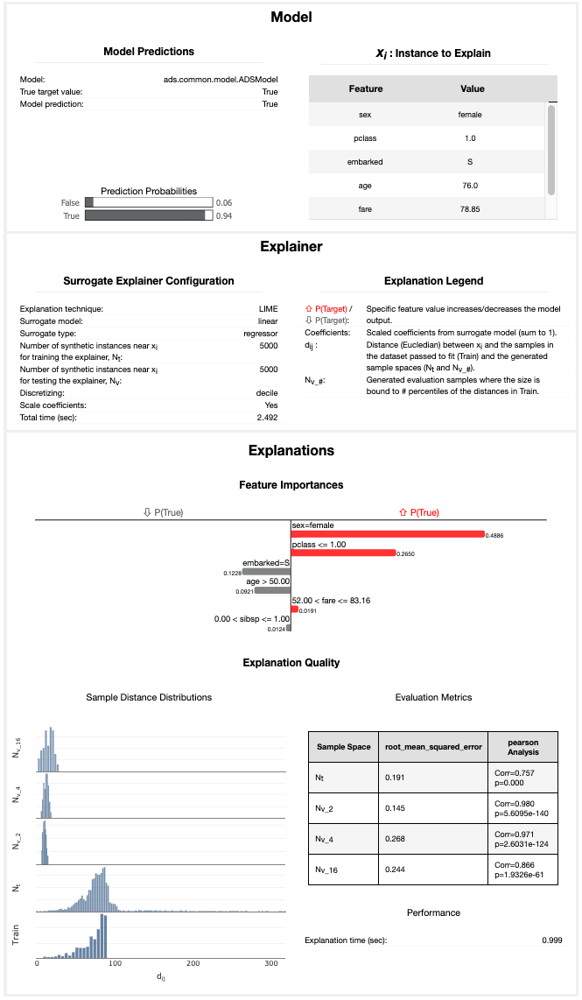
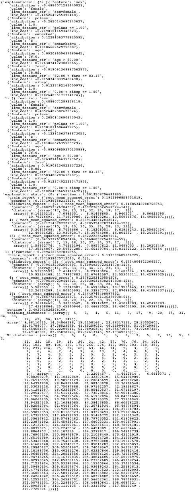

Enhanced LIME
*************

Overview
========

Local explanations target specific predictions from the machine learning model. The goal is to understand why the model made a particular prediction.

There are multiple different forms of local explanations, such as feature attribution explanations and exemplar-based explanations. ADS
supports local feature attribution explanations. They help to identify the most important features leading towards a given prediction.

While a given feature might be important for the model in general, the values in a particular sample may cause certain features to have
a larger impact on the model's predictions than others. Furthermore, given the feature values in a specific sample, local explanations can also estimate the contribution that each feature had towards or against a target prediction. For example, does the current value of the feature have a positive or negative effect on the prediction probability of the target class? Does the feature increase or decrease the predicted regression target value?

The Enhanced Local Interpretable Model-Agnostic Explanation (LIME) is a model-agnostic local explanation method. It provides insights into why a machine learning model made a specific prediction.

Description
===========

ADS provides an enhanced version of Local Interpretable Model-Agnostic Explanations (LIME), which improves on the explanation quality, performance, and interpretability. The key idea behind LIME is that while the global behavior of a machine learning model might be very complex, the local behavior may be much simpler. In ADS, local refers to the behavior of the model on similar samples. LIME tries to approximate the local behavior of the complex machine learning model through the use of a simple, inherently interpretable surrogate model. For example, a linear model. If the surrogate model is able to accurately approximate the complex model's local behavior, ADS
can generate a local explanation of the complex model from the interpretable surrogate model. For example, when data is centered and scaled the magnitude and sign of the coefficients in a linear model indicate the contribution each feature has towards the target variable.

The predictions from complex machine learning models are challenging to explain and are generally considered as a black box. As such, ADS refers to the model to be explained as the black box model. ADS supports classification and regression models on tabular or text-based datasets (containing a single text-based feature).

The main steps in computing a local explanation for tabular datasets are:

* Start with a trained machine learning model (the black box model).
* Select a specific sample to explain (x\ :sub:`exp`\).
* Randomly generate a large sample space in a nearby neighborhood around x\ :sub:`exp`\. The sample space is generated based on the feature distributions from the training dataset. Each sample is then weighted based on its distance from x\ :sub:`exp` \ to give higher weight to samples that are closer to x\ :sub:`exp`\. ADS provides several enhancements, over the standard algorithm, to improve the quality and locality of the sample generation and weighting methods.
* Using the black box model, generate a prediction for each of the randomly generated local samples. For classification tasks, compute the prediction probabilities using ``predict_proba()``. For regression tasks, compute the predicted regression value using ``predict()``.
* Fit a linear surrogate model on the predicted values from the black box model on the local generated sample space. If the surrogate model is able to accurately match the output of the black box model (referred to as surrogate model fidelity), the surrogate model can act as a proxy for explaining the local behavior of the black box model. For classification tasks, the surrogate model is a linear regression model fit on the prediction probabilities of the black box model. Consequently, for multinomial classification tasks, a separate surrogate model is required to explain each class. In that case, the explanation indicates if a feature contributes towards the specified class or against the specified class (for example, towards one of the other N classes). For regression tasks, the surrogate model is a linear regression model fit on the predicted regression values from the black box model.
* There are two available techniques for fitting the surrogate model:

  - Use the features directly:

    The raw (normalized) feature values are used to fit the linear surrogate model directly. This results in a normal linear model.  A positive coefficient indicates that when the feature value increases, the target variable increases. A negative coefficient indicates that when a feature value increases, the target variable decreases. Categorical features are converted to binary values. A value of 1 indicates that the feature in the generated sample has the same value as x\ :sub:`exp` \ and a value of 0 indicates that the feature in the generated sample has a different value than x\ :sub:`exp`\.

  - Translate the features to an interpretable feature space:

    Continuous features are converted to categorical features by discretizing the feature values (for example, quartiles, deciles, and entropy-based). Then, all features are converted to binary values. A value of 1 indicates that the feature in the generated sample has the same value as x\ :sub:`exp` \ (for example, the same categorical value or the continuous feature falls in the same bin) and a value of 0 indicates that the feature in the generated sample has a different value than x\ :sub:`exp` \ (for example, a different categorical value or the continuous feature falls in a different bin). The interpretation of the linear model here is a bit different from the regression model. A positive coefficient indicates that when a feature has the same value as x\ :sub:`exp` \ (for example, the same category), the feature increased the prediction output from the black box model. Similarly, negative coefficients indicate that when a feature has the same value as x\ :sub:`exp`\, the feature decreased the prediction output from the black box model. This does not say what happens when the feature is in a different category than x\ :sub:`exp`. It only provides information when the specific feature has the same value as x\ :sub:`exp` \ and if it positively or negatively impacts the
    black box model's prediction.

* The explanation is an ordered list of feature importances extracted from the coefficients of the linear surrogate model. The magnitude of the coefficients indicates the relative feature importance and the sign indicates whether the feature has a positive or negative impact on the black box model's prediction.
* The algorithm is similar to text-based datasets. The main difference is in the random local sample space generation. Instead of randomly generating samples based on the feature distributions, a large number of local samples are generated by randomly removing subsets of words from the text sample. Each of the randomly generated samples is converted to a binary vector-based on the existence of a word. For example, the original sample to explain, x\ :sub:`exp`\, contains 1s for every word. If the randomly generated sample has the same word as x\ :sub:`exp`\ , it is a value of 1. If the word has been removed in the randomly generated sample, it is a value of 0. In this case, the linear surrogate model evaluates the behavior of the model when the word is there or not.

Additionally, an upper bound can be set on the number of features to include in the explanation (for example, explain the top-N most important features). If the specified number of features is less than the total number of features, a simple feature selection method is applied prior to fitting the linear surrogate model. The black box model is still evaluated on all features, but the surrogate model is only fits on the subset of features.

Interpretation
==============

ADS provides multiple enhancements to the local visualizations from LIME. The explanation is presented as a grid containing information about the black box model, information about the local explainer, and the actual local explanation. Each row in the grid is described as:

* Model (first row)

  - The left column presents information about the black box model and the model's prediction. For example, the type of the black box model, the true label/value for the selected sample to explain, the predicted value from the black box model, and the prediction probabilities (classification) or prediction values (regression).
  - The right column displays the sample to explain. For tabular datasets, this is a table showing the feature names and corresponding values for this sample. For text datasets, this shows the text sample to explain.

* Explainer (second row)

  - The left column presents the explainer configuration parameters, such as the underlying local explanation algorithm used (for example, LIME), the type of surrogate model (for example, linear), the number of randomly generated local samples (for example, 5000) to train the local surrogate model (:math:`N_t`), whether continuous features were discretized or not.
  - The right column provides a legend describing how to interpret the model explanations. 

* Explanations (remaining rows)

  - For classification tasks, a local explanation can be generated for each of the target labels (since the surrogate model is fit to the prediction probabilities from the black box model). For binary classification, the explanation for one class will mirror the other. For multinomial classification, the explanations describe how each feature contributes towards or against the specified target class. If the feature contributes against the specified target class (for example, decreases the prediction probability), it increases the prediction probability of one or more other target classes. The explanation for each target class is shown as a
    separate row in the Explanation section.
  - The Feature Importances section presents the actual local explanation. The explanation is visualized as a horizontal bar chart of feature importance values, ordered by relative feature importance. Features with larger bars (top) are more important than features with shorter bars (bottom). Positive feature importance values (to the right) indicate that the feature increases the prediction target value. Negative feature importance values (to the left) indicate that the feature decreases the prediction target value. Depending on whether continuous features are discretized or not changes the interpretation of this value (for example, whether the specific feature value indicates a positive/negative attribution, or whether an increase/decrease in the feature value indicates a positive/negative attribution). If the features are discretized, the corresponding range is included. The feature importance value is shown beside each bar. This can either be the raw coefficient taken from the linear surrogate model or can be normalized such that all importance values sum to one. For text datasets, the explanation is visualized as a word cloud. Important words that have a  large positive contribution towards a given prediction (for example, increase the prediction value) are shown larger than unimportant words that have a less positive impact on the target prediction.

* The Explanation Quality section presents information about the quality of the explanation. It is further broken down into two sections:

  - Sample Distance Distributions

    This section presents the sample distributions used to train (:math:`N_t`) and evaluate (:math:`N_{v_\#}`) the local surrogate model based on the distances (Euclidean) of the generated samples from the sample to explain. This highlights the locality of generated sample spaces where the surrogate model (explainer) is trained and evaluated. The distance distribution from the sample to explain for the actual dataset used to train the black box model, Train, is also shown. This highlights the locality of :math:`N_t` relative to the entire train dataset. For the generated evaluation sample spaces (:math:`N_{v_\#}`), the sample space is generated based on a percentile value of the distances in Train relative to the sample to explain. For example, :math:`N_{v_4}` is generated with the maximum distance being limited to the 4\ :sup:`th` percentile of the distances in train from the sample to explain.
  - Evaluation Metrics

    This section presents the fidelity of the surrogate model relative to the black box model on the randomly generated sample spaces used to fit and evaluate the surrogate model. In other words, this section evaluates how accurately the surrogate model approximates the local behavior of the complex black box model. Multiple different regression and classification metrics are supported. For classification tasks, ADS supports both regression and classification metrics. Regression metrics are computed on the raw prediction probabilities between the surrogate model and the black box model. For classification metrics, the prediction probabilities are converted to the corresponding target labels and are compared between the surrogate model and the black box model. Explanations for regression tasks only support regression metrics. Supported regression metrics: MSE, RMSE (default), R\ :sup:`2`, MAPE, SMAPE, Two-Sample Kolmogorov-Smirnov Test, Pearson Correlation (default), and Spearman Correlation. Supported classification metrics: :math:`F_1`, Accuracy, Recall, and ROC_AUC.

  - Performance

    Explanation time in seconds.

Example
========

This example generates and visualizes local explanations on the `Titanic dataset <https://www.openml.org/d/40945>`_. The model is  constructed using the ADS ``OracleAutoMLProvider``. However, the ADS model explainers work with any model (classifier or regressor) that is wrapped in an ``ADSModel`` object.

.. code-block:: python3

    import logging
    import requests
    
    from ads.automl.driver import AutoML
    from ads.automl.provider import OracleAutoMLProvider
    from ads.dataset.factory import DatasetFactory
    from os import path

    # Prepare and load the dataset
    titanic_data_file = '/tmp/titanic.csv'
    if not path.exists(titanic_data_file):
        # fetch sand save some data
        print('fetching data from web...', end=" ")
        # Data source: https://www.openml.org/d/40945
        r = requests.get('https://www.openml.org/data/get_csv/16826755/phpMYEkMl')
        with open(titanic_data_file, 'wb') as fd:
            fd.write(r.content)
        print("Done")
    ds = DatasetFactory.open(
           titanic_data_file, target="survived").set_positive_class(True)
    ds = ds.drop_columns(['name', 'ticket', 'cabin', 'boat',
                          'body', 'home.dest'])
    ds = ds[ds['age'] != '?'].astype({'age': 'float64'})
    ds = ds[ds['fare'] != '?'].astype({'fare': 'float64'})
    train, test = ds.train_test_split(test_size=0.2)

    # Build the model using AutoML. 'model' is a subclass of type ADSModel.
    # Note that the ADSExplainer below works with any model (classifier or
    # regressor) that is wrapped in an ADSModel
    ml_engine = OracleAutoMLProvider(n_jobs=-1, loglevel=logging.ERROR)
    oracle_automl = AutoML(train, provider=ml_engine)
    model, baseline = oracle_automl.train()

    # Create the ADS explainer object, which is used to construct
    # global and local explanation objects. The ADSExplainer takes
    # as input the model to explain and the train/test dataset
    from ads.explanations.explainer import ADSExplainer
    explainer = ADSExplainer(test, model, training_data=train)

    # With ADSExplainer, create a local explanation object using
    # the MLXLocalExplainer provider
    from ads.explanations.mlx_local_explainer import MLXLocalExplainer
    local_explainer = explainer.local_explanation(
                          provider=MLXLocalExplainer())

    # A summary of the local explanation algorithm and how to interpret
    # the output can be displayed with
    local_explainer.summary()

    # Select a specific sample (instance/row) to generate a local
    # explanation for
    sample = 13

    # Compute the local explanation on our sample from the test set
    explanation = local_explainer.explain(test.X.iloc[sample:sample+1],
                                          test.y.iloc[sample:sample+1])

    # Visualize the explanation for the label True (Survived). See
    # the "Interpretation" section above for more information
    explanation.show_in_notebook(labels=True)

.. code-block:: python3

    # The raw explanaiton data used to generate the visualizations, as well
    # as the runtime performance information can be extracted with
    explanation.get_diagnostics()

References
==========

* `LIME <https://christophm.github.io/interpretable-ml-book/lime.html>`_
* `Vanderbilt Biostatistics - titanic data <http://biostat.mc.vanderbilt.edu/wiki/pub/Main/DataSets/titanic.html>`_
* `Why Should I Trust You? Explaining the Predictions of Any Classifier <https://arxiv.org/pdf/1602.04938.pdf>`_

